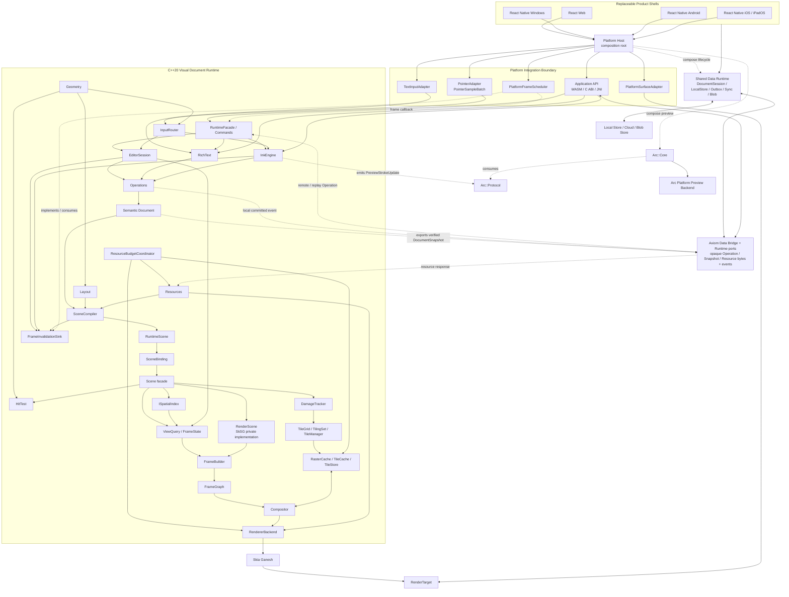

# Canvas v2 项目总体框架

> 状态：Architecture Baseline v1.5 / AR-0 Pass；当前执行主线：G0～G9 Evidence-Gated Vertical Build；POC/RF/R1～R5 保留为证据与交付工作包。POC-03 Windows Integrated D3D12 门禁仍为 `Validating`；主路线：C++20 + Skia Ganesh + Web React/WASM + Native React Native Shell

Canvas v2 的正式定义是 **Visual Document Runtime**。它不是一个单纯的白板应用、Skia Renderer 或跨平台 UI 框架，而是整个产品体系共享的语义文档、编辑、笔迹、文本、场景、渲染、持久化与协作运行时。

本文档固定项目边界和不可随意漂移的架构决策。模块契约、阶段任务、验证方法和决策依据分别见：

- [系统架构](architecture/SYSTEM_ARCHITECTURE.md)
- [RF-01 Scene Rendering Foundation](architecture/RF01_SCENE_RENDERING_FOUNDATION.md)
- [Runtime Public C API](api/RUNTIME_C_API_CONTRACT.md)
- [Canvas C++ / C ABI 风格](CPP_STYLE.md)
- [分阶段交付计划](planning/STAGED_DELIVERY_PLAN.md)
- [G0～G9 与 POC/RF/R 并集路线](planning/AXIOM_GATES_AND_STAGES.md)
- [AR-0 架构对账报告](planning/AR0_RECONCILIATION_REPORT.md)
- [Gate 任务追踪账本](planning/GATE_TASK_TRACKER.md)
- [R1～R5 里程碑状态表](planning/R_MILESTONE_STATUS.md)
- [验证策略](quality/VERIFICATION_STRATEGY.md)
- [Notion v0.3 与仓库差距对账](architecture/review/NOTION_V03_REPOSITORY_GAP_AUDIT.md)
- [Vibe 架构研究结论](research/VIBE_ARCHITECTURE_FINDINGS.md)
- [POC-03 渲染架构审查](research/POC03_RENDERING_ARCHITECTURE_REVIEW.md)
- [架构决策记录](adr/README.md)

## 1. 产品定义

Skia 供应链也分为不可变 profile：POC-01/POC-04 的历史 lock 保持原样；R1 使用
`r1-full-v1`，按 8 个 target × `release`/`debug`/`asan` 生成 Full SDK。普通 Canvas
consumer 只下载并校验 Release asset，Debug/ASan 必须显式选择，且不能回退到 Skia
源码、GN 或 Ninja。完整 profile、capability targets、archive closure 和 symbols
资产契约见 [Skia SDK Supply Chain](architecture/SKIA_SDK_SUPPLY_CHAIN.md)。

Axiom 为 Web、Windows、Android、iOS、iPadOS 和复用 Web target 的 ChromiumOS 环境提供同一套文档与画布语义。当前产品目标是 Web 与 Native React Native Shell；macOS native 产品化暂缓，用户可以通过 Web 使用，macOS 仍保留共享 Runtime 的构建/回归能力。Headless 是测试/reference Utility Target。平台 UI 可以替换，核心数据与行为不能分叉；平台分级和当前 Shell 决定见 [ADR-0025](adr/0025-product-shell-page-operation-data-runtime.md)。

长期能力边界包括：

- 无限画布、页面、容器、结构化布局和多视口。
- Shape、Vector、Image、PDF、Connector 和外部内容。
- Vector、Dab/Pixel 与 Hybrid Ink，以及独立低延迟 FastInk。
- RichText、Table、Sticky、Comment Anchor 和语义搜索。
- Selection、Tools、History、Clipboard、Text Edit 与 Presence。
- SceneCompiler、Runtime Scene facade、RenderScene、动态 SpatialIndex、DamageTracker、
  FrameGraph、Compositor 与多级 Tile/LOD/Cache。
- 本地持久化、离线编辑、多人协作、导出和 Headless 渲染。

这些能力属于架构容量，不代表全部进入 V1 实现；但 Connector、Group、Frame、Sticky、PDF、
Lasso、Align/Distribute、Smart Snap、三条擦除执行路径和 Arc 已由下文明确纳入 V1，不能再
用本句把它们整体后置。

## 2. V1 范围

### 2.1 V1 实现节点

- `Shape`：基础几何图元与样式。
- `Image`：外部资源引用、布局和绘制。
- `VectorPath`：可编辑矢量路径。
- `RichText`：节点从第一版保存 paragraphs、runs、styles 和 attributes；`TextEditSession` 另行提供 selection、caret 和 composition。
- `VectorStroke`：保留语义中心线和笔刷参数。
- `DabStroke`：支持纹理/dab 类型笔刷，不把所有 Stroke 简化为 `SkPath`。
- `Connector`、`Group`、`Sticky`：进入当前产品语义与交互路线；Connector 的 route 为派生数据，Group 不复制第二份 membership。
- `Frame`、`PDF`：进入产品实施范围，先以独立 schema/行为兼容契约分阶段关闭；不能把尚未完成的 schema 当作已实现。
- 每个 Product Page 对应一个独立 `Document`；Page 集合不属于 Axiom Document，详见下文。

### 2.2 分阶段实现范围与边界

以下能力属于分阶段实现范围或明确的后续兼容边界，不能再被笼统标成“永不实现”：

- Structural：`Frame`、`Group`、`Sticky`；`Table`/`Section` 按产品对象与编辑契约进入后续 G6 子阶段。
- Graphics：`PDF`、`Connector`。
- Ink：`HybridStroke`。
- Domain：`Comment` + `Anchor`。
- External：`Embed`、`Video`、`ExternalSurface`。
- 复杂权限对象、AI 对象和 Presentation 专用对象。

`Comment` 是领域对象与 anchor 的组合，不作为普通 RenderNode。`ExternalSurface` 采用受控 Overlay
产品边界：Runtime 只保存 identity/geometry/clip/lifecycle，真实 surface 由 Shell/Platform Host
拥有；不支持任意 DOM/native 节点穿插、texture zero-copy 或把平台句柄写入 Document。

### 2.3 Page 与 Document

一个 Product Page 恰好对应一个独立 Axiom `Document`。Document 内没有 Page ObjectKind，也
没有 `DocumentRoot → Page*` synthetic root。Page 的标题、顺序、复制/删除、导航、缩略图和
生命周期由上层产品层拥有；Shared Data Runtime 只按产品层契约持久化并查询 Page Collection
的 repository 数据。Axiom 只拥有单个 Document 的语义、revision、Operation history/frontier、
ResourceManifest、digest、Snapshot 和恢复边界。每个 Document 是可无限 pan/zoom、允许负坐标的
工作区，导出边界不限制编辑空间。

### 2.4 V1 协作范围

V1 包含 Collaboration MVP：

- 对象操作同步、Presence、操作去重和断网队列。
- 重连、快照引导和随机交错后的基本收敛。
- 文档状态、EditorSession 和 Presence 严格分离。

复杂 RichText 冲突、企业权限、完整历史压缩和大规模会话不是 V1 阻断项，分别通过后续 ADR 处理。

## 3. 平台矩阵

| Tier | 平台 | 当前 Shell/Target | V1 责任 |
| --- | --- | --- | --- |
| Product Tier A | Web | React + TypeScript / WASM | 完整产品、WebGL、IME、性能、发布与支持门禁 |
| Product Tier A | Windows | React Native for Windows + Native Canvas/Overlay | 完整产品；屏幕批注由 Native Overlay Host 承载 |
| Product Tier A | Android | React Native + Native `CanvasView` / JNI | 完整产品；MotionEvent/历史点直接进入 C++，不经过 RN JS |
| Product Tier A | iOS / iPadOS | React Native + Native Canvas/ObjC++ | 完整产品目标；Pencil/IME/渲染数据面保持 Native |
| Deferred / Reuse | macOS | Web Shell；共享 Core/Metal harness 可选 | 暂缓 native 产品化，不设 native 发布门禁 |
| Reuse Target | ChromiumOS | 复用 Web target | 继承必需的 Web Arc backend；额外系统级 FastInk capability 可选，失败回退 Canonical-only |
| Utility Target | Headless | internal runner | test/reference/golden 与内部受控 export；无 V1 公共 server/batch API |

跨平台共享的是 Runtime，不是 UI 框架。Toolbar、Inspector、Dialog、Share、Account、Navigation
和 Page Collection 的产品语义留在上层产品层；Document、Operations、Ink、Text、Scene、HitTest
与 Renderer 留在 C++ Runtime。Shared Data Runtime 通过 Snapshot/Operation/Resource/Event
ports 编排 Persistence、Sync、Page repository 与 Blob custody，但不取得 Page Collection 的
产品语义或生命周期 ownership。Runtime 不拥有数据库、文件、网络或服务器配置。
Serialization 是 Operations、数据侧存储和 Bridge 使用的版本化 codec 机制，不是独立领域状态所有者。

React Web、React Native for Windows、React Native Android/iOS/iPadOS 是当前产品选择；POC-05 的
RNW、Android RN 和 Apple RN/Fabric 证据支持这一边界，但 POC-only scene bridge 不成为产品 ABI。
长期不变量是窄 Bridge、native canvas/surface 边界以及高频 Pointer/IME/Render 数据面不经过不必要
的 JS 往返。替换 Shell framework 需要产品/平台决策和 contract regression evidence；macOS native
产品化另行立项，不阻断 Web 使用。

## 4. 固定总体架构



主渲染链固定为：

```text
Semantic Document
    → SceneCompiler / SceneBinding
    → RuntimeScene / Scene facade
    → RenderScene + SpatialIndex + DamageTracker
    → ViewQuery / FrameState
    → Render Tree
    → FrameBuilder
    → FrameGraph
    → Compositor
    → RendererBackend
    → Skia Ganesh
    → RenderTarget
```

`PlatformSurfaceAdapter` 在平台侧拥有 HTML Canvas/WebGL context、HWND/swapchain、ANativeWindow/EGLSurface、CAMetalLayer/drawable 和 Headless surface 的生命周期，通过 acquire/resize/present/recover 契约提供 `RenderTarget`。`RendererBackend` 不拥有窗口、View 或 native surface handle。Skia 是 GFX backend，不拥有 Document、Editor、Ink 或 Text 语义；Graphite/WebGPU 只能作为未来 RendererBackend，不得反向改变上层接口。

`RenderScene` 的首个产品候选可以在内部使用 Skia SkSG，但 SkSG 类型不得进入 Document、
Bridge 或 Shell。Object SpatialIndex、DamageTracker、TileGrid/TilingSet/TileManager、Raster
调度和 memory/eviction policy 始终由 Canvas Runtime 自己拥有；Chromium cc 只作为 tiling/
priority/raster scheduler 的源码级参考，不作为依赖。完整边界见
[ADR-0021](adr/0021-render-scene-spatial-index-tiling-boundaries.md)。

跨语言 Public API 统一使用 [稳定 C ABI](api/RUNTIME_C_API_CONTRACT.md)：Control Path 可由
React/Qt/ObjC++/JNI/WASM wrapper 调用；PointerSampleBatch、VSync、Preview 和 Render 是
Native Hot Path，不得逐 sample 经 RN JS/QML/React state。ABI 只暴露 generation handle、
fixed-width value、`struct_size + abi_version`、caller-provided buffer 和 borrowed event，
不暴露 Document/RuntimeScene/Tile/Skia/platform pointer。C++20 内部实现遵循
[Canvas 代码风格](CPP_STYLE.md)。

## 5. Runtime 模块

| 模块 | 权威职责 | 明确不负责 |
| --- | --- | --- |
| RuntimeFacade | Application API 的命令、查询、能力与生命周期入口 | 高频 Pointer/IME 数据面、平台 UI |
| InputRouter | Pointer batch 的顺序、设备/手势路由和 Editor/Ink 分发 | Application commands、IME 文本状态 |
| FrameInvalidationSink | Runtime 定义、host 实现的帧请求边界；携带 View/revision/generation | 平台 VSync 实现、Document 写入 |
| Geometry | 坐标/矩阵、bounds、path 与稳健几何 primitives | Viewport ownership、渲染或文档写入 |
| Document | 语义节点、层级、样式、资源引用、版本 | Skia 对象、选区、GPU 缓存 |
| Operations | 唯一 canonical 写入口、原子 apply、回放、持久/协作操作 | 平台输入与绘制、第二套 canonical batch 外层 |
| EditorSession | Selection、Hover、Tools、Snap、History、Clipboard | 文档持久化真相 |
| RichText | TextDocument 的 paragraphs/runs/styles/attributes；TextEditSession 的 selection/caret/composition | 平台 IME UI |
| InkEngine | Pointer 批次、StrokeSession、笔刷语义、Canonical Stroke | 平台直接送显 |
| Layout | Document/RichText 的确定性派生布局接口与 layout records | 持久语义真相、平台 widget 布局 |
| HitTest | 基于 RuntimeScene/SpatialIndex 的 world-space 命中查询 | Tool state、Selection ownership |
| SceneCompiler | Document 到 RuntimeScene 的确定性增量编译 | 文档写入 |
| RuntimeScene | 多视口共享的布局、world bounds、空间索引、render/hit-test records、资源引用和 world-space invalidation | Viewport、可见集合、screen damage、Selection/HUD |
| Scene / SceneBinding | 接受 SceneDelta，协调 RenderScene、SpatialIndex、DamageTracker 和查询/渲染门面 | Document 写入、向 Shell 暴露 SkSG 类型 |
| RenderScene | 内部渲染 DAG；首个候选为私有 SkSG adapter | Document 业务模型、Operation、协作或无限画布 Query |
| ISpatialIndex | 动态对象 insert/remove/update/query 与候选 culling | 精确几何命中、Document ownership |
| DamageTracker | 可重算的 world-space DamageSet，向 Tile/Frame invalidation 投影 | 持久语义或跨 View screen damage |
| ViewQuery / FrameState | 单视口可见集合、clip、LOD、scale bucket、target 参数和 screen damage | 共享场景真相、持久状态 |
| FrameBuilder | 合并 Scene、View、Editor overlay、Preview、Presence 和 ExternalSurface placement，生成不可变帧计划 | 文档写入和平台 surface 生命周期 |
| FrameGraph | Pass、依赖、资源生命周期 | 工具和文档规则 |
| Compositor | Background/Content/Ink/Overlay/Selection/HUD 合成 | 文档操作 |
| RendererBackend | 将帧计划通过 Ganesh 绘制到调用方提供的 RenderTarget | HWND/ANativeWindow/CAMetalLayer 生命周期 |
| TileCache | L1/L2/L3 缓存契约、预算、失效 | 权威内容存储 |
| TileManager / IRasterSource | 负坐标 TileGrid、LOD、优先级、预取、raster task 和 eviction；按 world rect 请求内容 | 拥有 Canvas Object、修改 Document |
| ResourceBudgetCoordinator | 统一协调 decoded resource、Canvas/Skia cache、transient 和 surface 内存预算/压力 | Document 语义、假装完全拥有 Skia 内部 cache |
| Resources | 图片、字体、外部资源加载与版本 | 平台文件对话框 |
| Runtime data ports | 导出 Snapshot/本地 Operation 事件，接收远端/回放 Operation 与资源结果 | 数据库、文件、Outbox/Inbox、网络、云端和 Page Collection 产品语义 |
| Shared Data Runtime（外部） | DocumentSession、Page repository custody、LocalStore、checkpoint/journal、Outbox/Inbox、Sync、Blob 与恢复编排 | Page Collection 产品语义/生命周期、Document/Object 语义、Scene、Ink、Skia 和 Pointer 热路径 |
| Platform Host（外部角色） | 组合 Axiom、Arc、Shared Data Runtime、surface、frame scheduler 与 overlay | 复制 Document/Data Runtime 的语义状态机 |

`Geometry` 是无状态基础模块。`Layout` 和 `HitTest` 是正式逻辑边界，但其实现可以在 R1 依赖图中落为 `core/scene/layout`、`core/scene/hit_test` 与 `core/text/layout` 子模块；不得因此把它们的公共职责从 Runtime 中删除或让平台各自复制。

## 6. 状态与生命周期

六类状态必须独立：

1. **Document State**：可保存、可同步的语义事实。
2. **EditorSession State**：Selection、Hover、Tool、TextEditSession、Viewport。
3. **Collaboration Presence**：在线成员、远端光标、临时选区和连接状态。
4. **RuntimeScene State**：多视口共享的布局、空间索引、Render Tree 和 world-space invalidation，可重建。
5. **View/Frame State**：Viewport 查询结果、visible set、screen damage、Selection/HUD 和当前帧计划，按 view/frame 短暂存在。
6. **GPU/Cache State**：纹理、display list、tile 和设备资源，可丢弃。

任何缓存或 GPU 设备丢失都不得改变 Document。Presence 不进入文件，EditorSession 不成为协作事实，Document 不保存 Skia 或平台句柄。

多个 View 可以共享同一 Document、RuntimeScene 和受 revision 约束的 resource cache；每个
View 的 EditorSession、History intention、Text composition、Active Stroke、FrameState 和
未决 frame callback 独立。View 销毁只清理本 View 的临时状态，不得连带销毁其他 View
仍在使用的共享状态。GPU context/cache 是否共享由 Renderer/Platform policy 决定。

## 7. 核心接口基线

### 7.1 Pointer 与 Ink

`PointerSampleBatch` 批量携带 pointer ID、位置、压力、倾角、接触尺寸、时间戳、设备类型和历史样本。平台适配器负责归一化，Android 不逐点穿过 RN JS。

坐标链固定为 `Node Local → Page/World → View Logical → Device Pixel → Platform Screen`。Platform PointerAdapter 先规范化到 View Logical，再使用带 ViewId/revision 的 viewport snapshot 逆变换到 Page/World；Document/Canonical geometry 只保存 Page/World 语义坐标，DPR 与像素舍入不进入 Document。

`StrokeSession` 同时产生：

- `Preview Stroke`：允许预测和临时质量，用于最低延迟反馈。
- `Canonical Stroke`：稳定、可编辑、可持久化并进入 Document。

二者共享 Stroke ID 和版本化 `BrushDescriptor` 语义；descriptor 至少包含 brush type/version、semantic parameters 和所需 ResourceId/ContentHash。Dab/texture 随机流必须使用按 algorithm、brush version、StrokeId 与 stream 分域的 deterministic seed/PRNG，不得依赖 wall clock 或全局 random。`push()` 允许持续增量构建 Canonical candidate，`end()` 只负责将最终 Canonical Stroke 作为一次原子 Operation 提交；不得把长笔迹的全部 Canonical 计算推迟到 pointer up。Preview 结束后必须能无闪烁交接到 Canonical。

Confirmed samples 不得静默删除、重复或重排；兼容 batch 可以合并。Predicted tail、可完全
替换的 Preview update 和 frame invalidation 可按 revision coalesce。队列必须有容量和延迟
诊断；资源不足时明确 `InputOverrun` 并原子取消 Stroke，不提交部分笔迹。Platform Adapter
报告 pen/touch/hover/eraser/palm capability，InputRouter 统一产品级 arbitration。

### 7.2 FastInk / Arc

`StrokeSession` 统一完成 resample、smooth、pressure mapping、prediction 和 rollback，并输出版本化 `PreviewStrokeUpdate`。它至少表达 Stroke ID、update revision、brush descriptor、transform/坐标空间、confirmed representation、predicted tail 和 replace/truncate 语义；具体 vector segment/dab batch 编码由 POC-02 冻结。

POC-06 将该能力落在可独立抽取的 `Arc` 模块中：`Arc::Protocol` 提供版本化 POD/C ABI，`Arc::Core` 提供有界队列、可靠控制面、handoff 状态机、诊断和 fallback，平台 target 提供输入与独立 Preview Presentation Target。Platform Host 是唯一 composition root；Axiom Runtime 与 Arc 只共同依赖协议，不能互相 include 内部头。Arc 不拥有 Canonical RenderTarget，也不得与 Axiom 并发 present 同一个 backbuffer。

Arc 的控制面不是把 `end` 当作立即清屏，而是 `begin → push* → sealInput → canonicalCommitted → canonicalVisible → retire`；只有匹配 Stroke/Document revision/HandoffToken/target generation 的 visible acknowledgement 才能清理 Preview。Arc presentation 失败只关闭 Preview 或切换内部 no-preview/null backend，产品可见结果进入 Canonical-only rendering；不能取消已确认输入或阻断 Canonical Stroke。

Arc 平台实现覆盖 Web、Windows、Android、iOS/iPadOS、ChromiumOS、Headless 和条件式自有设备；macOS 只保留已有 reference/conformance backend，不作为 native 产品门禁。平台 backend 只负责快速显示和 surface/presentation，不得从 raw pointer sample 重新实现另一套平滑、预测或笔刷语义。核心不知道 DirectComposition、SurfaceControl、DRM、HWC 或硬件 plane。

- Web：薄 JS pointer adapter + WASM/WebGL Preview target；高频路径绕过 React，A/B 验证 normal 与 `desynchronized` WebGL。
- Windows/Android：实现应用级 native low-latency preview；输入分别使用 native history 和 JNI/native CanvasView 数据面。
- iOS/iPadOS：React Native Host 下实现 Native/Metal Preview target 和 Pencil/coalesced input；macOS 仅保留 reference harness。
- ChromiumOS：复用 Web Arc backend，系统 capability 可选且失败回退；Headless 提供 deterministic Null/trace backend。
- 自有设备：条件式评估 Raw Input、Arc Service、DMA-BUF/GBM 与 DRM atomic overlay，不阻塞普通应用产品路线。

Runtime 只通过 FrameInvalidationSink 发布带 View/revision/generation 的 frame invalidation。PlatformFrameScheduler 拥有
rAF、Choreographer、DisplayLink、DXGI 或 Headless pump，合并请求并在 VSync callback 中
执行 acquire/render/present；过期 target 不得 present，Preview→Canonical handoff 以实际
visible acknowledgement 为准。

### 7.3 Scene 与缓存

`SceneCompiler` 接收 Document revision/ChangeSet，生成可完整重建、可增量更新的 RuntimeScene。ChangeSet 的 `SemanticChanges` 是成功 Atomic Operation Apply 派生的确定变化，`InvalidationHints` 是可丢弃、可扩大、可重算的优化提示，不进入持久化、协作或 digest。全量编译和相同变更序列的增量编译必须等价。

Document 节点只保存稳定、不可复用的 `ResourceId`，不调用 ResourceManager 或外部数据实现。版本化 `ResourceManifest` 将 ResourceId 映射到 ResourceRevision、`sha256:<content-hash>` 和不可变 blob；manifest binding 属于可保存/协作的语义状态并进入 Document digest，下载 URL、本地路径和 decode/GPU 状态不进入。Resources 独立负责 resolve/verify/decode/version，Shared Data Runtime 的 Persistence service 通过受控 port 原子保存 `DocumentSnapshot`、committed operation continuation、resource manifest 和 blob；两者都不得反向修改节点语义。

恢复关系固定为 `DocumentSnapshot@RecoveryFrontier F + committed Operations F→T =
Document@T`。Document revision 是 Runtime 实例内的发布/失效标记，RecoveryFrontier 是
持久/同步恢复位置；二者一起校验但不能互换。Snapshot 和 continuation 都绑定 Document
identity 与 base/target frontier。Snapshot 只在已提交 Operation 边界创建，并在发布恢复后的 Document 前
原子校验 identity/schema/capability/frontier/digest；它不包含 EditorSession、Presence、
Viewport/Preview、RuntimeScene、GPU/cache 或 blob bytes。运行期编辑与 Undo/Redo 不能通过
恢复旧 Snapshot 绕过 Operation。`ViewportSnapshot`、`DocumentReadView` 与可持久化
`DocumentSnapshot` 是三个不同概念。具体 codec/log/compaction 留给 R2/R4，语义遵循 ADR-0020。

ResourceManifest 在逻辑上属于 DocumentSnapshot/Digest，物理分包不能破坏同一 checkpoint
绑定。任何 log compaction 都必须先证明 Snapshot、manifest、continuation 起点和恢复元数据
已持久、可校验、可读取，之后才能回收 frontier 之前的 Operation prefix；blob GC 仍按内容
可达性独立处理。

缓存接口从首版存在，能力按阶段展开：

- L1：GPU/当前进程快速缓存，V1 产品化实现。
- L2：RAM cache，性能数据证明需要时启用。
- L3：SSD/eMMC 持久 tile，仅自有设备或大文档需求驱动。

FrameGraph 中 Background/Content/Ink/ExternalSurface/Overlay/Selection/HUD 是 logical passes；
backend 可在依赖和视觉等价性不变时 merge、elide 或 reuse。R3 的全局资源预算需要统一观察
decoded resources、Canvas cache、Skia GPU cache、transient allocations 和 surface memory，
不能由各模块分别宣称未超预算。

### 7.4 RichText

`TextDocument` 从第一版包含 paragraphs、runs、styles 和 attributes；`TextEditSession` 管理 selection、caret、composition、undo；`TextInputAdapter` 负责 Web、Windows、Android 和 iOS/iPadOS IME 边界。渲染由 TextDocument → TextLayout → SkParagraph 完成。产品 Schema 使用 Unicode scalar position；POC-04 的 UTF-16/`TextTransaction` 仅作为历史实验输入，必须在 G1/G6 迁移为 Operation-only 产品路径。

Canonical RichText 使用 `FontResourceId`/ContentHash 与规范化 fallback chain；系统字体的偶然可用性不能改变跨平台 canonical layout、换行和 selection geometry。平台字体可以用于非 canonical UI，但不得静默替换 Document font resource。

### 7.5 Eraser

Eraser 只有两种用户模式、三条 canonical 实现路径：对象擦除使用 Delete Operation 删除完整
Stroke；部分擦除对细矢量笔使用 segment split，生成有稳定 identity 的 Stroke fragments；对粗笔、
Dab/texture 笔使用 object-local Pixel/Dab erase mask。三条路径都必须可撤销、保存、重放和跨端
比较，且驱动 Scene/Spatial/Cache 的局部失效。平台 adapter 不决定 split/mask；版本化 Brush
resolver 与 golden corpus 属于 Axiom。

### 7.6 History 与 Undo/Redo

History 属于 EditorSession，只选择本地 intention 和 undo grouping。Undo/Redo 针对当前 Document revision 生成新的、原子的 compensating Operations，经唯一写入口验证、持久化和协作同步；不得移动 Document state pointer、倒退 operation sequence 或改写历史 Operation。

### 7.7 坐标、资源与版本化语义

- 坐标、DPI、输入逆变换、HitTest tolerance 和 ExternalSurface placement 遵循 ADR-0012。
- ResourceId、ResourceManifest、ContentHash、missing/corrupt handling 和 Document digest 遵循 ADR-0013。
- History/Undo/Redo ownership 与 compensating Operation 遵循 ADR-0014。
- canonical binary32、finite-only、canonical zero、checked overflow、版本化算法精度和
  little-endian digest encoding 遵循 ADR-0016；视觉容差不代替语义确定性。
- frame invalidation/VSync、input backpressure/coalescing、ChangeSet/hints 分别遵循
  ADR-0017、ADR-0018、ADR-0019。
- DocumentSnapshot、RecoveryFrontier 和 committed Operation continuation 遵循 ADR-0020。
- HitTest 返回 geometry candidates；SelectionPolicy 和 SnapEngine 属于 Editor subsystem。
  ID/stable order、V1 color/Image EXIF/ICC 在 R2/R3 前通过实验型 ADR 冻结。

## 8. 工程原则

1. **Shell 可替换，Runtime 不分叉。**
2. **Document 不等于 RuntimeScene，RuntimeScene 不等于 Skia scene。**
3. **Stroke 不等于 SkPath，Preview 不等于 Canonical。**
4. **Text 是一级领域模型，不是带字符串的 Shape。**
5. **FrameGraph 和缓存接口前置，但实现复杂度按证据递增。**
6. **POC 先单线程；线程接口预留，只有剖析数据允许引入 worker。**
7. **同一操作和输入语料必须可跨平台回放。**
8. **性能数字绑定设备、场景、构建和测量方法。**
9. **所有跨模块 geometry 都声明坐标空间与 revision；DPR 不污染 Document。**
10. **ResourceId 是语义身份，ContentHash 是不可变内容版本。**
11. **Undo/Redo 产生新 Operations，不回拨 Document。**
12. **数值、时钟和随机性必须可回放；wall clock 不进入语义摘要。**
13. **Runtime 请求帧，平台拥有 VSync；confirmed input 与 render cadence 解耦。**
14. **语义变化是事实，dirty/cache hints 只是可重算优化。**
15. **Snapshot 是恢复检查点，不是普通编辑、Undo/Redo 或任意状态替换的旁路。**

## 9. 目标仓库结构

```text
canvas/
├── core/
│   ├── foundation/
│   ├── input/
│   ├── geometry/
│   ├── document/
│   ├── operations/
│   ├── editor/
│   ├── text/
│   ├── ink/
│   ├── scene/
│   │   ├── layout/
│   │   └── hit_test/
│   ├── render/
│   ├── frame_graph/
│   ├── compositor/
│   ├── cache/
│   ├── resources/
│   └── bridge/
├── shared_data_runtime/
│   ├── core/
│   ├── storage/
│   ├── sync/
│   └── bridge/
├── arc/
│   ├── include/arc/protocol/v0/
│   ├── core/
│   ├── platform/
│   │   ├── web/
│   │   ├── windows/
│   │   ├── android/
│   │   ├── apple/
│   │   ├── headless/
│   │   └── device/
│   └── tests/
├── platform/
│   ├── web/
│   ├── windows/
│   ├── android/
│   ├── apple/
│   ├── surfaces/
│   └── fastink/                 # legacy/platform composition adapters only
├── shells/
│   ├── web/
│   ├── windows/
│   ├── android/
│   └── apple/
├── pocs/
│   ├── shared_engine/
│   ├── ink_engine/
│   ├── scene_100k/
│   ├── text_ime/
│   ├── hybrid_surface/
│   └── fastink/                 # POC-06 demos, benchmarks, fault probes, reports
├── tests/
├── benchmarks/
├── tools/
└── docs/
```

`arc/` 是 Arc 产品能力的候选模块边界，必须可独立 configure/build/test；POC-06 只是该边界的
实验消费者和历史证据，不能据此把目录形态或 ABI 自动升级为 Accepted 产品契约。
`pocs/fastink/` 只保存实验消费者和证据。产品 backend 覆盖 Web、Windows、Android、iOS/iPadOS、ChromiumOS 和
Headless；macOS 维持已有 core/Web/reference conformance，不建立 native 产品目录或发布门禁。
其余产品目录在对应 Gate 开始时创建。

## 10. Gate 执行主线与既有工作包

自 2026-08-23 起，G0～G9 是唯一的 promotion 顺序；POC-01～06、RF-01～03、R1～R5 不再
组成另一条竞争路线，而是风险验证、渲染基础与产品里程碑工作包。完整 many-to-many 映射、
每个 Gate 的五件套和退出条件见 [G0～G9 与 POC/RF/R 并集路线](planning/AXIOM_GATES_AND_STAGES.md)。

```text
AR-0 Architecture Reconciliation
  → G0 Verification Foundation
  → G1 Semantic Kernel
  → G2 RuntimeScene Foundation
  → G3 Basic Canonical Canvas
  → G4 Interaction + Ink
  → G5 Large Canvas Optimization
  → G6 Rich Editing + Platform Lifecycle
  → G7 Local Data Runtime
  → G8 Sync + Recovery
  → G9 Integrated Product Gate
  → R5-B Hardening and Release
```

Gate promotion 需要 E1 Contract/Unit、E2 Reference/Mock、E3 Integration/Golden 和适用的 E4
Physical/Demo 证据。POC-03 的 Windows 失败、POC-02/06 的未闭合物理延迟门禁继续有效；计划
文档不能将它们改成 PASS。Open 的协作冲突/ABI/线程策略只能让相应 Gate `BLOCKED`，不得由
实现人员临时决定。

### 既有技术验证工作包

| 阶段 | 主题 | 证据作用 |
| --- | --- | --- |
| POC-01 | Shared Engine | Web、Windows、macOS、iOS、iPadOS、Android 共享同一 C++ Runtime |
| POC-02 | Ink Engine | Pointer batch、Vector/Dab、Preview/Canonical 双路径成立 |
| POC-03 | 100K Scene | 基础 Scene 正确性、跨端效果与 Integrated Ink；生产 R-tree/Tile/LOD 仍走 RF-01～03 |
| POC-04 | RichText / IME | Web/Windows/Android 文本编辑语义成立 |
| POC-05 | Hybrid Surface | **Accepted scoped risk proof**：Web、Windows RNW、Android RN、Apple RN/Fabric 的受控 Overlay 与 z-order 边界可行；作为 G6 产品化输入 |
| POC-06 | FastInk / Arc | 全平台实现、独立 Preview target、错误隔离、分阶段 handoff 与 Canonical 交接可行 |

历史 POC/RF 之间不再使用箭头图表示，避免被误解为任务依赖或启动顺序。它们与 G0～G9 的
many-to-many Evidence 输入关系以 [Gate 总路线](planning/AXIOM_GATES_AND_STAGES.md) 和
[任务账本](planning/GATE_TASK_TRACKER.md) 为唯一记录。

POC-02/03/04 的核心证据可被下游 Gate 消费，但 `Integration Ready` 不等于 POC Accepted 或
产品 ABI 冻结。POC-03 的 direct Skia、Linear/Uniform Grid 和 L1 原型只作为 baseline；RF-01～03
分别进入 G2/G5。POC-05 证明受控 Overlay 和 RN Shell 边界可行，G6 仍须建立产品 Schema、稳定
bridge、lifecycle 与真实 ExternalSurface；任意 DOM/native 穿插和 zero-copy texture 不在承诺内。
它没有验证 Windows 本地屏幕批注的 transparent topmost、click-through/draw mode、多显示器/
DPI、focus/pen capture、display/surface lifecycle 或 Arc fallback；这些由 G3/G4 建立 seam，并由
G9 的独立物理门禁验收。Page Collection 同样不是隐含在 G7 persistence 中：G7 必须闭合产品
层 ownership 下的 repository/custody contract，G9 必须闭合多 Page 导航、隔离与恢复。
Arc 产品能力是 G4 的硬需求，并贡献 R3 里程碑；POC-06 只是其历史 Evidence 输入。backend
失败必须 Canonical-only fallback，POC-06 本身不解锁 G4 或 R3。

### 产品里程碑覆盖层

| 阶段 | 主题 | 核心结果 |
| --- | --- | --- |
| R1 | Runtime Foundation | 工程、模块、Bridge、诊断和确定性基础 |
| R2 | V1 Local Visual Document Runtime | V1 本地节点、Editor、Operations、RichText、Ink、Persistence；完整 V1 产品范围在 R4 后闭合 |
| R3 | Production Rendering and Shells | 生产 FrameGraph/Cache 与 Web、RNW、Android RN、iOS/iPadOS RN 集成 |
| R4 | Collaboration MVP | 对象同步、Presence、断网重连和基本收敛 |
| R5 | Hardening and Release | 兼容、恢复、安全、性能和发布闭环 |

R1 横跨 G0～G3，R2 主要覆盖 G1/G3/G4/G6/G7，R3 覆盖 G3/G4/G5/G6，R4 覆盖 G8，R5 拆成
G9 Internal Alpha 与 R5-B Hardening/Release。里程碑只能在所依赖 Gate 通过后宣称完成；Arc
产品契约必须通过 G4，iOS/iPadOS 纳入 G4/G6/G7/G9 适用的产品门禁，macOS native 不阻断发布。

完整 Gate 设计、验证、实现、交付物和量化退出条件见
[唯一总路线](planning/AXIOM_GATES_AND_STAGES.md)；任务级状态见
[Gate 任务追踪账本](planning/GATE_TASK_TRACKER.md)，R 里程碑单独见
[R1～R5 状态表](planning/R_MILESTONE_STATUS.md)。[分阶段交付计划](planning/STAGED_DELIVERY_PLAN.md)
只保留 POC/RF 历史设计、阈值和 R 工作包说明，不形成第二套晋级条件。

## 11. 已接受与待验证决策

已经接受：Visual Document Runtime 定位、Web/RNW/Android RN/iOS/iPadOS RN 产品矩阵、macOS
native deferred、一 Page 一 Document、Operation-only、Shared Data Runtime 的数据侧 owner、
Platform Host composition role、Document/Scene 分离、双路径 Ink/Arc、Ganesh v1、RichText 一级模型、
缓存接口前置、不可变 Skia SDK、Renderer/Platform Surface 所有权、坐标/DPI、资源身份、Undo 补偿
Operation、数值确定性、帧调度、输入背压、ChangeSet/hints、Snapshot/Operation continuation、
Runtime Scene/SkSG、空间索引/Damage/Tile 边界、受控 Overlay 与 Runtime Public C ABI 方向。

仍需实验型 ADR：

- DocumentSnapshot、Operation Log 与 migration 的具体编码/存储/compaction 格式；恢复语义已由 ADR-0020 固定。
- Collaboration MVP 的具体合并算法和协议。
- L2/L3 缓存格式与压缩策略。
- POC 后的线程拓扑和 WASM pthread 启用时机。
- Page Collection 的产品 repository/schema、跨 Document 操作和迁移规则；不重新开放一 Page 一 Document。
- Frame/PDF/Table/Section、RichText bullet/product profile 的兼容 Schema 与行为契约。
- Operation-only 产品 Schema/codec、OperationBatch、跨对象 payload 和 ABI 映射。
- Shared Data Runtime 的实现语言（TypeScript 仅为候选）、物理 owner、最终包名及 Data Bridge
  的具体 ABI；数据侧职责方向不因此重新开放。
- Entity/Operation/Actor ID 与 stable order/z-order schema；R4 再冻结并发排序算法。
- V1 color space 与 Image EXIF/ICC canonicalization。

“待验证”是明确的阶段输出，不允许实现人员在没有 ADR 和证据时自行选择。

## 12. 项目完成定义

任何 POC 或产品阶段只有同时满足以下条件才算完成：

- 设计、接口和状态所有权与本文基线一致。
- 验证语料、基准脚本和环境信息可重复。
- 阶段要求的功能从干净环境可构建、运行和演示。
- 正确性、视觉、延迟、规模与资源退出阈值全部通过。
- 新增持久状态有版本与失败恢复策略。
- 未关闭风险已登记到后续 ADR，不被代码事实偷偷固定。
