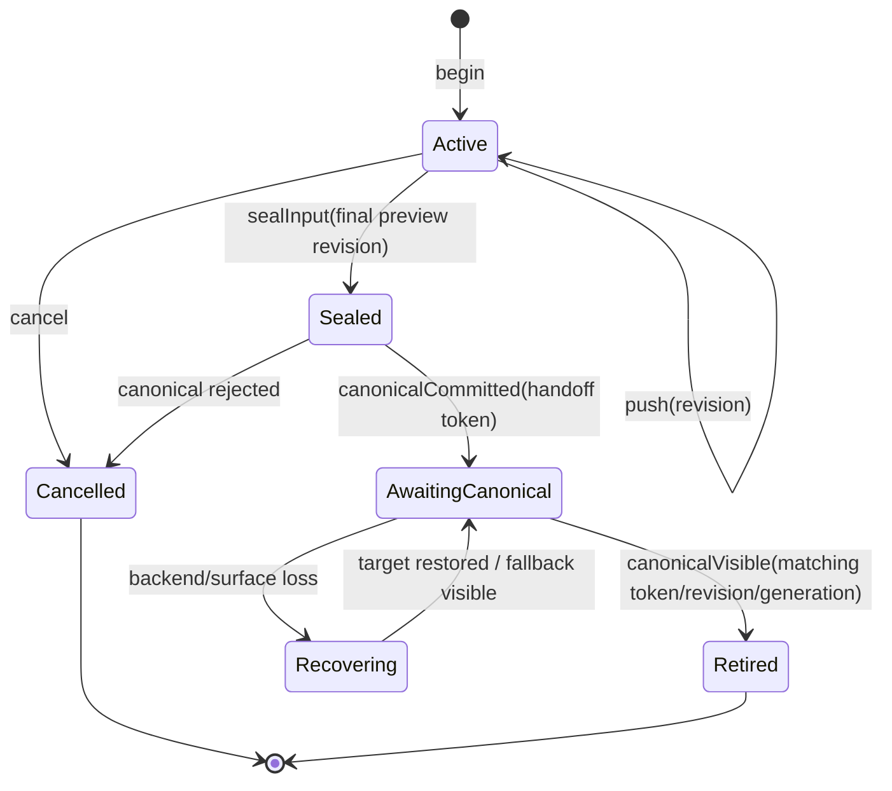

# ADR-0024: Arc 是可抽取的跨平台 input-to-display 模块

- Status: Accepted
- Date: 2026-08-19
- Related stages: POC-02, POC-06, R1, R3
- Clarifies: ADR-0002, ADR-0004, ADR-0010, ADR-0011, ADR-0015, ADR-0017, ADR-0018

## Context

POC-02 已证明同一个 `StrokeSession` 可以从批量输入产生 Canonical Stroke 与版本化
Preview Model；POC-06 需要证明平台可以更早取得输入，并通过独立低延迟路径显示 Active
Stroke。若这部分代码继续散落在各 Shell 或 Axiom Runtime 内，平台 surface、输入 API、
handoff、线程和设备特例会污染 Document/Scene/Renderer，未来也无法把低延迟能力复用于
其他产品。

另一方面，Arc 仍处于 POC-06 边界验证期。现在拆成独立仓库会过早引入跨仓版本、发布和
兼容管理。因此需要同时满足：开发期与 Axiom 同仓快速迭代，架构上可独立构建、测试、
发布和抽取。

本 ADR 使用 **FastInk** 表示低延迟能力与 POC-06 主题，使用 **Arc** 作为模块/SDK 名称：
它连接平台输入与 Preview presentation，形成 input-to-display 的最短弧线。

## Decision

### 1. 模块与依赖方向

Arc 位于仓库顶层 `arc/`，是 embedded independent project；`pocs/fastink/` 只保存
POC-06 demo、fixture、benchmark、fault probe 和报告。Arc 必须支持独立 CMake 配置、
独立测试和 external-consumer smoke。

协议由 `Arc::Protocol` 拥有，依赖方向固定为：

```text
              Arc::Protocol
                ▲       ▲
                │       │
          Axiom Ink   Arc::Core / Arc platform backends
                ▲       ▲
                └───┬───┘
                    │
               Platform Host
```

Platform Host 是唯一 composition root。它创建并连接 Axiom Runtime、Arc input source、
Arc preview backend、Canonical surface adapter 和平台 scheduler。Axiom Runtime 不加载
Arc 动态库，不依赖 Arc 平台实现；Arc 不包含 Axiom Runtime 私有头。

### 2. 独立 presentation target

每个有显示能力的平台都实现 Arc Preview Presentation Target。所有权固定为：

| 对象 | Owner |
| --- | --- |
| OS window/view 与最终 composition | Platform Host / OS compositor |
| Canonical presentable target | Axiom `PlatformSurfaceAdapter` |
| Preview presentable target | Arc platform backend |
| Document/Scene/Canonical rendering | Axiom Runtime |
| Active Stroke Preview presentation | Arc |

Arc 与 Axiom **不得并发拥有或 present 同一个 presentable backbuffer**。平台允许通过 Host
注入的不透明 capability 共享 GPU device、queue、context 或不可变资源，但 Canonical 与
Preview target 的 acquire/present/fence/generation/lifecycle ownership 必须分离。Arc
公共协议不得出现 HWND、DirectComposition、Surface、ANativeWindow、CAMetalLayer、DOM、
WebGL 或 Skia 类型。

### 3. 错误隔离

Arc presentation 是可降级派生状态。backend 不可用、队列耗尽、surface/device 丢失、
过期 generation 或 Arc 内部错误只能：

1. 记录结构化诊断；
2. 关闭受影响 Preview target 或切换内部 no-preview/null backend，使产品进入 Canonical-only；
3. 请求 Canonical redraw；
4. 保留或安全退役当前 Preview，避免空白。

Presentation 错误不得作为 `InkEngine`/Atomic Operation Apply 失败返回，不得取消已确认输入、
撤销已经提交的 `AddStroke` 或改变 Stroke/Document digest。输入采集故障属于独立 failure
domain：Arc Input Source 必须显式报告 source loss；Host/InputRouter 对 active Stroke 做原子
cancel，不允许提交部分 confirmed input，并可切回平台默认输入 source。

### 4. 分阶段 handoff 状态机

`end` 不再同时表示“pointer up”和“清除 Preview”。Arc 使用可靠有序的控制面：



- `sealInput` 停止接收该 Stroke 的 Preview 更新，但继续显示最新 confirmed Preview。
- `canonicalCommitted` 清除 predicted tail，绑定 Document revision、ViewId、target generation
  和不可复用 `HandoffToken`。
- `canonicalVisible` 必须来自 Canonical presentation path 的可见证据；GPU submit、render
  返回、swap 调用返回或单独一次 rAF 不能自动等同实际可见。
- 只有完全匹配 Stroke ID、Document revision、handoff token 与有效 generation 的 ack 才能
  retire Preview。重复消息幂等；旧 generation、乱序或属于其他 Stroke 的 ack 被拒绝且不能
  清除新 Preview。
- 多个已 seal Stroke 可以同时等待各自 handoff；pointer ownership 与 pending handoff 不共享
  一个全局槽位。
- 平台 handoff 必须避免 blank frame、double-dark frame 和超过 1 device pixel 的位置跳变；
  仅“Canonical 可见后再 clear”不足以证明没有双重加深。

### 5. 版本化协议与 buffer ownership

POC-06 建立版本化 C/POD 协议和 C++20 RAII wrapper。底层结构使用固定宽度字段、
`struct_size + abi_version/schema_version`、显式 pointer/count/stride，不跨 ABI 暴露
`std::vector`、`std::string`、异常或平台/GPU 类型。

`Arc::Protocol` 仅包含：

- `PointerSampleBatch`、input/device capabilities、单调 timestamp 与 sample provenance；
- `PreviewStrokeUpdate`、resolved preview primitives、BrushDescriptor view、Stroke/View ID；
- 明确的坐标空间、viewport transform/revision、DPR、target dimensions/generation；
- lifecycle commands、`HandoffToken`、Canonical visible acknowledgement；
- backend capability、presentation receipt、错误和 latency diagnostics。

调用方提供的 input/update buffer 只保证在调用期间有效；Arc Bridge 在返回前完成校验并复制
到有界队列。平台 backend 只消费 Arc 拥有的不可变 batch。未来若测量证明 copy 是瓶颈，
可以增加版本化 lease/retain/release capability，但不得静默改变 v1 lifetime。

Preview 数据面可按 revision 合并；begin、seal、commit、visible、cancel、surface generation
和 failure 控制消息不可丢弃。Arc 只呈现 Axiom 已计算的 Preview primitives，不重新执行
resample、smooth、pressure mapping、prediction、rollback 或 brush semantics。

### 6. 全平台实现与分级验证

“平台分级”只决定验收强度，不决定是否提供实现：

| 平台 | Arc 实现 | POC-06 验证等级 |
| --- | --- | --- |
| Web | pointer adapter + WASM/WebGL Preview target | Tier A 完整功能、物理真笔、延迟与 handoff 门禁 |
| Windows | WM_POINTER/history + D3D/DXGI/DirectComposition Preview target | Tier A 完整功能、硬件 GPU/真笔与延迟门禁 |
| Android | MotionEvent/history + JNI + low-latency Preview target | Tier A 完整功能、真机/真笔与延迟门禁；不得经过 RN JS |
| macOS | 已有 NSEvent/tablet input + Metal Preview reference target | Deferred/core conformance；不建立 native 产品延迟与发布门禁 |
| iOS/iPadOS | RN Host + coalesced touch input + Metal Preview target | Tier A 完整功能、真机/真笔、延迟、handoff 与生命周期门禁；不得经过 RN JS |
| ChromiumOS | 复用 Web backend；可选 system capability | Reuse 实现；Web conformance，系统能力失败必须回退 |
| Headless | deterministic input + Null/trace Preview backend | Utility 实现；协议、状态机、replay、fuzz，无显示延迟门禁 |
| 自有 Android/Linux 设备 | Raw Input/service/direct-plane backend | 条件式实现；光电 raw-input→scanout，不阻塞普通应用路线 |

Web 高频路径可以经过必要的浏览器 JS adapter，但不得进入 React state/SyntheticEvent 数据
流；首版不要求 Worker、pthread、SharedArrayBuffer 或 COOP/COEP。ChromiumOS 的 Web 复用
不等于另复制一套算法。iOS/iPadOS 已由 ADR-0025 纳入产品目标；macOS 仅保留 reference/core
conformance，不由该实现产生 native 产品承诺。

## Consequences

- Arc 在同仓内可以快速消费 POC-02 实验契约，但模块、公共头、target、测试和 CI 独立。
- Axiom 与 Arc 共享的是小型版本化协议，不形成双向编译依赖。
- 各平台可以采用不同输入和 presentation API，但不能形成第二套 Stroke 算法。
- 独立 Preview target 增加 layer、memory、composition、颜色空间和生命周期成本；报告必须
  分列 Arc surface/queue/GPU memory。
- POC-02 的聚合实验头不能原样成为 Arc ABI；POC-06 需要 protocol adapter。
- `Arc::Protocol` 在 POC-06 Accepted 前仍标记 Experimental；版本号存在不代表产品兼容承诺。

## Validation

POC-06 必须证明：

1. Arc 可在仓库内和外部 consumer 中独立 configure/build/test，依赖扫描不触碰禁止模块；
2. 所有表列平台都有对应 build target/adapter，平台分级不被用来省略实现；
3. Default 与 Arc backend 消费相同 fixture 后得到相同控制事件和 Preview revision 序列，
   最终 Stroke/Document digest 完全一致；
4. duplicate/reordered/stale ack、慢 consumer、queue overrun、多指交错、快速连续笔、cancel、
   resize、background、surface/device loss 和 generation replacement 不丢 Canonical Stroke；
5. Web、Windows、Android、iOS/iPadOS 产品目标达到各自适用的真机延迟和 handoff 门禁；
   macOS 产出 reference/core conformance 报告；
6. Presentation failure 注入只导致 Arc 降级，不能向 Document/Canonical path 传播失败；
7. Canonical 与 Preview target ownership 可由静态依赖检查和平台 lifecycle trace 证明分离。

若某平台必须读取 Axiom Document/Scene、共享 Canonical backbuffer ownership，或重新解释 raw
samples 才能工作，必须新增 ADR 和实测证据重新评估本边界。
