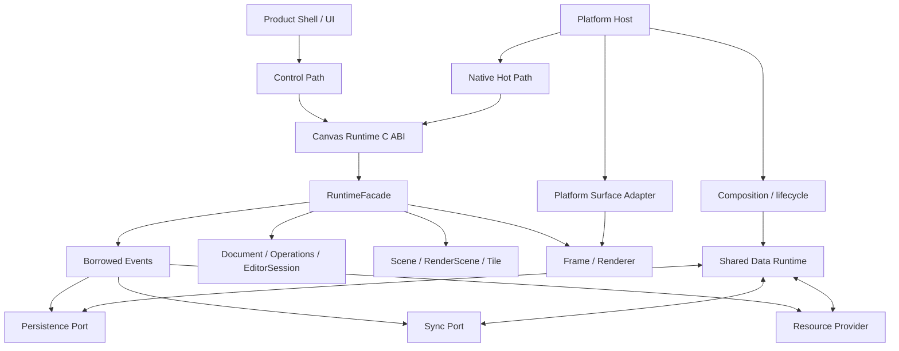

# Canvas Runtime Public C API Contract

> Status: **Accepted contract baseline**；适用范围：R1 Runtime Foundation、R2 V1 Local
> Runtime、R3 Product Tier A Shell；POC-01 的 `canvas_poc_*` ABI 仍是独立的 Experimental
> ABI，不承诺源码或二进制兼容。
> AR-0 clarification：本文件冻结 C ABI 的结构和生命周期方向，不再冻结旧的 canonical
> Transaction 外层。产品 Operation/Batch/DataBridge 命名与签名须在 G1/G7 按 ADR-0025
> 生成新版 manifest；当前头文件仍是实现输入，不是已发布 SDK。

本文确定 Canvas Runtime 的唯一跨语言公共边界。它描述 ABI、所有权、生命周期、控制面、
Native Hot Path、事件、Persistence/Sync/Resource port 和渲染时序；它不把当前 POC 的
NDJSON、文件格式、Operation payload、Snapshot codec、协作算法或具体线程拓扑伪装成产品
协议。具体 codec 通过 `CanvasEncodedData` 传递，并由对应的 schema/codec ADR 版本化。

[canvas_runtime_api_v1.h](canvas_runtime_api_v1.h) 是本契约的规范性、可编译签名清单；本文
解释语义、ownership 和调用时序。该头文件当前位于 `docs/api`，作为 R1 implementation 的
输入而非已经发布的二进制 SDK。R1 实现时按模块拆入 `include/canvas/*.h`，函数、字段、枚举
数值和生命周期不得静默改变。

## 1. 总体边界



`Shared Data Runtime` 是数据侧的外部编排边界；它通过 Persistence/Sync/Resource ports 消费
Runtime 事件并提供已验证的 Snapshot、Operation continuation 和资源 bytes。`Platform Host` 是
组合根，不是万能数据 owner；具体实现语言、包边界、Bridge ABI、数据库和网络协议留给后续
RFC/Gate。图中的 ports 不是 C++ Core 内部的持久化或协作模块。

核心原则：

- Shell 不理解 Stroke 几何、Operation Apply、RuntimeScene、SpatialIndex、Tile、Skia 或 GPU。
- Runtime 不理解 HWND、UIView、SurfaceView、React component、OAuth、URL、HTTP、WebSocket、
  SQLite、IndexedDB 或具体文件路径。
- `CanvasRuntimeHandle` 是唯一的根 capability；Document/View handle 是它创建的受控子
  capability，不代表可解引用的 C++ 对象。
- C ABI 不导出 `Document*`、`RuntimeScene*`、`SkCanvas*`、`SkImage*`、`SkSurface*`、
  `FrameGraph*`、`TileManager*` 或任何 STL/异常/虚函数对象。

## 2. ABI identity 与公共类型

产品头文件使用：

```text
include/canvas/runtime.h
include/canvas/types.h
include/canvas/input.h
include/canvas/document.h
include/canvas/view.h
include/canvas/events.h
```

`runtime.h` 是 C ABI umbrella header；各分头文件可以独立包含。所有导出的函数使用
`extern "C"`，名字为 `canvas_<domain>_<verb>` lower_snake_case。Windows 导出使用显式
visibility macro；其它平台使用默认 visibility 属性或 linker export list。

```c
#define CANVAS_RUNTIME_ABI_VERSION 1u

typedef uint32_t CanvasRuntimeHandle;
typedef uint32_t CanvasDocumentHandle;
typedef uint32_t CanvasViewHandle;
typedef uint32_t CanvasSurfaceHandle;

#define CANVAS_INVALID_HANDLE 0u
```

Handle 是 generation handle：0 永远无效，销毁后旧 handle 必须被拒绝，即使 slot 被复用。
Runtime、Document、View、Surface 使用独立 handle domain；资源使用稳定的 `CanvasResourceId`
而不是可解引用的 resource handle。实现不得把一个 domain 的裸整数静默当作另一个 domain。
Handle 由 Runtime 创建和销毁，平台 surface adapter 创建 `CanvasSurfaceHandle`；通用 C ABI
不创建或解释 HWND、ANativeWindow、CAMetalLayer、WebGL context 等 native value。

所有可扩展输入 struct 的前两个字段固定为：

```c
uint32_t struct_size;
uint32_t abi_version;
```

调用者把 `struct_size` 设置为实际传入版本的 `sizeof`；Runtime 只读取不超过
`struct_size` 的字段，缺失尾字段使用文档默认值。未知 `abi_version`、过小的
`struct_size`、非法保留位和未对齐的指针直接返回错误，不产生部分修改。导出函数的参数
类型只使用固定宽度整数、float32、指针、长度、枚举和上述 handle。

### 2.1 基础值类型

```c
typedef struct CanvasByteSpan {
    const uint8_t* data;
    uint64_t size;
} CanvasByteSpan;

typedef struct CanvasMutableByteBuffer {
    uint8_t* data;
    uint64_t capacity;
} CanvasMutableByteBuffer;

typedef struct CanvasStringView {
    const char* data;       /* UTF-8, not NUL-terminated */
    uint64_t size;
} CanvasStringView;

typedef struct CanvasDocumentId {
    uint8_t bytes[16];
} CanvasDocumentId;

typedef struct CanvasOperationId { uint8_t bytes[16]; } CanvasOperationId;
typedef struct CanvasActorId { uint8_t bytes[16]; } CanvasActorId;
typedef struct CanvasClientId { uint8_t bytes[16]; } CanvasClientId;
typedef struct CanvasObjectId { uint8_t bytes[16]; } CanvasObjectId;
typedef struct CanvasResourceId { uint8_t bytes[16]; } CanvasResourceId;
typedef struct CanvasBrushId { uint8_t bytes[16]; } CanvasBrushId;

typedef struct CanvasHash256 {
    uint8_t bytes[32];
} CanvasHash256;

typedef struct CanvasPointF { float x; float y; } CanvasPointF;
typedef struct CanvasSizeF { float width; float height; } CanvasSizeF;
typedef struct CanvasRectF { float x; float y; float width; float height; } CanvasRectF;
typedef struct CanvasColorRgba8 { uint8_t r, g, b, a; } CanvasColorRgba8;
```

`CanvasByteSpan`、`CanvasStringView` 和所有 callback payload 都是借用视图；Runtime 不会
保存其指针。输入必须在函数返回前保持有效，事件 payload 必须在 callback 返回前保持有效。
输出使用 caller-provided buffer；先传 `data = NULL, capacity = 0` 查询所需字节数，再分配
并重试。字符串不会隐式补 NUL；需要 C 字符串的 wrapper 必须自行复制。

所有 ID 是强类型、16-byte opaque value，按 bytes 原样比较和复制；全零无效。C ABI 只
冻结容器宽度和 domain separation，不在本文件决定 UUID variant、离线生成、碰撞处理或
并发排序算法；这些语义继续由 R2/R4 ID ADR 和跨平台 replay 冻结。

### 2.2 Status 与错误

```c
typedef uint32_t CanvasStatus;
enum {
    kCanvasStatusOk = 0,
    kCanvasStatusInvalidArgument = 1,
    kCanvasStatusAbiMismatch = 2,
    kCanvasStatusInvalidHandle = 3,
    kCanvasStatusWrongHandleType = 4,
    kCanvasStatusNotSupported = 5,
    kCanvasStatusUnavailable = 6,
    kCanvasStatusBufferTooSmall = 7,
    kCanvasStatusInvalidState = 8,
    kCanvasStatusParseError = 9,
    kCanvasStatusValidationError = 10,
    kCanvasStatusSequenceError = 11,
    kCanvasStatusResourcePending = 12,
    kCanvasStatusResourceMissing = 13,
    kCanvasStatusPlatformError = 14,
    kCanvasStatusCancelled = 15,
    kCanvasStatusInputOverrun = 16,
    kCanvasStatusInternalError = 17
};
```

`CanvasRendererBackend`、`CanvasRendererCapabilities`、`CanvasInputCapabilities`、
`CanvasPlatformCapabilities`、`CanvasOperationDurability`、`CanvasPointerDevice`、
`CanvasPointerPhase`、`CanvasPointerSampleFlags`、`CanvasToolType`、`CanvasEraserMode`、
`CanvasCommandType`、`CanvasKeyPhase`、`CanvasImeEventType`、`CanvasEventType` 和
`CanvasDebugOverlayFlags` 的 v1 数值定义与规范性 header 完全一致。它们的值一旦发布不得
重排；其中带 `Capabilities`、`Durability` 或 `Flags` 后缀的类型是 bit mask。Runtime 对输入
mask 的未知位返回 `kCanvasStatusInvalidArgument`；调用方必须忽略 capability 输出中不认识的
新增位，以允许同 ABI major 的 feature discovery 向前演进。其余枚举值是 mutually exclusive
numeric values，未知输入值必须拒绝。

Header 还为不透明的数值字段提供稳定语义类型：`CanvasColorSpace`、
`CanvasSurfaceOrientation`、`CanvasWheelEventFlags`、`CanvasKeyModifiers`、
`CanvasBrushTip`、`CanvasBlendMode`、`CanvasEraserScope`、`CanvasObjectType`、
`CanvasSelectionCapabilities` 和 `CanvasResourcePurpose`。这些类型的 v1 常量和保留位同样
以 `canvas_runtime_api_v1.h` 为规范来源；它们不把平台枚举或 Skia 枚举暴露给
调用方。

数值一旦发布不得重排。`canvas_status_message()` 返回静态 UTF-8 文本；详细错误通过当前
调用线程的 last-error buffer 获取。错误文本只用于诊断，不是稳定机器协议。异常不得跨
ABI；C++ wrapper 将 `CanvasStatus` 转换为 `Result`/error object，不能让 exception 穿过
导出函数。

```c
const char* canvas_status_message(CanvasStatus status);
CanvasStatus canvas_get_last_error(CanvasMutableByteBuffer buffer,
                                   uint64_t* out_required_size);
```

## 3. Runtime 生命周期与配置

### 3.1 Host callbacks

```c
typedef uint32_t CanvasLogLevel;
enum {
    kCanvasLogDebug = 0,
    kCanvasLogInfo = 1,
    kCanvasLogWarning = 2,
    kCanvasLogError = 3
};

typedef void (*CanvasLogCallback)(void* user_data, CanvasLogLevel level,
                                  CanvasStringView message);
typedef void (*CanvasRequestFrameCallback)(void* user_data,
                                           CanvasViewHandle view,
                                           uint64_t revision,
                                           uint32_t target_generation);
typedef struct CanvasEventHeaderV1 CanvasEventHeaderV1;

typedef void (*CanvasEventCallback)(void* user_data,
                                    const CanvasEventHeaderV1* event);

typedef struct CanvasRuntimeCallbacksV1 {
    uint32_t struct_size;
    uint32_t abi_version;
    void* user_data;
    CanvasLogCallback log;
    CanvasRequestFrameCallback request_frame;
    CanvasEventCallback event;
} CanvasRuntimeCallbacksV1;

typedef struct CanvasRuntimeConfigV1 {
    uint32_t struct_size;
    uint32_t abi_version;
    const CanvasRuntimeCallbacksV1* callbacks;
    CanvasRendererBackend requested_backend;
    uint32_t flags;
    uint64_t gpu_cache_budget_bytes;
    uint64_t tile_cache_budget_bytes;
    uint64_t resource_budget_bytes;
} CanvasRuntimeConfigV1;
```

`callbacks` 是调用者拥有的 borrowed 指针，只在 `canvas_runtime_create()` 调用期间读取；
其 callback target/user_data 也由调用者拥有。Runtime 不保存该指针、不创建线程、不拥有
callback target、不执行网络或文件 I/O。Callback 为同步通知，禁止在 callback 内重入同一 Runtime；需要异步工作
的 Shell/port 必须复制 payload 后排队。没有 `request_frame` 时，Runtime 仍可由 host 显式
轮询 `canvas_view_on_vsync()`。

所有配置的 `flags` 在 ABI v1 中必须为 0；cache budget 为 0 表示使用 Runtime 默认预算，
不是禁用对应缓存。`requested_backend = kCanvasRendererBackendAuto` 允许平台 adapter 选择可用
后端；指定后端不可用时 create 返回 `kCanvasStatusNotSupported`，不得静默选择不同后端。

### 3.2 Functions

```c
uint32_t canvas_runtime_get_abi_version(void);
CanvasStatus canvas_runtime_create(const CanvasRuntimeConfigV1* config,
                                   CanvasRuntimeHandle* out_runtime);
CanvasStatus canvas_runtime_destroy(CanvasRuntimeHandle runtime);
CanvasStatus canvas_runtime_get_capabilities(CanvasRuntimeHandle runtime,
                                             CanvasCapabilitiesV1* in_out_capabilities);
```

`canvas_runtime_get_abi_version()` 不需要 Runtime handle，供 loader 在创建任何对象前验证
二进制 ABI major。`canvas_runtime_destroy()` 只有在所有 child Document/View 已关闭、Surface 已 detach 时
才成功；失败不会隐式销毁子对象。Capabilities 是版本化只读描述，包含 backend、DPR、
pressure/tilt、最大 batch、surface、IME 和 FastInk capability；它不把某一设备偶然支持的
GPU private handle 暴露给 Shell。

## 4. Document、Snapshot 与 Operation port

### 4.1 Open/close

```c
typedef struct CanvasEncodedDataV1 {
    uint32_t struct_size;
    uint32_t abi_version;
    CanvasStringView codec_id;
    CanvasByteSpan bytes;
} CanvasEncodedDataV1;

typedef struct CanvasOperationEnvelopeV1 {
    uint32_t struct_size;
    uint32_t abi_version;
    CanvasOperationId operation_id;
    CanvasDocumentId document_id;
    CanvasActorId actor_id;
    CanvasClientId client_id;
    uint64_t client_sequence;
    uint64_t logical_time;
    uint32_t schema_version;
    uint32_t flags;
    CanvasStringView payload_codec_id;
    CanvasByteSpan payload;
} CanvasOperationEnvelopeV1;

typedef struct CanvasOperationBatchV1 {
    uint32_t struct_size;
    uint32_t abi_version;
    const CanvasOperationEnvelopeV1* operations;
    uint64_t operation_count;
    uint64_t operation_stride;
} CanvasOperationBatchV1;

typedef struct CanvasCapabilitiesV1 {
    uint32_t struct_size;
    uint32_t abi_version;
    uint64_t renderer_flags;
    uint64_t input_flags;
    uint64_t platform_flags;
    CanvasRendererBackend active_backend;
    uint64_t maximum_pointer_batch_samples;
    uint64_t maximum_views_per_document;
} CanvasCapabilitiesV1;

typedef struct CanvasDocumentOpenInfoV1 {
    uint32_t struct_size;
    uint32_t abi_version;
    CanvasDocumentId document_id;
    CanvasActorId local_actor_id;
    CanvasClientId local_client_id;
    uint32_t flags;
    const CanvasEncodedDataV1* snapshot;
    const CanvasEncodedDataV1* operation_continuation;
} CanvasDocumentOpenInfoV1;

typedef struct CanvasDocumentStateV1 {
    uint32_t struct_size;
    uint32_t abi_version;
    CanvasDocumentId document_id;
    uint64_t revision;
    uint64_t local_operation_count;
    uint64_t pending_resource_count;
} CanvasDocumentStateV1;

CanvasStatus canvas_document_open(CanvasRuntimeHandle runtime,
                                  const CanvasDocumentOpenInfoV1* info,
                                  CanvasDocumentHandle* out_document);
CanvasStatus canvas_document_close(CanvasDocumentHandle document);
CanvasStatus canvas_document_get_state(CanvasDocumentHandle document,
                                       CanvasDocumentStateV1* in_out_state);
CanvasStatus canvas_document_copy_recovery_frontier(CanvasDocumentHandle document,
                                                    CanvasMutableByteBuffer buffer,
                                                    uint64_t* out_required_size);
```

Snapshot 和 continuation 的 codec 由 Persistence/Schema ADR 决定；C ABI 只规定经过验证的
borrowed byte span 和 codec identity。打开时 Runtime 原子验证 document identity、codec、
capability、frontier、sequence 和 digest；失败不得暴露部分 Document。
`snapshot == NULL` 表示新建空 Document，非空时 `snapshot->bytes` 必须包含完整快照；
`operation_continuation == NULL` 表示无后续操作，非空 continuation 必须从该 Snapshot 的
RecoveryFrontier 连续开始。Runtime 只在 `canvas_document_open()` 返回前读取这两个 borrowed
struct 及其 span，不保存任何调用方指针。

### 4.2 Snapshot 与远端 Operations

```c
typedef struct CanvasSnapshotWriteOptionsV1 {
    uint32_t struct_size;
    uint32_t abi_version;
    CanvasStringView codec_id;
    uint32_t flags;
} CanvasSnapshotWriteOptionsV1;

CanvasStatus canvas_document_create_snapshot(
    CanvasDocumentHandle document,
    const CanvasSnapshotWriteOptionsV1* options,
    CanvasMutableByteBuffer buffer,
    uint64_t* out_required_size);

CanvasStatus canvas_document_apply_remote_operations(
    CanvasDocumentHandle document,
    const CanvasOperationBatchV1* operation_batch);

CanvasStatus canvas_document_update_operation_durability(
    CanvasDocumentHandle document,
    CanvasOperationId operation_id,
    CanvasOperationDurability durability_state);
```

`canvas_document_apply_remote_operations()` 是 Sync port 进入 Runtime 的唯一 Operation
批量入口。Shell 不得把 RuntimeScene 或对象指针作为远端更新入口。`durability_state` 使用
独立 bit flags 表示已达到的事实（AppliedLocally、PersistedLocally、QueuedForSync、
ServerAcknowledged）；Runtime 可以拒绝非法回退，但不假设本地持久化和服务端 ACK 在所有
产品部署中严格线性到达。它是诊断/恢复元数据，不改变 Document digest，也不能伪造
服务器确认。

### 4.3 Control command

用户行为通过 command/intent→Operation→Atomic Operation Apply→Document 唯一写路径完成；不公开
`applyOperation(Document*)` 或 `RuntimeScene` mutation。稳定的 command envelope 为：

```c
typedef uint32_t CanvasCommandType;
enum {
    kCanvasCommandDeleteSelection = 1,
    kCanvasCommandSelectAll = 2,
    kCanvasCommandClearSelection = 3,
    kCanvasCommandGroupSelection = 4,
    kCanvasCommandUngroupSelection = 5,
    kCanvasCommandBringForward = 6,
    kCanvasCommandSendBackward = 7,
    kCanvasCommandInsertShape = 8,
    kCanvasCommandInsertImage = 9,
    kCanvasCommandInsertText = 10,
    kCanvasCommandMoveSelection = 11,
    kCanvasCommandTransformSelection = 12,
    kCanvasCommandCopySelection = 13,
    kCanvasCommandCutSelection = 14,
    kCanvasCommandPaste = 15
};

typedef struct CanvasCommandV1 {
    uint32_t struct_size;
    uint32_t abi_version;
    CanvasCommandType type;
    uint32_t payload_schema_version;
    CanvasByteSpan payload;
} CanvasCommandV1;

CanvasStatus canvas_view_execute_command(CanvasViewHandle view,
                                         const CanvasCommandV1* command);
CanvasStatus canvas_view_undo(CanvasViewHandle view);
CanvasStatus canvas_view_redo(CanvasViewHandle view);
CanvasStatus canvas_view_begin_command_batch(CanvasViewHandle view);
CanvasStatus canvas_view_end_command_batch(CanvasViewHandle view);
CanvasStatus canvas_view_cancel_command_batch(CanvasViewHandle view);
```

Command payload schema与Operation payload分离并各自版本化。未知 command/payload 必须拒绝，
不能对 Scene 做近似修改。Command/Undo/Redo 属于每 View `EditorSession`；command batch 只把
一项高层业务行为归为一个 undo intention，可产生一个或多个各自原子 apply 的 Operations，
不向 Shell 暴露原始 Operation builder。OperationBatch 只是传输容器，不天然跨 Operation 原子；
nested batch 必须拒绝。

## 5. View、Camera 与 Surface

### 5.1 View 与 viewport

```c
typedef struct CanvasViewConfigV1 {
    uint32_t struct_size;
    uint32_t abi_version;
    uint32_t flags;
    float width_logical;
    float height_logical;
    float device_pixel_ratio;
} CanvasViewConfigV1;

typedef struct CanvasViewportV1 {
    uint32_t struct_size;
    uint32_t abi_version;
    float width_logical;
    float height_logical;
    float device_pixel_ratio;
} CanvasViewportV1;

typedef struct CanvasCameraStateV1 {
    uint32_t struct_size;
    uint32_t abi_version;
    float scale;
    float world_origin_x;
    float world_origin_y;
    uint64_t viewport_revision;
} CanvasCameraStateV1;

typedef struct CanvasCameraV1 {
    uint32_t struct_size;
    uint32_t abi_version;
    float scale;
    float world_origin_x;
    float world_origin_y;
} CanvasCameraV1;

typedef struct CanvasSurfaceStateV1 {
    uint32_t struct_size;
    uint32_t abi_version;
    uint32_t width_pixels;
    uint32_t height_pixels;
    float device_pixel_ratio;
    uint32_t target_generation;
    uint32_t color_space;
    uint32_t orientation;
} CanvasSurfaceStateV1;

CanvasStatus canvas_view_create(CanvasDocumentHandle document,
                                const CanvasViewConfigV1* config,
                                CanvasViewHandle* out_view);
CanvasStatus canvas_view_destroy(CanvasViewHandle view);
CanvasStatus canvas_view_set_viewport(CanvasViewHandle view,
                                      const CanvasViewportV1* viewport);
CanvasStatus canvas_view_set_camera(CanvasViewHandle view,
                                    const CanvasCameraV1* camera);
CanvasStatus canvas_view_get_camera(CanvasViewHandle view,
                                    CanvasCameraStateV1* in_out_camera);
CanvasStatus canvas_view_pan_by(CanvasViewHandle view, float dx_logical,
                                float dy_logical);
CanvasStatus canvas_view_zoom_at(CanvasViewHandle view, float x_logical,
                                 float y_logical, float scale_delta);
CanvasStatus canvas_view_screen_to_world(CanvasViewHandle view,
                                         CanvasPointF view_logical_point,
                                         CanvasPointF* out_world_point);
CanvasStatus canvas_view_world_to_screen(CanvasViewHandle view,
                                         CanvasPointF world_point,
                                         CanvasPointF* out_view_logical_point);
```

Runtime 负责 Screen↔World 变换、双指 centroid anchoring、DPR、viewport revision 和
negative-world 坐标；Shell 不得复制相机数学。`CanvasCameraV1` 是输入，
`CanvasCameraStateV1.viewport_revision` 只由 Runtime 维护并返回，调用者不能伪造或倒退。

### 5.2 Surface binding

```c
CanvasStatus canvas_view_attach_surface(CanvasViewHandle view,
                                        CanvasSurfaceHandle surface,
                                        const CanvasSurfaceStateV1* state);
CanvasStatus canvas_view_detach_surface(CanvasViewHandle view);
CanvasStatus canvas_view_update_surface(CanvasViewHandle view,
                                        const CanvasSurfaceStateV1* state);
```

`CanvasSurfaceHandle` 必须由同一平台 Surface Adapter 注册，通用 Runtime 只把它当 opaque
token。Surface 的 acquire/resize/present/recover 和 native lifecycle 属于 adapter；通用 C ABI
不提供任何 `canvas_surface_create(...)` 函数，也不接受 HWND、UIView 等平台对象。

每个平台可以发布独立 adapter header，例如 `canvas/platform/windows_surface.h`、
`android_surface.h`、`apple_surface.h`、`web_surface.h`，在该 header 中接受 HWND/
ANativeWindow/CAMetalLayer/canvas element context 并返回 `CanvasSurfaceHandle`。这些函数不属于
通用 ABI symbol set，不能被 `canvas/runtime.h` transitively include；adapter 负责验证 Runtime/
backend compatibility、生成 `target_generation`、销毁 native binding，并保证 handle 不跨
Runtime 或 platform adapter 混用。

## 6. Input、Tool 与 Brush

### 6.1 Pointer Hot Path

```c
typedef uint32_t CanvasPointerDevice;
enum {
    kCanvasPointerMouse = 1,
    kCanvasPointerTouch = 2,
    kCanvasPointerPen = 3,
    kCanvasPointerEraser = 4
};

typedef uint32_t CanvasPointerPhase;
enum {
    kCanvasPointerBegin = 1,
    kCanvasPointerMove = 2,
    kCanvasPointerEnd = 3,
    kCanvasPointerCancel = 4
};

typedef uint32_t CanvasPointerSampleFlags;
enum {
    kCanvasPointerConfirmed = 1u << 0,
    kCanvasPointerPredicted = 1u << 1,
    kCanvasPointerCoalesced = 1u << 2,
    kCanvasPointerPrimary = 1u << 3,
    kCanvasPointerBarrel = 1u << 4
};

typedef struct CanvasPointerSampleV1 {
    uint64_t pointer_id;
    CanvasPointerDevice device;
    CanvasPointerPhase phase;
    uint32_t flags;
    float x;
    float y;
    float pressure;
    float tilt_x;
    float tilt_y;
    float twist;
    float contact_width;
    float contact_height;
    uint32_t buttons;
    uint64_t timestamp_ns;
} CanvasPointerSampleV1;

typedef struct CanvasPointerBatchV1 {
    uint32_t struct_size;
    uint32_t abi_version;
    const CanvasPointerSampleV1* samples;
    uint64_t sample_count;
    uint64_t sample_stride;
    uint64_t viewport_revision;
} CanvasPointerBatchV1;

CanvasStatus canvas_view_push_pointer_batch(CanvasViewHandle view,
                                            const CanvasPointerBatchV1* batch);
```

批量输入一次性进入 InputRouter；sample 必须按 `timestamp_ns`/platform sequence 非递减，
坐标、pressure、tilt 和 contact 必须 finite，非法 batch 整批拒绝。确认点不能因渲染频率
降低而静默丢失；预测点可以回退/合并。Native CanvasView、WM_POINTER、UIKit Pencil、Web
PointerEvent adapter 直接调用此 hot path；React Native JS、Qt/QML signal 和 Web UI state
不得逐 sample 调用它。POC/R1 默认 single-owner thread，不承诺并发调用。

高频数组 element 不重复携带 struct prefix；`CanvasPointerBatchV1.sample_stride` 决定每个
element 的可读宽度，V1 最小为 `sizeof(CanvasPointerSampleV1)`。这同时允许后续追加 sample
尾字段，并避免每点重复 ABI metadata。Operation batch 使用同样的 count + stride 规则。

### 6.2 Tool、Brush、Eraser

```c
typedef uint32_t CanvasToolType;
enum {
    kCanvasToolPen = 1,
    kCanvasToolBrush = 2,
    kCanvasToolMarker = 3,
    kCanvasToolHighlighter = 4,
    kCanvasToolEraser = 5,
    kCanvasToolSelect = 6,
    kCanvasToolLasso = 7,
    kCanvasToolPan = 8,
    kCanvasToolShape = 9,
    kCanvasToolText = 10,
    kCanvasToolLaserPointer = 11
};

typedef struct CanvasBrushDescriptorV1 {
    uint32_t struct_size;
    uint32_t abi_version;
    CanvasBrushId brush_id;
    CanvasColorRgba8 color;
    float size;
    float opacity;
    CanvasBrushTip tip;
    float hardness;
    float spacing;
    float taper_start;
    float taper_end;
    float pressure_size_response;
    float pressure_opacity_response;
    float tilt_response;
    CanvasBlendMode blend_mode;
    CanvasResourceId texture_resource_id;
    uint64_t random_seed;
} CanvasBrushDescriptorV1;

typedef uint32_t CanvasEraserMode;
enum {
    kCanvasEraserObject = 1,
    kCanvasEraserStroke = 2,
    kCanvasEraserPartialVector = 3,
    kCanvasEraserObjectMask = 4,
    kCanvasEraserRaster = 5
};

typedef struct CanvasEraserDescriptorV1 {
    uint32_t struct_size;
    uint32_t abi_version;
    CanvasEraserMode mode;
    float size;
    float hardness;
    CanvasEraserScope scope;
} CanvasEraserDescriptorV1;

typedef struct CanvasToolStateV1 {
    uint32_t struct_size;
    uint32_t abi_version;
    CanvasToolType active_tool;
} CanvasToolStateV1;

CanvasStatus canvas_view_set_active_tool(CanvasViewHandle view,
                                         CanvasToolType tool);
CanvasStatus canvas_view_set_brush(CanvasViewHandle view,
                                   const CanvasBrushDescriptorV1* brush);
CanvasStatus canvas_view_set_eraser(CanvasViewHandle view,
                                    const CanvasEraserDescriptorV1* eraser);
CanvasStatus canvas_view_get_tool_state(CanvasViewHandle view,
                                        CanvasToolStateV1* in_out_state);
CanvasStatus canvas_view_get_brush(CanvasViewHandle view,
                                   CanvasBrushDescriptorV1* in_out_brush);
CanvasStatus canvas_view_get_eraser(CanvasViewHandle view,
                                    CanvasEraserDescriptorV1* in_out_eraser);
```

Tool/Brush/Eraser 改变 EditorSession，不直接改变 Document。BrushDescriptor 的版本、资源
identity、随机 seed 和坐标语义进入 Canonical Stroke；Preview/FastInk 只能消费同一模型。

## 7. Selection、Text 与非 Pointer 输入

```c
typedef struct CanvasSelectionSummaryV1 {
    uint32_t struct_size;
    uint32_t abi_version;
    uint64_t count;
    CanvasObjectType common_type;
    CanvasSelectionCapabilities capabilities;
    CanvasRectF world_bounds;
} CanvasSelectionSummaryV1;

CanvasStatus canvas_view_get_selection_summary(
    CanvasViewHandle view, CanvasSelectionSummaryV1* in_out_summary);
CanvasStatus canvas_view_copy_selection_ids(CanvasViewHandle view,
                                            CanvasObjectId* object_ids,
                                            uint64_t capacity,
                                            uint64_t* out_required_count);

typedef struct CanvasWheelEventV1 {
    uint32_t struct_size;
    uint32_t abi_version;
    float x;
    float y;
    float delta_x;
    float delta_y;
    uint32_t flags;
    uint64_t timestamp_ns;
} CanvasWheelEventV1;

typedef struct CanvasKeyEventV1 {
    uint32_t struct_size;
    uint32_t abi_version;
    uint32_t physical_key;
    uint32_t logical_key;
    uint32_t modifiers;
    CanvasKeyPhase phase;
    uint64_t timestamp_ns;
} CanvasKeyEventV1;

typedef struct CanvasTextRangeV1 {
    uint64_t start_scalar;
    uint64_t length_scalars;
} CanvasTextRangeV1;

typedef struct CanvasImeEventV1 {
    uint32_t struct_size;
    uint32_t abi_version;
    CanvasImeEventType type;
    uint32_t flags;
    CanvasStringView text;
    CanvasTextRangeV1 replacement_range;
    CanvasTextRangeV1 selection_range;
    uint64_t surrounding_text_revision;
    uint64_t timestamp_ns;
} CanvasImeEventV1;

typedef struct CanvasTextInputStateV1 {
    uint32_t struct_size;
    uint32_t abi_version;
    uint32_t active;
    uint32_t flags;
    CanvasTextRangeV1 selection_range;
    CanvasTextRangeV1 composition_range;
    CanvasRectF caret_rect_view_logical;
    uint64_t surrounding_text_revision;
} CanvasTextInputStateV1;

CanvasStatus canvas_view_push_key_event(CanvasViewHandle view,
                                        const CanvasKeyEventV1* event);
CanvasStatus canvas_view_push_wheel_event(CanvasViewHandle view,
                                          const CanvasWheelEventV1* event);
CanvasStatus canvas_view_push_ime_event(CanvasViewHandle view,
                                        const CanvasImeEventV1* event);
CanvasStatus canvas_view_get_text_input_state(
    CanvasViewHandle view, CanvasTextInputStateV1* in_out_state);
CanvasStatus canvas_view_copy_surrounding_text(
    CanvasViewHandle view, CanvasMutableByteBuffer buffer,
    uint64_t* out_required_size, uint64_t* out_text_revision);
```

IME composition、selection/caret 和 TextEditSession 通过 `TextInputAdapter` 进入；
`CanvasImeEventV1` 明确区分 begin/update/commit/cancel 和逻辑 selection range，不让 Shell
复制 `TextDocument`。平台 surrounding-text 查询和 accessibility contract 在 POC-04/R1
通过 `get_text_input_state/copy_surrounding_text` 读取当前 caret、selection、composition 和
版本化 surrounding text，不得变成第二套文本模型。

## 8. Frame scheduling 与渲染

```c
typedef uint32_t CanvasFrameDecision;
enum {
    kCanvasFrameNoFrameNeeded = 0,
    kCanvasFrameNeeded = 1,
    kCanvasFrameUrgent = 2
};

typedef struct CanvasFrameTimingV1 {
    uint32_t struct_size;
    uint32_t abi_version;
    uint64_t frame_id;
    uint64_t vsync_time_ns;
    uint64_t predicted_present_time_ns;
    uint64_t refresh_period_ns;
    uint32_t target_generation;
} CanvasFrameTimingV1;

CanvasStatus canvas_view_on_vsync(CanvasViewHandle view,
                                  const CanvasFrameTimingV1* timing,
                                  CanvasFrameDecision* out_decision);
CanvasStatus canvas_view_render_frame(CanvasViewHandle view,
                                      const CanvasFrameTimingV1* timing);
```

Runtime 只发布 frame invalidation/request；Web rAF、Android Choreographer、Apple DisplayLink、
Windows DXGI scheduler 和 Headless pump 拥有 VSync/present。`canvas_view_render_frame` 必须在
有效 attached surface 和匹配 target generation 下调用；resize、background、device loss 或
过期 generation 返回 `kCanvasStatusCancelled`/`kCanvasStatusInvalidState`，不得 present 旧
target。Runtime 不导出 TileKey、DirtyRegion、RenderGroup、FrameGraph、SkImage 或 GPU fence。

## 9. Resource Provider port

资源请求通过 `kCanvasEventResourceRequested` 发给外部 provider；Runtime 不做 HTTP、
文件或平台 asset I/O。Provider 验证后调用：

```c
typedef struct CanvasResourceVersionV1 {
    uint32_t struct_size;
    uint32_t abi_version;
    CanvasResourceId resource_id;
    uint64_t resource_revision;
    CanvasHash256 content_hash;
} CanvasResourceVersionV1;

CanvasStatus canvas_document_provide_resource(
    CanvasDocumentHandle document,
    const CanvasResourceVersionV1* resource,
    CanvasByteSpan bytes);
CanvasStatus canvas_document_fail_resource(
    CanvasDocumentHandle document,
    const CanvasResourceVersionV1* resource,
    CanvasStatus reason);
CanvasStatus canvas_document_evict_resource(CanvasDocumentHandle document,
                                            const CanvasResourceVersionV1* resource);
```

ResourceId、ResourceRevision、ContentHash 和 manifest binding 是语义层概念；`bytes`、路径、
URL、decode object 和 GPU texture 都不是 Document 状态。错误资源不会产生半个 Node 或错误
digest；资源异步到达只触发可重建 Scene/Frame invalidation。

## 10. Events、Persistence port 与 Sync port

### 10.1 Event

```c
typedef uint32_t CanvasEventType;
enum {
    kCanvasEventLocalOperationCommitted = 1,
    kCanvasEventDocumentChanged = 2,
    kCanvasEventSelectionChanged = 3,
    kCanvasEventToolStateChanged = 4,
    kCanvasEventCameraChanged = 5,
    kCanvasEventResourceRequested = 6,
    kCanvasEventSnapshotRecommended = 7,
    kCanvasEventError = 8,
    kCanvasEventPerformanceWarning = 9,
    kCanvasEventOperationDurabilityChanged = 10,
    kCanvasEventLocalPresenceChanged = 11,
    kCanvasEventTextInputStateChanged = 12
};

typedef struct CanvasEventHeaderV1 {
    uint32_t event_size;
    uint32_t abi_version;
    CanvasEventType type;
    CanvasDocumentHandle document;
    CanvasViewHandle view;
    uint64_t revision;
} CanvasEventHeaderV1;

typedef struct CanvasLocalOperationCommittedEventV1 {
    CanvasEventHeaderV1 header;
    CanvasOperationBatchV1 batch;
} CanvasLocalOperationCommittedEventV1;

typedef struct CanvasResourceRequestedEventV1 {
    CanvasEventHeaderV1 header;
    CanvasResourcePurpose purpose;
    CanvasResourceVersionV1 resource;
} CanvasResourceRequestedEventV1;

typedef struct CanvasDiagnosticEventV1 {
    CanvasEventHeaderV1 header;
    CanvasStatus status;
    CanvasStringView message;
} CanvasDiagnosticEventV1;

typedef struct CanvasOperationDurabilityChangedEventV1 {
    CanvasEventHeaderV1 header;
    CanvasOperationId operation_id;
    CanvasOperationDurability durability;
} CanvasOperationDurabilityChangedEventV1;

typedef struct CanvasLocalPresenceChangedEventV1 {
    CanvasEventHeaderV1 header;
    CanvasEncodedDataV1 presence;
} CanvasLocalPresenceChangedEventV1;
```

Event 是 Runtime 构造的只读消息，不采用 input struct 的 `struct_size` 协商。所有 typed event
必须以固定布局 `CanvasEventHeaderV1` 开头；`event_size` 是本次完整 event 的字节数，callback
先读取 `type/event_size`，确认长度足够后再转为对应的 typed event struct。
例如 `CanvasLocalOperationCommittedEventV1`、`CanvasResourceRequestedEventV1` 或
`CanvasDiagnosticEventV1`。所有嵌套 span 在 callback 返回后立即失效。最
重要事件是 `kCanvasEventLocalOperationCommitted`：它同时通知 Persistence port 追加 WAL
和 Sync port 入离线队列。Runtime 不等待网络 ACK 才更新 Document。

### 10.2 Persistence port

Persistence 不进入 Runtime Core，也不通过万能 `PlatformHost` 注入。它只使用：

1. `canvas_document_open()` 提供已验证的 Snapshot + OperationContinuation；
2. `kCanvasEventLocalOperationCommitted` 复制 operation bytes 到 WAL；
3. `canvas_document_create_snapshot()` 生成 checkpoint；
4. `canvas_document_update_operation_durability()` 回报本地持久化/flush 状态；
5. `canvas_document_provide_resource()` 管理已验证资源 bytes。

IndexedDB/OPFS、SQLite/File 和其它实现可以替换，不改变 Runtime ABI。Runtime 不知道文件
路径、数据库连接、压缩、WAL 实现或 blob GC。

### 10.3 Sync port

Sync SDK 只看见 document/actor/client identity、encoded Operation/Snapshot、revision/frontier、
ACK、retry 状态和 Presence；它不能访问 Tile、Stroke GPU geometry、SkImage 或 Surface。
它使用 `canvas_document_apply_remote_operations()` 进入 Runtime，使用 durability event 回报
`QueuedForSync`/`ServerAcknowledged`。OAuth、token、server URL、tenant、proxy、certificate、
WebSocket/HTTP 实现全部留在 Sync/Product Shell。

Presence 继续使用独立 ephemeral codec：`canvas_view_set_local_presence()` 发布本 View 的
本地 Presence event，Sync SDK 复制后发送；`canvas_document_apply_remote_presence()` 输入
远端 batch。Presence 可以丢失/过期，不进入 Snapshot、Operation history、Undo 或 Document
digest。具体 presence payload/protocol 由 R4 ADR 冻结，不在 ABI v1 伪造协作算法。

```c
CanvasStatus canvas_view_set_local_presence(
    CanvasViewHandle view, const CanvasEncodedDataV1* presence);
CanvasStatus canvas_document_apply_remote_presence(
    CanvasDocumentHandle document, const CanvasEncodedDataV1* presence_batch);
```

Clipboard 不是 Document port。Copy/cut/paste 由 View command 触发，平台 clipboard 通过
独立 `canvas/platform/*_clipboard.h` adapter 或 wrapper service 交换版本化 MIME/codec bytes；
通用 Runtime header 不暴露 NSPasteboard、Android ClipboardManager、Win32 clipboard、DOM
Clipboard 或其 handle。R1 在实现这些 command 前补充独立 clipboard contract，不把平台
对象塞进 `CanvasRuntimeCallbacksV1`。

## 11. Debug 与诊断

```c
typedef uint32_t CanvasDebugOverlayFlags;
enum {
    kCanvasDebugNone = 0,
    kCanvasDebugTileBounds = 1u << 0,
    kCanvasDebugDamageRegions = 1u << 1,
    kCanvasDebugFps = 1u << 2,
    kCanvasDebugSceneStats = 1u << 3
};

CanvasStatus canvas_view_set_debug_overlay(CanvasViewHandle view,
                                           uint32_t flags);
CanvasStatus canvas_runtime_copy_diagnostics(CanvasRuntimeHandle runtime,
                                             CanvasMutableByteBuffer buffer,
                                             uint64_t* out_required_size);
```

Debug overlay 是诊断 capability，不是 Render API；发布构建可以拒绝或忽略未支持 flags，但
不能因此改变 Document/Scene 语义。诊断输出可包含 backend、revision、generation、queue age、
candidate count、cache/memory categories 和 last error，不包含 native handle、token 或用户
隐私数据。

## 12. 版本、兼容性与退出规则

以下版本严格分离：

| 版本 | 负责内容 | 变化时的规则 |
| --- | --- | --- |
| Runtime API/ABI version | C symbols、struct prefix、status、handle/lifecycle | 新增尾字段可兼容；删除/改义需新 ABI major |
| Operation schema version | Operation envelope/payload | 由 R2/R4 schema ADR 和 migration 语料决定 |
| Snapshot schema version | Snapshot/continuation codec | 由 R2 persistence ADR 决定 |
| Sync protocol version | ACK/retry/frontier/presence transport | 由 R4 collaboration ADR 决定 |
| Renderer/Cache schema version | RenderScene/Tile/GPU cache compatibility | 不进入 Document digest；由 RF-03/R3 ADR 决定 |

C ABI 允许新增函数和 struct 尾字段，但同一 `abi_version` 不得改变既有字段语义、枚举数值、
所有权或同步/回调时序。Capability query 用于可选 backend/feature；必需 capability 不支持
时返回明确错误，不静默降级。每次 public ABI 变更必须通过 Web/WASM、Windows、Android 和
macOS/iOS/iPadOS C ABI contract tests；不得以 POC ABI 的兼容性替代 R1 contract。

可扩展 struct 不得按值嵌入另一个仍有后续字段的可扩展 struct，否则内层追加字段会移动外层
字段。配置和 Document open 使用 borrowed pointer 指向 nested extensible struct；事件中的
按值嵌套只用于 Runtime 构造、由 `event_size` 描述的只读消息。Pointer/Operation 数组使用
`uint64_t count + uint64_t stride`，跨 32/64 位 wrapper 不暴露 `size_t`。

## 13. Public API 禁止项

- 禁止在 public C header include Skia、平台窗口、网络、数据库、线程库或 C++ STL header。
- 禁止返回 owning pointer、内部对象地址、异步 callback 之后仍有效的 borrowed pointer。
- 禁止 Shell 直接修改 RuntimeScene、Tile、SpatialIndex、Stroke geometry 或 Selection backing
  store。
- 禁止 Runtime 主动连接服务器、读取 token、打开文件、创建 thread 或拥有系统 message loop。
- 禁止把 `canvas_poc_*` 直接 rename 成产品 ABI；R1 必须依据此契约和 POC 证据重新实现。
