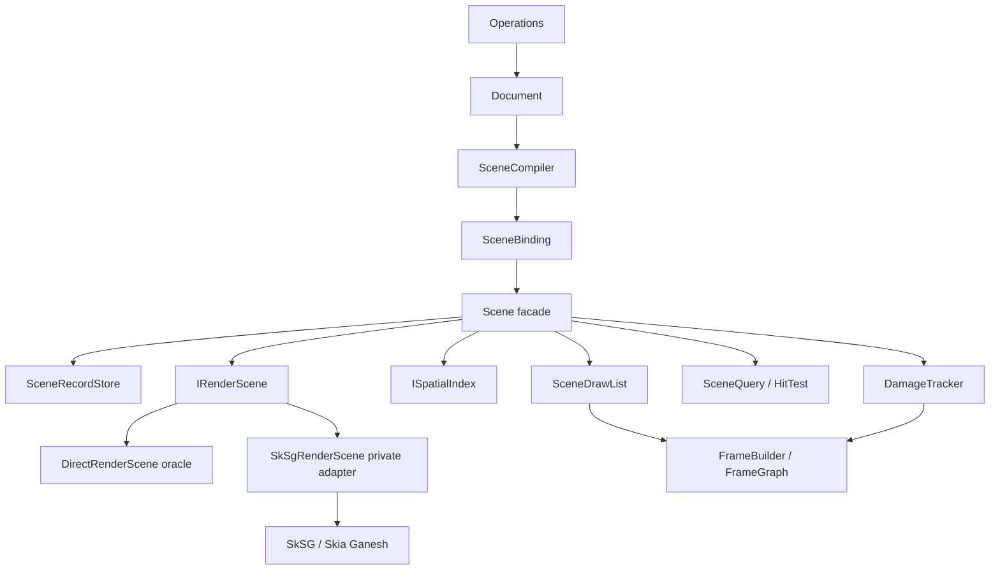

# RF-01 Scene Rendering Foundation 接口与迁移方案

> Status: **Implementation Baseline / RF01-5 Validating**
> Date: 2026-08-19
> Scope: RF-01；后续由 RF-02 动态空间索引、RF-03 Tile/LOD/Raster 调度继续实现
> Depends on: [ADR-0003](../adr/0003-semantic-document-runtime-scene.md)、
> [ADR-0019](../adr/0019-semantic-changes-invalidation-hints.md)、
> [ADR-0021](../adr/0021-render-scene-spatial-index-tiling-boundaries.md)、
> [Runtime Public C API](../api/RUNTIME_C_API_CONTRACT.md)、
> [Canvas C++ / C ABI 风格](../CPP_STYLE.md)

本文把 RF-01 从路线图中的方向性描述收敛为可实现的 C++20 模块接口、所有权、原子应用时序、
错误恢复、测试门禁和 POC-03 迁移批次。本文定义的是 Runtime 内部 C++ contract，不新增或
修改产品 C ABI；SkSG、SkCanvas、SkPaint、GPU handle 和平台 surface 都不能进入这些接口。

## 1. 目标与非目标

RF-01 必须完成：

- 建立 Canvas-owned `Scene` facade，作为 Scene 查询、增量更新、damage 和 draw-list 的唯一
  入口。
- 建立 `SceneCompiler → SceneBinding → Scene` 路径，保证 Document 只通过已验证的 full
  snapshot 或 delta 改变派生 Scene。
- 把 render DAG、对象空间查询和 damage journal 拆成独立参与者，避免 POC-03
  `RuntimeScene` 同时承担全部职责。
- 建立 `IRenderScene`，以 Direct renderer 作为 oracle、SkSG 作为私有候选实现。
- 建立 `ISpatialIndex` 的稳定内部接口；RF-01 使用 Linear/Uniform Grid oracle，RF-02 在不
  改调用方的情况下替换为动态 R-tree。
- 建立可重算、revisioned、支持多 View 的 `DamageTracker`。
- 将 HitTest 固定为 coarse candidate query → precise geometry/render hit 两阶段。
- 保持 POC-03 的 full/incremental digest、draw order、视觉和 Ink handoff 语义。

RF-01 不做：

- 不实现或选择动态 R-tree 分裂算法；这是 RF-02。
- 不实现 TileGrid、LOD、prefetch、raster queue、eviction 或 L2/L3；这是 RF-03。
- 不改变 `CanvasRuntime` public C ABI，不把内部 Scene handle 暴露给 Shell。
- 不冻结 Document ID、协作 z-order、Operation codec、Snapshot codec 或线程拓扑。
- 不把 POC-03 的 Windows 性能失败改为通过，也不降低现有 p95/p99 门禁。
- 不直接删除 POC-03 historical harness；迁移通过 adapter 和差分 oracle 分批进行。

## 2. 依赖方向与所有权



固定 ownership：

```text
Runtime
└── Document
    └── SceneBinding
        └── Scene
            ├── SceneRecordStore
            ├── unique_ptr<IRenderScene>
            ├── unique_ptr<ISpatialIndex>
            └── DamageTracker
```

- `SceneBinding` 是唯一同时知道 `DocumentReadView/ChangeSet` 和 `Scene` 的模块。
- `Scene` 拥有全部派生 participant；participant 不能反向写 Document。
- View、FrameBuilder 和 HitTest 只持有某一 Scene revision 的借用 read view，不拥有 Scene。
- Render DAG、index 和 damage 都是派生状态，随时可以从 full compiled snapshot 重建。
- Runtime 当前为 single-owner thread；`apply()` 期间不调用 host callback，也不允许另一个线程
  读取中间状态。未来线程拓扑只能在保持 `Atomic Scene Apply` 边界后另建 ADR；该边界不是
  Document 的 canonical Transaction 或第二条写路径。

## 3. 目标模块与 include 边界

R1 产品目录建立后，RF-01 目标布局为：

```text
src/
├── foundation/include/canvas/foundation/
│   ├── object_id.hpp
│   ├── result.hpp
│   └── world_geometry.hpp
├── scene/include/canvas/scene/
│   ├── scene.hpp
│   ├── scene_binding.hpp
│   ├── scene_compiler.hpp
│   ├── scene_delta.hpp
│   ├── scene_query.hpp
│   ├── scene_frame.hpp
│   ├── scene_view.hpp
│   ├── render_scene.hpp
│   ├── shadow_render_scene.hpp
│   ├── spatial_index.hpp
│   └── damage_tracker.hpp
├── scene/
│   ├── scene.cpp
│   ├── scene_binding.cpp
│   ├── scene_compiler.cpp
│   ├── damage_tracker.cpp
│   ├── direct/direct_render_scene.cpp
│   └── skia/sk_sg_render_scene.cpp
└── frame/
    └── ...
```

这些 include directory 只在 Runtime 内部 CMake targets 间可见，不安装为产品 C++ SDK。
`include/canvas/*.h` 继续只承载公共 C ABI。只有 `scene/skia` target 可以 include SkSG/Skia
headers；dependency test 必须拒绝 Document、Scene contract、Bridge 或 Shell 引入 Skia。

命名遵循 [Canvas 风格](../CPP_STYLE.md)：`namespace canvas`、UpperCamelCase 类型、
lowerCamelCase 方法、private `_member`、4 spaces、100 columns、K&R braces。

## 4. 基础类型与不变量

RF-01 复用 R1 Foundation 的强类型，不自行发明第二套 ID/geometry：

```cpp
namespace canvas {

using ObjectId = foundation::ObjectId;
using SceneRevision = foundation::Revision<struct SceneRevisionTag>;
using ContentRevision = foundation::Revision<struct ContentRevisionTag>;
using SceneOrderKey = foundation::StableOrderKey;

struct WorldPoint {
    float x = 0.0F;
    float y = 0.0F;
};

struct WorldRect {
    float left = 0.0F;
    float top = 0.0F;
    float right = 0.0F;
    float bottom = 0.0F;
};

}  // namespace canvas
```

`ObjectId` 的 16-byte C ABI 容器已固定，但离线生成和协作排序仍由 R2/R4 ID ADR 决定。
`SceneOrderKey` 只要求提供跨平台 total ordering；RF-01 不冻结其持久编码。

所有进入 `SceneRecord` 的数值必须：

- 是 finite IEEE-754 binary32，`-0` 已规范化为 `+0`；
- 满足 `left <= right`、`top <= bottom`；
- 支持负世界坐标；checked conversion 失败时整次 update 被拒绝；
- 空/退化 bounds 可以存在，但不能伪造可见面积；HitTest 依靠 tolerance 和 precise geometry；
- damage 可以扩大，不能缩小到小于 authoritative before/after coverage。

## 5. Compiled Scene 数据契约

`SceneCompiler` 输出 Canvas-owned、无 Skia 类型的 owning value：

```cpp
namespace canvas {

enum class SceneObjectKind : std::uint8_t {
    kShape = 1,
    kImage = 2,
    kVectorPath = 3,
    kRichText = 4,
    kVectorStroke = 5,
    kDabStroke = 6,
};

enum class SceneRecordFlags : std::uint32_t {
    kNone = 0,
    kVisible = 1U << 0U,
    kLocked = 1U << 1U,
    kHitTestable = 1U << 2U,
};

struct RenderPayloadRef {
    std::uint32_t slot = 0;
    std::uint32_t generation = 0;
};

struct HitGeometryRef {
    std::uint32_t slot = 0;
    std::uint32_t generation = 0;
};

enum class InvalidationHintFlags : std::uint32_t {
    kNone = 0,
    kLayoutChanged = 1U << 0U,
    kResourceChanged = 1U << 1U,
    kOrderChanged = 1U << 2U,
};

struct InvalidationHints {
    std::optional<WorldRect> worldDirty;
    InvalidationHintFlags flags = InvalidationHintFlags::kNone;
};

struct SceneRecord {
    ObjectId objectId;
    SceneOrderKey orderKey;
    SceneObjectKind kind = SceneObjectKind::kShape;
    SceneRecordFlags flags = SceneRecordFlags::kNone;
    WorldRect worldBounds;
    ContentRevision contentRevision;
    RenderPayloadRef renderPayload;
    HitGeometryRef hitGeometry;
};

enum class SceneMutationKind : std::uint8_t {
    kInsert,
    kUpdate,
    kRemove,
};

struct SceneMutation {
    SceneMutationKind kind = SceneMutationKind::kInsert;
    ObjectId objectId;
    std::optional<SceneRecord> before;
    std::optional<SceneRecord> after;
};

struct CompiledSceneSnapshot {
    SceneRevision sourceRevision;
    std::vector<SceneRecord> records;
};

struct CompiledSceneDelta {
    SceneRevision beforeRevision;
    SceneRevision afterRevision;
    std::vector<SceneMutation> mutations;
    std::optional<InvalidationHints> hints;
};

}  // namespace canvas
```

不变量：

- Snapshot 中 `ObjectId` 唯一，`orderKey + objectId` 形成稳定 total order。
- Delta 必须连续：`beforeRevision == Scene.revision()` 且 `afterRevision` 是此次成功
  Operation apply 的目标 revision；该 apply 的内部原子边界称为 Atomic Operation Apply。
- Insert 只有 `after`；Remove 只有 `before`；Update 同时有 `before/after`。
- `before` 必须逐字段匹配当前 SceneRecord，`after` 必须匹配 DocumentReadView 的权威投影。
- Reorder、visibility、style、resource 或 bounds 改变统一表达为 Update，不创建旁路 mutation。
- `InvalidationHints` 可以缺失、扩大或被丢弃，不参与 Scene digest，也不能替代 before/after。

`RenderPayloadRef/HitGeometryRef` 是 Runtime 内部 generation reference；0 generation 无效。
Geometry/resource store 拥有真实 Vector/Dab/Text/Image 数据，Scene 只保存稳定引用和保守 bounds。

## 6. SceneCompiler 与 SceneBinding

目标接口：

```cpp
namespace canvas {

class SceneCompiler final {
public:
    Result<CompiledSceneSnapshot> compileFull(DocumentReadView document) const;

    Result<CompiledSceneDelta> compileDelta(
        DocumentReadView document,
        const ChangeSet& changeSet) const;
};

enum class SceneSyncDisposition : std::uint8_t {
    kAppliedIncremental,
    kRebuiltFull,
};

struct SceneSyncReceipt {
    SceneRevision revision;
    SceneSyncDisposition disposition = SceneSyncDisposition::kAppliedIncremental;
    std::uint64_t recordsTouched = 0;
    std::uint64_t renderNodesTouched = 0;
    std::uint64_t spatialRecordsTouched = 0;
    std::uint64_t damageRectCount = 0;
};

class SceneBinding final {
public:
    SceneBinding(SceneCompiler& compiler, Scene& scene);

    Result<SceneSyncReceipt> rebuild(DocumentReadView document);
    Result<SceneSyncReceipt> synchronize(
        DocumentReadView document,
        const ChangeSet& changeSet);

private:
    SceneCompiler& _compiler;
    Scene& _scene;
};

}  // namespace canvas
```

`synchronize()` 时序：

1. `compileDelta()` 验证 ChangeSet revision、semantic changes 和 DocumentReadView。
2. `Scene::apply()` 验证当前 record、participant capability 和所有资源引用。
3. 增量失败若返回 `kRequiresFullRebuild`，`SceneBinding` 只允许从同一 DocumentReadView
   `compileFull()` 后调用 `Scene::replace()`。
4. full rebuild 仍失败则保留原 Scene，返回结构化错误；不得清空 Scene 或伪造成功 revision。
5. 成功 receipt 交给 FrameInvalidationSink；只有包含该 revision 的帧 present 后，Ink 才能
   发送 Canonical visible acknowledgement。

SceneCompiler 不直接持有 Scene，不调用 renderer，也不写 SpatialIndex/TileCache。

## 7. Scene facade 与原子 apply

```cpp
namespace canvas {

enum class SceneApplyError : std::uint8_t {
    kInvalidRevision,
    kInvalidRecord,
    kBeforeImageMismatch,
    kDuplicateObject,
    kMissingObject,
    kInvalidReference,
    kRequiresFullRebuild,
    kParticipantRejected,
    kOutOfMemory,
};

struct SceneApplyReceipt {
    SceneRevision beforeRevision;
    SceneRevision afterRevision;
    std::uint64_t recordsTouched = 0;
    std::uint64_t renderNodesTouched = 0;
    std::uint64_t spatialRecordsTouched = 0;
    DamageSet damage;
};

class Scene final {
public:
    Scene(
        std::unique_ptr<IRenderScene> renderScene,
        std::unique_ptr<ISpatialIndex> spatialIndex);

    [[nodiscard]] SceneRevision revision() const;
    [[nodiscard]] SceneReadView read() const;

    Result<SceneApplyReceipt> replace(CompiledSceneSnapshot snapshot);
    Result<SceneApplyReceipt> apply(CompiledSceneDelta delta);

    Result<SceneQueryResult> query(const SceneQuery& query) const;
    Result<HitTestResult> hitTest(const HitTestRequest& request) const;
    Result<SceneDrawList> buildDrawList(const SceneQueryResult& visible) const;
    Result<SceneFrameInput> buildFrame(
        const SceneQuery& query,
        SceneRevision afterExclusive) const;

    [[nodiscard]] DamageSet collectDamage(
        SceneRevision afterExclusive,
        SceneRevision throughInclusive) const;
    void compactDamageThrough(SceneRevision revision);

private:
    SceneRecordStore _records;
    std::unique_ptr<IRenderScene> _renderScene;
    std::unique_ptr<ISpatialIndex> _spatialIndex;
    DamageTracker _damageTracker;
    SceneRevision _revision;
};

}  // namespace canvas
```

`replace/apply` 使用 prepare→commit：

```text
validate revisions / IDs / finite bounds / references
    ↓
prepare SceneRecordStore update
prepare IRenderScene update
prepare ISpatialIndex update
derive authoritative DamageSet
    ↓ any failure
return error; old Scene remains byte-for-byte unchanged
    ↓ all prepared
commit record store      noexcept
commit render scene      noexcept
commit spatial index     noexcept
append damage journal    noexcept
publish Scene revision   noexcept, last step
```

约束：

- prepare 可以分配内存并失败；commit 不允许分配、抛异常或调用外部 callback。
- Scene revision 最后发布，因此同一 owner thread 不会观察到 participant revision 分裂。
- participant commit 中出现异常属于实现 bug；export boundary 转换为 InternalError，但不得用
  catch 后继续运行一个未知状态 Scene。Debug/sanitizer 构建必须 fail fast。
- `replace()` 同样先准备完整新 participant state，再通过 move/swap 提交，不能先清空旧 Scene。
- full/incremental 后的 Scene canonical digest、draw order、query 和 hit-test 必须等价。

## 8. IRenderScene 与 SkSG 私有实现

```cpp
namespace canvas {

class IPreparedRenderSceneUpdate {
public:
    virtual ~IPreparedRenderSceneUpdate() = default;
};

struct PreciseHitRequest {
    ObjectId objectId;
    WorldPoint worldPoint;
    float tolerance = 0.0F;
};

struct PreciseHit {
    bool hit = false;
    float distance = 0.0F;
};

class IRenderScene {
public:
    virtual ~IRenderScene() = default;

    virtual Result<std::unique_ptr<IPreparedRenderSceneUpdate>> prepareReplace(
        std::span<const SceneRecord> records,
        SceneRevision revision) const = 0;

    virtual Result<std::unique_ptr<IPreparedRenderSceneUpdate>> prepareApply(
        std::span<const SceneMutation> mutations,
        SceneRevision beforeRevision,
        SceneRevision afterRevision) const = 0;

    virtual void commit(
        std::unique_ptr<IPreparedRenderSceneUpdate> update) noexcept = 0;

    virtual Result<PreciseHit> preciseHitTest(
        const PreciseHitRequest& request) const = 0;

    virtual Result<SceneDrawList> buildDrawList(
        std::span<const ObjectId> backToFront) const = 0;

    [[nodiscard]] virtual RenderSceneDiagnostics diagnostics() const = 0;
};

}  // namespace canvas
```

- `DirectRenderScene` 首先封装 POC-03 direct draw，作为语义和视觉 oracle。
- `SkSgRenderScene` 在私有 target 内实现同一接口；SkSG node、observer、invalidation 和
  `SkCanvas` 只存在于 `.cpp`/private adapter header。
- `SceneDrawList` 是 Canvas-owned immutable frame input，只保存 ObjectId、order、payload
  reference 和 Scene revision，不保存 `SkNode*` 或 `SkDrawable*`。
- FrameBuilder 使用 draw list；RendererBackend 在自己的 Skia adapter 中解析 payload。
- SkSG 不能充当对象 SpatialIndex、Document hierarchy、Operation store 或 Tile manager。
- Direct/SkSG 的选择是内部 test/build configuration，不作为 public renderer capability；
  public backend 仍是 D3D12/WebGL2/Metal/GLES3/Raster。

SkSG 切换必须先运行 shadow mode：同一 Snapshot/Delta 同时进入 Direct 与 SkSG adapter，比较
revision、node count、bounds、draw list、precise hit 和 reference RGBA；未通过前不能成为默认。

## 9. ISpatialIndex 的 RF-01 contract

```cpp
namespace canvas {

struct SpatialRecord {
    ObjectId objectId;
    WorldRect worldBounds;
};

struct SpatialMutation {
    SceneMutationKind kind = SceneMutationKind::kInsert;
    ObjectId objectId;
    std::optional<WorldRect> before;
    std::optional<WorldRect> after;
};

class IPreparedSpatialUpdate {
public:
    virtual ~IPreparedSpatialUpdate() = default;
};

class ISpatialIndex {
public:
    virtual ~ISpatialIndex() = default;

    virtual Result<std::unique_ptr<IPreparedSpatialUpdate>> prepareReplace(
        std::span<const SpatialRecord> records,
        SceneRevision revision) const = 0;

    virtual Result<std::unique_ptr<IPreparedSpatialUpdate>> prepareApply(
        std::span<const SpatialMutation> mutations,
        SceneRevision beforeRevision,
        SceneRevision afterRevision) const = 0;

    virtual void commit(
        std::unique_ptr<IPreparedSpatialUpdate> update) noexcept = 0;

    virtual Result<SpatialQueryResult> query(const WorldRect& worldRect) const = 0;
    [[nodiscard]] virtual SpatialIndexDiagnostics diagnostics() const = 0;
};

}  // namespace canvas
```

RF-01 可提供 `LinearSpatialIndex` 和迁移后的 `UniformGridSpatialIndex`。接口不承诺 index 返回
顺序；`Scene` 必须按 `SceneOrderKey + ObjectId` 排序，保证不同实现结果一致。Diagnostics 至少
记录 examined records、returned candidates、tree/cell visits、fallback 和 estimated bytes。

RF-02 的 `DynamicRTreeSpatialIndex` 必须原样实现此接口。不得为了 R-tree 修改 SceneBinding、
HitTest、FrameBuilder 或 C ABI。

## 10. DamageTracker 与多 View revision

Damage 不能是“取一次就清空”的全局状态，否则一个 View 会消费掉另一个 View 尚未呈现的
失效。RF-01 使用 revision journal：

```cpp
namespace canvas {

enum class DamageReason : std::uint32_t {
    kContent = 1U << 0U,
    kOrder = 1U << 1U,
    kResource = 1U << 2U,
    kLayout = 1U << 3U,
    kFullRebuild = 1U << 4U,
};

struct DamageRect {
    WorldRect worldRect;
    DamageReason reasons = DamageReason::kContent;
};

struct DamageSet {
    SceneRevision afterExclusive;
    SceneRevision throughInclusive;
    bool fullScene = false;
    std::vector<DamageRect> rects;
};

class DamageTracker final {
public:
    Result<PreparedDamage> prepareReplace(
        SceneRevision beforeRevision,
        SceneRevision afterRevision,
        const WorldRect& oldContentBounds,
        const WorldRect& newContentBounds) const;

    Result<PreparedDamage> prepareApply(
        const CompiledSceneDelta& delta) const;

    void commit(PreparedDamage damage) noexcept;

    [[nodiscard]] DamageSet collect(
        SceneRevision afterExclusive,
        SceneRevision throughInclusive) const;

    void compactThrough(SceneRevision minimumPresentedRevision);
};

}  // namespace canvas
```

Authoritative damage：

| Mutation | 最小覆盖 |
| --- | --- |
| Insert | new bounds |
| Remove | old bounds |
| Bounds/content update | union(old bounds, new bounds) |
| Reorder/blend/visibility | old/new bounds 的并集；必要时扩大到受影响 stacking group |
| Resource/layout replacement | 所有引用者或受影响 subtree 的 old/new bounds |
| Full rebuild | union(old content bounds, new content bounds)，或 explicit fullScene |

Hints 只允许 union/扩大 authoritative damage；缺失、过期、NaN 或缩小提示被忽略并计入
diagnostics。Journal 有固定 revision/rect/byte 上限；超限时把旧记录保守折叠为 `fullScene`
marker，不允许无界增长。每个 View 在成功 present 后维护自己的 presented Scene revision，
Runtime 只以所有 live Views 的最小 revision 调用 `compactThrough()`。若请求范围早于已 compact
frontier，`collect()` 返回 fullScene，而不是漏 damage。

Tile invalidation 不进入 RF-01；RF-03 将 `DamageSet` 投影为 TileKey。View transform/resize 引起
的 screen damage 由 View/FrameState 管理，不写回共享 world-space journal。

## 11. Query、HitTest 与 draw order

```cpp
namespace canvas {

struct SceneQuery {
    WorldRect worldRect;
    SceneQueryFilter filter;
};

struct SceneQueryResult {
    SceneRevision revision;
    std::vector<ObjectId> backToFront;
    SceneQueryDiagnostics diagnostics;
};

struct HitTestRequest {
    WorldPoint worldPoint;
    float tolerance = 0.0F;
    HitTestFilter filter;
    std::uint64_t maximumResults = 1;
};

struct HitTestResult {
    SceneRevision revision;
    std::vector<ObjectId> frontToBack;
    HitTestDiagnostics diagnostics;
};

}  // namespace canvas
```

固定算法：

1. 用 `worldPoint ± tolerance` 形成 coarse query rect。
2. `ISpatialIndex::query()` 返回 unordered candidates。
3. SceneRecordStore 去重、验证 current revision，并按 order front-to-back 排序。
4. filter 排除 hidden/locked/non-hit-testable 或工具不接受的 kind。
5. `IRenderScene::preciseHitTest()` 或 Geometry provider 做真实 fill/stroke/text/image hit。
6. precise hit 后才应用 `maximumResults`；index 顺序不能决定最终结果。

Viewport culling 使用同一个 query contract，但按 back-to-front 输出 draw list。Selection、Eraser
和 Snap 的策略留在各自模块，只消费 candidate/hit 结果，不能重新访问 index internals。

## 12. Frame 与 Public C ABI 的映射

RF-01 不增加 C symbol。现有调用映射为：

```text
canvas_view_push_pointer_batch / execute_command
    → EditorSession / Operation
    → Atomic Operation Apply + ChangeSet
    → SceneBinding::synchronize
    → Scene::apply
    → DamageSet + FrameInvalidationSink

canvas_view_on_vsync
    → View reads Scene revision
    → collectDamage(lastPresented, targetRevision)
    → Scene::query(view world rect)
    → Scene::buildDrawList
    → FrameBuilder / FrameGraph

canvas_view_render_frame
    → RendererBackend / PlatformSurfaceAdapter
    → successful present
    → View presentedSceneRevision update
```

Public `CanvasViewHandle` 不等于 Scene、SkSG node 或 SceneReadView。Runtime facade 把内部错误
映射为 `CanvasStatus`；不会把 RF-01 enum、diagnostics object 或 C++ exception 穿过 ABI。
Public ABI manifest test 必须证明 RF-01 前后 symbol、field offset 和 enum value 没有变化。

## 13. POC-03 到 RF-01 的迁移映射

| POC-03 当前对象 | RF-01 目标 | 迁移规则 |
| --- | --- | --- |
| `canvas::poc03::Document` | R2 Document / `DocumentReadView` | POC 保留为 fixture；不得复制为产品 Document |
| `NodeRecord` | `SceneRecord` | 通过 `Poc03SceneSource` adapter 映射；不直接 typedef |
| `RuntimeScene` SoA | `SceneRecordStore` + `Scene` | 先建立差分 oracle，再拆 ownership |
| `SceneCompiler::CompileFull` | `SceneCompiler::compileFull` + `SceneBinding::rebuild` | 保持 canonical digest oracle |
| `ApplyIncremental` | `compileDelta` + `Scene::apply` | 增量失败走明确 full rebuild disposition |
| `SpatialIndex` uniform grid | `UniformGridSpatialIndex : ISpatialIndex` | 只作 RF-01 baseline；RF-02 替换 |
| `DirtyFor`/hints | `DamageTracker` | authoritative before/after 与 hint 分离 |
| `QueryView` | `Scene::query` + View transform | index 输出不携带最终顺序 |
| `HitTest` | `Scene::hitTest` | coarse candidate + precise hit |
| direct Skia renderer | `DirectRenderScene` | 继续作为 visual oracle |
| planned SkSG | `SkSgRenderScene` | private shadow adapter；等价后再切换 |
| `BuildFrame`/FrameGraph | FrameBuilder consumer | 只改输入为 immutable `SceneDrawList` |
| `TileCache` | RF-03 | RF-01 不迁移为产品 TileManager |
| `IntegratedInkController` | Operation → SceneBinding | 不再直接持有 compiler/scene/cache 三个可写引用 |

POC namespace、历史 evidence 和 physical harness 保留；不能把 `canvas::poc03` 批量 rename 成
`canvas`。产品代码从 contract 重建，并通过 adapter 消费相同 fixture。

## 14. 分批实施方案

### RF01-0：Contract 与静态边界

- 建立上述 target-private headers、module dependency lint 和 ABI manifest baseline。
- 建立 FakeRenderScene/FakeSpatialIndex，验证 prepare failure 和 no-fail commit。
- C++ API 全部符合 Canvas style；不改 POC behavior。

当前 RF01-0 host baseline 已落在 `runtime/foundation` 与 `runtime/scene`：

- `canvas_runtime_foundation` 只提供强类型 `ObjectId`、revision、order key、result 和 world
  geometry；不链接第三方或平台库。
- `canvas_runtime_scene` 提供 `SceneRecord`、snapshot/delta、`IRenderScene`、`ISpatialIndex`、
  `DamageTracker` 与 `Scene` 的内部接口骨架；Fake participant 位于独立 testing target。
- `Scene::replace/apply` 统一执行 validate → prepare record/render/spatial/damage → commit，
  并将 Scene revision 作为最后发布步骤；失败路径不触碰旧 record、participant、damage 或
  revision。
- `tools/check_runtime_boundaries.py` 检查 RF-01 contract include 和 CMake 依赖，拒绝 Skia、
  Windows、Apple、JNI、Emscripten、网络/存储/线程及 public C ABI 反向依赖。
- `docs/api/canvas_runtime_api_v1.manifest.json` 与 `tools/check_runtime_abi_manifest.py` 固定
  当前 54 个导出函数、49 个 struct 声明和 163 个 enum 常量；RF01-0 不修改规范性 C header。

RF01-0 明确不包含 SceneCompiler/SceneBinding 的 Document adapter、真实 Direct/SkSG renderer、
动态空间索引、Tile/LOD、平台 surface 或 POC-03 行为迁移；这些在 RF01-1 及之后的批次实现。

退出：C11/C++20 public ABI manifest 不变，Document/Bridge/Shell 无 Skia include。

### RF01-1：SceneRecordStore 与 full rebuild

- 实现 SceneRecordStore、Scene::replace、DirectRenderScene 和 UniformGridSpatialIndex adapter。
- 实现 `Poc03SceneSource`，将固定 fixture 编译为 `CompiledSceneSnapshot`。
- 对比旧 RuntimeScene 与新 Scene 的 digest、bounds、draw order、query 和 RGBA。

当前 RF01-1 实现基线：

- `SceneRecordStore` 按 `orderKey + objectId` 保存确定性 record 顺序，并维护独立 ObjectId
  索引；`prepareReplace()` 完成数值、kind、generation、重复 ID 校验，`commit()` 只交换已准备
  的 owning state。
- `DirectRenderScene` 保存 Canvas-owned render projection，`UniformGridSpatialIndex` 保存 full
  snapshot 的负坐标安全 grid projection；两者不依赖 Skia、平台 surface 或 POC 类型。
- `Scene::replace()` 以 record → render → spatial → damage → revision 顺序提交；任何 participant
  prepare 失败都保留旧 Scene。Direct/Grid 的 delta 入口在本批次明确返回
  `kRequiresFullRebuild`，不伪装增量能力。
- `Poc03SceneSource` 只存在于 POC compatibility target，将 POC-03 `Document` 映射成产品
  `CompiledSceneSnapshot`。payload slot 与旧 `RuntimeScene` 保持零基；slot 0 合法，只有
  generation 0 无效。
- Host oracle 覆盖 1K/10K/50K/100K 的 revision、record、digest、content bounds、visible
  query、draw order 和 deterministic CPU reference RGBA。CPU reference 是无 Skia 的语义像素
  等价门禁，不冒充 Skia/GPU readback；实际 Skia visual/golden 仍由 POC-03 平台门禁承担。
- RF01 独立测试覆盖 Store validation/index、Direct draw-list/bounds hit、Grid 负坐标/去重/
  brute-force 等价、退化 bounds、stale query、replace participant failure 原子性，以及
  Direct/Grid delta capability 声明。

退出：1K/10K/50K/100K full compile 逐项等价；replace 失败保持旧 Scene。

### RF01-2：Delta 与原子 participant update

- 实现 SceneCompiler::compileDelta、SceneBinding::synchronize 和 prepare→commit。
- 覆盖 create/update/remove/reorder/resource/Stroke commit。
- 注入 record/render/index prepare failure 和 stale/malformed hints。

当前 RF01-2 correctness baseline：

- 新增无 Document 类型依赖的 `ICompiledSceneSource` 与 `SceneBinding`。Binding 只接收 owning
  `CompiledSceneSnapshot/Delta`；POC-03 `Document/ChangeSet` 只由 compatibility adapter 感知。
- `SceneBinding::synchronize()` 优先编译并应用 delta；source 或 participant 明确返回
  `kRequiresFullRebuild` 时，从同一 source 编译 full snapshot。receipt 区分
  `kAppliedIncremental/kRebuiltFull` 并保留触发 fallback 的结构化错误。
- `DirectRenderScene` 与 `UniformGridSpatialIndex` 已实现 create/update/remove/reorder 的
  prepare→commit 路径；Store、Render、Spatial、Damage 全部 prepare 成功后才依次无失败提交，
  Scene revision 仍最后发布。
- `Poc03SceneSource` 保留稳定 payload slot，不因 order 改变重编号；ChangeSet 必须连续、结构
  合法且 after image 与当前 Document 一致，否则请求安全 full rebuild。
- 自动语料覆盖真实 create/update/reorder/delete、400 次确定性混合操作、损坏 ChangeSet full
  fallback、stale source、full compile 失败传播，以及 full/delta participant failure 后旧 Scene
  保持不变。每一步均与旧 POC-03 full compiler 的 digest 对比。

RF01-2 尚未宣称性能退出：当前 Direct/Grid oracle 在 prepare delta 时仍会复制并重建其内部
状态。`recordsTouched` 只代表语义 mutation 数，不能冒充实际工作量。把 participant 改为真正
局部、工作量可诊断且有界的容器结构，仍是 RF01-2 从 `Validating` 退出前的剩余工作；不得把
这一限制推迟后伪称单节点更新已与场景规模无关。

退出：任何失败都不改变 record/render/index/damage/revision；incremental/full oracle 等价。

### RF01-3：Damage journal 与 Frame 接入

- 实现 revisioned DamageTracker、journal collapse、multi-view collect/compact。
- FrameBuilder 改用 `SceneDrawList + DamageSet`，但仍走 direct renderer。
- Ink visible acknowledgement 继续绑定成功呈现的 Scene revision。

当前 RF01-3 correctness baseline：

- `DamageTracker` 以 `(afterExclusive, throughInclusive]` 保存 world-space damage，默认限制为
  256 条 journal、4096 个 rect 和 1 MiB 估算内存。任一限制超出时，prepare 阶段把现有记录
  保守折叠为单个 `fullScene` marker；commit 前旧 journal、frontier 和 diagnostics 均不改变。
- authoritative damage 始终来自 mutation 的 old/new bounds。`InvalidationHints` 必须携带与 delta
  一致的 before/after revision、有限有序且完整覆盖 authoritative bounds，才允许 union/扩大并
  映射 order/resource/layout reason；缺失 hint 不影响正确性，过期、NaN、未知 flag 或缩小 hint
  被拒绝并计入 diagnostics。
- `compactThrough()` 只前移 compact frontier，并删除所有已被全部 live View 呈现的记录；若某
  View 请求的起始 revision 早于 frontier，`collect()` 返回 `fullScene`，不会静默漏 damage。
- `SceneViewRegistry` 为每个非零 View ID 独立维护单调 presented revision，并提供所有 live View
  的最小 revision。duplicate attach、missing View 和 revision 倒退均返回结构化错误。
- `Scene::buildFrame()` 从同一 Scene revision 生成 `SceneQueryResult`、`SceneDrawList` 和
  `DamageSet`；新增 `SceneFrameInput` 只包含 owning frame 数据，不暴露 participant 或 Skia 类型。
- RF01 独立测试覆盖 entry/rect/byte collapse、stale collect、hint 扩大/过期/非法、View attach/
  present/detach 与 frame revision 一致性；新增 public headers 继续参加 self-contained compile。

RF01-3 仍为 `Validating`：当前仅建立 direct renderer 的 frame input contract。把
`SceneViewRegistry::minimumPresentedRevision()` 接入平台 present/visible acknowledgement，以及
10,000 revisions 的双 View 速率差语料，仍需在后续 Frame/Shell integration 中完成；不得把
registry 单元测试写成已完成真机多 View 调度。

退出：两个 View 不互相消费 damage；journal 有界；Preview/Canonical 不空白、不重复加深。

### RF01-4：两阶段 HitTest

- query candidates 先去重并确定排序，再调用 Direct precise geometry。
- 覆盖负坐标、退化 bounds、fill/stroke/text/image、locked/hidden 和 tolerance。
- Selection/drag harness 只通过 Scene::hitTest，不访问 SpatialIndex internals。

当前 RF01-4 correctness baseline：

- `HitTestRequest` 以 world point、非负 tolerance、kind mask、locked policy 和有界
  `maximumResults` 组成；Scene 先以 `point ± (tolerance + epsilon)` 做 coarse query，再过滤
  hidden、non-hit-testable、locked 和 kind，最后按 `SceneOrderKey + ObjectId` 从 front-to-back
  调用 `IRenderScene::preciseHitTest()`。
- candidate 返回顺序不具有语义。Scene 自己去重并排序，命中数量限制只在 precise hit 之后应用；
  index 顺序变化不会改变结果。Direct 当前以保守 bounds distance 作为 POC precise geometry，
  后续 SkSG/geometry provider 才替换为真实 fill/stroke/text/image 精确算法。
- 非 finite point/tolerance、负 tolerance、zero maximum、未知 kind flag 和 coarse bounds 溢出
  整体拒绝；不会部分返回命中结果。locked/hidden/non-hit-testable 语料、tolerance、负坐标和
  1,000 次候选顺序扰动已加入 RF01 测试。

RF01-4 仍为 `Validating`：本轮建立 two-stage contract 和 Direct baseline；退化 path、真实
 stroke/text/image geometry、Selection/Eraser/Snap policy integration 仍是后续验证项。

退出：与 brute-force precise oracle 逐字节一致；index 返回顺序扰动不改变结果。

### RF01-5：SkSG shadow adapter

- 增加私有 `SkSgRenderScene` target；只有该 target include SkSG。
- Direct/SkSG 同时消费 snapshot/delta，输出独立 diagnostics 和 reference readback。
- 在所有跨平台 correctness/golden 门禁通过前，默认仍为 Direct。

当前 RF01-5 baseline：

- `ShadowRenderScene` 已实现通用双 participant orchestration：同一 snapshot/delta 必须在
  primary 与 shadow 两侧都 prepare 成功后才生成一个可提交 update；commit 依次消费两侧已准备
  状态，不允许单侧发布。draw-list 与 precise-hit 的可观察结果不一致时返回结构化
  `kParticipantRejected` 并累计 mismatch diagnostics。
- 当前锁定的 `poc01-minimal-v1` Skia SDK 只包含 Ganesh core 静态库和 public core headers；
  manifest/归档中没有 `modules/sksg` headers 或独立 SkSG target。因此本提交不伪造
  `SkSgRenderScene`，也不从 Skia source tree 或 GN/Ninja 隐式回退。真实 adapter 需要新的
  producer profile/SDK ID（包含 SkSG headers、实现库和 license）后才能在 private target 中接入。
- RF-01 不建立或冻结专属 Skia/SkSG SDK profile，也不把 producer 构建纳入本阶段门禁。真实
  adapter 所需的 headers、实现库、license、工具链身份和消费方式由后续产品构建流程统一设计；
  在该流程落地前，RF-01 只验证 Canvas-owned Scene contract 和无 Skia 的 Direct/Fake 路径。
- Direct renderer 继续是默认 oracle；`ShadowRenderScene` 的双 participant contract 可先被
  Fake/Direct 组合验证，不把这项 contract 测试写成 SkSG visual/golden 已通过。

RF01-5 状态为 `Validating`：双 participant 原子性和 observable comparison 已通过 host/ASan
语料；产品级 Skia 供应链、真实 SkSG node/bounds/invalidation/readback、跨平台 shadow golden 和
无 SkSG 类型泄漏门禁仍 Pending。

退出：node/bounds/draw-list/hit/damage/revision 等价；RGBA 达到既有视觉门禁；无 SkSG 泄漏。

### RF01-6：默认切换与 POC compatibility 收口

- 在支持 SkSG 的 target 将默认内部实现切换为 `SkSgRenderScene`，保留 Direct oracle target。
- POC harness 继续通过 adapter 运行，不删除历史 evidence。
- 输出 RF-01 evidence；Windows 性能数据如实记录，不提前宣称 RF-02/RF-03 收益。

退出：本文件第 15 节全部满足后，RF-01 才能标记完成并开始 RF-02 默认实现。

## 15. 验证矩阵与量化退出条件

### 15.1 Correctness

- 10 个固定 fixture + 10,000 组随机合法 delta：full/incremental Scene digest、record、bounds、
  draw order、query、precise hit 和 final RGBA 100% 等价。
- create/update/remove/reorder/resource/VectorStroke/DabStroke 均覆盖 before-image mismatch、
  missing ID、duplicate ID、stale revision、invalid generation 和 NaN/Infinity。
- 任何 rejected update 后，四个 participant 的 revision/digest/estimated bytes 与调用前一致。
- hints 缺失、扩大、损坏和过期时正确性不变；缩小 hints 不得造成漏 damage。
- 清空所有 derived state 后，从同一 CompiledSceneSnapshot 重建结果一致。

### 15.2 Module/API

- SkSG/Skia include 只允许出现在 `scene/skia` 和 renderer implementation allowlist。
- Document、Operations、Bridge、public C header、Shell 不链接 SkSG target。
- `docs/api/canvas_runtime_api_v1.h` 的 54 个导出声明、struct field offset、enum value 和
  lifecycle contract 无变化。
- RF-01 headers 在 C++20 下 self-contained；format、naming、include 和 ownership lint 通过。

### 15.3 Damage 与多 View

- 每种 mutation 的 authoritative damage 完整覆盖 CPU reference 的像素变化；允许扩大，不允许
  漏覆盖。
- 两个 View 以不同 present rate 运行 10,000 revisions，慢 View 不丢 damage。
- journal 超过配置上限后折叠为 fullScene；entries/rects/bytes 均不超过上限。
- target generation 改变、surface detach/device loss 不改变 Document/Scene digest；恢复后
  full damage 触发重绘。

### 15.4 Query/Hit/Render

- candidate order 随机洗牌 1,000 次，最终 visible/hit order 完全一致。
- negative world、极大 finite coordinate、zero-area bounds、跨原点对象和 tolerance corpus 通过。
- Direct 与 SkSG 的 node count、world bounds、draw list、precise hit 和 visual digest 等价。
- Windows/Web/Android/Apple 现有 build、golden、16 KiB alignment 和手势回归不退化。

### 15.5 性能与诊断

RF-01 不用新阈值替代 POC-03 Windows 失败，但必须提供分段 trace：

- compile/prepare/commit、damage derive、candidate query、precise hit、draw-list build；
- Direct/SkSG record/render、Skia draw/flush、GPU submit 和 present；
- records/render nodes/index/damage journal/transient 的 bytes；
- single-object delta 的 records/render/index touched 必须与 mutation 数量成比例，不能隐藏 full
  rebuild；发生 full fallback 时 diagnostics 必须明确记录原因。

RF-01 完成条件不是“Windows 已达到最终 100K 门禁”；它必须先证明模块边界、原子性、damage
和 SkSG 私有实现正确。RF-02/RF-03 完成后，再在同一 Windows 设备重新判断 p95/p99。

## 16. 明确后置的选择

- R-tree node capacity、split/reinsert/condense 和 oversized object policy：RF-02。
- Tile size、signed world→tile rounding、LOD/scale bucket、prefetch 和 raster task：RF-03。
- Scene/Frame worker、parallel prepare、WASM pthread：线程拓扑 ADR。
- SceneOrderKey 的持久编码和协作插入：R2/R4 ID/order ADR。
- SkSG 不满足的具体节点用 CustomRenderNode 还是 Direct payload：实现实验和 golden 决定。
- Skia Graphite/WebGPU：未来 RendererBackend，不进入 RF-01。

上述选择不得反向改变 `SceneBinding → Scene → participant`、prepare→commit、revisioned damage、
两阶段 HitTest 或 Public C ABI 边界。
