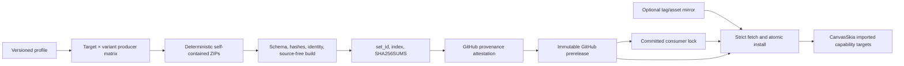

# Skia Prebuilt SDK Supply Chain

## 边界

`poc01-minimal-v1` 固定 POC-01 已验证的 Ganesh 功能集，不顺带引入 RichText、
JPEG/WebP、SVG、PDF、Vulkan、Graphite、Debug 或符号包。Producer 是唯一允许获取
Skia source 并运行 GN/Ninja 的路径；Canvas 普通 CI 是只读 Consumer。

POC-04 历史验收使用独立的
[`poc04-richtext-v2`](../../tools/skia/profiles/poc04-richtext-v2.json) profile。
它在保留既有 Web、Windows 和
Android RichText SDK 的基础上，增加 `macos-arm64-metal`、`ios-arm64-metal` 和
`ios-simulator-arm64-metal`。iOS device SDK 同时服务 iPhone 与 iPad，iOS
simulator SDK 同时服务 iPhone 与 iPad simulator；这些是 SDK producer 和
source-free linking 门禁，不等同于 AppKit/UIKit IME 行为验收。

POC-01 与 POC-04 已 Accepted，POC-05 也已完成非 V1 风险验证，因此它们的自动
workflow 和两条历史 Producer 已退役。历史 profile、lock、Release、工具与证据继续保留
用于显式复现，但不再参与普通 PR/push。POC-02、POC-03 和 POC-06 尚有未关闭门禁；其中
需要 Skia 的活跃 Consumer 统一使用 `r1-full-v1` 的锁定 `release` variant，不再依赖
POC-01 minimal 或 POC-04 RichText SDK。

R1 产品化使用独立的
[`r1-full-v1`](../../tools/skia/profiles/r1-full-v1.json) profile。历史
`poc01-minimal-v1`、`poc04-richtext-v1`、`poc04-richtext-v2` 及其 lock 保持不可变，
不会为了 R1 Full 迁移或重发。Full profile 是单一 Runtime SDK，不拆 capability 包，
但每个 target 同时发布 `release`、`debug`、`asan` 三种显式 variant。DNG 与 PIEX 在
全部 variant/target 上关闭，manifest 固定 `raw_dng=false`。



## R1 Full matrix 与 variant

`r1-full-v1` 构建 8 个 target：Windows x64/D3D12、Web WASM/WebGL2、macOS
arm64/x64 Metal、iOS/iPadOS device arm64 Metal、Apple Silicon iOS simulator arm64
Metal，以及 Android arm64-v8a/x86_64 GLES3。Producer 将 `target × variant` 展开为
24 个独立 job；每个 job 只拥有一个 GN output directory：

- `release`：`is_official_build=true`、`is_debug=false`、无 sanitizer、无独立 symbols
  asset，是唯一默认 consumer variant。
- `debug`：`is_official_build=false`、`is_debug=true`、保留完整调试信息，并发布
  symbols asset。
- `asan`：`is_official_build=false`、`is_debug=true`、`sanitize="ASAN"`、保留 frame
pointer。consumer 必须显式选择并同时插桩，不能由 Release/Debug 构建隐式消费。

同一次 workflow run 可用 **Rerun failed jobs** 只重跑失败组合，成功组合的 artifact
保持可用。新 run 在安装目标工具链并记录 identity 后，会查询保留期内的旧 Full Producer
artifact；只有 profile/hash、Skia commit、target/variant、规范化 GN args、toolchain、
recipe hash、SDK ID、GitHub artifact digest、manifest 与全部文件 hash 完全一致时才复用。
复用包仍执行 source-free consumer smoke 并重新上传为本次 run 的独立 artifact；任何不匹配
都进入正常源码构建。Actions cache 只恢复编译输出，不能替代 package、verify、smoke 或
aggregate。不可变 prerelease 发布后，普通 Canvas consumer 只下载 Release asset，不再运行
Producer。

ASan 验证等级写入 identity：macOS、Windows 和 iOS simulator 目标为
`runtime-smoke`；Android arm64/x86_64 和 iOS device 初始为 `instrumented-link`，Web
WASM 初始为 `link-only`。Android producer runner 没有常驻 emulator/真机，因此不能把
instrumented source-free link 冒充 runtime smoke；连接设备或 emulator 的独立 evidence
可提升该等级。等级是已执行证据，不用于伪装所有平台具有相同 sanitizer runtime 能力。

Full profile 启用 Ganesh、PDF、SVG、Skottie、SkParagraph/SkShaper/SkUnicode、
PathOps、PNG/JPEG/WebP/Wuffs、FreeType/HarfBuzz/ICU/Expat/zlib；关闭 Graphite、Dawn、
Vulkan、DNG/PIEX、viewer/tools/fuzzer、Perfetto、Lua 和 XPS。PathOps 没有虚构的 GN
开关，能力由真实公共 API link probe 验证。

`is_official_build=true` 会让部分 Skia GN 第三方依赖默认切到系统库，因此 Full profile
显式设置 Expat、FreeType、HarfBuzz、ICU、JPEG、PNG、WebP 与 zlib 的全部
`skia_use_system_*` 开关为 `false`。Release、Debug 与 ASan 由同一 Skia commit 构建并
打包实际依赖闭包，不把 host 或平台预装 archive 隐式泄漏给 consumer。

## Profile 与 identity

[`poc01-minimal-v1.json`](../../tools/skia/profiles/poc01-minimal-v1.json)
定义公共 GN 参数、七个 target、实际链接的 archive 和 toolchain 最低身份约束。
target ID 固定为：

- `windows-x64-d3d12`
- `web-wasm-webgl2`
- `macos-arm64-metal`
- `ios-arm64-metal`
- `ios-simulator-arm64-metal`
- `android-arm64-v8a-gles3`
- `android-x86_64-gles3`

`sdk_id` 是规范化 identity JSON 的 SHA-256。identity 包含 profile/hash、Skia
commit、target/backend/arch、规范化 GN 参数、实际 toolchain identity 和 producer
recipe hash；绝对安装路径不参与。`set_id` 是按 target ID 排序后的
`target -> sdk_id` 映射的 SHA-256。

Windows manifest 记录 LLVM、实际 MSVC toolset 与 Windows SDK；Web 记录
Emscripten/LLVM 与无 pthread；Apple 记录 Xcode、SDK 版本和 iOS 17.0 deployment
target；Android 记录 NDK 27.2.12479018 与 API 26。

## 包契约

每个 `skia-sdk-<target>.zip` 根目录包含：

```text
manifest.json
args.gn
include/**
modules/skcms/{skcms.h,src/skcms_public.h}
lib/*.{a,lib}
lib/cmake/CanvasSkia/CanvasSkiaConfig.cmake
resources/fonts/Roboto-Regular.ttf
licenses/{Skia,FreeType,libpng,zlib}.txt
```

Manifest 对所有 payload 文件记录角色、大小和 SHA-256。ZIP 使用固定时间戳、排序
路径和固定权限生成；连续两次打包必须逐字节一致。验证器拒绝未知 schema 字段、重复
或穿越路径、符号链接、额外/缺失文件、校验漂移、错误 target/toolchain、无效静态库和
不匹配的字体。

Full v2 包另外包含 SkParagraph、Skottie、SkSG、SkResources、JSON reader、SVG 等
module headers、Noto CJK fixture、所有实际启用依赖的 notice，以及
`archive_closure`。Windows ASan 包另外携带锁定 LLVM 的动态 runtime DLL、import library
与 runtime thunk library；imported target 负责显式链接，不能把 clang-cl driver 的
`/fsanitize=address` 错传给 `lld-link`。闭包由 GN 根模块的传递 dependency graph 与
`outputs` 生成，保留根到
依赖的确定性链接顺序和原始 build-relative path；打包器不得盲扫 output tree 或引入
host-tool archive。Debug/ASan symbols ZIP 使用独立 `canvas-skia-symbols-v1` manifest，
逐文件记录大小与 SHA-256；即使平台没有产生 PDB/dSYM/map，静态库内嵌调试信息仍由
variant identity 声明并保留。

Full CMake package 只公开以下 imported targets：

- `CanvasSkia::Skia`：完整 Runtime archive closure，唯一默认入口。
- `CanvasSkia::Paragraph`、`CanvasSkia::Skottie`、`CanvasSkia::Svg`、
  `CanvasSkia::PathOps`、`CanvasSkia::Media`：受支持能力入口，继承完整 closure、平台库和
  必要 compile definitions。

能力入口不承诺拆成更小的二进制包；它们禁止消费者自行排列 Skia、ICU、HarfBuzz、
JPEG/WebP 等 archive。Producer 删除/隐藏 Skia source 后分别链接真实 Paragraph、
Skottie、SVG、PDF、JPEG/WebP 与 PathOps API，证明 package 是自包含的。

## 发布权限和不可变性

R1 Full 将 Producer 拆为可复用的
[`skia-sdk-r1-full-producer.yml`](../../.github/workflows/skia-sdk-r1-full-producer.yml)、
变更分类入口
[`r1-full-producer-contract.yml`](../../.github/workflows/r1-full-producer-contract.yml)
和只允许 `workflow_dispatch` 的
[`r1-full-release.yml`](../../.github/workflows/r1-full-release.yml)。Producer 的
`target × variant` 是 24 个独立 job；PR 可按变更影响范围运行完整矩阵、对应平台的
3 个 variant，或完全不运行 Producer。`fetch.py`、consumer 校验、lock 工具和 consumer
workflow 只进入
[`r1-full-consumer-validation.yml`](../../.github/workflows/r1-full-consumer-validation.yml)，
不 checkout Skia source、不运行 GN/Ninja。文档和无关改动不启动这些昂贵验证。

变更分类由
[`classify_r1_changes.py`](../../tools/skia/classify_r1_changes.py) 完成：profile、Skia
lock、构建/打包/identity/aggregate/publish recipe 或 Producer workflow 选择完整 24
job；`deps.lock.json` 会比较变更前后的依赖子树，只有 Skia、Skia 构建参数、平台工具链
或 SDK 字体身份变化才选择 Producer；仅 Protobuf/Abseil 等 Semantic Codec 依赖变化不
启动 Skia Producer。平台专属 producer 路径只选择对应平台的 3 个 variant；fetch、consumer、lock 校验
和 consumer workflow 只运行 source-free consumer validation。普通 PR 仅获得
`contents: read`；Actions artifact 只负责 matrix 与聚合 job 之间的短期传递。

从 `main` 人工触发 R1 Full release 时会重新构建完整 24-job 矩阵，而不是提升 PR
artifact。聚合 job 要求八个 target 的 24 包齐全，生成 `skia-sdk-index.json` 与
`SHA256SUMS`。publish job 单独获取写权限，为 ZIP 与 index 生成 provenance，然后创建
`skia-sdk-r1-full-v1-<set_id 前 16 位>` prerelease。若同名 Release 已存在，只有 target
commit、资产集合和每个字节都一致才成功；任何差异都失败且不会覆盖资产。

首个不可变 prerelease 已发布为
`skia-sdk-poc01-minimal-v1-debcbb7b9376806c`，完整 set ID 为
`debcbb7b9376806c94ffb9af5950ebd8a6de0547833f9b57df96a20531ca7817`。
[`skia-sdk.lock.json`](../../skia-sdk.lock.json) 固定 Release repository/tag、profile、
Skia commit，以及七个资产的 SDK ID、大小、SHA-256 和 toolchain identity。被任何
lock 引用的 Release 永不删除；回滚只恢复旧 lock。

## Consumer 下载与 CMake 边界

[`fetch.py`](../../tools/skia/fetch.py) 默认从 lock 指定的精确 GitHub Release tag
下载。设置 `CANVAS_SKIA_SDK_BASE_URL` 时，镜像必须暴露
`<base>/<tag>/<asset>`；无论来源，下载器都执行相同的大小、SHA-256、ZIP 安全、
manifest、文件级 hash、target、toolchain、profile 与规范化 GN identity 校验。
验证在临时目录完成，成功后才原子替换 `.deps/skia-sdk/<target>`；已有安装在复用前
也会重新验证。

普通构建通过 `CANVAS_SKIA_SDK_ROOT` 和
`find_package(CanvasSkia CONFIG REQUIRED)` 只链接 `CanvasSkia::Skia`。CMake 同时
比对安装 manifest 与 committed lock；缺包或不匹配直接失败并给出 `fetch.py` 命令，
没有源码回退。普通 POC-01 workflow 的静态检查拒绝 Skia source bootstrap、sync、
`skia/out` cache 和 producer builder。七个 SDK 的 ID/下载字节/耗时与 Canvas 构建、
测试耗时写入 job summary；当前只收集数据，不设总耗时门禁。

更新 lock 只能显式运行：

```sh
python3 tools/skia/update_lock.py --tag <immutable-prerelease-tag>
```

该命令会核对 prerelease、target commit、index、`SHA256SUMS`、GitHub 资产 digest 和
精确七包资产集合后才改写 lock。

R1 Full 使用 v2 matrix lock，按 `target -> variants -> release/debug/asan` 固定 24 个
SDK ZIP、16 个 Debug/ASan symbols ZIP、toolchain、capabilities、sanitizer metadata 与
runtime validation level。下载目录是 `.deps/skia-sdk/<target>/<variant>`；默认 variant
只允许 `release`，Debug/ASan 必须显式指定 `CANVAS_SKIA_SDK_VARIANT`。首个 Full lock
只能在 40 个 ZIP 的不可变 prerelease 发布并聚合验证后由 `update_lock.py` 生成；发布前
不提交虚构 asset hash 的占位 lock。

首个 Full prerelease 发布后运行：

```sh
python3 tools/skia/update_lock.py \
  --profile tools/skia/profiles/r1-full-v1.json \
  --tag <immutable-r1-full-prerelease-tag>
```

工具默认写入 `r1-full-skia-sdk.lock.json`；显式 `--output` 只用于审计或迁移，不能用来
覆盖历史 POC lock。
