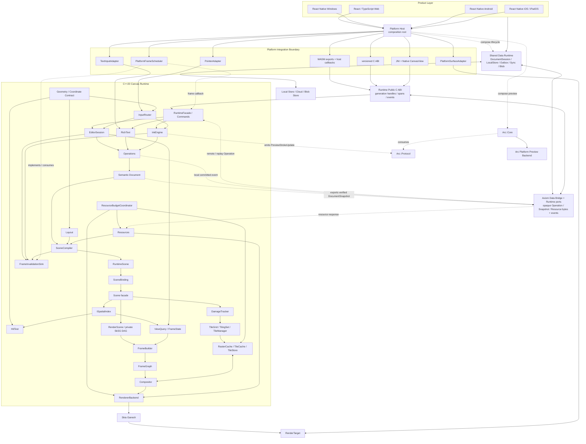
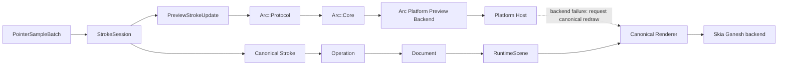
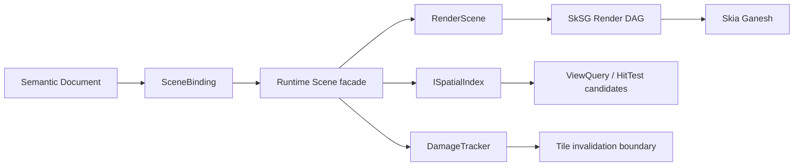

# Canvas v2 系统架构

> 状态：Accepted Baseline / AR-0 Pass；适用范围：G0～G9、POC/RF/R1～R5；相关 ADR：[ADR 索引](../adr/README.md)

本文档定义 Visual Document Runtime 的模块边界、数据流和接口语义。具体容器、序列化库、协作算法和最终线程拓扑仍由对应 POC/ADR 决定，但实现不得绕过这里规定的所有权和依赖方向。

产品发布目标是 Web、Windows、Android、iOS 和 iPadOS。Web 使用 React/TypeScript + WASM；
Windows 使用 RNW；Android、iOS/iPadOS 使用 React Native + Native Canvas 数据面。macOS native
产品化暂缓，通过 Web 使用；ChromiumOS 复用 Web，Headless 是 test/reference target。见 ADR-0025。

## 1. 系统分层



图中的 `Platform Host` 是组合根：它负责把 Shell、Axiom、Shared Data Runtime、Arc、平台
surface 和 frame scheduler 组合起来，但不复制任何一个运行时的语义状态机。`DataBridge`、
Persistence/Sync/Resource ports 是 Axiom 与 Shared Data Runtime 之间的窄边界；数据库、文件、
网络和云端服务仍在图外。Arc 的 Preview presentation 失败时，Host 必须关闭或绕过该
Preview backend，并让已经确认的输入继续沿 Canonical Renderer 路径呈现。

依赖只能自上而下：Shell 的低频产品命令依赖 Runtime Public C ABI；Pointer、VSync 与 IME
分别通过专用 adapter 进入 InputRouter、FrameScheduler 和 TextEditSession。C ABI 只提供
generation handles、fixed-width values、explicit-length spans、caller buffers 和 borrowed
events；Bridge 依赖 Runtime 的公开 facade，Document 不依赖 Editor、ResourceManager、
Persistence、Skia、网络或平台，Renderer 不拥有 Document 写入口或 platform surface 生命周期。
Shared Data Runtime 的 Persistence/Sync 编排和 Resource provider 通过 port/event 与 Runtime 连接，不进入 Runtime Core。
Serialization 是 Bridge、Operations 和 Persistence 使用的版本化 codec 机制，不是独立权威状态模块。

## 2. 平台边界

### 2.0 Public C ABI、Control Path 与 Hot Path

[Runtime Public C API](../api/RUNTIME_C_API_CONTRACT.md) 是 Web/WASM、Windows、Android/JNI、
Apple ObjC++ 和未来 Qt/其它 wrapper 的共同 contract。它不等同于 POC-01 `canvas_poc_*`，
也不暴露 C++/STL/Skia/platform object。生命周期固定为：

```text
runtime create
  → document open
  → view create
  → platform surface attach
  → input / command / VSync / render
  → surface detach
  → view destroy
  → document close
  → runtime destroy
```

Control Path 包括 openDocument、setTool/Brush/Eraser、executeCommand、undo/redo 和状态查询，
允许经过跨语言 wrapper。Native Hot Path 包括 PointerSampleBatch、IME composition、VSync、
Preview、render/present，必须由 native adapter 批量进入 C++，不得逐 sample 经过 RN JS、
QML/React state 或 JSON。Runtime callback 是 borrowed synchronous notification，不允许重入；
Persistence/Sync/Resource provider 复制所需 payload 后异步处理。

Public ABI、Operation schema、Snapshot schema、Sync protocol 和 Renderer/Cache schema 各自
版本化。公共 ABI 新字段只能追加在 `struct_size + abi_version` struct 尾部；handle domain、
enum 数值、ownership 和 callback 时序一旦发布不得静默改变。Canvas C++ 实现遵循
[代码风格规范](../CPP_STYLE.md)。

RF-01 的内部 Scene C++ contract、`SceneCompiler → SceneBinding → Scene` 时序、
`IRenderScene/ISpatialIndex/DamageTracker` prepare→commit 原子协议、两阶段 HitTest 和
POC-03 迁移批次见 [Scene Rendering Foundation](RF01_SCENE_RENDERING_FOUNDATION.md)。这些
类型属于 Runtime private interface，不安装为产品 SDK，也不增加 Public C ABI symbol。

### 2.1 Web

- React/TypeScript 负责 Toolbar、Inspector、Dialog、Comment UI、Share、Account 和 Navigation。
- C++ Runtime 编译为 WASM，通过窄接口接收命令、批量输入和平台服务回调。
- Skia Ganesh 使用 WebGL；POC 阶段单线程运行，不启用 SharedArrayBuffer/pthread。
- Web adapter 拥有 HTML Canvas/WebGL context 的创建、resize、context loss 与 present；Runtime 只消费本帧 `RenderTarget`。
- HTML/DOM 不插入 RuntimeScene 的任意深度。ExternalSurface 只通过受控 Overlay 层出现。
- React/TypeScript 是当前 Tier A 产品选择；架构不变量是 WASM 窄接口、WebGL surface ownership 和共享 Runtime，不是某个具体 React/Vite 版本。

### 2.2 Windows / RNW

- React Native for Windows 负责产品 UI，C++ Runtime 在 Native Canvas Region 中绘制；本地屏幕
  批注是独立 Native Overlay Host special host。RNW 只控制进入/退出和低频产品状态；transparent
  topmost window、click-through/draw mode、multi-monitor/DPI、focus/pen capture、surface、Arc 与
  composition 保持 native hot path。POC-05 只证明 RNW/native Canvas 与受控 ExternalSurface
  可行性，不构成屏幕批注产品验收。
- C ABI 版本化，使用不透明 handle；C++ 对象、STL 容器和异常不跨 ABI。
- Windows adapter 拥有 HWND、DXGI swapchain/backbuffer、resize、present 与 device-loss 生命周期；这些类型不进入 Runtime Core。
- DOM/WebView2 与 native canvas 使用固定层级区域，不允许单个 DOM 元素穿插在画布对象之间。
- Pen/Pointer 输入由 native region 收集并批量进入 InputRouter。
- RNW 是当前 Tier A 产品选择。更换产品壳若保持 C ABI、native canvas region 和高频数据面边界，只需新的产品/平台决策与 contract evidence；改变这些不变量才需要 Architecture ADR。

### 2.3 Android

- React Native 只负责产品 Shell。
- Native `CanvasView` 拥有 Surface 生命周期、MotionEvent、历史点、IME 桥和 JNI 调用。
- 触控笔数据链固定为 `MotionEvent/history → Native CanvasView → PointerSampleBatch → C++ InputRouter`，不得走 RN event/JS/NativeModule 往返。
- JNI 只传递 opaque handle、批量结构、命令和事件；高频路径不得逐 sample 跨 JNI。
- React Native 是当前 Tier A 产品选择。替换 JS Shell 不得改变 Native CanvasView/JNI、IME 与 Pointer 的 native 数据面不变量。

### 2.4 iOS / iPadOS RN

- iOS/iPadOS adapter 拥有 native view、CAMetalLayer/Metal drawable、resize、前后台与 drawable failure 生命周期。
- React Native 负责产品 Shell，Native Canvas/ObjC++ 负责 Canvas、Pencil、IME 与 Metal surface 数据面；高频事件不经过 RN JS。POC-01/POC-04/POC-06 的 Apple 证据迁移为产品纵切面证据。

### 2.5 macOS deferred

- macOS 保留 core/Metal portability harness；当前产品通过 Web Shell 使用，不建立 native 产品发布门禁。

### 2.6 ChromiumOS 与自有设备

- ChromiumOS 默认复用 Web Shell 和 WASM Runtime。
- 系统 FastInk 是平台能力，通过 FastInkBackend 注入；Runtime 不依赖 ChromiumOS、Android BSP 或 DRM 类型。
- 自有设备预研可以拥有 RawInputSource 和 system service，但它们不进入通用 Runtime target。

### 2.7 Headless

- V1 Headless 是 test/reference/golden 与内部受控 export Utility Target，不是公开 server/batch rendering 产品 API。
- Headless 使用同一 Document、SceneCompiler、FrameBuilder 和 Renderer 语义，但没有 Editor viewport UI、Platform Pointer/IME 或 native overlay。
- server-side export、thumbnail、PDF/image batch conversion、并发隔离和公共稳定 API 在产品化前另建 ADR。

## 3. 权威状态边界

### 3.1 Semantic Document

Document 是唯一可保存、迁移和协作同步的业务真相，包含：

- Document identity、schema version 和带命名空间的 DocumentCapability requirements；一个 Product Page 与该 Document 一一对应，但 Page 集合不属于 Document。
- V1 节点、稳定 ID、层级、z-order、几何、样式和资源引用。
- RichText 内容、Vector/Dab Stroke 的语义数据。
- 操作与迁移需要的最小版本/因果元数据。

Document semantic state 同时包含版本化 ResourceManifest；节点只保存稳定 ResourceId，manifest 将 ResourceId 绑定到 ResourceRevision、ContentHash 和语义元数据。Document 不包含：blob 下载 URL/本地路径、decode 状态、Skia 对象、GPU handle、空间索引、选区、hover、IME composition UI、远端光标或连接状态。

### 3.2 EditorSession

每个本地视图拥有独立 EditorSession：

- Viewport、Selection、Hover、Tool、Snap 和临时 Drag state。
- History/Undo intention、Clipboard session 和 TextEditSession。
- Active Stroke session 与局部 preview 状态。

EditorSession 可根据产品需要局部恢复，但不作为 Document collaboration state。

History/Undo intention 属于 EditorSession。Undo/Redo 选择本地 intention，并针对当前 Document revision 产生新的 compensating Operations；单个 Operation 的内部 Atomic Apply 不是 canonical Transaction 外层，不能倒退 Document state pointer、operation sequence 或改写旧 Operation。

同一 Document 可被多个 View/EditorSession 同时观察，但生命周期不能隐式共享：

| 状态/资源 | 默认 ownership |
| --- | --- |
| Viewport、Selection、Hover、Tool、Text composition、Active Stroke | 每个 EditorSession/View 独立 |
| History/Undo intention、Clipboard session | 每个 EditorSession 独立；平台 clipboard 通过 adapter 访问 |
| Document 与 committed Operations | Document 级共享 |
| RuntimeScene、Resource decode cache | Runtime/Document context 共享，以 revision 隔离 |
| FrameState、screen damage、Preview/HUD | 每个 View/frame 独立 |
| GPU context/cache | 由 Renderer/Platform target sharing policy 决定，不进入 Document |

销毁 View 必须取消其 composition、Active Stroke、未决 frame callback 和 Preview sink，但不
销毁仍被其他 View 使用的 Document/RuntimeScene/resource；同一节点在多个 View 同时编辑的
产品策略由 R2 Editor contract 冻结，不能靠共享临时 state 偶然串行化。

### 3.3 Collaboration Presence

Presence 包含在线成员、远端光标、临时选区、follow 状态和网络质量。它允许丢失和过期，不进入快照、操作历史与撤销语义。

### 3.4 RuntimeScene

RuntimeScene 是 SceneCompiler 从 Document 构建的派生表示：

- 布局结果、world bounds、空间索引、render/hit-test records。
- 文本布局引用、稳定资源引用/解析状态和 world-space content invalidation。
- 可由主画布、minimap、第二窗口和 headless export 共享的稳定 scene data。

RuntimeScene 可随时全量重建；增量更新结果必须与同 revision 的全量编译等价。

RuntimeScene 不保存 Viewport、单视口 visible set/clip/LOD、scale bucket、screen-space damage、Selection、Hover、HUD、Presence 或 Active Stroke Preview。这些由 `RuntimeScene + EditorSession/View + target parameters` 产生单视口 `ViewQuery/FrameState`，并按 view/frame 独立失效。

### 3.5 View/Frame State

`ViewQuery/FrameState` 是单视口、单 target 的短暂派生状态，包含 visible records、viewport clip、LOD/scale bucket、target color/DPR、screen-space damage 和 frame revision。Selection、Hover、caret、HUD、Presence 与 Active Preview 作为独立 overlay 输入，不回写 RuntimeScene。

### 3.6 GPU 与缓存

display list、纹理、字形、图片、raster tile 和 persistent tile 都是非权威数据。设备丢失、缓存逐出或版本不兼容时直接重建，不允许回写或修正文档语义。

## 4. 领域模型

### 4.1 V1 节点

```text
Product Page (owned by Product Layer)
└── one independent Axiom Document
    ├── Shape
    ├── Image
    ├── VectorPath
    ├── RichText
    ├── VectorStroke
    ├── DabStroke
    ├── Connector
    ├── Group
    ├── Sticky
    ├── Frame (staged schema)
    └── PDF (staged resource/object schema)
```

所有节点具有稳定 ID、局部变换、可见/锁定状态、稳定排序键和版本化属性集合。ID 保持
强类型和 domain separation：Node/Stroke、Operation、Actor、Resource、View/Surface 不得
互换或由裸整数偶然共享命名空间。R1 冻结编码、离线生成、collision/reuse、serialization
与 replay 属性；R2 schema 在实现前决定实体范围，R4 再用协作语料冻结 Actor/Operation
及离线冲突规则。

稳定排序键必须支持层级内中间插入、确定遍历/摘要及不修改无关节点；不能把容器迭代顺序
或每次插入后全量重新编号当作语义。R2 前用实验型 ADR 冻结本地 order schema 和 migration，
R4 再决定并发插入/移动的合并算法；当前基线不预选 fractional indexing、RGA、LSEQ 或其他
CRDT。每个 Axiom Document 本身就是一个 Product Page 的语义内容根；没有 Page ObjectKind
或 `DocumentRoot → Page*` synthetic root。Viewport 属于 `EditorSession`，跨 Page 的导航、
排序、复制和生命周期由上层产品层的 Page Collection 管理；Shared Data Runtime 只按产品层
契约保管并查询 PageId→DocumentId 等 repository 数据。

### 4.2 已确认的分阶段 V1 对象与未来扩展

```text
V1 staged:  Frame / Group / Sticky / PDF / Connector
Future:     Section / Table / HybridStroke / Comment + Anchor
External:   Embed / Video / ExternalSurface
```

Frame、Group、Sticky、PDF 和 Connector 已进入 V1 实施范围，按 G1/G4/G6 分阶段关闭；其中
Frame/PDF 的具体 schema 仍需兼容契约，未闭合不等于从 V1 删除。Section、Table、HybridStroke、
Comment/Anchor、Embed、Video 和 ExternalSurface 按各自需求与 Gate 分期；extension registry、
资源引用、SceneCompiler visitor 和 unknown capability 处理必须允许未来添加。未知必需能力要
显式拒绝，不能静默降级为丢失内容。

## 5. Operations

三个层次不能混用：

- **Intent/Command**：用户意图，例如移动当前选区或提交一次文本 composition。
- **Operation**：已规范化、可回放、可持久化、可同步的确定性变化。
- **ChangeSet**：Operation 应用结果，描述受影响节点、字段、资源、布局和 dirty hints。

`ChangeSet` 不是第二种持久化事实。它由一次成功的 Atomic Operation Apply 针对明确的
before/after revision 派生，并逻辑上分为 `SemanticChanges` 与 `InvalidationHints`：前者
描述创建/删除、字段、层级/order 和 ResourceManifest 等语义变化，后者描述 dirty bounds、
layout、spatial 或 cache 优化提示。Hints 可丢弃、扩大或重算，不进入 Document digest、
operation log 或 collaboration envelope；SceneCompiler 缺少可信 hints 时必须扩大失效或
回退 full compile，不能因 hints 缺失产生错误结果。详见 [ADR-0019](../adr/0019-semantic-changes-invalidation-hints.md)。

本地写路径：

```text
Normalized Input
  → Editor/Text/Ink intent
  → command validation
  → deterministic Operation
  → Operation validate → Atomic Operation Apply
      ├→ committed Operation → persistence/collaboration queue
      └→ ChangeSet → SceneCompiler incremental update
```

远端写路径从 operation validation 开始，不能进入 Tool state machine。Document 只提供一个有序写入口；同一初始快照和 operation sequence 必须得到相同逻辑摘要。

Undo/Redo 不构成第二写路径：History 只选择 local intention/undo group，随后生成新的原子 compensating Operations。并发导致补偿不再适用时必须返回明确 applied/no-op/rejected/conflicted 结果，不能通过恢复旧 snapshot 覆盖当前 Document。

### 5.1 DocumentSnapshot 与 Operation continuation

Operation-driven Document 的恢复关系固定为：

```text
DocumentSnapshot at RecoveryFrontier F
    + committed OperationContinuation F → T
    = Document state at target frontier T
```

`DocumentSnapshot` 是已提交 Operation 边界上的完整、不可变语义检查点，包含 Document
identity/schema/capability、语义 graph、RichText/Canonical Stroke、ResourceManifest、
Document revision、版本化 `RecoveryFrontier` 和可验证 digest。它不包含 EditorSession/
History UI、Presence、Viewport、composition/Preview、RuntimeScene、GPU/cache、平台句柄、
decode 状态或 blob bytes。

Snapshot 从同一 revision/frontier 的不可变 `DocumentReadView` 导出。ResourceManifest 在
逻辑上属于 Snapshot/Digest，即使物理包分开保存也必须由同一原子 checkpoint 绑定。只有
Snapshot、manifest、continuation 起点和恢复元数据已经持久化、校验且可读取后，才允许
compaction 删除 frontier 之前的 Operation prefix；资源 blob 的 GC 继续按 manifest/content
reachability 决定。

`RecoveryFrontier` 是不透明版本化位置；单机 POC/V1 可用连续 sequence 实现，但 Core
契约不假设未来永远只有全局线性序号。Document revision 是当前 Runtime 实例的单调发布/
失效标记，RecoveryFrontier 是持久/同步恢复位置，二者必须一起校验但不能互换。Snapshot
和 continuation 均绑定 Document identity 与明确 base/target frontier。Snapshot restore
只用于创建/恢复 Document、显式
migration 或 collaboration bootstrap，不能作为普通编辑、Undo/Redo 或远端更新的第二写
入口。Snapshot 和 continuation 必须在发布 Document 前原子验证；gap、duplicate、乱序、
frontier mismatch、未知 required capability 或 digest 损坏不能暴露部分恢复状态。

术语必须区分：可持久化语义检查点叫 `DocumentSnapshot`；输入变换快照叫
`ViewportSnapshot`；executor 内不可变读取视图叫 `DocumentReadView`。后两者不是保存格式。
完整契约见 [ADR-0020](../adr/0020-document-snapshot-operation-recovery.md)。

## 6. 坐标空间、Pointer 与 Ink 接口

### 6.1 坐标与 DPI

概念空间和变换顺序固定为：

```text
Node Local
  → node/world transform
Page/World
  → viewport transform (ViewId + viewport_revision)
View Logical
  → RenderTarget DPR/device transform
Device Pixel
  → platform placement transform（仅 adapter）
Platform Screen
```

- Page/World unit 是抽象文档单位，x 向右、y 向下，不等于 device pixel 或物理长度。
- Web CSS pixel、Windows DIP、Android logical pixel 和 Apple point 在 adapter 边界归一化为 View Logical。
- PointerAdapter 先得到 View Logical sample，再使用该 batch 记录的 viewport snapshot 逆变换为 Page/World。历史 sample 不得用较新的 viewport revision 重新解释。
- Document/Canonical Stroke 保存 Page/World geometry；DPR、screen coordinates、像素取整和平台 inset 不进入 Document。
- HitTest 使用 Page/World point 与由 View Logical tolerance 转换的 world tolerance。ExternalSurface placement 由 FrameBuilder 从 world 变换到 device，再由平台 registry 映射到 screen/view。
- 像素取整只在 raster/overlay adapter 边界发生；bounds/clip 在此前保持连续值并采用 half-open extent 语义。

### 6.2 数值与几何确定性

Document geometry、Canonical Stroke geometry 和进入 canonical Scene digest 的几何标量以
IEEE-754 binary32 作为 canonical storage；这不限制算法使用经过声明的 binary64 中间值。
进入 Atomic Operation Apply、Canonical commit 或 canonical Scene record 前必须是 finite，
`-0` 规范化为 `+0`；NaN、Infinity、不可逆矩阵、checked arithmetic 溢出和超出 schema/
algorithm version 声明范围的结果必须整笔/整个 Operation 拒绝。Canonical serialization 使用版本化
字段顺序和 little-endian bit pattern，不得 hash C++ 对象布局或依赖 locale 十进制格式。
FMA、fast-math、flush-to-zero、libm 和算法 quantization 规则必须由算法版本声明；视觉
golden 容差不能替代语义 digest 一致性。完整边界见 [ADR-0016](../adr/0016-numeric-geometry-determinism.md)。

### 6.3 PointerSampleBatch

以下是必须保持的语义接口；具体二进制布局由 POC-02 固定。

```cpp
struct PointerSample {
  PointerId pointer_id;
  Vec2 position;
  float pressure;
  Vec2 tilt;
  Vec2 contact_size;
  Timestamp timestamp;
  PointerPhase phase;
};

struct PointerSampleBatch {
  ViewId view_id;
  ViewportRevision viewport_revision;
  Mat3 view_to_world;
  PointerDeviceInfo device;
  Span<const PointerSample> samples;
};
```

要求：

- 一个 batch 内按时间单调排序；跨 batch 的乱序策略由 InputRouter 明确处理。
- 平台 timestamp 进入 Runtime 前转换为同一单调时间域。
- 缺失 pressure/tilt 使用 capability 标记，不伪造硬件精度。
- 历史点批量传递，不逐点跨 WASM/C ABI/JNI。
- batch 内位置在进入 InputRouter 时使用 View Logical space，并通过同 batch 的不可变 `view_to_world` 生成 canonical Page/World samples；矩阵失效或不可逆时整 batch 明确拒绝。

InputRouter 对 confirmed samples 保持每个 pointer stream 的顺序，不得静默删除、重复或
重排；兼容 batch 可以合并。Predicted tail 是可替换派生状态，可以丢弃后从 confirmed
prefix 重算。Preview update 和 frame invalidation 可以按 revision 合并，但 begin/end/
cancel、Canonical commit 与 visible/handoff acknowledgement 不可丢弃。所有跨线程/ABI
队列都有容量、字节上限、最大 batch 与 oldest-sample-age 诊断；无法背压时以明确
`InputOverrun` 取消受影响 StrokeSession，不提交部分 Document。详见 [ADR-0018](../adr/0018-input-backpressure-coalescing.md)。

`StrokeSession` 生命周期：

```cpp
class StrokeSession {
 public:
  void push(const PointerSampleBatch& batch);
  StrokeCommit end();
  void cancel();
};
```

- Session 允许 resample、smooth 和 prediction。
- Preview 可以包含预测点，Canonical 只能提交确认样本派生的稳定语义。
- `push()` 允许持续增量维护 Canonical candidate；`end()` 只把已经验证完成的 Canonical Stroke 作为一次原子 Operation 提交，不能把超长笔迹的全部计算推迟到 pointer up。`cancel()` 不留下 Document 修改。
- Preview 与 Canonical 共享 Stroke ID、transform 和版本化 `BrushDescriptor`。Descriptor 至少包含 brush type/version、semantic parameters 及所需 ResourceId/ContentHash；同一 descriptor/version 的跨平台 replay 必须产生等价结果。
- Dab/texture 等涉及 jitter、rotation、spacing 或 variation 的算法不得使用不可控的全局
  random。随机流必须使用 algorithm/brush-version/StrokeId/stream 等 domain-separated
  deterministic seed，并将 PRNG/seed 规则纳入 BrushDescriptor algorithm version；随机性
  不得依赖 wall clock 或平台线程调度。

## 7. FastInk 双路径与 Arc 模块



这里的虚线只表示呈现失败后由 Host 请求 Canonical Renderer 重绘，不携带 Stroke 语义写入，
也不允许 Arc 写入 Document 或接管 Canonical Renderer。Canonical Stroke 始终沿
`Operation → Document → RuntimeScene → Canonical Renderer → Skia backend` 路径提交和呈现，
不存在 `Canonical Stroke → Skia` 旁路。

Arc 是与 Axiom 同仓、但可独立构建、测试和抽取的 input-to-display 模块。Axiom Ink 与
Arc Core/平台 backend 只共同依赖版本化 `Arc::Protocol`，由 Platform Host 组装。Arc 不
依赖 Document、Operations、EditorSession、RuntimeScene、FrameGraph、Canonical Stroke、
Persistence 或 Collaboration，也不取得 Canonical RenderTarget ownership。

控制面语义：

```cpp
class ArcPreviewBackend {
 public:
  virtual void begin(const ArcPreviewBegin&) = 0;
  virtual void push(const ArcPreviewStrokeUpdate&) = 0;
  virtual void seal_input(const ArcPreviewSeal&) = 0;
  virtual void canonical_committed(const ArcCanonicalCommit&) = 0;
  virtual void canonical_visible(const ArcCanonicalVisible&) = 0;
  virtual void cancel(const ArcPreviewCancel&) = 0;
};
```

- `PreviewStrokeUpdate` 是 `StrokeSession` 在统一 resample/smooth/pressure/prediction/rollback 后产生的版本化 Preview Model，至少携带 Stroke ID、update revision、brush descriptor、transform/坐标空间、confirmed representation、predicted tail 和 replace/truncate 语义。
- 具体 vector segment/dab batch 布局、buffer ownership 和 ABI 由 POC-02 用延迟与回放证据冻结；平台 backend 不接收 raw pointer sample 来重新实现另一套平滑、预测或笔刷解释。
- `begin/push/seal_input/canonical_committed/canonical_visible/cancel` 必须按 Stroke ID、
  revision、HandoffToken 和 target generation 幂等保护。
- `seal_input` 只停止新 Preview update 并继续显示 confirmed Preview；Canonical 是否提交由
  StrokeSession/Operations 决定。多个 sealed Stroke 可以分别等待自己的 handoff。
- Canonical 对应 revision 通过实际 presentation evidence 可见后，Preview 才能移除；GPU
  submit、render/swap 返回或一次 rAF 不能自动等同 visible。失败时保留、安全退役或切换
  内部 no-preview/null backend，产品可见结果进入 Canonical-only rendering，不出现空白帧或双重加深。
- Arc presentation failure 不得返回成 InkEngine/Document failure，不得取消 confirmed input
  或改变最终 Stroke/Document digest。
- Arc Preview target 与 Axiom Canonical target 不得共享 presentable backbuffer ownership；
  可以通过 Platform Host 的不透明 capability 选择性共享 GPU device/queue/context。
- 通用 Runtime 不引用 DirectComposition、SurfaceControl、DRM、HWC、DMA-BUF 或 plane 类型。

Arc 的产品实现矩阵覆盖 Web、Windows、Android、iOS/iPadOS 和复用 Web 的 ChromiumOS；
Headless 提供 deterministic reference/trace backend。macOS 只保留 core/Metal/Web-reuse
conformance，不承诺 native 产品 backend。自有 Android/Linux direct-plane backend 是条件式
实现，不阻塞普通应用路线。完整决定见
[ADR-0024](../adr/0024-arc-fastink-module-boundary.md)。

### 7.1 输入设备与编辑策略边界

Platform Adapter 报告 pointer/tool capability，包括 pen、touch、hover、barrel button、
eraser tip、pressure/tilt 是否真实可用及平台已有的 palm 判定；InputRouter 负责跨平台
的 pen/touch priority、gesture arbitration 和事件 taxonomy，不在各个 Shell 复制产品
行为。完整 palm classifier 不是 POC-02 的前置条件。

`HitTest` 只提供 Page/World geometry candidates、稳定 ID、命中顺序和必要 local geometry。
locked/invisible、group-vs-child、透明对象、Text character position 等属于
EditorSession 的 SelectionPolicy/Tool 语义。SnapEngine 属于 Editor subsystem，使用
RuntimeScene/SpatialIndex 的 query primitives；Document 和 SceneCompiler 不知道当前
selection 或 snap 策略。POC-02 历史范围只冻结了 whole-stroke、segment、pixel/dab 的扩展
边界；产品 G4 必须实现对象擦除、细矢量 Stroke 的 Segment partial erase，以及粗笔/Dab/纹理
Stroke 的 Pixel/Dab erase mask，并分别验证 Operation、Undo/Redo、replay、Scene/Spatial/Cache
失效和跨端结果。

设备级预研分层为 `RawInputSource → FastInk Service → PreviewStrokeRenderer → ScanoutBuffer → DisplayPlane`。该 target 需要受控硬件、系统权限和 BSP，不是普通 App fallback。

## 8. RichText 与 IME

```text
Platform IME
  → TextInputAdapter
  → TextEditSession
  → TextDocument
  → TextLayout
  → SkParagraph
```

`TextDocument` 包含 paragraphs、runs、styles 和 attributes；`TextEditSession` 包含 selection、caret、composition 和 undo grouping。平台 composition 未提交前属于 session，提交后通过 Operation 进入 Document。

Canonical text style 使用 `FontResourceId`/ContentHash 与规范化 fallback chain。系统字体的偶然可用性只能服务非 canonical Shell UI，不能静默改变 Document 的 shaping、换行、caret/selection geometry 或 export；font missing/hash mismatch 必须产生确定 placeholder/diagnostic。

`TextInputAdapter` 必须表达：

- begin/update/commit/cancel composition。
- selection 与 caret 查询/更新。
- surrounding text 和 replacement range。
- clipboard、快捷键和平台文本服务请求。

Web、Windows、Android、iOS 和 iPadOS 运行同一文本行为语料；平台只能适配 IME，不得复制 RichText 模型。

## 9. SceneCompiler 与渲染管线

`SceneCompiler` 提供两个逻辑入口：全量 `compile(DocumentReadView)` 与增量 `apply(ChangeSet)`。二者输出相同 revision 的 RuntimeScene 时，render records、bounds、hit-test 和视觉结果必须等价。这里的 `DocumentReadView` 是 executor 内不可变读取视图，不是 ADR-0020 的持久化 `DocumentSnapshot`。Document 节点只携带稳定 ResourceId；versioned ResourceManifest 将其映射到 ResourceRevision、ContentHash 与 blob metadata。SceneCompiler 通过只读 `ResourceResolver` 获取并校验内容，不让 Document 调用或拥有 ResourceManager。

共享 Scene 和单视口/临时状态进入以下管线：

1. `RuntimeScene + Viewport` 通过 SpatialIndex 查找候选并生成单视口 `ViewQuery/FrameState`。
2. Visibility、clip、LOD 和 screen-space damage 过滤本帧内容。
3. Render Tree 解析层级、opacity、mask 和 effect 边界。
4. `FrameBuilder` 合并 RuntimeScene、FrameState、Editor/Presence overlays、Active Preview 和 ExternalSurface placement，生成不可变 frame plan。
5. FrameGraph 构建 Background、Content、Ink、ExternalSurface、Overlay、Selection、HUD
   logical passes。
6. Compositor 分配 pass 资源并应用 cache。
7. RendererBackend 使用 Skia Ganesh 绘制到调用方提供的 `RenderTarget`。

FrameGraph 管理 pass 依赖和临时资源，不拥有文档语义。上述是 logical pass，不要求 backend
每帧创建七个物理 render pass；在依赖、clip/blend、资源生命周期和视觉等价性不变时，
backend 可以 merge、elide、reuse 或按依赖安全重排。RendererBackend 接口要允许未来
Graphite，但 V1 只验收 Ganesh。

### 9.1 Scene facade、RenderScene 与空间/失效边界

`RuntimeScene` 是跨 View 共享的派生数据；它不是 SkSG `Scene` 的别名，也不是一个可以由
Shell 直接操作的 Render Tree。Runtime 对外提供自己的 `Scene` facade，由 `SceneBinding`
把 Document/`SceneDelta` 投影到渲染和查询所需的内部结构：



SkSG `Group`、`Transform`、`Draw`、`CustomRenderNode`、bounds/revalidation 和精确几何命中
可以作为 `SkSGRenderScene` 的内部实现；SkSG 类型不得进入 Document、Operations、Bridge
或产品 Shell。SkSG 不承担业务节点、稳定 ID、协作关系、持久化或无限世界 Query。后端仍
允许在不改变 Runtime facade 的情况下替换 RenderScene 实现。

空间查询固定为两阶段：`ISpatialIndex` 先给出可能命中的 world-space candidates，随后
Geometry/SkSG 执行精确命中、clip 和 z-order 选择。POC-03 的 deterministic uniform-grid/
linear 实现只用于正确性和实验性局部更新；RF-02 再引入 `DynamicRTreeSpatialIndex`，可与
POC-04 RichText/IME 并行但不改变其编号和职责。
Skia `SkRTree` 是 bulk-load 工具，不能直接充当动态对象索引。索引接口必须支持 insert、
remove、update、query，并覆盖负坐标、退化 bounds 和 checked overflow。

`DamageTracker` 是 Runtime 的唯一对外失效抽象，输出可重算的 world-space `DamageSet`。
POC-03 可以封装 SkSG invalidation controller；它不能把 SkSG dirty region 暴露为 Document、
Operation 或跨 View 状态。未来 Tile 阶段将 `DamageSet` 映射到 TileKey/content revision，
而不是改变上层 Scene API。

### 9.2 Tile、LOD 与 Raster 调度边界

POC-03 只验证 `TileCache` 接口、严格 key、清空/设备丢失恢复和直接 Skia baseline；它不
声称已实现生产 Tile renderer。后续 `TileGrid`、`TilingSet`、`TileManager`、`TilePriority`、
`IRasterSource`、`RasterTaskScheduler`、`MemoryBudget` 和 eviction 由 Runtime 自己拥有，
算法参考 Chromium cc 但不引入 Chromium 依赖：

```cpp
struct TileKey { int64_t x; int64_t y; uint8_t level; };

class TileManager {
public:
    void updateViewport(const ViewportState&);
    void invalidate(const DamageSet&);
    void prepareTiles(const FrameContext&);
    void onMemoryPressure(MemoryPressure);
    TileSet visibleTiles() const;
};

class IRasterSource {
public:
    virtual void raster(SkCanvas&, const RectD& worldRect,
                        const RasterContext&) = 0;
};
```

Tile 只缓存一个 world rect 在 content/raster revision 下的结果，不拥有 Document object。
`TileKey` 必须支持负坐标；world→tile 的取整、溢出和 LOD 规则由后续实验语料冻结。多级
tiling 至少区分 Visible、NearViewport、Prefetch、Background 优先级，并受可取消的 task、
soft/hard memory budget 和 eviction 约束，避免预取或缓存无界增长。具体 L2/L3 格式仍由
缓存 ADR 决定。

### 9.3 RenderTarget 与 PlatformSurfaceAdapter

`PlatformSurfaceAdapter` 位于平台边界，拥有 HTML Canvas/WebGL context、HWND/DXGI swapchain、Android Surface/ANativeWindow/EGLSurface、CAMetalLayer/Metal drawable 或 Headless surface。它负责 acquire/resize/present/recover，并为每帧提供带尺寸、DPR、颜色空间、backend capability 和 generation 的 `RenderTarget`。

`RendererBackend` 属于 C++ Runtime 渲染能力，只消费 frame plan 和有效 RenderTarget。它不能缓存或销毁 native window/view handle，也不能假设 target 跨 resize、device/context loss 后仍有效。具体平台类型只允许出现在 platform adapter 实现中。

Runtime 不拥有平台 VSync/event loop。它通过 Runtime 定义、host 实现的
`FrameInvalidationSink` 发布带 ViewId、reason、revision 和 target generation 的 frame
invalidation；PlatformFrameScheduler 对接 Web rAF、Android
Choreographer、Apple DisplayLink、Windows DXGI scheduler 或 Headless deterministic pump，
合并同一 View 的未决请求，并在 callback 中执行 generation-bound acquire → render → present。
过期 target、resize、后台和 device loss 必须丢弃并重约；跨线程交接使用 revision、generation、
cancel 和 visible acknowledgement。详见 [ADR-0017](../adr/0017-platform-frame-scheduling.md)。

## 10. Cache 接口

```cpp
class RasterCache;
class TileCache;
class TileStore;
```

- `RasterCache`：对象或 subtree 的可丢弃 raster 结果。
- `TileCache`：按 viewport/scale/content revision 管理 L1/L2 tile。
- `TileStore`：可选 L3 持久 tile，必须包含版本、内容摘要和兼容信息。

L1 cache key 至少覆盖内容 revision、渲染参数、scale bucket、颜色空间和 backend capability。任何无法证明有效的缓存项必须 miss，不允许展示过期内容。未来 L3 `TileStore` 的 compatibility namespace 还必须覆盖 CacheSchemaVersion、RendererVersion、Skia SDK/backend shader compatibility、资源/字体内容 hash 和平台能力；具体哪些进入 namespace、manifest 或每 tile key 由 L2/L3 ADR 决定。

演进顺序：POC-03 验证接口与 L1 原型；R3 产品化 L1；L2/L3 只有在性能证据和 ADR 通过后实现。

R3 由 `ResourceBudgetCoordinator` 作为单一 Global Resource Budget owner，至少可观察并归因 decoded image/font
resources、Canvas Raster/Tile cache、Skia Ganesh GPU resource cache、FrameGraph transient
allocations 和 platform surface/overlay。Runtime 可以驱动自己的 cache eviction，并通过
Skia cache budget/telemetry 协调而不是假设完全拥有 Skia 内部 cache；soft/hard limit、
eviction order、memory-pressure fallback 和计费归属必须在真实设备数据后冻结。

## 11. Hybrid Surface

POC-05 固定使用 Overlay 完成 scoped architecture risk proof；G6 在同一受控 Overlay 原则上
产品化 ExternalSurface/Video/Embed 的 identity、placement、focus 和 lifecycle：

POC-05 已由 Web（POC-01 WASM/WebGL2 Canvas + POC-05 DOM Overlay）、Windows
RNW、Android RN 与 Apple RN/Fabric 的真实 Web/video surface 验证并标记
`Accepted`。接受范围是受控 Overlay 边界，不是产品 C ABI bridge、任意节点间
DOM/native 穿插或 zero-copy texture composition；详见
[ADR-0023](../adr/0023-hybrid-surface-controlled-overlays.md) 和
[收敛报告](../evidence/poc05/consolidated-validation-20260820.md)。

- RuntimeScene 保存 ExternalSurface 的语义 bounds、clip、opacity、pass info 和稳定 `ExternalSurfaceId`；native view/surface handle 只存在于 Platform Shell 的 `ExternalSurfaceRegistry`/adapter。
- Platform Shell 通过 ExternalSurfaceId 查找 registry entry，创建并定位 WebView/Video surface。
- Compositor 输出 overlay placement，不把外部 surface 当 Skia texture。
- Overlay 只允许位于约定 pass；不支持任意外部 UI 穿插到每个 Document node 之间。

Texture import、zero-copy、复杂 mask/effect 与跨平台一致混合留给未来 ADR。

### 11.1 Capability namespaces

能力协商至少区分 `DocumentCapability`（schema/node/resource 要求）、`RendererCapability`
（Ganesh/backend/feature）、`PlatformCapability`（surface/input/IME/FastInk/font）和
`ProductCapability`（当前 Shell 是否暴露功能）。每个命名空间分别声明 required/optional、
version、fallback/reject 和 diagnostic；不得把不同层级无命名空间地塞进一个 capabilities
bitset。具体编码由 R1 contract 冻结。

## 12. Resources 与 Persistence

- 节点只保存稳定、不可复用的 ResourceId。ResourceManifest 是版本化 Document semantic state，将 ResourceId 映射到 ResourceRevision、`sha256:<content-hash>`、kind、长度和必要语义元数据；manifest binding 改变必须改变 Document digest。
- Blob 按 ContentHash 不可变寻址。Resources 负责 resolve、hash verify、decode、版本、placeholder、CPU/GPU upload 协调；资源 missing/corrupt 只能产生诊断和派生状态，不能反向修改 Document。
- Shared Data Runtime 的 Persistence service 原子保存 `DocumentSnapshot`、committed operation continuation、
  resource manifest 和 blobs，并负责 migration/crash recovery；Document 本身不发起 IO。
  Snapshot 具体编码、log 分段/compaction 与 migration 格式由 R2 前实验型 ADR 决定，但
  必须保持 ADR-0020 的 frontier、原子验证和恢复关系。下载 URL、本地路径、decode/GPU/
  cache state 不进入 Document digest。
- Resources 与外部 Persistence service 可以共享 blob/content-addressed storage port，但生命周期和模块所有权保持独立。

图片 decoder 必须在进入 canonical Image semantics 前提供一致的 decoded metadata。POC-01
固定 fixture 不引入 EXIF/ICC 变量；R2/R3 的实验型 ADR 需要决定 EXIF orientation 是否在
decode 归一化、logical width/height 的含义、ICC 保留/转换/丢弃，以及哪些派生 metadata
进入 ResourceManifest/Document digest。`ContentHash` 继续按 ADR-0013 表示原始不可变 blob
bytes；若需要 canonical decoded-content digest，必须使用独立、版本化的派生身份。平台
codec 不得静默作出互不一致的 Document 语义。

## 13. Collaboration MVP

Shared Data Runtime 的 Collaboration/Sync 能力只传输 Operation 和独立 Presence：

- 本地 Operation 乐观应用后进入 durable outbound queue。
- 远端 envelope 先做版本、大小、身份、去重和算法校验，再进入单一 Document 写入口。
- 断网允许继续产生 Operation；重连通过 server acknowledgement、缺失操作或快照引导恢复。
- Presence 可节流、丢失和过期，不影响文档收敛。

具体 CRDT/OT/排序日志方案由 R4 前的实验型 ADR 决定。V1 退出门禁只覆盖对象操作和基础 RichText 原子操作，不承诺字符级复杂并发编辑。

## 14. 线程模型

POC-01 至 POC-06 默认在 canonical deterministic executor 上单线程有序执行 Document write、SceneCompiler 和 Canonical Renderer，以建立确定性参考结果。接口需传递 document/view/viewport/resource/target revision、不可变 `DocumentReadView` 和任务取消信息，但不提前创建 Runtime worker。POC common foundation 同时提供可注入的 deterministic clock、seed/PRNG 和 task executor；wall clock、平台随机源和线程调度不得进入 digest。

平台原始输入采集、OS compositor、GPU driver，以及 POC-06 FastInkBackend 必需的平台 presentation thread 不属于该 executor。它们与 canonical Runtime 的通信必须通过显式 queue、revision、generation、ack/fence、cancel 和销毁契约；这项豁免不代表产品线程拓扑已经确定。

后台资源解码、IO、Scene Worker、Render Thread、Cache Worker 和 WASM pthread 只有在：

1. 基准证明单线程未达到阶段预算；
2. 数据所有权与 revision 失效规则已有测试；
3. 新线程拓扑 ADR 被接受；

之后才能进入产品实现。GPU 资源始终在所属 context/thread 创建与销毁。

## 15. 失败与恢复

- Bridge 版本不兼容：初始化失败并返回结构化能力差异。
- Surface/设备丢失：销毁 GPU/cache state，从 RuntimeScene 重建，不影响 Document。
- FastInk backend 失败：关闭 preview path，继续 Canonical Renderer。
- 资源加载失败：Document 保留引用，RuntimeScene 输出明确 placeholder/diagnostic。
- Scene 增量校验失败：记录 revision，回退全量 compile。
- 文件或远端操作损坏：在 Atomic Operation Apply 前拒绝，不产生部分修改。
- IME/手势取消：清理 session 临时状态，不产生 Operation。

## 16. 架构不变量

- Shell 不拥有 Document 业务真相。
- Runtime Public API 使用稳定 C ABI；C++/STL/Skia/platform/network/storage 类型不越过 ABI，
  POC `canvas_poc_*` 不等于产品 ABI。
- Control Path 可以跨语言；PointerSampleBatch、IME、VSync、Preview 和 render Native Hot Path
  不逐 sample 经 RN JS、QML/React state 或 JSON。
- Persistence、Sync 和 Resource provider 通过 Snapshot/Operation/Resource/Event ports 连接，
  Runtime 不拥有数据库、文件、网络、token、URL 或服务器 transport。
- Document 不依赖 Skia、平台或网络。
- Document 只保存资源引用，不依赖 ResourceManager 或 Persistence。
- ResourceManifest binding 是版本化语义事实；同 ResourceId 的内容不能在原 hash 下静默变化。
- 所有跨模块 geometry 声明坐标空间；DPR、screen coordinates 和像素取整不进入 Document。
- RuntimeScene 可由 Document 完整重建。
- RuntimeScene 不拥有 per-view visible set、screen damage 或 Editor overlay。
- Runtime `Scene` facade 与内部 `RenderScene` 分离；SkSG 只能作为 Render DAG 实现，不能成为
  Document Model、Bridge 或 Shell API。
- SpatialIndex 负责候选查询，Geometry/SkSG 负责精确 HitTest；POC-03 的 Linear/Uniform
  Grid 只是实验实现，动态 R-tree 和生产 viewport culling 必须经过后续证据。
- DamageTracker 是 Runtime 的对外失效边界；SkSG invalidation 可以被封装但不得泄漏为
  Document/Operation 状态。
- Tile 只缓存 world rect 的 raster 结果，不拥有 Canvas Object；TileGrid/TilingSet/LOD、
  TileManager、RasterScheduler、Prefetch 和 Eviction 属于后续 Runtime 实现，并支持负坐标
  的无限 WorldSpace。
- Renderer 和 cache 无 Document 写入口。
- RendererBackend 不拥有平台 window/view/surface 生命周期；PlatformSurfaceAdapter 不拥有 Document 语义。
- FastInk 失败不阻断 Canonical Stroke。
- FastInkBackend 消费共享 Preview Model，不重新定义 Stroke 平滑、预测或笔刷语义。
- Arc 与 Canonical Renderer 不共享 presentable backbuffer ownership；Platform Host 是唯一 composition root。
- Arc presentation error 与 Canonical/Document failure domain 隔离；匹配 handoff token 与 generation 前不得 retire Preview。
- 所有 Product Tier A target 均有 Arc 产品实现；ChromiumOS 复用 Web，Headless 与 macOS 只提供
  适用的 reference/conformance adapter，不把 macOS 变成 native 产品 backend。
- BrushDescriptor 是版本化、可回放的语义，不是未标版本的运行时参数。
- Undo/Redo 通过新 compensating Operations 进入唯一 Document 写入口。
- Android 高频 pen path 不经过 RN JS。
- Runtime 只发布 frame invalidation，平台 scheduler 拥有 VSync 和 present 时机；confirmed input 不因 render 频率降低而静默丢失。
- canonical geometry 的数值边界、ChangeSet 语义变化与失效提示遵循 ADR-0016/0019。
- DocumentSnapshot 只用于 restore/migration/bootstrap；运行期语义变化、Undo/Redo 和远端编辑继续通过 Operations。
- POC 参考结果在引入多线程后继续作为等价性 oracle。
- 所有平台共享 operation、input replay、text behavior 和 golden scene 语料。
