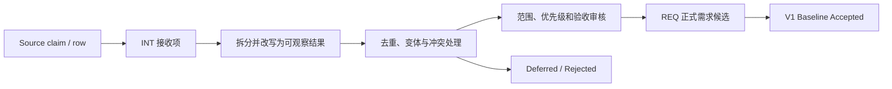

# 步骤 3：Axiom V1 需求基线

> 状态：In Review / Non-normative
> 当前评审：第二组已确认；待进入第三组 Resource、保存、Snapshot/Recovery、Offline、Sync 与 Collaboration
> 评审记录：2026-08-21，第一组八条需求接收规则已由用户明确确认；2026-08-22，第二组需求
> 方向已由用户逐项审核并确认为 `Framed`；两次确认都不批准 P0/P1、实现状态或最终架构 owner
> 建立日期：2026-08-21
> 输入：SRC-REPO-MAIN-20260821、SRC-NOTION-FUNCTIONS-V01、
> SRC-NOTION-COMPETITIVE-20260821、SRC-CHAT-07，以及步骤 0～2 已审核的用户输入
> 现行规范：在本文形成并获得明确批准前，仍以
> [项目总体框架](../../PROJECT_FRAMEWORK.md)、
> [系统架构](../SYSTEM_ARCHITECTURE.md)和[现有 ADR](../../adr/README.md)为准

这一步要回答的不是“Axiom 能做多少事”，而是“V1 必须为哪些用户结果负责”。仓库当前已经
积累了节点清单、模块边界、POC 门禁、产品功能表和竞品研究，但它们不是同一种东西。若直接
拼成一张表，架构容量会被误当成功能承诺，竞品行会被误当成正式需求，测试阈值也会被误报为
产品已经达到的能力。

步骤 3 的第一组接收规则和第二组本地核心编辑需求方向已经确认。第二组把本地核心能力改写成
可逐项验收的 `Framed` 需求；它仍不决定 P0/P1，也不借产品需求决定模块 owner、协议或物理
实现。下一轮进入第三组的数据、保存与协作需求审核。

## 本文用语

| 中文首选名 | 英文或代码名 | 本文含义 |
| --- | --- | --- |
| 接收项 | Intake / `INT-*` | 从某个来源拆出的、尚未成为正式需求的最小可审核陈述。它可以被合并、拆分、延后或拒绝。 |
| 需求 | Requirement / `REQ-*` | 对 Axiom 产品行为、质量或约束的可追溯陈述，必须有平台范围和验收方法。 |
| 基线优先级 | Baseline Priority | 经本轮评审确定的 `P0/P1/P2`；与来源自己标注的优先级分开。 |
| 来源优先级 | Source Priority | 功能表或竞品材料中的原始 P0/P1/P2，只保留为来源 claim，不自动进入 Axiom 基线。 |
| 平台范围 | Platform Scope | 该需求适用于 Product Tier A、Portability Tier B、Reuse Target 或 Utility Target 中的哪些目标。 |
| 验收方法 | Acceptance Method | 用用户场景、契约、语料、设备、指标或故障注入判断需求是否满足的方法。 |
| 非目标 | Non-goal | 本版本明确不承诺实现的能力；“冻结扩展边界”也属于非实现承诺。 |

全局术语仍以[架构重审术语表](GLOSSARY.md)为准。本文不会用 Requirement 的存在决定它应当
归 Axiom、Arc、Product Shell 还是 Shared Data Runtime；状态和数据所有权在步骤 4、相关
RFC 与 ADR 中决定。

## 一、这份基线覆盖什么

### 1. V1 与交付阶段不是同一个维度

V1 是产品范围，R1～R5 是交付阶段。当前路线中：

| 阶段 | 与 V1 的关系 |
| --- | --- |
| R1 Runtime Foundation | 建立工程、边界和确定性基础，不等于 V1 用户功能完成。 |
| R2 Local Visual Document Runtime | 交付本地 Document、编辑、Ink、RichText、资源、保存与恢复主链。 |
| R3 Production Rendering and Shells | 完成生产渲染、Tier A 平台集成及已通过验证的低延迟能力。 |
| R4 Collaboration MVP | 闭合 V1 的对象同步、Presence、离线队列、重连与基本收敛。 |
| R5 Hardening and Release | 完成发布、迁移、诊断、恢复、安全和回归门禁。 |

所以，一条 V1 需求可以以 R4 为目标阶段；不能因为 R2 名称中出现“V1”就把协作从产品范围
删除，也不能因为 R1 已经开始就声称 V1 已进入验收。

### 2. 本步骤记录五种不同内容

1. 用户明确要解决的场景和产品结果；
2. 仓库现行规范已经施加的产品或技术约束；
3. 功能基线、竞品调研和历史讨论提出的候选需求；
4. 已有验证计划提供的验收方法或阈值输入；
5. 明确不进入 V1 的非目标与未来扩展边界。

这五类内容可以互相引用，但不能互相冒充。尤其要保持下面的区别：

```text
需求是否被接受
  ≠ 代码是否存在
  ≠ 测试机制是否存在
  ≠ 实际 Evidence 是否通过
```

POC-01 的通过可以支撑某条跨端确定性需求的可行性，却不能自动把 POC NDJSON 或实验 C ABI
变成产品协议。POC-03 的性能失败也不会删除规模需求；它表示当前方案尚未满足门禁。

## 二、从来源到正式需求



### 1. 接收项不是需求票数

- 一个来源行可以包含多个用户结果，因此可以拆成多个 `INT-*`；
- 多个来源行可以描述同一个结果，因此可以合并到一个接收项；
- 一个接收项可以产生零个、一个或多个 `REQ-*`；
- 三份材料重复提到某项能力，不等于三票，也不会自动提高优先级；
- 产品名、实现建议、候选 owner 和来源优先级作为元数据保留，不写进需求陈述。

接收项的去重键使用：

```text
actor + job/outcome + semantic object + trigger/context
      + platform scope + externally observable result
```

若核心结果相同而平台或质量要求不同，保留一个主接收项和平台变体；若边界或期望结果冲突，
分别保留并登记冲突，不能为了表格整齐强行合并。

### 2. 需求必须写结果，方案另行处理

“用户在断网后重新打开文档时不丢失已经确认保存的编辑”可以成为需求；“使用 SQLite WAL、
CRDT 或 TypeScript Data Runtime”是候选方案。类似地，低延迟书写是产品结果，Arc/Axiom 的
物理拆分和具体 ABI 是架构方案。

现行 ADR 中已经接受的 C++20、Skia Ganesh、平台分级和唯一语义写路径可以作为约束引用，
但仍不得把尚未解决的 Shell、Data ownership、Public SDK 或 Scene 物理映射写成需求结论。

## 三、编号与记录字段

### 1. `INT-*` 接收编号

编号按需求域分桶，不编码来源、优先级、版本或处理结果：

| 前缀 | 接收域 |
| --- | --- |
| `INT-CAN-*` | Canvas、Page、Viewport 与导航 |
| `INT-INK-*` | Pointer、笔、笔刷、橡皮与低延迟反馈 |
| `INT-OBJ-*` | 对象、选择、变换、层级与本地编辑 |
| `INT-STRUCT-*` | 结构化内容、复杂文档与多视图工作方式 |
| `INT-COL-*` | 协作、Presence、评论、会议与主持 |
| `INT-AI-*` | 识别、生成和智能辅助候选能力 |
| `INT-DATA-*` | 保存、恢复、离线、历史、同步与资产 |
| `INT-SHELL-*` | 平台、设备输入、大屏、手机与无障碍 |
| `INT-IO-*` | 剪贴板、导入导出与外部表面 |

接收项至少记录：稳定 ID、规范化结果、actor/job、对象和触发场景、平台变体、质量要求、来源
及 claim locator、来源角色、产品事实核验状态、处理状态、合并目标和开放问题。

`INT-*` 的处理状态固定为：

`Received / Split / Merged / Conflict / Deferred / Rejected / Source-blocked`

### 2. `REQ-*` 需求编号

正式需求候选按稳定主题编号，优先级和阶段变化不导致重编号：

| 前缀 | 主题 |
| --- | --- |
| `REQ-FUNC-*` | 跨域产品行为和核心用户流 |
| `REQ-DATA-*` | Document、Operation、Snapshot 与 Resource 语义 |
| `REQ-EDIT-*` | EditorSession、History、Selection 与本地编辑 |
| `REQ-INK-*` | Pointer、Stroke、Preview 与 Canonical Ink |
| `REQ-TEXT-*` | RichText、IME 与文本编辑 |
| `REQ-SCENE-*` | Scene、空间查询、渲染、损伤与缓存结果 |
| `REQ-PLAT-*` | 平台、Shell 边界、Surface、Bridge 与 ABI 约束 |
| `REQ-COLLAB-*` | 同步、Presence、离线与收敛 |
| `REQ-NFR-*` | 确定性、性能、资源、可靠性、安全和运维质量 |
| `REQ-CON-*` | 不适合归入单一主题的外部约束 |
| `NON-*` | 经确认的 V1 非目标或后置能力 |

每条 `REQ-*` 至少包含：

| 字段 | 要求 |
| --- | --- |
| 需求陈述 | 单一、可观察、尽量与实现无关；必要的 Accepted 约束单独列出。 |
| 理由与来源 | 引用具体 `SRC-*`、仓库路径/ADR 或 `INT-*`，不以重复次数计权。 |
| 类型 | 功能、非功能、约束、平台或验证需求。 |
| Baseline Priority | `P0/P1/P2`，只能由本轮评审决定。 |
| Platform Scope | 明确 Tier、平台变体和不适用项。 |
| Target Stage | R1～R5 中最晚必须交付的阶段，不等于实现 owner。 |
| Acceptance Method | 场景、oracle、语料、设备、阈值和失败行为；未知项明确写缺口。 |
| 依赖与风险 | 关联 Requirement、Conflict、ADR/RFC 和 Primary-source gap。 |
| Requirement Status | 见下一节；不能由代码或 POC 状态反推。 |

## 四、优先级、状态和成熟度

### 1. Baseline Priority

第一组建议使用以下含义，具体需求获得何种优先级留到后续分组确认：

| 优先级 | 建议含义 |
| --- | --- |
| P0 | 没有它就不能把 V1 称为可用、可发布的目标产品；阻塞 V1 完成。 |
| P1 | 属于已经承诺的 V1 产品范围，可以晚于 P0 排期，但仍阻塞完整 V1 声明。 |
| P2 | 值得保留的后续候选或差异化能力，不阻塞 V1。 |

Notion 功能表中的 `V1 Required`、竞品矩阵中的 P0/P1/P2 和 Roadmap 阶段都只是
`source-priority` 或 `target hint`。它们必须经本轮确认后才能写入 `baseline-priority`。

### 2. 四种状态分别记录

| 维度 | 允许值 | 回答的问题 |
| --- | --- | --- |
| Requirement Status | `Candidate / Framed / Baseline Accepted / Deferred / Rejected` | 这是不是 Axiom 已确认的需求？ |
| Implementation Status | `Absent / POC / Partial / Product` | 当前代码实现到了哪里？ |
| Verification Mechanism | `None / Planned / Exists` | 是否已有可执行的验证方法？ |
| Evidence Result | `None / Pending / Partial / Passed / Failed / Blocked` | 绑定目标 commit、环境和阈值的实际结果是什么？ |

用户确认一个需求属于 V1，只会改变 Requirement Status。只有实际产品实现和证据才能分别改变
后两类成熟度；Accepted ADR、合并 PR、测试文件存在或 workflow 全绿不能越级替代它们。

## 五、验收方法的最低要求

进入 `Baseline Accepted` 的 P0/P1 至少要有：

- 明确 actor、用户结果、前置条件和失败时的可观察行为；
- Product Tier A 的适用平台，或为何允许平台差异；
- 能判断通过/失败的场景或 oracle；
- 非功能需求的规模、设备/环境、采样方法和阈值；
- 依赖外部产品事实时的一手证据状态；
- 尚未决定的 owner、协议或实现方案不得伪装成验收条件。

POC 阈值可以作为现行验证输入，但不会未经审核直接成为 V1 产品 SLO。例如 100K Scene、
Preview p95/p99、黄金图容差和内存预算都要保留测试背景、目标平台和当前 Evidence 状态。

## 六、本轮接收到的来源规模与边界

本表只说明输入规模，不分配正式需求编号：

| 输入 | 可见规模 | 当前用途 | 不能推出 |
| --- | ---: | --- | --- |
| 仓库现行规范、计划、实现与 Evidence | 24 份 Accepted ADR 及现有 POC/RF/R1 材料 | 提取现行约束、需求候选、验证方法和状态事实 | 所有目标模块都已实现，或所有门禁均通过 |
| Notion 产品功能基线 | 58 个 source rows | 拆分用户场景、目标提示和产品能力候选 | 其中 58 项均已批准，或其 `V1 Required` 已成为基线优先级 |
| Notion 竞品矩阵 | 8 个域、实际 178 个 source rows | 发现能力、差距和需要验证的问题 | 178 个正式需求，或竞品产品行为已经核验 |
| 竞品矩阵中的官方入口 | 21 个 Evidence leads | 后续逐 claim 寻找一手证据 | 链接本身证明某项产品能力 |
| `SRC-CHAT-07` | 来源角色已由用户确认；正文当前不可核验 | 待补齐 artifact 后增量接收 | 目前可从中提取具体能力行 |

竞品矩阵来源自称 177 项、Collaboration 标题自称 31 项；实际表格分别为 178 行和 32 行。
这是一项来源数据质量差异，不在仓库中替来源改写。其 source-priority 统计为 P0 53、P1 74、
P2 51，也只作为 Roadmap 输入保存。

### `PG-CHAT07-001`：来源 representation 缺口

`SRC-CHAT-07` 的“同类产品需求调研”身份和用途已经由用户明确确认，但步骤 3 复核当前可访问
representation 时，没有取得能与该身份对应的可核验正文。当前可见内容指向其他架构整理或
Canvas/Skia 讨论，不能据此补造竞品需求。

因此，本步骤暂不从 `SRC-CHAT-07` 创建 `INT-*` 或 `REQ-*`。该状态记为
`Source-blocked / Primary-source gap`，表示内容尚不能定位，不表示用户确认的来源身份被否定。
这里的 `Source-blocked` 是来源级审计记录的状态，不会虚构一个 `INT-*`。来源目录中的
`Complete` 仍只表示采集当时可见的 representation 已在其声明边界内读完；它不表示存在不可变
快照，也不保证当前可访问页面与用户确认的来源身份一致。
获得正确 artifact、可定位回合或用户提供的脱敏摘要后，再作为来源增量接收并与已有接收项
重新去重。步骤 3 可以继续处理仓库和两份已审核的 Notion 需求材料。

## 七、具体需求的审核顺序

第一组规则确认后，按以下小组推进，避免一次批准掩盖范围差异：

| 组别 | 审核主题 | 主要输出 | 状态 |
| --- | --- | --- | --- |
| 第一组 | 本文一～六节的范围、编号、状态、去重和来源边界 | 固定 Intake/Requirement 处理规则 | Confirmed（2026-08-21） |
| 第二组 | Canvas、Page/Viewport、对象、Selection、History、Ink 与 RichText | 本地核心用户流和节点深度 | Confirmed / Framed（2026-08-22） |
| 第三组 | Resource、保存、Snapshot/Recovery、Offline、Sync 与 Collaboration | 数据结果、失败行为和 V1 协作边界 | Not started；下一组 |
| 第四组 | Web/Windows/Android、Apple portability、输入、Shell、Clipboard、Import/Export 与 Accessibility | 平台范围和产品体验差异 | Not started |
| 第五组 | 确定性、规模、延迟、内存、生命周期、安全、诊断与发布 | 可量化非功能需求和验证缺口 | Not started |
| 第六组 | P0/P1/P2、非目标、冲突和追溯矩阵 | 最终 V1 Requirement baseline | Not started |

每组先列 `INT-*`，再把可以独立验收的内容提升为 `REQ-*` 候选。未解决的架构 owner 问题转入
步骤 4/5/6，不能通过需求表偷偷决定。

## 八、第一组确认记录

第一组确认的是下面八条流程规则，而不是任何具体功能优先级：

1. V1 是跨 R1～R4 闭合的产品范围；R1 只表示 Runtime Foundation，R5 负责发布硬化。
2. `INT-*` 与 `REQ-*` 分开；source row、架构 claim、测试门禁都不能直接冒充正式需求。
3. 接收项按可观察结果拆分和去重；多来源重复不计票，平台/质量差异使用变体，冲突不强并。
4. 需求陈述、Accepted 技术约束、架构方案、实现 owner 和验收方法分别记录。
5. 采用本文的 Intake 域、Requirement 主题前缀和稳定编号原则；优先级与阶段不进入 ID。
6. 采用 `source-priority` 与 `baseline-priority` 分栏，以及 P0/P1/P2 的建议含义。
7. Requirement、Implementation、Verification Mechanism 与 Evidence Result 使用四套独立状态。
8. `SRC-CHAT-07` 暂记 `PG-CHAT07-001 / Source-blocked`；不阻塞其他来源接收，也不从不可核验
   正文生成需求。

以上八条已于 2026-08-21 获得用户明确确认，成为步骤 3 的评审规则。确认没有把来源候选、
测试阈值或现行架构模块升级为产品需求。本文继续保持 `In Review`；只有第六组完成、所有
P0/P1 都有平台范围和验收方法，并得到用户明确批准后，步骤 3 才能标记 Completed。

## 九、第二组取证与接收结果

### 1. 本组怎样使用现有材料

本组对账了仓库现行 V1 节点、EditorSession/Operation 约束、POC-02/03/04 验证材料，以及
Notion 产品功能基线和竞品矩阵中的相关能力。引用规则保持不变：

- 仓库的 Accepted ADR 可以提供现行技术约束，但不能替代用户体验和产品深度；
- POC-04 已证明 RichText/IME 可行，不等于生产编辑器已经完整；
- POC-02/06 的自动化契约存在，但 Human Ink、真实显示延迟和 handoff 仍未闭合；
- POC-03 有 pan/zoom/select/drag 和多 View 机制，Windows 性能门禁仍失败；
- 产品功能表的原生行号和竞品矩阵只用于定位 claim，其优先级、owner 和产品观察仍是
  non-normative input。

第一组定义的 Intake 域是来源接收桶，不是产品模块。因而 Selection/History 先进入
`INT-OBJ-*`，RichText/IME 先进入 `INT-STRUCT-*`；它们分别可以产生 `REQ-EDIT-*` 和
`REQ-TEXT-*`，无需为本组静默修改已确认的编号规则。

### 2.1 用户范围修正（已纳入第二组确认）

用户已明确要求把以下能力纳入实现范围：

- Connector、Group、Frame、Sticky 和 PDF 不再作为“V1 后置”或“仅冻结扩展边界”；它们进入
  本组 Framed requirements，具体对象语义、资源边界、布局深度和交付阶段仍需逐项验收；
- Lasso、对齐/分布（Align/Distribute）和 Smart Snap 进入选择与变换范围；候选算法、阈值、
  参考系和关闭策略仍不在本轮冻结；
- Erase 面向用户提供对象擦除和部分擦除两种模式；对象擦除删除整个 Stroke，部分擦除按
  Brush/Stroke capability 采用 Segment 或 Pixel/Dab 路径。三条执行路径的 identity、几何
  分裂、mask/覆盖、撤销重放和缓存语义必须分别验证；
- Arc Preview backend 是硬性实现要求。Arc 不可用或 presentation 失败时，必须自动切换为
  Canonical-only rendering：不得丢失已确认输入、取消 Canonical 提交、污染 Document 或
  改变 Stroke/Document digest。

这些是用户确认的范围方向，不等于本步骤已经批准了 P0/P1、稳定 ABI、具体 schema 或算法。
其中 Canonical-only 是比现行 ADR 对 fallback 目标更窄的产品约束；现行 ADR 已保证 Arc 故障
不得传播到 Canonical/Document，具体切换目标和可见性门禁留给后续 ADR 澄清。
下文将其拆成独立 `INT-*`/`REQ-*`；第二组确认后 Requirement Status 为 `Framed`，实现和证据
成熟度仍分别保留 `Absent/POC/Partial` 与 `Pending/Partial/Passed/Failed`。

### 2. 已规范化的接收项

| Intake ID | 规范化结果 | 主要来源与去重 | 当前处理 |
| --- | --- | --- | --- |
| `INT-CAN-001` | 产品支持多个 Page，但语义拓扑是一 Page 对应一 Document；多 Page 集合、导航和顺序位于独立的上层 Page 集合之上，不采用 `DocumentRoot → Page*`。 | 用户确认；仓库 V1 Page；功能基线 CAN-03；矩阵多 Page/duplicate page | `Split`：Page/Document 一一对应已确认；上层集合 owner/持久格式后续决定 |
| `INT-CAN-002` | 每个 Page/Document 都是无限画布；用户可以在没有固定可见页边界的连续 world space 中平移、缩放、适配内容，并在负坐标、DPR/resize 后保持对象位置和命中稳定。 | 用户确认；功能基线 CAN-01/02；矩阵 Canvas/Navigation；ADR-0012 | `Received`；产品边界已确认；“无限”不承诺无限数值精度、内存或资源，安全边界留第五组 |
| `INT-CAN-003` | Viewport、Selection、History、composition 与 Active Stroke 按 View 隔离；View 的销毁不改共享 Document。 | 仓库 EditorSession/多 View；功能基线 CAN-04 | `Split` 为导航和生命周期候选 |
| `INT-CAN-004` | Mini-map、outline、第二窗口和 presentation view 是独立产品能力。 | 功能基线 CAN-05；矩阵 overview/presentation | `Deferred`；不能由多 View conformance 自动推出 V1 UI |
| `INT-OBJ-001` | Shape、Image、VectorPath 分别需要真实的创建、编辑、删除、变换和稳定语义。 | 仓库 V1 节点；功能基线 OBJ-01/02/03/05；矩阵 basic objects | `Split` 为三个对象需求 |
| `INT-OBJ-002` | 用户需要命中、选择、多选并变换对象；Selection 本身不是 Document 内容。 | 功能基线 SEL-01～06；矩阵 select/transform/duplicate | `Split`；最小选择和变换深度待确认 |
| `INT-OBJ-003` | 对象的锁定、可见性和前后顺序需要与渲染、HitTest 和编辑结果一致；容器对象也必须遵守同一规则。 | 功能基线 OBJ-06/07；矩阵 lock/z-order | `Received` |
| `INT-OBJ-004` | 本地 Undo/Redo 应覆盖已承诺编辑，并形成可重放的新修改，而不是回拨 Document。 | 功能基线 HIS-01/SEL-07；矩阵 undo/redo；ADR-0014 | `Received`；Version History 已拆到第三组 |
| `INT-OBJ-005` | Group、Frame、Sticky 进入实现范围；容器层级、承载关系、文本编辑和选择/变换需要独立可观察语义。 | 用户范围修正；功能基线和矩阵；现行扩展边界（冲突记录） | `Split`：Group/Frame/Sticky 的对象语义待分别确认 |
| `INT-OBJ-006` | Connector 进入实现范围；连接关系、端点、命中、路径更新和渲染结果不能退化为普通 VectorPath。 | 用户范围修正；功能基线和矩阵；现行 Connector 扩展边界（冲突记录） | `Received`；routing 深度和布局约束待确认 |
| `INT-OBJ-007` | PDF 进入实现范围；用户可观察到的导入、分页/页内内容、渲染、变换、资源缺失和错误行为需要定义。 | 用户范围修正；功能基线和矩阵；现行 PDF 扩展边界（冲突记录） | `Received`；解码、分页和资源安全边界待确认 |
| `INT-OBJ-008` | Lasso、Align/Distribute 和 Smart Snap 是本地选择/变换工具，而不是可选的市场差异化附加项。 | 用户范围修正；功能基线 SEL/XFORM；竞品矩阵 | `Split`：几何规则、参考系、阈值和 opt-out 待确认 |
| `INT-IO-001` | 对当前 Selection 的 copy/cut/paste 需要清楚的对象语义和平台格式。 | 功能基线 Clipboard；矩阵 copy/paste | `Deferred` 到第四组；本组只记录依赖 |
| `INT-INK-001` | confirmed 笔输入产生可编辑、可回放的 Vector/Dab Canonical Stroke。 | 功能基线 INK-01/02/04/05；矩阵 stylus/brush；POC-02 | `Received` |
| `INT-INK-002` | 活动笔迹有即时 Preview；cancel、过载或 Preview 故障不产生部分 Document 或丢失 Canonical Stroke。 | 功能基线 low-latency；矩阵 Ink；POC-02/06 | `Received`；具体 SLO 留第五组 |
| `INT-INK-003` | V1 笔刷要有清楚的颜色、宽度、透明度、pressure/tilt 与 Vector/Dab 参数范围。 | 功能基线 pen preset；矩阵 pen/highlighter/texture | `Received`；自定义纹理和产品 preset 数量待定 |
| `INT-INK-004` | 用户看到两种 Erase 模式：对象擦除删除整个 Stroke 对象；部分擦除保留未命中部分，并按 Stroke/Brush 类型使用 Segment 或 Pixel/Dab 语义。 | 用户确认；功能基线 INK-03；矩阵 eraser variants；仓库 extension boundary（冲突记录） | `Split`：对象擦除、Segment partial、Pixel/Dab partial 分别建立需求；分派规则需版本化 |
| `INT-INK-005` | Ink stroke 的 group/split/merge、识别为文本和 smart shape 仍是与擦除、选择工具不同的能力；这里的 group 不指 Group 容器对象。 | 功能基线 INK-06/07；竞品矩阵 | `Deferred`；不把相邻能力误并入本轮擦除需求 |
| `INT-INK-006` | Arc Preview backend 必须存在并与 Canonical Renderer 共享 Stroke 语义；Arc 失败时必须可切换 Canonical-only。 | 用户范围修正；ADR-0004/0011/0024 | `Received`；实现约束与产品故障行为分开验收 |
| `INT-STRUCT-001` | RichText 是 paragraphs/runs/styles/attributes 的一级语义对象，不是带字符串的 Shape。 | 仓库 ADR-0006；功能基线 OBJ-01；POC-04 | `Received` |
| `INT-STRUCT-002` | 用户需要 selection、caret、composition、直接输入、删除、粘贴和 Undo/Redo 的统一文本编辑结果。 | 功能基线 Text；矩阵 Rich Text；POC-04 | `Split` 为文本模型、IME 和 History 需求 |
| `INT-STRUCT-003` | V1 富文本样式需要明确而有限的 run/paragraph 能力。 | 功能基线 EXT-03；竞品矩阵 | `Received`；样式矩阵待确认 |
| `INT-STRUCT-004` | 高级选择句柄、双向文字、完整排版、链接/复杂列表和字符级并发有独立成本。 | POC-04 acceptance limitations；竞品矩阵 | `Deferred`，除非本组明确扩大范围 |

### 3. 本组没有合并的相邻概念

下列名称相近，但验收结果不同，必须继续分开：

- Page semantic root 与产品页签/导航；
- 单 View 状态隔离与 V1 第二窗口/mini-map 产品功能；
- VectorPath 与 Connector；Connector 的 routing 深度另行验收，但不再把 Connector 整体排除；
- Selection、Lasso、Align/Distribute 与 Smart Snap；
- Undo/Redo 与持久 Version History；
- 面向用户的对象擦除/部分擦除模式，与内部 whole-stroke、Segment、Pixel/Dab 三条执行路径；
- TextDocument、平台 IME UI 和系统字体；
- canonical RichText 基础能力与复杂字符级协作。

## 十、第二组 Framed Requirements

以下 Requirement 已通过第二组审核，统一记为 `Framed`；`Baseline Priority` 仍留到第六组，
不是 `Baseline Accepted`。平台范围在第四组还会细化；本组先使用“Tier A 产品行为 + 共享
Runtime conformance”作为默认范围。

| Requirement ID | 已定界需求陈述 | Intake / 现行约束 | 最晚阶段 | 当前成熟度 |
| --- | --- | --- | --- | --- |
| `REQ-FUNC-CAN-001` | 产品可以管理多个 Page；每个 Page 恰对应一个独立 Document，拥有独立 revision、对象顺序、资源绑定和 digest，并关联彼此隔离的 EditorSession/History。Page 的创建、复制、删除、重命名、排序、切换和恢复不把多个 Page 伪装成同一 Document 内的子树。 | `INT-CAN-001`；用户确认；现行 Page≠Viewport、History 不属于 Document | R2/R3 | Requirement `Framed`；产品实现 `Absent`；contract mechanism `Planned`；Evidence `Pending` |
| `REQ-EDIT-VIEW-001` | 用户在每个 Page/Document 的无限画布中平移、缩放或适配视图后，可以继续定位、查看和命中同一语义对象；Viewport 变化不修改 Document。 | `INT-CAN-002/003`；用户确认；ADR-0012 | R2/R3 | `Framed`；POC implementation；mechanism exists；Evidence `Partial`，POC-03 性能仍 Failed |
| `REQ-EDIT-VIEW-002` | 同一 Document 的多个 View 不共享 Viewport、Selection、History、composition 或 Active Stroke；销毁一个 View 不破坏其他 View。 | `INT-CAN-003` | R2 | `Framed`；POC/Partial；mechanism exists；Evidence `Partial` |
| `REQ-FUNC-OBJ-001` | 用户可以创建、编辑几何/样式、变换、排序和删除 Shape，并通过保存/重放保持相同语义结果。 | `INT-OBJ-001`；V1 Shape | R2 | `Framed`；POC only；mechanism exists；Evidence `Partial` |
| `REQ-FUNC-OBJ-002` | 用户可以插入、替换、布局/变换和删除 Image；资源不可用时不得静默换成别的内容。 | `INT-OBJ-001`；V1 Image | R2/R3 | `Framed`；POC only；mechanism exists；Evidence `Partial`；资源与色彩移交第三/五组 |
| `REQ-FUNC-OBJ-003` | 用户可以创建、编辑和变换 VectorPath，同时保留可重放的矢量语义，而非退化为 bitmap。 | `INT-OBJ-001`；V1 VectorPath | R2 | `Framed`；最小 POC render；产品编辑深度和 Evidence `Pending` |
| `REQ-FUNC-OBJ-004` | 用户可以创建、编辑、嵌套/解除嵌套、选择、变换和删除 Group/Frame 容器；容器与子对象的层级、裁剪/承载关系、命中、排序、保存、重放和撤销结果一致。 | `INT-OBJ-005`；用户范围修正；现行扩展边界待重审 | R2/R3 | `Framed`；实现 `Absent`；机制 `Planned`；Evidence `Pending` |
| `REQ-FUNC-OBJ-005` | 用户可以创建、编辑、选择、变换和删除 Sticky；其文本、样式、尺寸、层级、命中、保存、重放和 Undo/Redo 结果保持一致。 | `INT-OBJ-005`；用户范围修正 | R2/R3 | `Framed`；实现 `Absent`；机制 `Planned`；Evidence `Pending` |
| `REQ-FUNC-OBJ-006` | 用户可以创建、编辑、连接、移动端点和删除 Connector；连接关系、端点命中、路径更新、渲染、排序、保存、重放和撤销不得退化为普通 VectorPath。 | `INT-OBJ-006`；用户范围修正 | R2/R3 | `Framed`；实现 `Absent`；机制 `Planned`；Evidence `Pending` |
| `REQ-FUNC-OBJ-007` | 用户可以导入并使用 PDF 内容；在声明的分页/页内模型下可查看、选择（若适用）、变换、保存和重放，且损坏或缺失资源有确定错误结果。 | `INT-OBJ-007`；用户范围修正 | R2/R3 | `Framed`；实现 `Absent`；机制 `Planned`；Evidence `Pending` |
| `REQ-EDIT-SEL-001` | 用户可以按明确的 SelectionPolicy 选择和多选可编辑对象；Selection/hover/handles 不进入 Document。 | `INT-OBJ-002/003` | R2/R3 | `Framed`；POC harness；mechanism exists；产品 Evidence `Pending` |
| `REQ-EDIT-SEL-002` | 用户可以使用 Lasso 选择符合 SelectionPolicy 的对象；点选、框选、Lasso 和多选对 locked/hidden/container/Connector 对象的结果可预测且不产生部分选择状态。 | `INT-OBJ-002/003/006/008`；用户范围修正 | R2/R3 | `Framed`；实现 `Absent`；机制 `Planned`；Evidence `Pending` |
| `REQ-EDIT-XFORM-001` | 对象移动、缩放、旋转和已声明样式修改作为原子语义编辑提交；取消或失败不暴露部分修改。 | `INT-OBJ-002`；Operation 唯一写路径 | R2 | `Framed`；POC variants；mechanism exists；Evidence `Partial` |
| `REQ-EDIT-XFORM-002` | 用户可以对选中的对象执行 Align/Distribute；参考系、间距、容器边界、最小对象数、舍入和失败行为明确，结果通过原子 Operation 提交并可撤销/重放。 | `INT-OBJ-002/003/005/008`；用户范围修正 | R2/R3 | `Framed`；实现 `Absent`；机制 `Planned`；Evidence `Pending` |
| `REQ-EDIT-SNAP-001` | 变换和绘制过程中提供可关闭的 Smart Snap；候选、阈值、优先级、参考系和跨容器行为确定且可重放，未命中或取消不改变 Document。 | `INT-OBJ-002/003/005/006/008`；用户范围修正；ADR-0021 边界 | R2/R3 | `Framed`；实现 `Absent`；机制 `Planned`；Evidence `Pending` |
| `REQ-EDIT-ORDER-001` | 用户调整对象前后顺序后，渲染、HitTest、保存和重放使用同一稳定顺序；并发排序算法不在本组冻结。 | `INT-OBJ-003` | R2 | `Framed`；implementation `Partial/Absent`；Evidence `Pending` |
| `REQ-EDIT-HIST-001` | 用户可以撤销/重做本地已承诺编辑；系统生成新的原子 compensating Operations，并明确报告 applied/no-op/rejected/conflicted。 | `INT-OBJ-004`；ADR-0014 | R2；协作交错 R4 | `Framed`；Text POC partial；mechanism exists；通用 Evidence `Pending` |
| `REQ-INK-001` | 有效 confirmed 输入产生可编辑、保存和重放的 VectorStroke 或 DabStroke；历史样本不被静默丢失、重复或用新 Viewport 重解释。 | `INT-INK-001`；ADR-0004/0012/0018 | R2/R3 | `Framed`；POC；mechanism exists；Evidence `Partial/Pending` |
| `REQ-INK-002` | 书写过程中提供可降级的即时 Preview；prediction 不进入 Document，cancel/overrun/fallback 不留下部分 Stroke，最终显示与 Canonical Stroke 一致。 | `INT-INK-002`；ADR-0011/0024 | R3 | `Framed`；POC；mechanism exists；物理延迟/visible handoff `Failed/Pending` |
| `REQ-INK-003` | Vector/Dab Stroke 保存版本化 Brush 语义，并支持本组确认的最小颜色、宽度、透明度和输入映射；跨端重放结果一致。 | `INT-INK-003` | R2 | `Framed`；POC；mechanism exists；产品 brush matrix `Pending` |
| `REQ-INK-004` | 用户选择“对象擦除”并命中 Stroke 时，删除整个 Stroke 对象；操作原子、可撤销、可保存和可重放，且不留下孤立的 Stroke/资源引用。 | `INT-INK-004`；用户确认 | R2 | `Framed`；实现 `Absent`；机制 `Planned`；Evidence `Pending` |
| `REQ-INK-005` | 用户对适合矢量切分的细笔 Stroke 使用“部分擦除”时，系统采用 Segment erase；未命中部分被保留，fragment identity、几何分裂、空间索引、渲染、Undo/Redo、保存和 replay 语义确定。 | `INT-INK-004`；用户确认 | R2/R3 | `Framed`；实现 `Absent`；机制 `Planned`；Evidence `Pending` |
| `REQ-INK-006` | 用户对较粗、Dab/纹理或不适合矢量切分的 Stroke 使用“部分擦除”时，系统采用 Pixel/Dab erase；擦除区域、mask/覆盖表示、质量、资源和缓存语义确定，可撤销、保存、重放并跨端得到一致结果。 | `INT-INK-004`；用户确认 | R2/R3 | `Framed`；实现 `Absent`；机制 `Planned`；Evidence `Pending` |
| `REQ-INK-007` | Tier A 必须提供 Arc Preview backend，并与 Canonical Renderer 共享版本化 Stroke 语义；Arc 不可用或 presentation 失败时自动切换 Canonical-only rendering，不丢失 confirmed input、不取消 Canonical 提交、不污染 Document 或改变 digest。 | `INT-INK-002/006`；ADR-0004/0011/0024；用户范围修正 | R3 | `Framed`；Arc `POC/Integration Ready`；mechanism exists；物理设备 Evidence `Pending` |
| `REQ-TEXT-001` | RichText 从 V1 保存有序 paragraphs、runs、styles 和 attributes；平台 widget、JS state 或系统字体不能成为第二份文本真相。 | `INT-STRUCT-001`；ADR-0006 | R2 | `Framed`；POC；mechanism exists；POC feasibility Evidence `Passed` |
| `REQ-TEXT-002` | 用户可以编辑 selection/caret，输入、替换、换行、删除并完成 IME begin/update/commit/cancel；commit 产生一次原子可重放编辑，cancel 不改 Document。 | `INT-STRUCT-002` | R2/R3 | `Framed`；POC；mechanism exists；POC-04 Evidence `Passed`，产品完整度 `Pending` |
| `REQ-TEXT-003` | 给定声明的字体资源和 fallback，文本换行、selection/caret geometry 与最终语义可重复；缺字体/hash mismatch 有确定诊断。 | `INT-STRUCT-001/002` | R2/R3 | `Framed`；POC；mechanism exists；POC-04 Evidence `Passed`，产品资源集成 `Pending` |
| `REQ-TEXT-004` | V1 提供经本组确认的有限 run/paragraph 样式集合，并能保存、重放、撤销且跨 Tier A 得到相同语义。 | `INT-STRUCT-003` | R2/R3 | `Framed`；POC `Partial`；具体范围和产品 Evidence `Pending` |

本轮已经分别建立对象擦除、Segment partial erase 和 Pixel/Dab partial erase 需求，以及 Arc
Preview backend/fallback 需求。它们是 `Framed`，不表示当前实验 C ABI、POC enum 或算法已经
满足产品语义；三条擦除执行路径必须分别提供 operation、history、replay、digest 和视觉验收
证据，并证明面向用户只暴露“对象擦除”和“部分擦除”两种模式。

## 十一、第二组验收方法草案

### 1. Page、Canvas 与 View

- 固定语料覆盖正/负 world coordinates、非整数 zoom、pan、fit、resize 和多个 DPR；
- world→view→device 与逆向 HitTest 分层比较，Viewport 改变前后 Document digest 不变；
- 两个 View 使用不同 Viewport/Selection/composition，编辑发布后可看到同一 Document revision，
  但临时状态互不污染；销毁一个 View 后另一个继续工作；
- 多 Page 语料覆盖独立 Document 的 create/duplicate/delete/rename/reorder/open/close、active Page
  切换、稳定 Page/Document identity、各自 order/History/digest、保存和恢复；必须证明跨 Page
  操作不会生成隐式父子引用或污染另一 Page 的 Document。具体耐久性和恢复故障进入第三组。

### 2. Shape、Image、VectorPath、结构化对象与本地编辑

- Shape、Image、VectorPath、Group、Frame、Sticky、Connector 和 PDF 分别覆盖其适用的
  create/edit/delete/transform/style/serialize/replay/undo/redo；容器、连接关系和 PDF 分页/资源
  行为不能用普通 Shape 的占位实现代替；
- 选择变化只改变 EditorSession；提交变换只通过 Operation 修改 Document；
- HitTest、selection overlay、最终 render 和 stable z-order 使用同一节点身份与顺序；
- locked、hidden、透明对象、重叠对象和越界点击必须有明确 SelectionPolicy；
- Lasso、Align/Distribute 和 Smart Snap 覆盖单对象、多对象、容器边界、负坐标、未命中、取消
  和跨 View 语料；失败或取消不得产生部分 Operation；
- Image/PDF missing/corrupt、ResourceManifest 与 color/EXIF/ICC 的完整 oracle 分别移交第三、五组，
  但本组不能用 placeholder 掩盖资源身份变化。

### 3. History

- Shape/Image/VectorPath/Stroke/RichText 的本组已接受编辑都能按 intention grouping 撤销/重做；
- Undo/Redo 产生新 Operation ID/sequence，经保存和重放得到相同 digest，不替换旧 Snapshot；
- 生成或验证失败时整个补偿 transaction 原子失败；协作交错的冲突语料留 R4，但返回结果
  vocabulary 不能在产品实现中缺失。

### 4. Ink

- 录制 60/120/240 Hz、历史点、pressure/tilt 有/无、zoom/pan/DPR 与非法 transform 语料；
- Vector/Dab 的 confirmed input、BrushDescriptor、Stroke/Document digest 和跨端回放一致；
- “对象擦除”和“部分擦除”分别覆盖命中、Operation 原子性、Undo/Redo、保存/replay、空间索引
  和缓存失效；部分擦除再按 brush capability/版本化 BrushDescriptor 分派到 Segment 或
  Pixel/Dab。Segment 必须保留未命中 fragment，Pixel/Dab 必须验证 mask/覆盖结果；任何失败都
  不得丢失未擦除内容或生成半个 Stroke。
- prediction rollback、cancel、InputOverrun、View destroy、surface/Preview failure 不产生部分
  Document，Arc/Default sink 最终得到同一 Canonical Stroke；Arc presentation 失败后必须可验证
  Canonical-only rendering，且 confirmed input、Canonical 提交和 digest 不变；
- 输入到 Preview、handoff 帧数和 Human Ink 的产品 SLO 在第五组绑定设备、刷新率和 Evidence
  level；本组不以 POC 数字替用户作承诺。

### 5. RichText 与 IME

- 固定语料覆盖英文、中文拼音、直接输入、selection/caret、replacement、换行、删除、粘贴、
  composition commit/cancel、Undo/Redo 和 focus/view lifecycle；
- commit 恰好生成一个原子 Text transaction，cancel/blur 不产生 Document Operation；
- 字体按 ResourceId/ContentHash/fallback 解析；跨 Tier A 比较最终文本、digest、换行、cluster、
  selection/caret geometry 和缺字诊断；
- 中文/英文是当前最小已验证语料，不自动代表日文、韩文、BiDi、Indic、完整 typography 或
  accessibility 已获 V1 支持声明；平台/语言发布矩阵在第四组确认。

## 十二、第二组范围冲突与建议

| ID | 需要决定的问题 | 建议基线 | 不这样决定的影响 |
| --- | --- | --- | --- |
| `G2-D01` | Page、Document 和多 Page 产品体验采用什么拓扑？每个 Page 是否为连续工作区？ | 已确认产品支持多 Page，但采用一 Page 对应一 Document，而不是 `DocumentRoot → Page*`；每个 Page/Document 是支持连续 pan/zoom 和负坐标的无限画布。多 Page 集合、导航、顺序和生命周期位于独立的上层 Page 集合之上；具体 owner、schema 与持久格式由后续 ADR 决定。 | 若把多个 Page 放进一个 Document，会混合 revision、History、digest、资源和协作边界；若没有上层集合契约，又无法验收多 Page 导航和恢复。 |
| `G2-D02` | 是否扩大现行 V1 节点？ | 用户已确认 Shape、Image、VectorPath、RichText、VectorStroke、DabStroke 之外，Connector、Group、Frame、Sticky、PDF 也进入实现范围；对象 schema、容器关系、PDF 资源/分页深度和分阶段交付仍需拆解。 | 若不拆分容器、连接器和 PDF 的语义，后续会把布局、routing、资源、迁移和协作问题混成一个不可验收的“大对象”。 |
| `G2-D03` | Selection 和对象变换的最小可用范围是什么？ | 接受 click/tap、marquee、additive multi-select、Lasso、move/resize/rotate、Align/Distribute、前后顺序和 Smart Snap；locked 对象不可变换，hidden 对象不可命中。具体几何 oracle、阈值、参考系和 opt-out 仍待确认。 | 这些工具属于已确认的实现范围；若不先定义失败原子性和确定性，交互结果会跨平台漂移。 |
| `G2-D04` | VectorPath 与 Connector 的可编辑深度是什么？ | V1 支持 VectorPath 的整体变换和 anchor/control-point 移动/增删；Connector 作为独立对象实现连接关系、端点命中和路径更新。boolean operations、自动描摹以及 routing 的具体算法/级别另行验证，不把 Connector 整体后置。 | 只把 Connector 当普通路径会丢失连接语义；一次冻结完整 routing 算法又会越过方案评审。 |
| `G2-D05` | Brush 与 Ink 对象操作的最小范围是什么？ | 至少一类 Vector pen 和一类 Dab/highlighter；支持 color/width/opacity 和 pressure mapping；Stroke 可被普通 Selection 移动/缩放。用户自定义 texture、AI 识别和 split/merge 后置。 | 不给参数范围无法验收 Vector/Dab；过早开放自定义 brush 会先冻结资源和算法兼容。 |
| `G2-D06` | V1 橡皮擦采用哪种用户模式和执行语义？ | 已确认面向用户提供“对象擦除”和“部分擦除”两种模式：对象擦除删除整个 Stroke；部分擦除对适合矢量切分的细笔使用 Segment erase，对较粗、Dab/纹理或不适合切分的 Stroke 使用 Pixel/Dab erase。Brush 分类与分派必须版本化，三条执行路径分别通过 Operation/Undo、保存/replay 和视觉/资源验收。 | 用户模式和内部执行路径不能混成三个同级工具；若分派规则不版本化，同一 Stroke 在不同端或版本会产生不同结果。 |
| `G2-D07` | 低延迟 Preview 和 Arc 是否是产品硬需求？ | Tier A 书写必须有 Arc Preview backend；Arc 与 Canonical 共享 Stroke 语义。Arc 无效、不可用或 presentation 失败时必须自动切换 Canonical-only rendering，不能丢 confirmed input、取消 Canonical 提交或改动 Document/digest。具体 p95/p99/帧数在第五组确认。 | Arc 是硬性实现能力，同时保留可靠 fallback；不能把 Arc 失败等同于输入失败，也不能让平台差异污染语义结果。 |
| `G2-D08` | V1 RichText 样式边界是什么？ | 支持字体资源/产品字体集、字号或 H1/H2/H3/body preset、颜色、bold/italic/underline/strikethrough、left/center/right 和一级 bullet；链接、编号/嵌套列表、BiDi/复杂排版后置。 | 只验证 IME 不能形成可用 RichText；一次纳入完整排版会显著扩张字体、layout 和交互矩阵。 |
| `G2-D09` | 多 View 是产品功能还是架构能力？ | 保持 Runtime 多 View 状态隔离为 V1 conformance；第二窗口、mini-map、outline 和 presentation view 不作为 V1 产品 UI。 | 把 conformance 误作产品功能会扩大 Shell；不保留 conformance 会让共享状态边界以后难以迁移。 |
| `G2-D10` | Clipboard 和多 View 同节点编辑怎样处理？ | 本组只确认 Selection/History 对 adapter 和并发策略有依赖；对象 clipboard 格式、跨实例/跨应用和同节点本地冲突策略移交第四组及对应 RFC。 | 现在选格式或冲突算法会越过平台与 Data ownership 审核。 |

以上第二组需求方向已于 2026-08-22 获得用户逐项确认，Requirement Status 已从 `Candidate`
进入 `Framed`。P0/P1/P2 和最终 `Baseline Accepted` 仍留到第六组；这次确认不会把现行实现、
实验 ABI 或 Evidence 成熟度升级为 Product/Passed。Page 集合的 owner/持久格式、Brush 到部分
擦除策略的版本化表示，以及具体算法仍进入后续架构步骤和 ADR/RFC。
