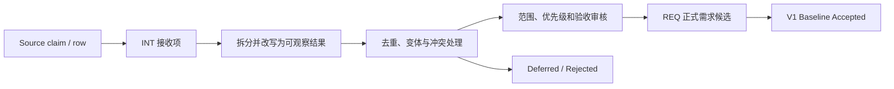

# 步骤 3：Axiom V1 需求基线

> 状态：In Review / Non-normative
> 当前评审：第一组——需求接收、编号、状态与去重规则
> 建立日期：2026-08-21
> 输入：SRC-REPO-MAIN-20260821、SRC-NOTION-FUNCTIONS-V01、
> SRC-NOTION-COMPETITIVE-20260821、SRC-CHAT-07，以及步骤 0～2 已审核的用户输入
> 现行规范：在本文形成并获得明确批准前，仍以
> [项目总体框架](../../PROJECT_FRAMEWORK.md)、
> [系统架构](../SYSTEM_ARCHITECTURE.md)和[现有 ADR](../../adr/README.md)为准

这一步要回答的不是“Axiom 能做多少事”，而是“V1 必须为哪些用户结果负责”。仓库当前已经
积累了节点清单、模块边界、POC 门禁、产品功能表和竞品研究，但它们不是同一种东西。若直接
拼成一张表，架构容量会被误当成功能承诺，竞品行会被误当成正式需求，测试阈值也会被误报为
产品已经达到的能力。

因此，步骤 3 先建立接收规则，再分组审核具体需求。本次提交只进入第一组，不接受任何新的
P0/P1、产品范围或架构 owner。

## 本文用语

| 中文首选名 | 英文或代码名 | 本文含义 |
| --- | --- | --- |
| 接收项 | Intake / `INT-*` | 从某个来源拆出的、尚未成为正式需求的最小可审核陈述。它可以被合并、拆分、延后或拒绝。 |
| 需求 | Requirement / `REQ-*` | 对 Axiom 产品行为、质量或约束的可追溯陈述，必须有平台范围和验收方法。 |
| 基线优先级 | Baseline Priority | 经本轮评审确定的 `P0/P1/P2`；与来源自己标注的优先级分开。 |
| 来源优先级 | Source Priority | 功能表或竞品材料中的原始 P0/P1/P2，只保留为来源 claim，不自动进入 Axiom 基线。 |
| 平台范围 | Platform Scope | 该需求适用于 Product Tier A、Portability Tier B、Reuse Target 或 Utility Target 中的哪些目标。 |
| 验收方法 | Acceptance Method | 用用户场景、契约、语料、设备、指标或故障注入判断需求是否满足的方法。 |
| 非目标 | Non-goal | 本版本明确不承诺实现的能力；“冻结扩展边界”也属于非实现承诺。 |

全局术语仍以[架构重审术语表](GLOSSARY.md)为准。本文不会用 Requirement 的存在决定它应当
归 Axiom、Arc、Product Shell 还是 Shared Data Runtime；状态和数据所有权在步骤 4、相关
RFC 与 ADR 中决定。

## 一、这份基线覆盖什么

### 1. V1 与交付阶段不是同一个维度

V1 是产品范围，R1～R5 是交付阶段。当前路线中：

| 阶段 | 与 V1 的关系 |
| --- | --- |
| R1 Runtime Foundation | 建立工程、边界和确定性基础，不等于 V1 用户功能完成。 |
| R2 Local Visual Document Runtime | 交付本地 Document、编辑、Ink、RichText、资源、保存与恢复主链。 |
| R3 Production Rendering and Shells | 完成生产渲染、Tier A 平台集成及已通过验证的低延迟能力。 |
| R4 Collaboration MVP | 闭合 V1 的对象同步、Presence、离线队列、重连与基本收敛。 |
| R5 Hardening and Release | 完成发布、迁移、诊断、恢复、安全和回归门禁。 |

所以，一条 V1 需求可以以 R4 为目标阶段；不能因为 R2 名称中出现“V1”就把协作从产品范围
删除，也不能因为 R1 已经开始就声称 V1 已进入验收。

### 2. 本步骤记录五种不同内容

1. 用户明确要解决的场景和产品结果；
2. 仓库现行规范已经施加的产品或技术约束；
3. 功能基线、竞品调研和历史讨论提出的候选需求；
4. 已有验证计划提供的验收方法或阈值输入；
5. 明确不进入 V1 的非目标与未来扩展边界。

这五类内容可以互相引用，但不能互相冒充。尤其要保持下面的区别：

```text
需求是否被接受
  ≠ 代码是否存在
  ≠ 测试机制是否存在
  ≠ 实际 Evidence 是否通过
```

POC-01 的通过可以支撑某条跨端确定性需求的可行性，却不能自动把 POC NDJSON 或实验 C ABI
变成产品协议。POC-03 的性能失败也不会删除规模需求；它表示当前方案尚未满足门禁。

## 二、从来源到正式需求



### 1. 接收项不是需求票数

- 一个来源行可以包含多个用户结果，因此可以拆成多个 `INT-*`；
- 多个来源行可以描述同一个结果，因此可以合并到一个接收项；
- 一个接收项可以产生零个、一个或多个 `REQ-*`；
- 三份材料重复提到某项能力，不等于三票，也不会自动提高优先级；
- 产品名、实现建议、候选 owner 和来源优先级作为元数据保留，不写进需求陈述。

接收项的去重键使用：

```text
actor + job/outcome + semantic object + trigger/context
      + platform scope + externally observable result
```

若核心结果相同而平台或质量要求不同，保留一个主接收项和平台变体；若边界或期望结果冲突，
分别保留并登记冲突，不能为了表格整齐强行合并。

### 2. 需求必须写结果，方案另行处理

“用户在断网后重新打开文档时不丢失已经确认保存的编辑”可以成为需求；“使用 SQLite WAL、
CRDT 或 TypeScript Data Runtime”是候选方案。类似地，低延迟书写是产品结果，Arc/Axiom 的
物理拆分和具体 ABI 是架构方案。

现行 ADR 中已经接受的 C++20、Skia Ganesh、平台分级和唯一语义写路径可以作为约束引用，
但仍不得把尚未解决的 Shell、Data ownership、Public SDK 或 Scene 物理映射写成需求结论。

## 三、编号与记录字段

### 1. `INT-*` 接收编号

编号按需求域分桶，不编码来源、优先级、版本或处理结果：

| 前缀 | 接收域 |
| --- | --- |
| `INT-CAN-*` | Canvas、Page、Viewport 与导航 |
| `INT-INK-*` | Pointer、笔、笔刷、橡皮与低延迟反馈 |
| `INT-OBJ-*` | 对象、选择、变换、层级与本地编辑 |
| `INT-STRUCT-*` | 结构化内容、复杂文档与多视图工作方式 |
| `INT-COL-*` | 协作、Presence、评论、会议与主持 |
| `INT-AI-*` | 识别、生成和智能辅助候选能力 |
| `INT-DATA-*` | 保存、恢复、离线、历史、同步与资产 |
| `INT-SHELL-*` | 平台、设备输入、大屏、手机与无障碍 |
| `INT-IO-*` | 剪贴板、导入导出与外部表面 |

接收项至少记录：稳定 ID、规范化结果、actor/job、对象和触发场景、平台变体、质量要求、来源
及 claim locator、来源角色、产品事实核验状态、处理状态、合并目标和开放问题。

`INT-*` 的处理状态固定为：

`Received / Split / Merged / Conflict / Deferred / Rejected / Source-blocked`

### 2. `REQ-*` 需求编号

正式需求候选按稳定主题编号，优先级和阶段变化不导致重编号：

| 前缀 | 主题 |
| --- | --- |
| `REQ-FUNC-*` | 跨域产品行为和核心用户流 |
| `REQ-DATA-*` | Document、Operation、Snapshot 与 Resource 语义 |
| `REQ-EDIT-*` | EditorSession、History、Selection 与本地编辑 |
| `REQ-INK-*` | Pointer、Stroke、Preview 与 Canonical Ink |
| `REQ-TEXT-*` | RichText、IME 与文本编辑 |
| `REQ-SCENE-*` | Scene、空间查询、渲染、损伤与缓存结果 |
| `REQ-PLAT-*` | 平台、Shell 边界、Surface、Bridge 与 ABI 约束 |
| `REQ-COLLAB-*` | 同步、Presence、离线与收敛 |
| `REQ-NFR-*` | 确定性、性能、资源、可靠性、安全和运维质量 |
| `REQ-CON-*` | 不适合归入单一主题的外部约束 |
| `NON-*` | 经确认的 V1 非目标或后置能力 |

每条 `REQ-*` 至少包含：

| 字段 | 要求 |
| --- | --- |
| 需求陈述 | 单一、可观察、尽量与实现无关；必要的 Accepted 约束单独列出。 |
| 理由与来源 | 引用具体 `SRC-*`、仓库路径/ADR 或 `INT-*`，不以重复次数计权。 |
| 类型 | 功能、非功能、约束、平台或验证需求。 |
| Baseline Priority | `P0/P1/P2`，只能由本轮评审决定。 |
| Platform Scope | 明确 Tier、平台变体和不适用项。 |
| Target Stage | R1～R5 中最晚必须交付的阶段，不等于实现 owner。 |
| Acceptance Method | 场景、oracle、语料、设备、阈值和失败行为；未知项明确写缺口。 |
| 依赖与风险 | 关联 Requirement、Conflict、ADR/RFC 和 Primary-source gap。 |
| Requirement Status | 见下一节；不能由代码或 POC 状态反推。 |

## 四、优先级、状态和成熟度

### 1. Baseline Priority

第一组建议使用以下含义，具体需求获得何种优先级留到后续分组确认：

| 优先级 | 建议含义 |
| --- | --- |
| P0 | 没有它就不能把 V1 称为可用、可发布的目标产品；阻塞 V1 完成。 |
| P1 | 属于已经承诺的 V1 产品范围，可以晚于 P0 排期，但仍阻塞完整 V1 声明。 |
| P2 | 值得保留的后续候选或差异化能力，不阻塞 V1。 |

Notion 功能表中的 `V1 Required`、竞品矩阵中的 P0/P1/P2 和 Roadmap 阶段都只是
`source-priority` 或 `target hint`。它们必须经本轮确认后才能写入 `baseline-priority`。

### 2. 四种状态分别记录

| 维度 | 允许值 | 回答的问题 |
| --- | --- | --- |
| Requirement Status | `Candidate / Framed / Baseline Accepted / Deferred / Rejected` | 这是不是 Axiom 已确认的需求？ |
| Implementation Status | `Absent / POC / Partial / Product` | 当前代码实现到了哪里？ |
| Verification Mechanism | `None / Planned / Exists` | 是否已有可执行的验证方法？ |
| Evidence Result | `None / Pending / Partial / Passed / Failed / Blocked` | 绑定目标 commit、环境和阈值的实际结果是什么？ |

用户确认一个需求属于 V1，只会改变 Requirement Status。只有实际产品实现和证据才能分别改变
后两类成熟度；Accepted ADR、合并 PR、测试文件存在或 workflow 全绿不能越级替代它们。

## 五、验收方法的最低要求

进入 `Baseline Accepted` 的 P0/P1 至少要有：

- 明确 actor、用户结果、前置条件和失败时的可观察行为；
- Product Tier A 的适用平台，或为何允许平台差异；
- 能判断通过/失败的场景或 oracle；
- 非功能需求的规模、设备/环境、采样方法和阈值；
- 依赖外部产品事实时的一手证据状态；
- 尚未决定的 owner、协议或实现方案不得伪装成验收条件。

POC 阈值可以作为现行验证输入，但不会未经审核直接成为 V1 产品 SLO。例如 100K Scene、
Preview p95/p99、黄金图容差和内存预算都要保留测试背景、目标平台和当前 Evidence 状态。

## 六、本轮接收到的来源规模与边界

本表只说明输入规模，不分配正式需求编号：

| 输入 | 可见规模 | 当前用途 | 不能推出 |
| --- | ---: | --- | --- |
| 仓库现行规范、计划、实现与 Evidence | 24 份 Accepted ADR 及现有 POC/RF/R1 材料 | 提取现行约束、需求候选、验证方法和状态事实 | 所有目标模块都已实现，或所有门禁均通过 |
| Notion 产品功能基线 | 58 个 source rows | 拆分用户场景、目标提示和产品能力候选 | 其中 58 项均已批准，或其 `V1 Required` 已成为基线优先级 |
| Notion 竞品矩阵 | 8 个域、实际 178 个 source rows | 发现能力、差距和需要验证的问题 | 178 个正式需求，或竞品产品行为已经核验 |
| 竞品矩阵中的官方入口 | 21 个 Evidence leads | 后续逐 claim 寻找一手证据 | 链接本身证明某项产品能力 |
| `SRC-CHAT-07` | 来源角色已由用户确认；正文当前不可核验 | 待补齐 artifact 后增量接收 | 目前可从中提取具体能力行 |

竞品矩阵来源自称 177 项、Collaboration 标题自称 31 项；实际表格分别为 178 行和 32 行。
这是一项来源数据质量差异，不在仓库中替来源改写。其 source-priority 统计为 P0 53、P1 74、
P2 51，也只作为 Roadmap 输入保存。

### `PG-CHAT07-001`：来源 representation 缺口

`SRC-CHAT-07` 的“同类产品需求调研”身份和用途已经由用户明确确认，但步骤 3 复核当前可访问
representation 时，没有取得能与该身份对应的可核验正文。当前可见内容指向其他架构整理或
Canvas/Skia 讨论，不能据此补造竞品需求。

因此，本步骤暂不从 `SRC-CHAT-07` 创建 `INT-*` 或 `REQ-*`。该状态记为
`Source-blocked / Primary-source gap`，表示内容尚不能定位，不表示用户确认的来源身份被否定。
这里的 `Source-blocked` 是来源级审计记录的状态，不会虚构一个 `INT-*`。来源目录中的
`Complete` 仍只表示采集当时可见的 representation 已在其声明边界内读完；它不表示存在不可变
快照，也不保证当前可访问页面与用户确认的来源身份一致。
获得正确 artifact、可定位回合或用户提供的脱敏摘要后，再作为来源增量接收并与已有接收项
重新去重。步骤 3 可以继续处理仓库和两份已审核的 Notion 需求材料。

## 七、具体需求的审核顺序

第一组规则确认后，按以下小组推进，避免一次批准掩盖范围差异：

| 组别 | 审核主题 | 主要输出 |
| --- | --- | --- |
| 第一组 | 本文一～六节的范围、编号、状态、去重和来源边界 | 固定 Intake/Requirement 处理规则 |
| 第二组 | Canvas、Page/Viewport、对象、Selection、History、Ink 与 RichText | 本地核心用户流和节点深度 |
| 第三组 | Resource、保存、Snapshot/Recovery、Offline、Sync 与 Collaboration | 数据结果、失败行为和 V1 协作边界 |
| 第四组 | Web/Windows/Android、Apple portability、输入、Shell、Clipboard、Import/Export 与 Accessibility | 平台范围和产品体验差异 |
| 第五组 | 确定性、规模、延迟、内存、生命周期、安全、诊断与发布 | 可量化非功能需求和验证缺口 |
| 第六组 | P0/P1/P2、非目标、冲突和追溯矩阵 | 最终 V1 Requirement baseline |

每组先列 `INT-*`，再把可以独立验收的内容提升为 `REQ-*` 候选。未解决的架构 owner 问题转入
步骤 4/5/6，不能通过需求表偷偷决定。

## 八、第一组待确认规则

本次需要确认的是下面八条流程规则，而不是任何具体功能优先级：

1. V1 是跨 R1～R4 闭合的产品范围；R1 只表示 Runtime Foundation，R5 负责发布硬化。
2. `INT-*` 与 `REQ-*` 分开；source row、架构 claim、测试门禁都不能直接冒充正式需求。
3. 接收项按可观察结果拆分和去重；多来源重复不计票，平台/质量差异使用变体，冲突不强并。
4. 需求陈述、Accepted 技术约束、架构方案、实现 owner 和验收方法分别记录。
5. 采用本文的 Intake 域、Requirement 主题前缀和稳定编号原则；优先级与阶段不进入 ID。
6. 采用 `source-priority` 与 `baseline-priority` 分栏，以及 P0/P1/P2 的建议含义。
7. Requirement、Implementation、Verification Mechanism 与 Evidence Result 使用四套独立状态。
8. `SRC-CHAT-07` 暂记 `PG-CHAT07-001 / Source-blocked`；不阻塞其他来源接收，也不从不可核验
   正文生成需求。

第一组确认后，本文仍保持 `In Review`，随后开始第二组具体需求审核。只有第六组完成、所有
P0/P1 都有平台范围和验收方法，并得到用户明确批准后，步骤 3 才能标记 Completed。
