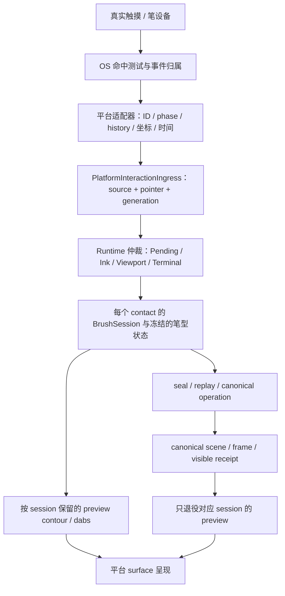

# 多端多指画笔实现复盘：输入归属、会话隔离与呈现交接

日期：2026-10-01。仓库：Mostorm-Labs/axiom。

实现基线为 `9085b973186a0ab69b5b95a182dcafb4a04661ca`；本记录随
`codex/g4-5-web-eraser-brush-packages` 合并回
`codex/g4-5-common-brush-processing`。这是一份工程复盘和后续工作清单，
不修改已有产品/语义 Authority，也不作 G4 或 G4.5 Gate PASS 判定。

## 1. 已解决的现象与结论边界

Windows 上，单指能够绘制，但第一指持续绘制时第二指无法产生独立笔迹。
最终修正的是 **D3D12/Skia preview popup 的系统输入穿透契约**：在既有
`WS_EX_TRANSPARENT` 基础上增加 `WS_EX_LAYERED`，并调用
`SetLayeredWindowAttributes(overlay_, 0, 255, LWA_ALPHA)` 完成初始化。
用户在真实触摸屏上确认多点画线恢复；新日志也记录到两个、乃至五个原生
触点并发与独立 preview contour。共享 BrushSession 算法没有为本次修正而改写。

本机验证环境为 Windows 11 Pro 10.0.22631、HJS-OPS-ADLP-A08 主机、
`Touch Device,55-50P` 触摸设备，HID VID/PID 为 `08D3:1000`，设备声明最多
50 个触点。**声明的最大触点数不是已经验证的产品支持上限**。

证据在 [Windows 恢复记录](../quality/evidence/windows-multitouch-20261001/windows-result.json)
及 [原始输入日志（gzip）](../quality/evidence/windows-multitouch-20261001/pointer-diagnostic.log.gz)。
详细失败过程保留在 [9 月 30 日调查记录](../quality/evidence/windows-multitouch-20260930.md)。

| 试验 | 原生输入与 Runtime 结果 | 能支持的结论 |
| --- | --- | --- |
| 修正前的 Axiom | 172、175、176 顺序出现；最大 active=1；首笔出现硬件 touch 转 mouse，随后 mouse-global capture | 第二指在进入共享会话前已丢失，优先调查宿主输入路径 |
| 无 overlay 的原生对照窗口 | 四组触点重叠；169 在移动约 754 像素后，170 于 1920ms 后 DOWN；用户看到两色轨迹 | 同一硬件/驱动/OS 能提供真正并发触摸；对照窗口不是 Axiom 功能通过证据 |
| 修正后 183/184 | 第一指先进入 Ink，第二指晚 1312ms 落下；最大 contour=2；两个 UP 各使 canonical 提交计数增加一次，合计 2 | Axiom 中独立进入 Ink、独立预览和独立提交的链路恢复 |
| 修正后 190–196 的重叠试验 | 原生接触数、frame contacts、active 与 contour 峰值均为 5；各指有独立 begin-key/更新/结束 | 已观察到五触点峰值；该混合试验不能当成五次独立双指验收 |
| 修正后 188/189 同时落下 | 两次 DOWN 时间相同，初始仍 Pending；随后 viewport=1、contour=0、该组没有 canonical 增量 | 与 AutoIntent 的短时手势仲裁相符，不能混为已锁定 Ink 被抢占 |
| 默认 Vector 窗口复查 215–243 | 从空场景开始；原生/active/contour 峰值均为 8；27 次 scene apply 成功，最终日志场景对象为 27 | 未改变程序即可再次产生 canonical；峰值不是全笔型、全设备支持上限 |

成功日志中没有 touch-promoted mouse DOWN、mouse capture，或 overlay 接收
pointer/touch/mouse 的记录。诊断没有覆盖 WM_GESTURE，故不把“未记录”扩大为
“所有输入类型都绝不可能到 overlay”。用户的视觉确认与 native 日志相互补充；
历史失败日志没有被改写成成功。

混合试验日志中的 `canonical_strokes=17` 实际取自
`submittedOperationCount()`；试验后期还使用了橡皮擦。它是 **canonical operation
提交计数**，不是最终仍存活的 17 个 stroke 对象。`preview_sessions` 则取自
`brushPreviewOutlines().size()`，是 outline 条目数，不是直接读取 BrushSession
容器；空轮廓、dab-only 笔型和 pending handoff 都会影响其解释。183/184 的
受控绘制片段才适合用“两个提交”佐证“两笔”。

**工具模式也是试验条件。** 用户随后报告“不能记录 canonical”时，窗口截图中
选中的是 Object Eraser；212/213 虽然并发进入 Ink，但没有 brush outline，也没有
新增 stroke。橡皮擦对空白区域操作不能用新增画笔对象作为 oracle。这是该次
现象的一种解释，不能仅凭截图断言所有失败都由选错工具造成。用户授权重新
启动后，保持同一 `9085b973` 源码和相同 exe SHA256，在默认 Vector 的新窗口中
观察到 215–243 原生触点、27 次成功 scene apply 与 27 个 scene object。复查日志
从 `objects=0` 开始，证明本次没有再修改生产代码也能产生 canonical；其中
218/219 的 Pending 双指手势仍进入 viewport，未计入画笔提交。

本次没有把三次严格、相同条件的双指协议逐次封闭，也没有完成所有端的真机
证据矩阵。因此记录“用户确认 Windows 功能恢复”和日志事实，不将其升级成
正式 Gate 结论。

## 2. 多指能力贯穿整条链路

多指不是给单笔画线函数增加一个循环。任何一层把多触点压成一个状态，最后
都会表现为“第二笔不见了”：

目前主要代码边界如下。平台层负责接收、归一化和呈现；笔迹语义、仲裁、
内容坐标变换和 canonical mutation 由共享 Runtime 控制。

| 层 | 代码入口 | 必须守住的性质 |
| --- | --- | --- |
| 输入生命周期 | `runtime/input/src/platform_interaction_ingress.cpp` | 非零逻辑身份；DOWN 建立 generation，UP/CANCEL 结束；无活动身份的 MOVE 不创建笔迹 |
| 多触点仲裁 | `runtime/interaction/src/multi_contact_coordinator.cpp`、`canvas_interaction_coordinator.cpp` | 已锁定 Ink 的 contact 不因后来的第二指重新进入 viewport |
| 画笔组成 | `apps/ink_playground/common/ink_playground_host.cpp` | 每个会话独立采样、笔型/seed、seal、replay、提交与取消 |
| 预览组成 | `runtime/render/src/preview_surface.cpp` | 多 contour 共存；每个 contour 独立 revision；取消/退役只影响对应 session |
| canonical 交接 | Host 的 `finishBrushSession()`、`presentCanonicalFrame()` | 语义提交和画面可见是两个阶段；回执匹配身份和 surface generation 后才清理 preview |

三个 generation 也不能混用：contact generation 防止系统 ID 复用；surface
generation 防止 GPU 重建后的旧帧回执；文档/语义 generation 防止跨文档或
过期 mutation。接收日志里两个 pointer 都为 generation=1 是正常的“各自第一次
接触”，不表示两者共用一个会话。

## 3. Windows：显示透明与输入透明必须分别验证

### 3.1 为什么前几步看起来正确，第二指仍然丢失

preview popup 没有注册 `RegisterTouchWindow(overlay_)` 或
`RegisterPointerInputTarget(overlay_)`，并返回 HTTRANSPARENT，但这些条件
不足以证明系统不会把新落下的触点命中到它。微软明确说明 WM_TOUCH 不遵守
[HTTRANSPARENT](https://learn.microsoft.com/en-us/windows/win32/wintouch/wm-touchdown)；
单独的 WS_EX_TRANSPARENT 定义的是绘制顺序，而
[layered window 的透明命中机制](https://learn.microsoft.com/en-us/windows/win32/winmsg/window-features)
是另一层机制。

第一指开始时与第二指落下时的窗口栈可能不同：前者尚无可见 preview，后者
已经有位于画布上方的 popup。只验证“启动时 owner 能接收 DOWN”会错过这个
状态迁移。最终修正使 popup 在保留 DirectComposition swapchain 呈现的同时，
完成 layered 透明初始化；owner 仍是实际输入接收窗口。

这次前后对照支持透明契约是本机故障的原因。修正前缺失触点的具体目标 HWND
没有被捕获，故没有凭空声称“已看到第二指进入 overlay”。同样，微软关于
layered hit testing 的文字主要描述鼠标；真实触摸恢复来自本机实测，而非把
鼠标规则直接推演成所有触摸设备的保证。

### 3.2 三种输入通道不能互相冒充

- **WM_POINTER**：按 pointer ID 获取信息/history，保留 sourceDevice 和生命周期。
  pointer capture 属于对应 contact，不以 Win32 SetCapture 替代。
- **WM_TOUCH**：作为兼容路径，逐项处理 contact ID/phase；正确处理触摸输入
  handle 的所有权与关闭，避免转发后再次读取已经失效的 handle。
- **mouse fallback**：真实鼠标可以走按钮消息；touch-promoted mouse 是兼容
  投影，无法表示并发触点。修正前首次触摸经过 fallback 并 SetCapture 的事实
  证明“有一条线”不足以证明走了原生触摸路径。

还要避免把 `RegisterPointerInputTarget` 的 error=5 当成 owner 完全收不到触摸。
该 API 涉及全局输入重定向及
[UIAccess 权限](https://learn.microsoft.com/en-us/windows/win32/api/winuser/nf-winuser-registerpointerinputtarget)。
本机 owner 的普通原生输入与 RegisterTouchWindow 成功并不依赖这次重定向成功；
修正前后都不能只用一个注册调用的返回值判定功能。

### 3.3 history 与最后一指 UP 的特殊性

Windows history 需要恢复时间顺序，并避免把旧 DOWN/UP 重复送进 Runtime。
新 DOWN 没有 history 仍是有效事件，必须提交当前样本。UP 的当前样本与
canonical handoff 不能依赖“下一次移动才会 render”，否则用户抬手后会看到
preview 残留或末端缺失。重放应保留每指顺序，并检查合并批次中的终止边界。

此次新增的 `G4InkPlaygroundWindowsPreviewPopup` 创建真实 provider，使用
Windows API 检查 layered 属性，再验证 resize/visibility 前后的 acquire/present。
它在修正前失败、修正后通过，但其证明范围是窗口契约与 surface 可用性；真实
多指仍需物理触摸。旧的源码字符串合约不能代替这种运行时验证。

## 4. Android：ID、坐标空间与多层生命周期

本节是当前源码及已有修正的复盘，本轮没有重新运行 Android 真机试验。

**pointer index 不是 pointer ID。** 首指 DOWN/末指 UP 与中途
ACTION_POINTER_DOWN/UP 必须区分；DOWN/UP 使用 actionIndex 找变化的指，MOVE
遍历所有当前 pointer，持久状态以 getPointerId() 建立。Android 官方说明
[index 会变化而活动期 ID 保持稳定](https://developer.android.com/develop/ui/views/touch-and-input/gestures/multi)。
本项目还有额外边界：Android ID 从 0 开始，但共享 PointerKey 将 0 视为无效；
`android_pointer_identity.hpp` 将合法原生 ID 映射为 `ID+1`。缺失这一步会使
“默认第一指”根本无法进入 Runtime，容易被误诊为会话问题。

**history 必须按指取样，坐标只变换一次。** `InkPlaygroundView.emitPointer()`
读取每指历史坐标、pressure、time，送 JNI 批次。原始 MotionEvent 是 View-local，
不应再加屏幕 inset，或在 Java 和 Runtime 各做一次 view→content。现有
MainActivity 显式让 canonical SurfaceView、preview SurfaceView、输入/HUD View
共享 MATCH_PARENT 布局，处理了层间 origin/size 不一致的坑。历史时间和当前
时间的顺序依照 [MotionEvent 契约](https://developer.android.com/reference/android/view/MotionEvent)
处理，不能用“整批入队时刻”覆盖。

**两个 SurfaceView 加一个输入 View，也需要唯一输入归属。** 当前生产呈现
使用 ANativeWindow/EGL/Skia 的独立 canonical/preview surface；Java Canvas
负责 HUD，显式证据路径才需要像素读回。旧
[platform-brush-baseline-v1](../quality/platform-brush-baseline-v1.md) 中的 raster→Bitmap
描述是历史基线，不能当成当前 GPU 路径事实。触摸层叠放、edge-to-edge、旋转、
surfaceDestroyed/recreated 都要同时验证输入 origin 和 provider generation。

输入逐样本更新 Runtime，preview 在 Choreographer 帧回调统一呈现。降低
present 次数是合理的，但不能靠丢掉某个 pointer 的样本达成。Java 的
activePointers、JNI/bridge 的 activePointers、Runtime ingress 三处生命周期
必须一致；当前 bridge 为重复 DOWN 提供 MOVE 转换只是兼容保护，不能掩盖
CANCEL 后残留状态。这一点列入后续优先风险。

## 5. Web：浏览器手势、per-pointer capture 与 WASM 边界

本轮读取当前实现及合约，没有重新完成浏览器真实触摸验证。

当前 canvas 使用 `touch-action: none`，DOWN 为对应 pointerId 调用
`setPointerCapture(pointerId)`，MOVE 按 started 集合过滤，UP/CANCEL 结束对应
指。浏览器的 per-pointer capture 与 Windows mouse-global SetCapture 具有
不同语义，不能因为函数都叫 capture 就共用处理方案。浏览器手势仲裁与
取消必须结合 [Pointer Events 标准](https://www.w3.org/TR/pointerevents3/) 验证。

`getCoalescedEvents()` 不可用或为空时要提交当前事件；history 不能把多个
contact 拼成一个 stroke。时间从毫秒转换到纳秒，并通过 WASM i64/BigInt
边界传递；sequence 用于顺序与去重，而时间用于仲裁，两者不能互相替代。
浏览器 canvas 的 CSS 大小、backing pixel 大小、DPR 和 Runtime viewport 是
不同量。当前 bridge 接收 view 坐标并由 Runtime 变换，传入的旧 contentX/Y
参数被忽略，避免双重变换；导出 trace 仍需注明记录的是哪种坐标。

Web 的高风险状态不止 pointercancel：capture 丢失、标签页隐藏、画布替换、
WebGL context lost/recovered、页面级 wheel/gesture handler 都可能绕过正常
终止路径。目前没有看到 canvas lostpointercapture 与整页失焦/隐藏的统一清理
闭环，不把它写成“已覆盖”。同一笔的 predicted 与 confirmed 样本也必须
区分；当前常规 Web 批次标为 confirmed，不意味着预测采样已经接通。

## 6. Apple：已有契约接入与待接原生宿主分别记录

仓库存在 `apple_input_adapter.cpp` 与 `c1_apple_input_contract_test.cpp`，能将
已提取的 Apple 样本构造成共享批次，并保留 predicted provenance。当前
Ink Playground 的构建入口没有等同于 Windows/Android 的 Apple 原生可运行
宿主，本次也没有 UIKit/AppKit 真机证据，不能写成四端功能都已通过。

后续接入应从稳定 contact 身份、coalesced/predicted 样本区分、取消回调、
视图与手势识别器的输入归属、点坐标与 drawable pixel 尺寸入手；参考
[UIKit 触摸处理入口](https://developer.apple.com/documentation/uikit/handling-touches-in-your-view)。
适配器契约测试可以验证 normalized 输出，平台真机必须另外验证系统是否
实际把两指交给宿主，以及 preview/canonical 是否确实显示。

## 7. 共享 Runtime 的关键设计与容易踩的边界

### 7.1 仲裁要保留手势意图，也要保护已开始的笔迹

当前 AutoIntent 的实现阈值是 radial slop=8、path slop=12（输入坐标单位），
viewport chord window=250ms。Pending 的样本仍可进入 provisional BrushSession，
一旦两个 Pending contact 在窗口内形成手势，Runtime 统一取消参与者的临时
笔迹。第一指一旦锁定 Ink，AutoIntent 下后来落下的指可直接加入 Ink。

这些阈值是当前实现事实，不能未经产品讨论提升为所有 DPI、设备、Accessibility
设置下的冻结标准。MultiInk 是独立策略，不使用 AutoIntent 的短时 viewport
仲裁；GesturePriority 下已有 Ink 时新 contact 的忽略行为也要独立测试。
“两个 DOWN 同时到达”和“先画至少 5cm 再加第二指”不是同一个验收场景。

### 7.2 每指拥有自己的会话、几何、参数和提交身份

当前 Host 按 pointer 建立 BrushSession、package、seed 和 preview 条目；
PreviewSurfaceController 按 session 保留多 contour，并让 revision 按 contour
比较。因此第二指既不能覆盖一个全局 outline，也不能把自己的 revision=1
与第一指的 revision=200 比较后误判为过期。

笔型状态在 begin 时解析，seal 后使用相同 package/seed replay，并检查摘要。
随机颗粒/dab 的种子、资源引用和版本必须冻结；中途换笔若影响已存在的会话，
canonical 就可能无法复现 preview。当前有活动 brush session 时工具/笔型切换
受限制，但“Pending 手势”“仅有橡皮擦”和失败 begin 后的回滚仍需各自验证。

### 7.3 preview 退役依赖可见回执，而不是任意一指抬起

`finishBrushSession()` 完成语义提交并记录 pending handoff；对应 canonical
frame 成功 present 后，`presentCanonicalFrame()` 再匹配 identity 并退役该
session。第二指 UP 后第一指仍需保留 contour；只剩最后一个 session 退役时
才立即隐藏 overlay。surface loss/resize/profile 重建需要新的 generation，
不能让旧帧回执清除新笔迹。

语义 apply 成功、scene 编译成功、GPU render 成功、platform-visible receipt
是四个不同节点。后续异步 renderer 若不再提供同步呈现语义，应补真正的
platform feedback，不能继续把“submit 返回成功”当成已可见。

## 8. 后续风险及应对顺序

下面是源码审查所得的风险或待覆盖场景，**不是本次 Windows 故障的已证实
额外根因，也没有在本轮顺手修改生产代码**。优先级按可能造成串笔/错误提交
或无法恢复排序。

| 优先级 | 风险与当前依据 | 应对方法与验收 |
| --- | --- | --- |
| P1 | ingress 使用完整 source/pointer/generation，但 Host 的 brushSessions、brushPreviews、pendingCanonicalIdentities 以裸 pointer 为键，Arc/preview identity 中也存在固定 epoch/generation=1 | 两个 source 同时使用相同原生 pointer ID，加 ID 复用和延迟旧样本回归；再统一稳定 session identity 的映射，证明不串笔、旧回执不清新会话 |
| P1 | Android nativeCancelAll 当前调用 Host.cancelAllPointers，但 bridge 的 activePointers 未在同一函数中清空；其重复 DOWN→MOVE 逻辑可能使 CANCEL 后的下一笔无 begin | 添加 DOWN→CANCEL→相同 ID DOWN→MOVE→UP 的端到端回归，逐层断言 active=0 后新 generation 能建立；修复应收敛到有问题的生命周期边界 |
| P1 | ingress.sourceLost(source) 构造该 source 的 Cancel 后，batch.sourceLost 又触发 cancelAll，可能连带取消其他 source | 对两个活跃 source 仅断开一个，验证另一笔可以继续与提交；明确 source-lost 与全宿主 terminal cancel 的范围契约 |
| P1 | Web 缺少可见的 lostpointercapture/页面隐藏清理闭环；平台输入目标重建或失焦可能没有 UP | 真实浏览器双指越界、切页、context lost 后恢复，验证无悬挂会话、不提交取消笔迹、下一笔正常 |
| P1 | GPU/surface 重建、canonical 延迟/失败时，多个 pending handoff 与新 contact ID 复用交错 | 注入呈现失败、旧 generation feedback 和第二指先 UP；只退役已可见的对应身份，不清整个 overlay |
| P1 | begin 在创建 BrushSession/Arc 状态后若 preview begin 失败，或 seal/apply/scene 步骤部分失败，状态可能已改变 | 给各失败点加回滚/幂等重试回归，区分“未提交失败”与“已提交但未呈现”；不能在重试时重复 canonical operation |
| P2 | nativeTouchChannelSeen 之前允许 promoted mouse fallback；其他机型或未来窗口层变更可能重新触发单指 capture | 记录输入来源与 promotion/capture，新增 native 通道初始化与首笔回归；保持真实鼠标能力并明确触摸兼容路径的限制 |
| P2 | 每指 Android JNI arrays、全量 outline 拷贝、逐样本日志 flush，可能放大五指以上的 UI 延迟和 history 批次 | 在 2/5/10 指、不同采样率下测 frame time、队列、分配、输入延迟；先保留样本，再按显示帧合并呈现；正式运行控制诊断开销 |
| P2 | 输入坐标单位、DPI/DPR、inset/旋转/viewport 比例不一致，既影响命中，也影响 8/12 的仲裁阈值 | 多屏 DPI 切换、Android 旋转/edge-to-edge、Web CSS resize 下绘制与手势双向 golden；证据同时记录 view/content/drawable 坐标 |
| P2 | pressure=0、tool/capabilities 未完整传播、pen+finger/掌压组合，与普通双指不同 | 以真实 pen+touch 单列矩阵，测试零压、悬停、eraser tip 与 palm rejection；避免 Web `pressure || 0.5` 之类默认值吞掉合法零压 |
| P2 | 自动生成 object/operation ID、固定 seed 与提交顺序，可能不适用于多源协作/并发编辑 | 对交错 UP 与相同 ID 不同 source 做 replay/幂等验证，再接入文档级身份与 commit ordering；不要只靠本地计数满足分布式唯一性 |
| P2 | renderer、family、eraser 的能力并不完全一致；outline 计数和最终对象数不能代表所有笔型的 preview/提交 | 对 vector、marker、chalk、membrane、对象/局部橡皮擦分开记录 contour/dab/operation/object 数；dab digest、资源与遮罩交接单列测试 |
| P2 | 当前测试仍存在 source-text 期望漂移、BrushLab digest 差异及全仓工具/语义测试失败 | 保留失败名称及基线，单独核查测试或实现变化；增加真实 boundary 回归，不修改断言来获得表面全绿 |

## 9. 下次遇到“只有一笔”的排查顺序

1. **保存源身份与试验条件**：分支、源码/可执行文件 hash、OS/触摸设备、策略、
   笔型、坐标/时间单位；先确认真正使用物理触摸，核对实际选中的工具，区分
   Vector/其他画笔与 Object/Local Eraser，记录试验前后对象数与 operation 数。
2. **先证明 OS 并发**：两个 DOWN 的 ID、原生 in-contact 重叠区间、两个 UPDATE
   与 UP；有必要时使用不含 Runtime/overlay 的原生对照窗口。鼠标轨迹不能代替。
3. **再证明宿主收到并发**：记录接收 HWND/View/DOM element、pointer target、
   promotion、capture 与 focus；日志覆盖 owner/overlay 的 before-route 边界。
4. **再证明 normalized 身份与 Runtime 路由**：source/pointer/generation、phase、
   sequence、disposition；将同时落下的 Pending 手势与已锁定 Ink 的第二指分开。
5. **再证明会话及预览隔离**：直接记录 session identity 与 count、contour/dab
   identity/revision；第二指开始、任意一指 UP/CANCEL 都不覆盖其他会话。
6. **最后证明 canonical 与可见交接**：逐指 operation/object identity、commit stamp、
   frame/surface generation、visible receipt；截图/视频与日志使用同一试验片段。

没有原生重叠，优先归类输入路径阻塞；有原生重叠但未进入 Ink/会话，归类
Runtime 路由问题；会话齐全但缺 preview 或 canonical，继续细分 render/handoff。
每次只提出一个可检验假设，先复现回归再最小修正，并保留阴性证据。

## 10. 验证现状与后续交付要求

本轮总结只新增文档与归档证据。此前 Windows 修正的验证结果：

| 检查 | 已记录结果 | 解释 |
| --- | --- | --- |
| 请求的 Windows app/测试目标构建 | 成功，使用锁定预构建 Skia SDK | 未重新源码编译 Skia；工具链使用实际安装的 VS x64 Developer 环境 |
| 原生 popup 回归 | 修正前失败，修正后通过 | 验证真实窗口属性与 D3D12 acquire/present，不模拟触摸 |
| 相关 CTest（含新增及三项交互测试） | 22/23 | G45BrushLab 的 manifest 比较仍失败 |
| 三项 Windows Python 合约及 diagnostics 合约 | 42/47 | 五项旧 preview/GDI 源码文本期望仍失败 |
| 全仓 Python，UTF-8 模式 | 458 通过、31 失败、4 跳过、209 subtests 通过 | 默认 Windows cp1252 曾阻塞收集；失败名称完整归档 |
| 全量 C++ 构建 | 未完成 | 旧测试使用弃用 SkiaInkBackend，在 /WX 下失败；未关闭 warning 来获得全绿 |
| Windows 真机功能 | 用户确认恢复；首轮日志记录 2/5 触点并发；Vector 复查峰值 8、成功提交 27 笔 | 本机事实，不等于其他 Windows 设备、Android、Web、Apple 的真机结论 |

详细结果在 [verification-summary.json](../quality/evidence/windows-multitouch-20261001/verification-summary.json)。
跨端固定 corpus 的 normalized/replay 一致性仍应遵照
[Platform Brush Baseline v1](../quality/platform-brush-baseline-v1.md)，并与真实
自由绘制的功能 smoke 区分：同一 Runtime 算法通过，不证明宿主 OS 接收了多指；
真机自由绘制恢复，也不证明三端固定 corpus、性能阈值及语义 Gate 已全部闭合。

后续优先关闭 P1 身份/取消/交接回归，再补齐每端物理触摸、各笔型与工具、
surface 重建、失焦与并发负载矩阵。每份 evidence 必须说明采集 revision、输入
现实类型、计数器语义、控制片段和截图时点，并保留负向试验及 hash，才能在
下一次端上差异出现时定位到具体边界。
