# Axiom Evidence-Gated 实现与验证总路线

> 状态：Accepted implementation and verification promotion baseline / 2026-08-23 用户确认
> 适用范围：AR-0、G0～G9、POC-01～06、RF-01～03、R1～R5
> 原则：`AR-0 → G0 → … → G9 → R5-B` 是唯一任务依赖与 Gate 晋级顺序；POC、RF 和 R 只提供
> 风险验证、参考实现、历史 Evidence 与里程碑视图，不形成第二条执行路线。

本文把 Notion 中的 Evidence-Gated Vertical Build 与仓库现有 POC-01～06、RF-01～03、
R1～R5 合并为一套可以按顺序执行、按证据复核的实施计划。它不删除已经完成的 POC，也不把
POC 接口升级为产品接口；历史成功和失败证据都作为后续 Gate 的输入保留。

## 1. 术语

| 术语 | 含义 |
| --- | --- |
| Architecture Reconciliation / `AR-0` | 正式实现前的架构对账阶段。它解决互相冲突的规范、平台范围、所有权和术语，但不冒充产品实现。 |
| Gate / `G0～G9` | 可晋级的纵向能力门禁。每一 Gate 都要求产品代码、Reference/Mock、自动化证据、可运行产物和 Gate Report。 |
| Promotion | 一个 Gate 满足全部阻断退出条件后，允许下一个 Gate 进入验收的晋级动作。 |
| POC | 可丢弃的技术风险验证。POC 结论可成为 Gate 输入，但 POC 代码、ABI、schema 和格式默认不是产品契约。 |
| RF | 渲染基础工作包。RF-01～03 是 G2/G5 的实现输入，不是与 G0～G9 并行的发布路线。 |
| Release Stage / `R1～R5` | 产品交付范围标签，用于表达 Foundation、Local Runtime、Production Rendering、Collaboration 和 Release；不决定 Gate 的通过顺序。 |
| Reference / Oracle | 有意保持简单、可能较慢，但用来判断优化实现是否正确的永久参考实现。 |
| Gate Report | 与 commit、平台、工具链、语料版本、原始 Observation、规范化 Result、适用性、结果和产物哈希绑定的机器可读门禁报告。 |
| Tier A | V1 正式产品目标：Web、Windows、Android、iOS 和 iPadOS。 |
| Deferred target | 当前不承诺原生产品 Shell 的目标。macOS 暂缓，用户可通过 Web 产品使用；共享 C++ Runtime 仍应保持可移植。 |

文中的 `PASS`、`FAIL` 和 `BLOCKED` 只描述某一 Gate Report 的结果。`Accepted POC`、
`Implementation Ready`、代码已经合并或 CI workflow 存在，都不能替代 Gate `PASS`。

## 2. 总体规则

### 2.1 唯一晋级顺序

```mermaid
flowchart LR
  AR0["AR-0 架构对账"] --> G0["G0 验证基础"]
  G0 --> G1["G1 语义内核"]
  G1 --> G2["G2 RuntimeScene 基础"]
  G2 --> G3["G3 基础 Canonical Canvas"]
  G3 --> G4["G4 交互与 Ink"]
  G4 --> G5["G5 大画布优化"]
  G5 --> G6["G6 富编辑与平台生命周期"]
  G6 --> G7["G7 本地数据运行时"]
  G7 --> G8["G8 同步与恢复"]
  G8 --> G9["G9 集成产品门禁"]
  G9 --> R5B["R5-B 发布加固"]
```

任务依赖、实现和晋级必须沿 `AR-0 → G0 → … → G9 → R5-B` 进行：

- 后一 Gate 可以提前建立分支、mock 或非阻断性实验，但不能在前一 Gate 通过前标记 `PASS`；
- 为完成当前 Gate 而需要修改上游 schema、所有权或平台决定时，Gate 必须停止晋级并回到
  相应 authority；
- G9 只解决集成、adapter、诊断和场景问题，不在集成阶段重新设计语义所有权；
- R5-B 是 G9 之后的发布加固，不允许用发布排期跳过任何 Gate。

G0 verification infrastructure 可以与历史 POC physical evidence 收尾并行，但这不构成跨 Gate
任务并行，也不允许提前实施后续 Gate。当前 Gate 未满足退出条件时，不得进入下一个 Gate。

### 2.2 每一 Gate 的固定交付合同

每一 Gate 必须同时提供以下五部分：

1. **设计**：边界、所有权、输入输出、错误语义、非目标和禁止修改项；
2. **验证语料**：fixture、oracle、随机语料、设备、指标、故障点和比较方法；
3. **实现**：产品 target、adapter、reference/mock、工具和 CI；
4. **交付物**：可运行 demo/inspector、规范、trace、报告和可复核 artifact；
5. **退出条件**：机器可检查的正确性、性能、生命周期和 evidence 条件。

缺少其中任一部分，Gate 都不能 `PASS`。

### 2.3 证据等级

| 等级 | 名称 | 证明内容 | 典型产物 |
| --- | --- | --- | --- |
| E1 | Contract / Unit | 类型、schema、API、invariant 和模块内部行为成立 | unit test、schema test、boundary lint |
| E2 | Reference / Mock | 产品实现能与简单 truth oracle 对照，故障路径可控 | ReferenceObjectStore、FullSceneCompiler、FakeSurface |
| E3 | Integration / Golden | 接入真实上下游后，可观察语义、结构和视觉结果正确 | replay、digest、golden、cross-language diff |
| E4 | Physical / Demo | 真实产品交互、真实设备、真实规模和真实生命周期工作 | Canvas Demo、Ink Playground、设备报告、soak |

E4 只在该 Gate 的目标包含真实产品交互、真实设备或真实生命周期时适用。Gate Report 必须显式写
`applicable` 或 `not_applicable` 及理由；不适用时不得伪造物理证据，也不能用 `N/A` 掩盖本应适用的
设备门禁。物理 input-to-display 延迟不能由 headless、WARP、SwiftShader 或模拟时间推断。

### 2.4 Gate Report 与状态纪律

Gate Report 至少记录：

- Gate、commit、branch、schema version 和报告生成器版本；
- 平台、设备、系统、编译器、构建配置、Skia SDK ID/backend；
- corpus/fixture ID、算法版本、seed、Reference implementation 版本；
- 原始 `Observation` 与规范化 `Result` 分离记录，包含 proof level、authority/open-policy、
  `applicable`/`not_applicable`；
- E1～E4 每项状态、第一处分歧、性能分布、未关闭问题，以及 generation namespace、session epoch、
  late-event fence 和 fault-hook 记录；
- 产物路径、字节数和 SHA-256；
- 总状态：`PASS`、`FAIL` 或 `BLOCKED`。

状态纪律如下：

- 已冻结规范或既有硬门禁失败时使用 `FAIL`，不能降低阈值换取通过；
- 上游仍明确为 `OPEN`、且当前 Gate 无权创造行为时使用 `BLOCKED`；
- `BLOCKED` 不能被描述成“有条件通过”，也不能生成下游 promotion；
- `Benchmark Target`、`Provisional` 和观察值不得自动升级为 Product SLO；
- blocking CI 不提供自动更新 golden 的 `--bless` 路径；
- 历史失败报告不能删除或被新报告静默覆盖，应通过 lineage 标记被何次重测补充或替代。

Notion 10 使用的 `OPEN → BLOCKED_OPEN` 在仓库中映射为：上游行为仍开放且当前 Gate 无权裁决时，
先记录 `OPEN` issue，Gate 结果必须是 `BLOCKED`，并保留从 OPEN 到 BLOCKED 的状态转换和 owner；
不能把 `BLOCKED` 写成条件 PASS。

## 3. 平台与产品不变量

### 3.1 Product Shell

| 平台 | 产品 Shell / Runtime 路径 | V1 责任 |
| --- | --- | --- |
| Web | React/TypeScript + WASM + WebGL2 | Tier A；产品 UI 由 React 负责，Canonical Runtime、布局和渲染在 C++/WASM。 |
| Windows | React Native Windows（RNW）+ Fabric/native canvas region | Tier A；产品 Shell 可承载本地批注等能力，Pointer/IME/Render 热路径不逐事件经过 JS。 |
| Android | React Native + Native CanvasView + JNI | Tier A；MotionEvent/history、IME、Arc 和 rendering 保持 native/C++ 数据面。 |
| iOS/iPadOS | React Native + Fabric/native CanvasView + ObjC++/C ABI | Tier A；coalesced input、IME、Metal surface 和 Arc 数据面不经过 RN JS。 |
| macOS | 暂缓原生产品 Shell；使用 Web 产品 | Deferred；共享 C++ Runtime 的 host/core 可移植性不得被 Tier A 特例破坏。 |
| Headless | reference/test utility | 非公开产品 Shell；提供 conformance、golden、inspector 和 fault runner。 |

Windows RNW 和 Apple RN/Fabric 的 POC-05 证据证明受控 Overlay/Shell 边界可行，但其中的
private POC Scene bridge 不能进入产品 ABI。

### 3.2 Page、Document 与写入模型

- 一个 Product Page 对应一个独立 Axiom `Document`；
- Page 集合、导航、创建、复制、删除、排序和产品生命周期由上层产品层拥有；Shared Data
  Runtime 只按产品层契约持久化并查询 `PageId → DocumentId` 等 repository 数据；禁止在单个
  Axiom Document 内建立多 Page synthetic root；
- 每个 Document 是支持负坐标、连续 pan/zoom 的无限画布；Viewport 属于 View/
  EditorSession，不进入 Document；
- Canonical mutation 只有 `Operation` 一条路径；不存在 canonical
  `Transaction → operations[]` 外层；
- 一个 Operation 可以携带领域内原子 payload，并在内部经历
  `decode → normalize → validate → idempotency → prepare apply plan → atomic apply/commit`；这个内部原子边界不能成为
  Wire、Replay、Sync 或 Undo 的第二种事实；
- transport batch 只用于摊销，不自动获得 canonical atomicity；History/Undo intention 只负责
  grouping，并通过新的 compensating Operations 修改 Document。

数据库或结构化存储仍可使用其自身的 storage transaction；该术语不能与 Document Operation
语义混用。

### 3.3 Axiom、Shared Data Runtime、Platform Host 与 Arc

运行时数据按五类划分，跨模块接口不得把它们混成一个状态：

| 数据类 | 例子 | 可否成为 Document 语义事实 |
| --- | --- | --- |
| Canonical | Document、Operation、Snapshot、ResourceManifest | 可以；由 Axiom 定义并参与 digest |
| Transient | Active Stroke、Preview、selection、composition | 不可以；可丢弃或回放重建 |
| Derived | RuntimeScene、spatial index、damage、tile、GPU/cache | 不可以；必须可从 Canonical 重建 |
| Transport | Outbox/Inbox envelope、cursor、ACK、retry metadata | 不可以；由数据运行时按协议托管 |
| Control | generation、session epoch、lifecycle、fault/diagnostic signal | 不可以；用于隔离异步事件和生命周期 |

所有异步回调必须携带适用的 generation namespace 与 session epoch，并在消费端执行 late-event
fence；旧 surface、store、sync 或 session 的事件只能被拒绝/记录，不能修改新状态。

- Axiom 拥有 Object/Operation/Snapshot 的语义、codec、validation、Document、Scene、Ink、
  RichText、HitTest 和 Canonical Renderer；
- Shared Data Runtime 拥有 `DocumentSession`、durable byte custody、journal/checkpoint、
  recovery ordering、Outbox/Inbox、Sync、Blob availability 和前后台数据编排；它把 Operation/
  Snapshot 当成 opaque canonical bytes，不解释或修改 ObjectRecord；
- Platform Host 是 composition root，负责创建和组合 Axiom、Arc、Shared Data Runtime、native
  surfaces、frame scheduler、overlay/native view 与最终 presentation；
- Arc 是 Tier A 低延迟书写硬需求，但只拥有 transient input-to-display preview；Axiom 仍唯一
  拥有 brush、prediction、Canonical Stroke 和 Document；
- Arc 不可用、超时、surface/device 丢失或 presentation 失败时，必须自动进入
  `Canonical-only rendering`，保留全部 confirmed input，不取消 Operation，不改变 Document
  digest；
- Canonical 与 Arc Preview 不共享 presentable backbuffer ownership。

## 4. POC、RF、R 与 Gate 的双向映射

任务级状态、来源定位、依赖、阻塞项和 Evidence 目标路径以
[Gate Task Tracker](GATE_TASK_TRACKER.md) 为准；R1～R5 的独立汇总见
[R 里程碑状态表](R_MILESTONE_STATUS.md)。本节只表达工作包与 Gate 的覆盖关系。

### 4.1 Gate 使用哪些既有工作包

| Gate | 主要既有输入 | 仍需完成的产品工作 |
| --- | --- | --- |
| G0 | POC workflows、runbook、golden、quality evidence | 统一 corpus、conformance CLI、Gate Report、first-divergence 和 CI governance |
| G1 | POC-01 operation/replay/digest；ADR-0014/0020 | 产品 Semantic Kernel、Operation-only 唯一写入口、Reference/Indexed store、Snapshot/digest |
| G2 | POC-03 correctness；RF-01 | G1 ChangeSet 到产品 Scene、Full/Incremental 和 Linear/Optimized 永久 oracle、Inspector |
| G3 | POC-01 render/surface/golden；POC-03 direct renderer | 产品 render-neutral frame、NonTiled reference、Ganesh adapter、Canvas Demo |
| G4 | POC-02、POC-06/Arc、POC-03 integrated ink | 产品 Input/Ink/Editor、三类擦除、Arc visible handoff 与物理 Ink gate |
| G5 | POC-03、POC-06/Arc 性能联动；RF-02/03，并复用 G2 已通过的 RF-01 contract | Spatial/Chunk、Damage、RenderGroup/Cache、Tile、Scheduler、Resource Budget |
| G6 | POC-04、POC-05、Platform Contract | 产品 RichText/IME/Clipboard、复杂对象、ExternalSurface、平台 lifecycle |
| G7 | ADR-0013/0020；POC replay/snapshot 经验 | Shared Data Runtime、本地 journal/checkpoint/store/recovery 和 DocumentSession |
| G8 | R4 设计、Persistence/Sync RFC | Outbox/Inbox、Fake server、catch-up/bootstrap、AXTP、conflict/convergence |
| G9 | G0～G8 的全部产物与历史 POC evidence | 产品级集成场景、FailureInjector、跨平台比较、Internal Alpha evidence |

### 4.2 仓库工作包落在哪些 Gate

| 工作包 | Gate 归属 | 处理规则 |
| --- | --- | --- |
| POC-01 Shared Engine | G0/G1/G3 输入 | 已接受的六端可移植性与 digest/golden 证据保留；POC ABI、NDJSON 和 Scene 不晋升。 |
| POC-02 Ink Engine | G4 输入 | `Integration Ready / Validating` 不等于 G4 PASS；物理延迟和 Human Ink 仍需产品 target 闭合。 |
| POC-03 100K Scene | G2/G3/G4/G5 输入 | Scene correctness、direct renderer 与 integrated ink 证据保留；Windows D3D12 p95/p99 失败保留并在 G5 用同设备重测。 |
| POC-04 RichText/IME | G6 输入 | 已接受的 IME/字体证据迁入；POC `TextTransaction`、UTF-16 schema 和 ABI 不晋升。 |
| POC-05 Hybrid Surface | G4 辅助输入、G6 主要输入 | native input/host 边界作为 G4 非阻断证据；受控 Overlay 风险证明保留，产品 ExternalSurface/Platform Host/ABI 需在 G6 重建。 |
| POC-06 Arc/FastInk | G4/G5/G9 输入 | 协议、fallback 和 target matrix 可复用；真实 preview/presentation evidence 仍须闭合。 |
| RF-01 Scene foundation | G2 | 复用 Scene/Binding/Damage/HitTest contract；与 G1 Semantic Kernel 对接后再验收。 |
| RF-02 Dynamic spatial query | G5A | 由 Linear oracle 与随机语料约束，不预先冻结具体算法。 |
| RF-03 Tiled raster/scheduling | G5D/G5E | 由 NonTiled renderer、seam corpus、fault 和 memory gate 约束。 |
| R1 Runtime Foundation | G0～G3 | 工程、ABI 与基础纵切面；R1 不再作为跳过 G1/G2/G3 的大包。 |
| R2 Local Runtime | G1、G3、G4、G6、G7 | 本地编辑、语义对象、基础 View 纵切面、RichText/Ink、资源和本地持久化。 |
| R3 Production Rendering/Shells | G3、G4、G5、G6 | 产品渲染、性能、Arc 和 Tier A Shell；以全部必需任务、集成与里程碑退出条件通过为完成条件。 |
| R4 Collaboration MVP | G8 | 离线、同步、Presence、基本冲突和收敛。 |
| R5 Hardening/Release | G9 + R5-B | G9 形成 Internal Alpha；R5-B 再完成发布安全、迁移和长时间稳定性。 |

### 4.3 R 阶段交付覆盖层

R 阶段不是 G 阶段的替代门禁，但每个 R 阶段仍有自己的设计、验证、实现、交付物和退出
条件。R 阶段只有在其依赖的 Gate 已 `PASS` 后才能标记完成；下面的“退出”是产品里程碑
条件，不允许绕过对应 Gate 的阻断条件。

| 阶段 | 设计 | 验证语料 | 实现 | 交付物 | 可量化退出条件 |
| --- | --- | --- | --- | --- | --- |
| R1 Runtime Foundation | 模块依赖、C ABI/handles、WASM/JNI/ObjC++ 边界、确定性服务、诊断和生命周期；不把 POC ABI 直接升级。 | G0 corpus、ABI manifest、C11/C++20/ObjC++ self-containment、stale handle、buffer、callback、sanitizer。 | `runtime/foundation`、public facade、contract adapters、CMake/CI/lint、最小 Tier A shell skeleton。 | 可 clean-build 的产品骨架、header/manifest、wrapper 示例、依赖图、迁移清单。 | G0/G1/G2/G3 相关 foundation work 全部通过；公开 header 跨 C11/C++20/ObjC++ 编译；POC 阻断语料无回归；无 POC-only ABI 进入产品。 |
| R2 V1 Local Visual Document Runtime | V1 Object/Operation/EditorSession/RichText/Ink/Resource/Snapshot+tail；一 Page 一 Document；本地 undo/redo 和恢复边界。 | G1/G3/G4/G6/G7 corpus：对象与 View 行为、三类擦除、文本/IME、资源 missing/corrupt、snapshot round-trip、crash/reopen、migration/fuzz。 | `runtime/semantic`、基础 View 纵切面、`runtime/input`、`runtime/ink`、`runtime/editor`、`runtime/text`、Resource/Persistence 与 Shared Data Runtime local core。 | V1 schema/API、内部编辑 demo、保存/恢复 demo、兼容与故障矩阵。 | G1、G3、G4、G6、G7 的全部 R2 必需任务 `PASS`；跨任务集成与里程碑退出条件通过；每种 V1 节点 create/edit/delete/transform/style/serialize/undo/redo 通过；Snapshot+tail digest 100% 一致；无静默数据丢失。 |
| R3 Production Rendering and Shells | Ganesh backend、FrameGraph/Compositor、RF-01～03、Tile/Cache/Scheduler、ResourceBudget、Tier A Shell 与 Arc fallback。 | G3/G4/G5/G6 physical golden、100K performance/memory、tile seam、device/surface loss、IME、Human Ink、2 小时稳定性。 | Production Scene/Render/Tile/Cache、Windows RNW、Web WASM、Android RN、iOS/iPadOS RN、Arc backend/fallback 和诊断。 | Tier A 内部版本、平台集成指南、性能/视觉/内存/生命周期报告、FastInk fallback 手册。 | G3、G4、G5、G6 的全部 R3 必需任务 `PASS`；跨任务集成与里程碑退出条件通过；Windows/Web/Android/iOS/iPadOS 用户流无回归；既有 p95/p99 与内存门禁通过；2 小时无 crash 且稳定期内存增长 <5%。 |
| R4 Collaboration MVP | Operation envelope、actor/op ID、排序/因果、Outbox/Inbox、ACK/retry、snapshot bootstrap、Presence 和已批准的冲突策略。 | G8 deterministic FakeServer：duplicate、out-of-order、lost ACK、断网、重连、gap、server restart、3/5 副本随机交错和 Presence 丢包。 | Shared Data Runtime SyncCoordinator、AXTP、dedupe、Blob closure、convergence runner、Presence channel。 | Collaboration/Conflict ADR、Sync Recovery Demo、故障/收敛报告、用户可见状态契约。 | G8 `PASS`；100K 随机 Operations 在 3/5 副本收敛；已确认 Operation 无丢失；5 客户端 2 小时无 divergence 或无界队列；OPEN policy 明确为 BLOCKED。 |
| R5 Hardening and Release | G9 Internal Alpha 后的兼容窗口、迁移、威胁模型、诊断、SBOM、签名、回滚和支持矩阵。 | G9 全量回归；24 小时 fuzz、8 小时编辑 soak、协作 soak、升级/损坏/磁盘满/服务故障/回滚演练。 | R5-B diagnostics、backup/recovery、migration protection、dependency/provenance、RC automation。 | 可追溯 Release Candidate、兼容/安全/恢复/性能/SBOM/发布清单。 | G9 与 R5-B 全部 PASS；无静默数据丢失或未归类 divergence；性能相对 G9 baseline 回归 ≤5%；升级、恢复、服务故障和回滚演练通过。 |

## 5. AR-0 — 架构对账前置

### 设计

- 用新的 ADR 明确第 3 节的平台矩阵，替代 Windows Tauri、Apple 仅 Portability Tier B 的旧决定；
- 明确一 Page 一 Document，以及 Page collection 的产品层 owner 和生命周期；
- 明确 Operation-only，分类处理 Document transaction、transport batch、undo grouping 与
  storage transaction；
- 明确 Axiom、Shared Data Runtime、Platform Host 角色、候选 Host Runtime 物理模块和最终产品
  SDK 的层级；不冻结候选包名或发布单元；
- 冻结进入 V1 的对象和交互范围：Shape、Image、VectorPath、RichText、VectorStroke、
  DabStroke、Connector、Group、Frame、Sticky、PDF，及 Lasso、Align/Distribute、Smart Snap；
- 冻结对象擦除与部分擦除的产品语义，以及 Arc required + Canonical-only fallback；
- 建立 Notion Freeze Candidate 与仓库 Accepted ADR 的 authority/lineage 映射。

### 验证语料

- 规范冲突矩阵：每项旧 claim 必须有 `Keep / Clarify / Supersede / Archive` 处理结果；
- 术语扫描：canonical `Transaction`、多 Page Document、旧 Shell、后置对象和可选 Arc 不能在
  现行规范中残留为第二种现行方案；
- 依赖图 review：Axiom 不依赖 network/database/Product Shell，Data Runtime 不依赖 Scene/
  Skia/Arc，Platform Host 不复制语义规则；
- 所有 POC-only 类型和产品类型建立显式迁移/禁止升级表。

### 实现

- 新增或替代相应 ADR、系统架构、项目框架、术语表和路线图；
- 为旧 ADR 建立双向 `Superseded by / Supersedes`，不改写历史决定；
- 建立 Gate/Stage、Requirement、Decision 与 Evidence 的追溯表。

### 交付物

- 平台、Page/Document、Operation-only、Data ownership、Arc/Erase、V1 object scope ADR；
- 规范冲突关闭表和 POC→产品迁移表；
- 本文经审核后的 Accepted 版本。

### 退出条件

- [ ] 所有 P0 规范冲突都有明确、可引用的新决定，不存在两个同时有效的方案；
- [ ] 一 Page 一 Document、Page collection owner 和无限画布边界已写入规范；
- [ ] Canonical write path 中只剩 Operation，旧 transaction 只作为历史 POC 或明确域术语；
- [ ] Tier A 明确为 Web、Windows RNW、Android RN、iOS/iPadOS RN，macOS 为 deferred/Web；
- [ ] Arc required/fallback 和三类擦除进入需求、架构与验证矩阵；
- [ ] 文档、Mermaid、链接、术语和私有来源泄漏检查通过。

## 6. G0 — Verification Foundation

### 设计

- 冻结 corpus layout、Golden Vector、ConformanceCase/Result/Divergence 和 Gate Report schema；
- 定义 FakeClock、DeterministicRandom、StableIdFixture、FakeResourceProvider 和虚拟时间；
- 区分 protocol、semantic、platform、golden、performance、fault 和 physical evidence；
- CI 分层固定为 PR targeted、main full corpus、nightly randomized/performance、release physical/
  soak；
- golden expected 只读，更新必须通过单独评审流程。

### 验证语料

- valid/invalid decode、canonical encode、数值边界、未知字段/枚举、short/long struct；
- Snapshot + Operation tail replay、invalid Operation rejection、同一 case 重复 10 次；
- Web/Windows/Android/iOS/iPadOS platform scenario seed 与 macOS host/core build；
- first-divergence、损坏 artifact、缺失 evidence 和错误 hash 自测。

### 实现

- 建立 `axiom-conformance` CLI、共享 corpus loader，以及受支持的 native/reference/WASM
  runners；runner 的实现语言只服务验证，不冻结 Shared Data Runtime 的产品实现语言；
- 实现 Gate Report schema、G0 aggregator、artifact hash 和 evidence lineage 校验；
- 迁入现有 POC fixture/golden 时保留原 ID、算法版本与历史结果，不复制预期值；
- 建立 platform harness 与 CI job wiring。

### 交付物

- Conformance CLI、Golden Corpus Seed、deterministic test services；
- Platform Harness、Gate Report schema 和 G0 evidence bundle；
- corpus governance 与 CI cadence 文档。

### 退出条件

- [ ] C++ runner、seed corpus 和 invalid corpus全部 PASS；
- [ ] 同一语料连续 10 次的结果与 digest 完全一致；
- [ ] first-divergence 可机器读取并指向 case、field 和 expected/actual；
- [ ] G0 Gate Report schema-valid，所有 artifact hash 可复算；
- [ ] clean checkout 可重复构建和运行，blocking CI 没有自动 bless；
- [ ] G0 总状态为 PASS。

## 7. G1 — Semantic Kernel

### 设计

- 定义 encoding-neutral Object/Field/Operation registry 与 strict codec boundary；
- 写路径固定为 `Wire → Decode → Validate → Prepare ApplyPlan → Atomic Apply →
  SemanticDocument → ChangeSet`；
- 使用 `ReferenceObjectStore` 作为简单 oracle，`IndexedObjectStore` 作为产品路径；
- 一个 Operation 对应一个逻辑 ChangeSet；传输 batch 不改变原子边界；
- `Normalize` 必须在验证前把等价输入归一化到 canonical representation；idempotency guard
  必须在 ApplyPlan 前拒绝重复或已消费的 Operation，且拒绝路径保持 state/revision/digest 不变；
- Snapshot、canonical projection、digest、Operation continuation 与 replay 分层；
- RichText 位置单位、字体身份、Brush family、Property/Field registry 和 unknown capability 必须
  先冻结；POC-04 UTF-16 与产品 schema 的差异不能隐式继承；
- Page 不作为 Document 内 ObjectKind；Product Page identity 与 Document identity 一一映射。

### 验证语料

- V1 对象 create/delete/placement/transform/property patch；
- Stroke、RichText、Connector endpoint、Group hierarchy、Sticky composition、Frame/PDF resource
  引用、对象擦除、SplitStroke 和 EraseMask Operation；
- invalid target/kind/field、duplicate ID、parent cycle、stale ref、非有限数值和溢出；
- Reference/Indexed store differential、Snapshot + tail replay、随机合法 Operation stream；
- 1K/10K/100K lookup/mutation baseline，记录扫描计数；
- normalize 等价输入、重复 Operation、重复 batch、session epoch/generation 过期事件和
  late-event rejection；每条 case 同时保存原始 Observation 与规范化 Result。

### 实现

- 建立产品 `runtime/semantic`，实现 typed Operation、codec、validator、ApplyPlan、Document、
  ChangeSet、Snapshot/projection/digest；
- 实现 ReferenceObjectStore、IndexedObjectStore 和强类型 ID/index；
- 实现 Semantic Replay Inspector，支持 step、jump revision、dump object/ChangeSet、compare
  digest；
- 删除产品路径的 mutable escape hatch；POC 类型只由 compatibility adapter 访问。

### 交付物

- Production Semantic Kernel、schema/IDL 与 registry；
- Semantic Replay Inspector、golden/replay corpus 和 G1 Gate Report；
- POC-01/02/03/04 operation/schema compatibility map。

### 退出条件

- [ ] valid/invalid Operation corpus 全部 PASS；
- [ ] 任意 rejection 都满足 state/revision/digest before == after；
- [ ] ReferenceObjectStore 与 IndexedObjectStore 的 canonical projection/digest 100% 一致；
- [ ] Snapshot + tail replay 在受支持的 native/reference/WASM runners 得到相同 target
  revision/digest；具体 runner 语言不构成产品语言或 Bridge 决策；
- [ ] ObjectId lookup 和单属性修改的 `full_scan_count == 0`；
- [ ] ChangeSet 足以驱动 G2，且不携带 View/Scene/GPU/Storage 状态；
- [ ] 唯一 canonical mutation 是 Operation；G1 Gate Report PASS；
- [ ] `decode → normalize → validate → idempotency → prepare → Atomic Apply → ChangeSet` 的
  每个阶段均有可定位 Observation/Result 和 first-divergence artifact；
- [ ] ResourceId/ResourceManifest/ContentHash 的语义边界可由 Reference provider 重放，资源
  availability 不会被误写成 Document mutation。

## 8. G2 — RuntimeScene Foundation

### 设计

- 以 G1 DocumentReadView/ChangeSet 为唯一 SceneCompiler 输入；
- RuntimeScene 只保存 derived records，区分 local/world/visual bounds；
- 永久保留 FullSceneCompiler 与 LinearSpatialIndex 两个 oracle；
- incremental compiler、HitTest 和 ViewQuery 都通过稳定内部接口替换；G2 同时保留
  LinearSpatialIndex oracle 和 candidate spatial implementation，并执行来源固定的 100K
  representative candidate gate；G5A 在此正确性与候选基线上验收 production spatial
  backend、复杂度和产品性能；
- SemanticChanges 是正确性输入，InvalidationHints 只允许扩大或触发 full rebuild；
- RF-01 Scene/Binding/participant、Damage journal 和两阶段 HitTest 接入同一 revision contract。

### 验证语料

- 随机 Document + create/delete/move/transform/property/resource/parent/order sequence；
- correct/empty/enlarged/stale/corrupt hints；负坐标、退化 bounds、巨大对象和复杂 stroke；
- Full vs Incremental records/bounds/order/resource refs/query/hit-test；
- Linear/candidate spatial 的 viewport/selection/eraser/tile/point-neighborhood 查询；G2 固定
  profile 的 candidate threshold 作为 Gate 条件，通用 Product SLO 和 production backend
  complexity 仍由 G5A 验收；
- 固定 100K 场景、单对象更新和多 View 隔离。

### 实现

- 用 G1 adapter 替换 experimental semantic binding；
- 实现统一 visual-bounds 计算、FullSceneCompiler、LinearSpatialIndex/candidate index 和产品
  增量路径；
- 实现 Scene Inspector，展示 Object/Visual bounds、spatial partition、candidate、hit、damage、
  ChangeSet 和 revision；
- 只闭合 G2 所需的 RF-01 Scene/Binding/participant baseline correctness；RF-01 的 shadow/SkSG、
  平台和性能工作仍按其实际 Gate 映射继续，不因本条自动完成。

### 交付物

- Product RuntimeScene correctness path、Scene Inspector、100K headless runner；这里不宣称
  production spatial/performance 已完成；
- full/incremental 与 spatial differential corpus；
- G2 Gate Report 和 RF-01 closure 映射。

### 退出条件

- [ ] 任意相同 revision 上 Full 与 Incremental observable result 100% 一致；
- [ ] Linear 与 G2 candidate spatial query 结果集合和稳定顺序一致；
- [ ] 固定 100K workload 的代表 viewport candidate 统计可复现，并达到来源计划中已绑定该
  profile 的 candidate gate；该数字不自动升级为通用 Product SLO；
- [ ] 单对象正常更新不重建完整 Scene；是否达到 production spatial 复杂度由 G5A 验收；
- [ ] invalid/stale hints 只造成诊断或性能降级，不改变结果；
- [ ] Scene Inspector 可从 semantic object 追到 record/index/hit/damage；
- [ ] G2 Gate Report PASS。

## 9. G3 — Basic Canonical Canvas

### 设计

- 定义 renderer-neutral RenderTarget、RenderFrame 和 immutable visible input；
- 永久保留 NonTiledReferenceRenderer；
- Skia Ganesh 只在 backend adapter 内部出现，Renderer 不读取 SemanticDocument；
- Platform Host 拥有 native window/surface/context 生命周期，renderer 不拥有平台窗口；
- Camera/View 支持无限画布的 pan、zoom、clip、DPR、Hit/Select 和 runtime stats；
- G3 不引入 Tile、RenderGroup、RasterCache 或生产 scheduler。

### 验证语料

- Shape、Image、VectorPath、Stroke、static RichText，以及只用于 canonical rendering 的 basic
  Connector/Group/Sticky/Frame/PDF read-only/placeholder resource fixture；G3 不验收其 G6 编辑深度；
- z-order、camera transform、clip、DPR、negative world coordinates；
- Headless raster golden；Web WASM/WebGL2、Windows RNW native canvas、Android RN CanvasView
  和 iOS/iPadOS RN/Metal 的 canonical surface/readback contract；
- semantic digest exact、scene structural exact 和 pixel tolerance 三类比较；
- visible set 已给出时的 render traversal scan counter。

### 实现

- 建立产品 `runtime/render` 和 NonTiledReferenceRenderer；
- 实现 Ganesh adapter、Headless host、Windows RNW native surface host、Web WASM/WebGL2 host、
  Android Native CanvasView/JNI host 和 iOS/iPadOS RN/ObjC++/Metal host 的最小 canonical path；
- 实现 Canvas Demo 0.1、camera controller、HUD/runtime stats 和 golden exporter。

### 交付物

- Axiom Canvas Demo 0.1、Headless reference runner；
- Web、Windows RNW、Android RN、iOS RN、iPadOS RN 各产品目标的 canonical readback、golden/
  structural result、screenshots、stats 和 diff bundle；物理 Evidence 按适用性分别提交；另附
  macOS shared Core/Web-reuse conformance result；
- G3 Gate Report。

### 退出条件

- [ ] Headless golden PASS；Web、Windows RNW、Android RN、iOS RN、iPadOS RN 的 build、
  readback、lifecycle contract 通过，semantic 与 structural comparison exact；
- [ ] Windows/Web pixel comparison 达到现行 golden tolerance；
- [ ] Pan/Zoom/Hit/Select 在产品纵切面可用；
- [ ] Renderer 在 visible set 存在时 `full_document_scan_count == 0`；
- [ ] 产品 public API 不暴露 Skia、GPU 或 native window 类型；
- [ ] Android/iOS/iPadOS canonical host 的 build/readback/lifecycle contract 无平台分叉；
- [ ] macOS shared Core/Web-reuse conformance 无回归，但不把它宣称为 native 产品 Gate；
- [ ] G3 Gate Report PASS。

## 10. G4 — Interaction + Ink

### 设计

- 产品化 PointerSampleBatch、InputRouter、StrokeSession、BrushEngine 和 PointerTrace；
- PreviewModel 保存 confirmed/predicted revision 与 rollback，Canonical Stroke 只通过 G1
  Operation 提交；
- Arc bridge 使用 `Committed → CanonicalVisible → retire`，并提供 Canonical-only fallback；
- Selection/Transform 扩展到 click/tap、marquee、Lasso、resize/rotate、Align/Distribute、
  z-order 和 Smart Snap；Snap 不生成 Operation；
- 擦除只有两个用户模式、三条版本化执行路径：
  - 对象擦除：命中整个 Stroke，产生 DeleteObject/whole-stroke Operation；
  - 部分擦除/细矢量笔：产生 SplitStroke/segment fragments；
  - 部分擦除/粗笔、Dab 或纹理笔：产生 Pixel/Dab EraseMask；
- Brush family 到 erase strategy 的分派必须版本化并进入 replay compatibility。

### 验证语料

- 120/240 Hz、60 秒长笔、historical/coalesced batch、压力/倾角、慢写、快速长划、急转、
  圆、prediction correction、cancel、queue overrun；
- 同一 PointerTrace 连续 10 次以及跨端 canonical geometry/digest；
- Arc unavailable、surface/device loss、stale generation、duplicate/reordered visible ack；
- Selection/Lasso/Transform/Align/Distribute/Snap 的几何 oracle；
- 三条擦除路径分别覆盖 identity、fragment/mask、Undo/Redo、replay、full Scene rebuild、资源/
  cache invalidation；
- Web、Windows RNW、Android RN、iOS RN、iPadOS RN 代表设备 Human Ink，记录刷新率、frame
  count、queue age 和 presentation evidence level；iPhone 与 iPadOS 分别出具适用的设备报告，
  不适用项必须给出可审核理由。

### 实现

- 建立产品 `runtime/input`、`runtime/ink`、`runtime/editor`；
- 实现 deterministic incremental Vector/Dab brush、PreviewModel、Arc adapter 和 commit controller；
- 实现 Selection/Transform/Lasso/Align/Distribute/Snap 与 EraserSession；
- 实现 Ink Playground 0.1 和各 Tier A native input adapter；
- Windows/Android/iOS/iPadOS 输入数据面不得逐 sample 经过 RN JS；Web 使用薄批量 adapter。

### 交付物

- Ink Playground 0.1、PointerTrace corpus、Ink replay CLI；
- 三类擦除规范、Brush dispatch registry、Arc fallback/handoff 状态图；
- Tier A latency/Human Ink/evidence bundle 和 G4 Gate Report。

### 退出条件

- [ ] 60 秒 × 240 Hz confirmed input 无静默丢失、重复或重排；
- [ ] PointerTrace/Stroke/Document digest 重复和跨端完全一致；
- [ ] 长笔 `end()` 工作有界，不做整笔全量补算；
- [ ] 现行 Preview p95/p99 与 handoff ≤ 2 帧门禁在适用真实设备通过；
- [ ] cancel/overrun/prediction/旧 generation 不留下半个 canonical Stroke；
- [ ] Arc 任意失败都自动 Canonical-only，且最终 Stroke/digest 不变；
- [ ] Selection/Transform/Lasso/Align/Distribute/Snap 和三条 erase 路径的 Operation/replay 通过；
- [ ] Tier A Human Ink Gate 无未分类中断、闪烁、双重加深或残影；
- [ ] G4 Gate Report PASS。

## 11. G5 — Large Canvas Optimization

G5 必须按 G5A～G5E 逐级实现，每个子 Gate 都与 G2/G3 Reference path A/B 对照。

### 设计

- G5A：production spatial backend、StrokeChunk、巨大对象和局部 query；
- G5B：old/new visual bounds、dependency damage 和多 View invalidation；
- G5C：RenderGroup、DisplayList/Raster reuse、transform-only reuse；
- G5D：signed TileGrid、TileKey、ScaleBucket、TileManager、local raster source、L1 TileCache；
- G5E：Priority/Deadline/Cancel/Generation scheduler 与 ResourceBudgetCoordinator；
- 不在没有 profiling 证据时加入 L2/L3；不让 Chromium cc 成为产品链接依赖。

G5A～G5E 是顺序子 Gate，而不是一批同时完成的实现任务。每个子 Gate 都复用本节的五件套，
但必须在自己的子报告中列出本次新增的设计边界、专属 corpus/reference comparison、产品实现、
trace/artifact 与阻断退出条件；前一子 Gate 未 `PASS` 时，后一子 Gate 只能做非阻断性实验。

### 验证语料

- FullSceneCompiler、LinearSpatialIndex、NonTiledReferenceRenderer 永久 oracle；
- 1K/10K/50K/100K 的固定 viewport、visible count、dirty area 和交互；
- Tile vs NonTile golden、跨 X/Y/corner seam 的细线/粗线/curve/dab/texture/shadow/blur/erase；
- cache clear、eviction、prefetch cancel、deadline、stale generation、device loss 和 memory pressure；
- 现有 Windows/Web/Android integrated workload，并保留历史 Windows D3D12 失败 lineage。

### 实现

- 完成 RF-02 Dynamic spatial 与 RF-03 Tile/raster scheduling；
- 实现 StrokeChunk、Damage、RenderGroup/RasterCache、TileManager/L1、scheduler；
- 实现全局资源预算和主要内存类别 telemetry；
- 实现 Axiom Performance Playground 与可切换 Reference/Optimized path。

### 交付物

- Performance Playground、spatial/scene/tile/cache/memory trace；
- tile/non-tile、seam、history-slope 和 device-loss bundles；
- G5A～G5E 子报告与 G5 Gate Report。

### 退出条件

- [ ] 每个优化子 Gate 与 Reference observable result 一致；
- [ ] 固定 100K profile correctness/candidate gate PASS；
- [ ] Windows p95 ≤ 16.7 ms、p99 ≤ 33.3 ms，Web p95 ≤ 20 ms、p99 ≤ 40 ms；
- [ ] Web peak linear memory ≤ 512 MiB，Windows runtime/scene/cache ≤ 768 MiB；
- [ ] tile/non-tile、seam、long-stroke chunk、eviction 和 rebuild corpus PASS；
- [ ] scheduler queue/callback/memory 全部有界，旧 generation 不 present；
- [ ] Windows POC-03 历史失败在同等设备/场景上有成功重测，或 G5 保持 FAIL；
- [ ] 未冻结的 history slope 只标 Provisional，不影响正确性结果；
- [ ] G5 Gate Report PASS。

## 12. G6 — Rich Editing + Platform Lifecycle

### 设计

- 产品化 RichText、TextEditSession、TextInputAdapter、SkParagraph 边界和字体资源；
- composition intermediate 属于 session，只有 commit 产生一次 Operation；
- Clipboard 通过 command/Operation，不直接写 ObjectStore；
- 完成 Connector、Group、Sticky、Frame 和 PDF 的编辑/命中/资源/生命周期集成；
- ExternalSurface 使用受控 Overlay，Platform Host 拥有 native handle、focus、z-order 和
  attach/detach generation；
- 定义 create/attach/resize/DPI/foreground/background/suspend/resume/surface loss/device loss/
  memory trim/destroy 状态机。

### 验证语料

- 英文、中文拼音、selection/caret/composition、clipboard、undo/redo、字体 missing/corrupt；
- Windows/Web/Android/iOS/iPadOS 的 native IME 回调与 lifecycle；
- Connector endpoint/routing level、Group hierarchy、Sticky text composition、Frame containment、
  PDF page/resource/missing placeholder；
- ExternalSurface bounds/clip/visibility/z-order/focus/failure；
- resize/DPI/suspend/device loss/memory trim 前后的 semantic digest 和 visual restore；
- G5 100K benchmark smoke，RichText edit 不能触发无关 full scene compile。

### 实现

- 建立产品 `runtime/text` 并扩展 `runtime/editor`、`runtime/platform_host`；
- 实现 Tier A TextInputAdapter、Clipboard adapter 和复杂对象 editor/scene projection；
- 实现 ExternalSurface registry/placement 和完整 lifecycle/fault adapter；
- 实现 Axiom Editing Demo 0.1 与故障开发菜单。

### 交付物

- Editing Demo 0.1、RichText/IME/Clipboard 规范；
- 复杂对象与 ExternalSurface contract；
- Tier A IME、lifecycle、device loss、memory trim evidence 和 G6 Gate Report。

### 退出条件

- [ ] RichText create/edit/style/selection/composition/undo/replay PASS；
- [ ] Tier A IME commit/cancel 语义和最终 digest 一致；
- [ ] Clipboard 支持/拒绝路径只通过 Operation 改变 Document；
- [ ] Connector/Group/Sticky/Frame/PDF 的 V1 行为和 fallback corpus PASS；
- [ ] ExternalSurface placement ≤ 1 device pixel，focus/lifecycle/failure 不污染 Document；
- [ ] surface/device/memory recovery 后 semantic digest 不变且视觉恢复；
- [ ] RichText/对象局部编辑不扫描或重编译无关 100K records；
- [ ] G6 Gate Report PASS。

## 13. G7 — Local Data Runtime

### 设计

- Shared Data Runtime 是与 Axiom 并列的逻辑边界；职责边界已确定，但物理目录/包、实现语言、
  发布形态和 owner 以批准 RFC/ADR 为准；TypeScript 可以作为候选实验实现，不在本 Gate
  预先冻结；
- AxiomDocumentPort/Data Bridge 只传版本化 Operation/Snapshot opaque bytes、frontier、状态和
  error，不泄漏 ObjectRecord/Scene；
- 定义 DocumentRepository/SessionRegistry、DocumentSession、OperationJournal、
  SnapshotManager、checkpoint manifest 和 durability frontier；
- 状态轴区分 Canonical Committed、Local Durable、Local Ready、Queued 和 Synced；
- G7 只实现 local-first，不接真实 Cloud，不决定 server ACK/conflict policy。

### 验证语料

- clean close/reopen、每一个 durable step 强制 crash、partial write、bad snapshot digest；
- Snapshot R + Operation tail R+1…N 与原 Document N 的 revision/frontier/digest；
- disk full、quota、storage failure、missing/corrupt blob、旧 checkpoint fallback；
- InMemory reference 与 native structured store、Web IndexedDB/OPFS 和 Apple/Android native
  adapter contract；
- cold/open 分段 timing：store open、snapshot decode、tail replay、Semantic Ready、First
  Contentful Canvas、Interactive Ready。

### 实现

- 建立 `shared-data-runtime` public/core boundary 与 AxiomDocumentPort adapter；
- 实现 InMemoryStore、native structured store、Web store、Apple/Android adapter；
- 实现 crash-safe journal/frontier、SnapshotManager/checkpoint 和 DocumentSession lifecycle；
- 实现 Persistence Demo 0.1 和 deterministic crash/fault hooks。

### 交付物

- Shared Data Runtime local-first core、storage contract；
- Persistence Demo 0.1、fault corpus、recovery inspector 和 G7 Gate Report。

### 退出条件

- [ ] LocalReady 不依赖网络或 Cloud；
- [ ] local committed→durable journal 的所有 crash point 都可恢复到最近完整 frontier；
- [ ] Snapshot + tail 恢复的 revision/frontier/digest 与原状态完全一致；
- [ ] 有有效 checkpoint 时不从 OP1 全历史重放；
- [ ] corrupt/partial/quota/disk-full 不静默损坏 canonical state 或覆盖最近有效 checkpoint；
- [ ] native/Web/Tier A applicable adapters 通过同一 storage contract；
- [ ] Kill/Reopen/Continue Editing demo PASS；G7 Gate Report PASS。

## 14. G8 — Sync + Recovery

### 设计

- 在 G7 durability 之上定义 durable Outbox、DurableInbox、SyncCoordinator、server cursor/
  revision、ACK/retry、gap detection 和 snapshot bootstrap；
- remote path 固定为 persist-first → apply-second → mark applied，且禁止 local echo；
- transport/persistence dedupe 与 Axiom semantic idempotency guard 分层；
- Blob Cloud Closure 与 Operation Server Acknowledged/Document Synced 分离；
- Presence 是非 canonical、可丢弃、带过期时间的独立通道；
- conflict、并发 order、RichText 冲突或 ACK policy 仍 OPEN 时必须先完成 ADR，当前 Gate 不
  自行选择 winner。

### 验证语料

- offline edit、pending outbox restart、latency、disconnect、duplicate、out-of-order、lost/
  delayed ACK、revision gap、server restart、snapshot fallback、missing blob；
- client 在 inbox persist、semantic apply、frontier/ACK 更新之间每一点 crash；
- deterministic FakeSyncServer 固定 seed/event order；
- 3/5 replicas 随机交错 100K Operations、Presence 丢包/过期；
- 1/1K/50K catch-up throughput/memory 只作为 Benchmark Target，直到另有 SLO authority。

### 实现

- 实现 Outbox/Inbox、SyncCoordinator、revision tracker、snapshot bootstrap、dedupe 和 BlobManager；
- 实现 FakeSyncServer/FakeTransport 与真实 AXTP adapter；
- 实现 convergence digest、divergence bundle、Presence channel 和 Sync Recovery Demo。

### 交付物

- Sync/Conflict ADR 与协议规范；
- Sync Recovery Demo、FakeSyncServer、fault/convergence corpus；
- 用户可见 Local Ready/Offline/Queued/Synced/Failure 状态契约和 G8 Gate Report。

### 退出条件

- [ ] offline/pending outbox/reconnect/catch-up 全部 PASS；
- [ ] duplicate、lost ACK、out-of-order、gap 与 snapshot fallback 不丢已确认 Operation；
- [ ] remote persist-first/apply-second crash matrix PASS，且无 local echo；
- [ ] 3/5 replicas 的 100K 随机 Operations 最终 digest 100% 收敛；
- [ ] Blob closure 与 Operation ACK/Document Synced 状态不会互相冒充；
- [ ] Presence 丢包、过期和高频更新不改变 Document/History；
- [ ] 任何仍 OPEN 的 conflict policy 产生明确 BLOCKED，而不是假 PASS；
- [ ] G8 Gate Report PASS 后才允许晋级 G9。

## 15. G9 — Integrated Product Gate

### 设计

- G9 不增加新 Object/Operation 来绕过集成问题；
- 定义 machine-readable IntegratedScenario、统一 FailureInjector 和 evidence bundle；
- reference integrated shell 组合 Axiom、Arc、Shared Data Runtime 和 Tier A adapters；
- 标准场景覆盖 100K Document 下的 Ink、Shape、RichText、Connector/Group/Sticky/Frame/PDF、
  Selection、三类 Erase、optimized render、lifecycle、local durability 与 offline sync；
- 平台范围包含 Headless、Windows RNW、Web WASM、Android RN、iOS/iPadOS RN；macOS 不建立
  原生产品 host，只保持 Web 使用和 core portability 不回归。

### 验证语料

- basic edit、long ink、100K pan/zoom、crash/reopen、offline catch-up、device/surface loss、
  memory pressure、store failure、snapshot corruption、network drop、ACK delay、server gap；
- 每个 checkpoint 记录 action index、semantic revision/digest、platform generation、local/
  remote frontier；
- G0～G8 全量 regression sweep；
- 跨平台相同 Operation 的 semantic checkpoint exact comparison；
- 2 小时 mixed editing/recovery soak 和完整 evidence hash 校验。

### 实现

- 实现 Axiom Integrated Demo 0.1、IntegratedScenario runner 和 FailureInjector；
- 实现 Headless/Windows/Web/Android/iOS/iPadOS applicable hosts；
- 实现 evidence collector、cross-platform comparator、soak driver 和 Internal Alpha reporter；
- 只通过既有 verification seams 注入故障，不在产品代码中留下测试专用业务旁路。

### 交付物

- Axiom Integrated Demo 0.1 与 Internal Alpha Candidate；
- G0～G9 evidence bundle、跨平台比较、trace、golden、memory/performance/sync/ink reports；
- G9 Gate Report 和人类可读 Internal Alpha Report。

### 退出条件

- [ ] 标准 100K 产品场景在所有适用 Tier A 平台 PASS；
- [ ] G0～G8 regression sweep 全部 PASS，无阈值降低或 golden 重写；
- [ ] deterministic failure/recovery corpus 全部 PASS；
- [ ] 跨平台相同 Operation checkpoint 的 semantic digest 完全一致；
- [ ] Arc failure profile 证明 Canonical-only 后仍可继续书写和保存；
- [ ] 2 小时 mixed editing soak 无 crash、无 divergence、无队列/内存无界增长；
- [ ] evidence bundle schema-valid、hash 完整、可追溯到 commit/设备/工具链；
- [ ] 没有新的未评审 ownership、POC ABI 或 hot-path bridge 旁路；
- [ ] G9 Gate Report PASS，Internal Alpha Candidate 才可生成。

## 16. R5-B — Hardening and Release

R5-B 不属于 G0～G9 的架构实现 Gate，而是 G9 通过后的发布层。

### 设计

- 定义格式/协议兼容窗口、migration、版本、升级、回滚和支持矩阵；
- 完成不可信 Operation/Snapshot/Resource、CPU/内存滥用、权限与隐私威胁建模；
- 定义 crash、卡顿、同步、恢复、诊断和性能回归指标；
- 定义签名、SBOM、许可证、构建 provenance 和 release checklist。

### 验证语料

- 24 小时 fuzz、8 小时 mixed editing soak、5-client collaboration soak；
- 旧文件迁移、损坏数据、磁盘满、服务重启、客户端跨版本、设备丢失和回滚演练；
- Tier A 真实设备性能与 G9 baseline 比较；
- static analysis、sanitizer、dependency/license 和不可信负载限制。

### 实现

- crash reporting、structured diagnostics、health metrics 和用户诊断包；
- migration protection、备份/恢复、protocol downgrade/refusal 和失败提示；
- dependency lock、SBOM、provenance、签名和 RC automation。

### 交付物

- 可追溯 Release Candidate；
- 兼容、安全、恢复、性能、soak、SBOM/许可证和发布/回滚报告；
- 支持手册、已知限制和告警阈值。

### 退出条件

- [ ] 无已知静默数据丢失或未归类 convergence 问题；
- [ ] 24 小时 fuzz、8 小时编辑 soak 和 collaboration soak 通过；
- [ ] 升级、migration、恢复、服务故障和回滚演练通过；
- [ ] Tier A 性能相对 G9 accepted baseline 回归 ≤ 5%，所有豁免有 owner 和到期时间；
- [ ] 构建、依赖、版本、签名、诊断和发布链路全部可追溯。

## 17. 永久 Reference 资产

以下资产在优化实现通过后仍必须保留：

- `ReferenceObjectStore`：IndexedObjectStore 的语义 oracle；
- `FullSceneCompiler`：IncrementalSceneCompiler 的正确性 oracle；
- `LinearSpatialIndex`：Grid/R-tree/Hybrid 的查询 oracle；
- `NonTiledReferenceRenderer`：RenderGroup/Tile/Cache compositor 的视觉 oracle；
- `InMemoryStore`：native/Web storage adapter 的顺序与故障 oracle；
- `FakeSyncServer`：Sync/Recovery 的 deterministic oracle；
- `FakeSurface`、`FakeDevice`、`FakeIME`、`FakeClock`、`FakeResourceProvider`；
- POC-01～06 的固定语料、黄金图、真实设备报告和历史失败报告。

Reference 慢不是删除理由。只有它不再表达现行语义、且替代 oracle 已通过独立评审时，才能建立
supersession lineage；不能为了让产品实现通过而修改 oracle 的 expected result。

## 18. Promotion 审核清单

每次 Gate promotion 必须回答：

1. 本 Gate 的设计、验证、实现、交付物和退出条件是否全部可定位？
2. E1～E4 是否满足本 Gate 要求，物理结论是否来自真实设备？
3. Gate Report 是否绑定 commit、环境、语料版本和 artifact hash？
4. 是否保留了 Reference/Mock 和历史失败 evidence？
5. 是否引入新的 schema、ownership、平台或阈值决定？若有，是否已经由上游 ADR 接受？
6. 是否把 POC 类型、private bridge、Benchmark Target 或 Notion Draft 冒充产品规范？
7. 是否存在仍为 OPEN 的行为？若有，本 Gate 应为 BLOCKED，而不是 PASS。
8. 是否有任何 Pointer/IME/Render 热路径退化为逐事件 RN JS/React state/JSON 往返？
9. 是否验证了 Arc failure 的 Canonical-only fallback？
10. 是否能够从 clean checkout 重现报告？

只有十项全部满足且 Gate Report 为 `PASS`，才允许 promotion。
