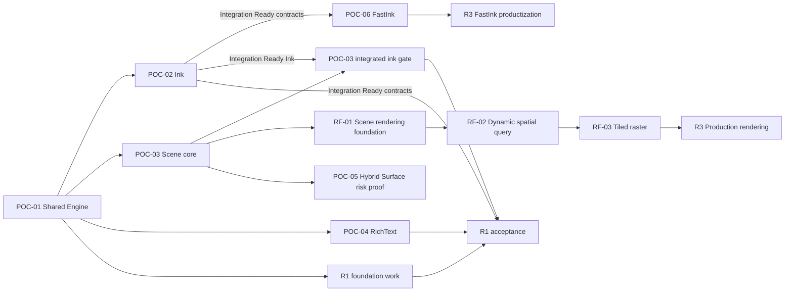

# Axiom 历史 POC/RF Evidence 与 R 里程碑工作包视图

> 状态：Historical Evidence and Milestone View；非 promotion 路线。当前历史状态：POC-01 /
> Accepted，POC-02 / Integration Ready / Validating，POC-03 / Validating（Windows Integrated
> D3D12 门禁可复现失败），POC-04 / Accepted，POC-05 / Accepted scoped risk proof。

> 2026-08-23 再基线：本文保留 POC/RF/R 工作包的历史设计、阈值和证据状态；唯一的产品
> promotion 顺序已改为 [AR-0 → G0～G9 → R5-B](AXIOM_GATES_AND_STAGES.md)。若本文的 Shell、
> Page topology、旧 Transaction 外层语义、产品对象或 POC-05/06 定位与新总路线冲突，以 ADR-0025
> 和新总路线为准；历史 POC 中的 transaction 仅保留为实验事实。
> 历史失败和量化阈值继续有效。任务与 Gate 状态只在
> [Gate Task Tracker](GATE_TASK_TRACKER.md) 维护；R1～R5 状态只在
> [R 里程碑状态表](R_MILESTONE_STATUS.md) 维护。

本文把工作包分为历史技术验证 POC-01～06、RF 参考输入和产品里程碑 R1～R5。编号不表达
产品晋级顺序；G0～G9 对这些工作包作 many-to-many 映射。下图只表达“某份历史结果曾为
哪份后续工作提供输入”的 Evidence lineage，不是现行任务依赖、启动条件或晋级图：

POC-02/03/04 的核心工作可在历史层面并行，但产品 Gate 仍按总路线晋级。POC-02 达到
`Integration Ready / Validating` 后可以提供实验性输入；不等于 G4 PASS。POC-05 的受控
Overlay 证据进入 G6 产品 contract；POC-only scene bridge 不成为稳定 C ABI。POC-06/Arc 是
G4/R3 硬需求，任何 backend 失败都必须进入 Canonical-only fallback。任何未通过 POC 的接口
都不能因并行开发或合并而被提前视为稳定产品契约。

每个性能结果必须记录设备、系统、编译器、构建模式、Skia commit/backend、场景版本、分辨率和采样方法。下文阈值是当前门禁；如基准设备变化，只能通过 ADR 修订。

## 历史工作包状态词

- `Not started`：没有形成阶段契约。
- `Designing`：接口、语料、基准和失败模式正在冻结。
- `Validating`：用可丢弃 POC 获取证据。
- `Implementing`：历史工作包曾使用的“产品实现进行中”状态；不解锁任何 Gate。
- `Accepted`：只表示该历史工作包在其声明范围内有重复证据；不等于 Gate 或 R 里程碑通过。
- `Rejected`：假设被推翻，必须 ADR 记录替代路线。

`Integration Ready` 不是新的终态，而是可与 `Validating` 并存的历史证据标签：表示已列明
内容可以成为后续 Gate 的输入，但尚未满足该 POC 的全部退出条件。它不等于 `Accepted`，
不冻结产品 ABI，不解锁 Gate，也不允许删除或降低剩余门禁。

# 第一层：技术验证

技术验证共享 ADR-0016 的数值/摘要契约，并从 POC common foundation 获得可注入的
deterministic clock、domain-separated seed/PRNG 与 task executor。所有 replay/generator
保存 algorithm version 与 seed；wall clock、平台随机源、线程调度和容器迭代顺序不得进入
semantic digest。ADR-0017～0019 分别在首次消费帧调度、输入队列和增量 Scene 的 POC 中
形成可执行 contract tests，而不是等到 R1 才首次定义。

## POC-01 — Shared Engine

### 目标

证明同一份单线程 C++20 Runtime 能在 Web/WASM、Windows、macOS、iOS、iPadOS 与 Android 上运行，并用 Skia Ganesh 绘制一致的最小语义场景。Apple 和 Android 的加入用于验证 Runtime 可移植性，不在 POC-01 冻结新的产品 Shell。

### 设计

- 定义最小 `CanvasRuntime` facade、opaque runtime/document/view handles 和 host callbacks。
- 定义 WASM API 与版本化 C ABI 的错误、字符串、数组、所有权和生命周期规则。
- 定义最小场景：外层 Product Page 对应的独立 Document context，以及 Rect/Shape、Image、
  VectorPath、只读 Text；Page 不是 Document 内的 ObjectKind。
- 定义固定坐标、颜色空间、DPI、资源、字体和逻辑摘要格式。
- 应用 ADR-0016 的 canonical binary32、finite-only、canonical zero、little-endian digest
  和 checked overflow；POC-01 继续使用固定 sRGB fixture，但不据此决定 V1 产品色彩范围。
- POC fixture 使用 Document 的 Page/World、View Logical 与 Device Pixel 显式元数据；这里的
  Page/World 是外层 Product Page 对应 Document 的坐标空间，不是 Document 内的 Page 节点。
  固定 DPR 1 只用于 POC-01 golden，不替代 ADR-0012 的长期坐标契约。
- 定义单线程 event loop：command → document → scene → frame。
- 定义 WebGL2、D3D12、Metal 和 Android GLES3 `PlatformSurfaceAdapter`；adapter 拥有 native surface/context 的 acquire/resize/present/recover，平台句柄不得进入通用 Runtime 或 `RenderTarget` 公共契约。
- 选择并登记 Windows/Web 基准设备与浏览器，作为 POC-01～03 性能基线；Apple/Android 记录验证设备但不替代该性能基线。

### 验证

- 同一 scene fixture 在 Web、Windows、macOS、iOS、iPadOS、Android 加载后，Document digest 必须逐字节一致。
- 使用同一打包字体、图片和 viewport 生成黄金图；至少 99.9% 像素的每通道差值 ≤ 2，其余差异必须有 diff 产物。
- create/move/delete 操作回放 10 次，digest 和 operation sequence 全部一致。
- 从两个独立空 Document 应用相同 create/move/delete sequence，最终 revision/sequence/
  digest 一致，证明 POC Core 由 Operation 驱动；本阶段不实现正式 DocumentSnapshot codec。
- x64、arm64、WASM 对 `-0/+0`、NaN/Infinity、极端 finite 值和 Operation apply checked
  overflow 的接受/拒绝结果一致；拒绝不产生部分修改。
- 连续创建/销毁 runtime、document、view 100 次，sanitizer/浏览器控制台无泄漏错误或 use-after-free。
- Release 构建连续渲染 1,000 节点 60 秒，不出现崩溃、无限增长和单帧 > 100 ms。
- Web 构建不得要求 SharedArrayBuffer、COOP/COEP 或 pthread。
- Apple runner 必须在 macOS、iPhone simulator 和 iPad simulator 分别完成 Metal render/readback；Android 必须通过 Native CanvasView/JNI 完成 render/readback，数据面不经过 JS。

### 实现

- 建立可丢弃的 C++20/Skia Ganesh POC target。
- 实现最小 Document、Operations、SceneCompiler 和 Renderer 直通链。
- 实现 Windows/D3D12、Web/WASM/WebGL2、macOS/iOS/iPadOS/Metal 与 Android Native CanvasView/JNI/GLES3 surface。
- 实现最小 C ABI、WASM exports、host callback 和结构化错误。
- 实现场景 fixture、逻辑 digest、操作回放和黄金图导出工具。

### 交付物

- Windows demo、Web demo、macOS runner、iOS/iPadOS universal runner、Android Native CanvasView demo 和相同场景资源。
- ABI/WASM 契约说明、运行脚本、构建环境锁定信息。
- Document digest、黄金图 diff、生命周期和 smoke 性能报告。
- POC-02 可复用的输入和 view/surface 边界。

### 退出条件

- [x] Web、Windows、macOS、iOS、iPadOS 与 Android 从干净环境构建成功。
- [x] 跨平台 Document digest 100% 一致。
- [x] 数值边界语料在 x64/arm64/WASM 上得到相同 canonical result/error 和 digest。
- [x] 独立空 Document 的相同 Operation replay 得到相同 revision/sequence/digest，且没有
  Shell/Scene 直接修改 Document 的旁路。
- [x] 黄金图达到 99.9%/通道差值 2 门禁。
- [x] 100 次生命周期测试和 60 秒 smoke 测试通过。
- [x] Runtime 内没有平台 UI、pthread 或产品业务依赖。

## POC-02 — Ink Engine

> 当前结论：**Integration Ready / Validating**。其已列明输出可作为 G4/G5 的实验输入；
> 延迟、正式真机 Human Ink Gate 和联合规模性能仍是 Pending，不因分支合并而视为通过，
> 也不解锁任何 Gate 或 R 里程碑。

### 目标

证明独立 InkEngine 能消费批量历史点，生成 Vector/Dab 笔迹，并同时驱动低延迟 Preview 与稳定 Canonical Stroke。这是完成 POC-01 后的最高优先级。

### 设计

- 冻结 `PointerSample`、`PointerSampleBatch`、device capability 和单调 timestamp 契约。
- 定义 resample、smooth、pressure mapping、prediction 和 prediction rollback 次序。
- 应用 ADR-0016 的 canonical binary32、finite-only、canonical zero、checked overflow 和
  算法精度/舍入契约；POC common foundation 提前提供 deterministic clock、domain-separated
  seed/PRNG 和 task executor，不等待 R1。
- 定义 `StrokeSession` 的 begin/push/end/cancel、Stroke ID 和 brush descriptor。
- 定义版本化 `BrushDescriptor`：brush type/version、semantic parameters、资源身份与跨平台 replay/升级规则。
- 为 Dab/texture brush 定义版本化 PRNG 与按 algorithm/brush-version/StrokeId/stream 分域的
  seed；禁止 wall clock/全局 random 影响 Canonical Stroke。
- 决定 Vector/Dab Canonical Stroke 为长期重放需要保存的稳定表示：中心线/语义参数、版本化算法输入、稳定 geometry/dabs 的组合，以及未知 brush version 的拒绝/迁移策略。
- 定义 `push()` 增量 Canonical candidate 与 `end()` 原子 Document commit 的边界，避免长笔迹抬笔时集中计算。
- 定义 VectorStroke 的语义中心线与 DabStroke 的 dab/纹理参数。
- 定义 Preview/Canonical 共享数据、差异容差、抬笔交接和失败 fallback。
- 定义版本化 `PreviewStrokeUpdate`：confirmed/predicted 表示、revision、坐标空间和 replace/truncate 语义；平台 Preview sink 不重新解释 raw samples。
- 定义 `DefaultPreviewSink`，使用普通 Skia Canvas overlay 验证 Preview Model，不依赖 POC-06 平台低延迟 surface。
- 定义输入录制格式和设备无关回放语料。
- 定义 View Logical→Page/World 输入逆变换、ViewId/viewport revision 绑定，以及 zoom/pan/DPR 变化时的 batch 规则。
- 按 ADR-0018 定义 confirmed-input queue、兼容 batch 合并、Preview revision coalescing、
  predicted-tail replacement、容量/字节/age 上限和 `InputOverrun` 原子取消。
- 按 ADR-0017 定义 frame invalidation 与平台 VSync scheduler 边界；input、Preview 和 render
  cadence 解耦，Canonical handoff 使用 visible acknowledgement。
- 冻结 pen/touch/hover/barrel/eraser-tip/palm capability taxonomy 与 Platform/InputRouter
  arbitration ownership；只冻结 whole-stroke/segment/pixel-dab Eraser 扩展边界，不扩大
  POC-02 最小实现范围。

### 验证

- 回放鼠标、120/240 Hz 笔输入、批量历史点、pressure 缺失、时间戳间隙和 cancel 语料。
- 60 秒 240 Hz 输入流不得丢失、重复或重排已确认 sample。
- 覆盖 32+ historical sample burst、慢 Preview/render consumer、暂停/恢复与容量边界；成功
  Stroke 的 confirmed samples 100% 完整、queue age 不随书写时长增长，过载只允许明确
  `InputOverrun` 且 Document 无部分 Stroke。
- 同一录制在 Windows/Web 重放后，Canonical Stroke digest 100% 一致。
- Pointer replay 产生 Canonical AddStroke Operation；在新的空 Document 中重放后 Stroke/
  Document digest 与原路径一致，InkEngine 不直接修改 Scene 或 Document internals。
- x64、arm64、WASM 覆盖 `-0/+0`、subnormal、舍入边界、非有限值、极端坐标和矩阵溢出；
  semantic digest 逐字节一致，非法输入整笔拒绝。
- Vector/Dab 各覆盖直线、急转、慢写、快速长划和压力渐变黄金图。
- 基准设备上 input sample 到 Preview 可见的 absolute baseline 为 p95 ≤ 16.7 ms、p99 ≤
  33.3 ms；同时记录 refresh rate、display intervals、sample-to-visible frame count、p50/p95/
  p99/max 和 missed presentation。高刷设备另以 frame count/Human Ink Gate 判断，不把
  16.7 ms 宣称为所有设备的一帧目标。
- Pointer up 到 Canonical 接管不超过 2 帧，期间没有空白帧或重复深色叠加。
- prediction 错误时 Preview 能回退，Canonical 不包含未确认预测点。
- 30 秒长笔迹在 pointer up 后的 Canonical commit p95 ≤ 16.7 ms；主要 geometry/dab 处理必须在 push 阶段增量完成。
- DPR 1/1.25/1.5/2/3、非整数 zoom、pan 与 viewport revision 变化语料中，Pointer replay 的 world-space Canonical digest 一致，失效/不可逆 transform 明确拒绝。
- BrushDescriptor version/resource 改变必须影响 Stroke digest；未知必需 brush version 明确拒绝，不能静默用当前算法重绘。
- 相同 replay/seed 的 Dab variation 和 Preview revision 序列完全一致；改变 algorithm、brush
  version、StrokeId 或 stream domain 必须得到可解释且互不耦合的随机流。
- burst frame invalidation 只保留有界 callback；resize/background/device loss 后旧 target
  generation 不 present，最新 Stroke revision 最终可见。
- 在 Windows/Web/Android 代表性实机输入环境运行 Human Ink Gate：慢写、快速长划、急转、画圈、压力渐变和连续书写；主观评分必须关联同次 trace、frame pacing、prediction correction 与 handoff 证据，不能替代量化门禁。

### 实现

- 实现平台 batch 适配、InputRouter 和输入录制/回放。
- 实现有界 input/Preview queues、revision coalescing、backpressure/overrun 诊断和测试用
  PlatformFrameScheduler；不在 POC 中固定最终产品线程拓扑。
- 实现独立 InkEngine、StrokeSession、resampler、smoother 和 predictor。
- 实现增量 Canonical candidate builder 和版本化 BrushDescriptor dispatch。
- 实现 deterministic clock/seed/PRNG POC foundation 与 Dab 随机流版本分发。
- 实现 Vector Brush 与 Dab Brush 的最小语义和渲染。
- 实现 `PreviewStrokeUpdate`、`DefaultPreviewSink`、Active/Preview overlay、Canonical operation 和 handoff 状态机。
- 实现 AddStroke Operation replay harness；不为该测试引入正式 operation log、Snapshot codec
  或 collaboration protocol。
- 输出 input/processing/render 分段耗时、sample 数和 prediction 诊断。
- 实现可加载录制语料并支持真实笔连续书写的 Canvas Ink Playground。

### 交付物

- Pointer/Stroke 接口规范和行为状态图。
- 数值/随机确定性、输入背压/coalescing、frame invalidation/VSync 与 device arbitration 契约。
- 坐标/viewport replay、BrushDescriptor registry/version 和 Canonical incremental processing 规范。
- 输入语料、Vector/Dab 黄金图与 digest 工具。
- AddStroke Operation 的空 Document replay 语料与 digest 报告。
- 延迟追踪、handoff 录屏/帧序列和压力曲线报告。
- Windows/Web/Android Human Ink Gate 报告，包含固定动作 rubric、设备/笔/刷新率、体验结论和关联 trace。
- POC-06 使用的 FastInkBridge 上游契约。

### 退出条件

- [ ] 240 Hz/60 秒样本完整性测试通过。
- [ ] Canonical Stroke digest 跨平台完全一致。
- [ ] Pointer→AddStroke→Document 与空 Document replay 得到相同 Stroke/Document digest。
- [ ] Preview p95/p99 延迟达到 16.7/33.3 ms。
- [ ] 延迟报告同时包含毫秒、刷新率、frame intervals、sample-to-visible frame count 和 queue age；高刷体验没有被 60 Hz baseline 掩盖。
- [ ] 所有 handoff/cancel/prediction 语料无空白和 Document 污染。
- [ ] Web、Windows RNW、Android RN、iOS/iPadOS RN Human Ink Gate 已在代表性设备完成，无未分类
  的书写中断、明显抖动或 handoff 缺陷；所有主观问题均能关联 trace/录屏。
- [ ] Stroke 模型没有退化为只保存 `SkPath` 或 bitmap。
- [ ] 长笔迹没有 pointer-up 集中计算尖峰；BrushDescriptor 与坐标/viewport 语料通过确定性门禁。
- [ ] 数值边界、deterministic PRNG、burst/backpressure、过载取消和过期 frame generation 语料全部通过。

## POC-03 — 100K Scene

### 目标

证明 Semantic Document、RuntimeScene 和 Renderer 分层在 100K 节点下保持正确、可重建、
可观测，并为后续生产渲染路线提供基线。POC-03 是基础 scene/correctness、跨端效果和
集成 Ink 验证，不是生产级 R-tree、分层 Tile/LOD 或 raster scheduler 的完成证明。Windows
D3D12 Integrated Playground 的真实设备门禁失败必须保留为架构风险证据，不能通过降低门禁
或将结果归因于机器性能而关闭。当前数值、环境和 bundle identity 见
[2026-08-19 Windows/Web Integrated evidence](../quality/evidence/poc03/integrated-windows-web-physical-20260819.md)。

### 设计

- 定义 100K 可重复场景生成器：混合 Shape、Image、VectorPath、POC-01 read-only/simple Text render record 和 Stroke；不实现 POC-04 RichText layout/editing。
- 定义 Document records 与 SoA RuntimeScene records 的映射。
- 定义自己的 `Scene` facade 与 `SceneBinding`，内部 RenderScene 可在后续接入 SkSG Render
  DAG；SkSG 类型不进入 Document、Bridge 或 Shell。
- 定义 full compile、incremental ChangeSet、revision 和失效规则。
- 按 ADR-0019 将 `SemanticChanges` 与可丢弃/可重算的 `InvalidationHints` 分离；过期、冲突
  或缺失 hints 必须扩大失效或回退 full compile。
- 定义共享 RuntimeScene 与单视口 `ViewQuery/FrameState` 的边界；visible set、LOD、scale bucket 和 screen-space damage 不进入共享 Scene。
- 定义 `FrameBuilder` 如何合并 RuntimeScene、FrameState、Editor/Presence overlays、Active Preview 和 ExternalSurface placement。
- 定义 Background/Content/Ink/Overlay/Selection/HUD logical passes，并只预留 empty/reserved
  ExternalSurface pass contract；backend 可在依赖/视觉等价时 merge、elide、reuse，placement、
  registry、focus 与 lifecycle 语义归 POC-05。
- 定义 L1 Raster/Tile cache key、预算、淘汰、失效和设备丢失路径。
- 只冻结 `ISpatialIndex`、`DamageTracker`、`TileKey`/`TileManager`/`IRasterSource` 的实验性
  边界；POC-03 使用 deterministic Linear/Uniform Grid 和 direct Skia。动态 R-tree、
  TileGrid/TilingSet/LOD、prefetch、raster task scheduler、memory budget/eviction 归入
  后续 RF-01～RF-03，不在本阶段伪造生产结论。
- 定义 RuntimeScene/HitTest geometry query 与 Editor SelectionPolicy/SnapEngine 的边界；SceneCompiler 不知道当前 Tool。
- 使用 POC common deterministic seed/clock 生成 100K fixture；按 ADR-0017 验证每 View
  frame invalidation、VSync callback、target generation 与多视口调度隔离。

### 验证

- 场景固定为 100K 总节点、典型 viewport ≤ 5K 候选节点，并包含局部和大范围更新。
- full compile 与任意合法增量序列在同 revision 下的 scene digest、bounds 和 hit-test 结果 100% 一致。
- 使用正确、空、扩大、过期和损坏 hints 分别增量编译；结果均与 full compile 等价，错误
  hints 只允许诊断/性能退化。
- 平移/缩放 60 秒：基准 Windows absolute p95 ≤ 16.7 ms、p99 ≤ 33.3 ms；Web p95 ≤
  20 ms、p99 ≤ 40 ms；同时报告 refresh rate、frame intervals、missed presentation 与
  frame p50/p95/p99/max，不把 60 Hz 阈值解释为高刷设备体验目标。
- Web 峰值线性内存 ≤ 512 MiB，Windows Runtime/scene/cache 峰值 ≤ 768 MiB；资源原图单独统计。
- 单节点属性更新不得遍历全部 100K 节点；诊断中受影响 records 与 dirty area 可见。
- 清空 L1、改变 scale bucket、resize 和模拟 device loss 后，画面可重建且 Document digest 不变。
- 主视口与 minimap/第二视口同时查询时，不复制第二份 Document。
- 两个 Viewport 使用不同 pan/zoom/DPR 时，visible set、screen damage、HitTest 和 cache key 互不污染；world→view→device 结果符合 ADR-0012。
- burst invalidation、多 View、resize、background 和 device loss 下 callback 数量有界，旧
  generation 不 present，最新 revision 最终可见。
- Scene generator 相同 seed 在 x64/arm64/WASM 产生相同 canonical fixture/digest；wall clock
  和容器迭代顺序不影响结果。
- 在集成性能 Playground 分别加载 1K/10K/50K/100K objects，执行 pan、zoom、write、select 和 drag；Windows/Web 保持硬基准，Android 至少提交一台代表性真机的 frame/input/memory 与人工体验报告。
- 记录 Windows D3D12、WebGL2 和 Android 真机在每档的候选数、dirty area、render/submit、
  presentation、memory category 和 warm-up；性能失败必须关联到下一阶段的索引、damage、
  tiling 或调度假设，而不是删除语料。

### 实现

- 实现 Document→RuntimeScene 的 full/incremental SceneCompiler POC。
- 实现 SoA records、SpatialIndex、共享 world-space invalidation、单视口 ViewQuery/FrameState 和 hit-test。
- 实现最小 Render Tree、FrameBuilder、FrameGraph passes 和 Compositor。
- 实现测试用 PlatformFrameScheduler/invalidation 契约、logical-pass merge/elide 诊断和
  HitTest query primitives；SelectionPolicy/SnapEngine 仅实现足以验证边界的 harness。
- 实现 L1 Raster/Tile cache 原型和严格 cache key。
- 实现场景生成器、frame trace、内存统计、scene digest 和增量差分测试。
- 将 POC-02 Ink Playground 接入 1K/10K/50K/100K 场景，形成 Integrated Performance Playground。
- 集成层直接链接 POC-02 InkEngine：历史 Stroke 与实时 Vector/Dab write 均走
  `PointerSampleBatch → InputRouter/StrokeSession → AddStrokeOperation`；POC-03
  只保存 Stroke resource ID/bounds/revision，Preview 复用 POC-02 renderer，
  Canonical visible acknowledgement 必须晚于成功呈现。

### 交付物

- 100K scene fixture/generator 与参数说明。
- SceneCompiler、ViewQuery/FrameState、FrameBuilder、FrameGraph 和 cache interface 规范。
- ChangeSet semantic/hints、frame scheduler、HitTest/Selection/Snap boundary 规范。
- Windows/Web 帧时间、内存、dirty/cull 和 cache 报告。
- Android 代表性真机集成性能/体验报告，以及 1K～100K 交互场景 bundle。
- full/incremental 等价性语料及失败最小化工具。

### 退出条件

- [ ] 100K 场景 full/incremental 等价性全部通过。
- [ ] Windows/Web 达到各自 p95/p99 帧时间门禁。
- [ ] 若 Windows/Web 物理门禁未通过，必须保留失败证据并将 POC-03 保持 `Validating`；不得
  以 host/headless 或单次有界复测替代重复物理设备结果。
- [ ] 内存保持在 768/512 MiB 上限内且 60 秒无持续增长。
- [ ] 单节点更新没有全量遍历或全屏无条件失效。
- [ ] 空/错误/过期 InvalidationHints 不改变 Scene 正确性；logical pass 优化不改变视觉结果。
- [ ] device loss/cache clear 可完整恢复。
- [ ] 多 View frame scheduling、target generation 和 deterministic scene generator 语料通过。
- [ ] Integrated Performance Playground 完成 Web、Windows RNW、Android RN、iOS/iPadOS RN 评审；
  Android 真机不存在未分类的输入中断、交互冻结或内存无界增长。
- [ ] Windows、Chrome Stable Web、Pixel 7 在 1K/10K/50K/100K 完成 pan/zoom/write/select/drag 证据；普通节点 drag 不伪造 MoveStroke。
- [ ] POC-03 未提前实现 RichText 编辑或 ExternalSurface placement；仅 simple Text 和 reserved pass 进入 Scene POC。

### 与 POC-03 有 Evidence lineage 的生产渲染基础（不改变 POC 编号）

POC-03 完成基础验证后，按 [ADR-0021](../adr/0021-render-scene-spatial-index-tiling-boundaries.md)
进入三个可独立审查的渲染基础工作包。它们是 R3 前的必要技术准备，不把 POC-03 的 direct
Skia baseline 误称为生产方案：

| 工作包 | 设计项 | 验证语料 | 实现项 | 交付物 | 退出条件 |
| --- | --- | --- | --- | --- | --- |
| RF-01 Scene rendering foundation | `Scene` facade、SceneBinding、RenderScene/SkSG 私有边界、DamageTracker API、两阶段 HitTest、shadow participant contract | SkSG 类型隔离、full/incremental 等价、damage fault injection、负坐标/退化 bounds、candidate 顺序扰动、双 participant observable 等价 | SkSGRenderScene adapter、ShadowRenderScene orchestration、world-space DamageSet、candidate→precise hit pipeline | 模块依赖图、RenderScene contract、damage trace、shadow mismatch report | Document/Bridge/Shell 不依赖 SkSG；damage 可重建且不进入 digest；RF01-0/1 已验证，RF01-2/3/4/5 correctness baseline 为 `Validating`；真实 SkSG SDK、局部 participant 性能、平台 present 接入和真实 geometry 仍 Pending |
| RF-02 Dynamic spatial query | `ISpatialIndex` 动态 insert/remove/update/query、viewport culling、Selection/Eraser 查询 | brute-force oracle、20 万次随机增删改、负坐标、局部更新扫描量和命中顺序 | DynamicRTreeSpatialIndex、索引诊断和迁移 fallback | R-tree/Hybrid 评估报告、查询基准和失败缩减语料 | 结果逐字节等价；局部操作不全量扫描；内存和退化策略有界 |
| RF-03 Tiled raster and scheduling | TileGrid、TilingSet/LOD、TilePriority、IRasterSource、TileManager、RasterTaskScheduler、MemoryBudget/Eviction | 1K～100K 多 zoom/pan、prefetch/取消、cache clear、device loss、内存压力、负世界坐标 | 分层 Tile renderer、raster task queue、prefetch 和可观测 eviction | Tile/LOD 设计 ADR、frame/memory/raster trace、R3 迁移报告 | visible tile 及时可用；不出现无界增长；清缓存/设备丢失后 digest 与视觉恢复；固定 Windows/Web 门禁重新通过 |

RF-01～RF-03 只允许在证据完整后接入 R3 Production Rendering。POC-03 的 `Validating`
状态、Windows 失败和 Android/Web 观察值继续按本阶段报告保留。

RF-01 的可实现接口、prepare→commit 原子更新、revisioned DamageTracker、两阶段 HitTest、
Direct/SkSG shadow migration、POC-03 类型映射、分批实施与量化退出条件见
[RF-01 Scene Rendering Foundation](../architecture/RF01_SCENE_RENDERING_FOUNDATION.md)。该
设计不修改 Runtime Public C ABI；RF-02/RF-03 必须复用其 Scene/participant contract，不能
为了具体 R-tree 或 Tile 算法让 Shell、Bridge 或 Document 依赖 Skia/SkSG。

## POC-04 — RichText / IME

### 目标

证明 RichText 是可跨平台共享的一级模型，并在 Web、Windows、Android、
macOS、iOS 和 iPadOS 上完成统一的真实 IME 编辑闭环。POC-04 只有一个
阶段状态；canonical Runtime 与 native IME 是两条互补证据轨道，不拆成
独立的 Apple 子 POC。

### 设计

- 定义 TextDocument 的 paragraph、run、style、attribute 和 logical positions。
- 定义 TextEditSession 的 selection、caret、composition、undo grouping 和焦点生命周期。
- 定义 TextInputAdapter 的 begin/update/commit/cancel composition 与 surrounding-text 契约。
- 定义 TextLayout/SkParagraph、字体解析、固定测试字体和 fallback 规则。
- 定义 canonical `FontResourceId`、ContentHash、规范化 fallback chain、missing font 和系统字体隔离规则；测试固定字体只是 oracle，不是产品字体模型。
- 定义文本 operation 与 V1 Collaboration MVP 的原子边界。
- 定义 Shell UI、平台 IME 和 Runtime 的所有权，禁止平台复制 TextDocument。

### 验证

- Web、Windows、Android 运行同一 canonical 行为矩阵：英文、简体中文、中文拼音、换行、混合 runs、selection、caret、clipboard、undo/redo。
- Web、Windows、Android、macOS、iOS、iPadOS 分别提交真实 native IME 回调、组合/提交/取消、最终文本、selection/caret 和 view 生命周期证据；平台回调名称不要求相同。
- composition cancel 不产生 Operation；commit 只产生一次可回放 Text Operation。
- 同一已提交编辑序列的 TextDocument digest 在 Web/Windows/Android canonical 轨道 100% 一致；Apple 设备提交独立 digest 证据。
- 使用固定字体时，layout line/cluster/selection geometry 与黄金数据一致；允许的像素差异按黄金图门禁处理。
- 同一 FontResourceId/ContentHash/fallback chain 在 Web/Windows/Android 产生相同 canonical shaping、换行、caret 与 selection geometry；系统安装字体差异不能改变结果。
- font missing、hash mismatch、fallback 缺失和资源替换有确定 placeholder/diagnostic、layout invalidation 与 Document digest 变化。
- 10K 字符文档中的普通输入和 caret 移动 p95 ≤ 16.7 ms；全量 layout p95 ≤ 33.3 ms。
- 连续 focus/unfocus、切换节点和销毁 view 100 次，无残留 composition 或崩溃。

### 实现

- 实现 TextDocument、TextEditSession、Text operations 和 undo grouping POC。
- 实现 SkParagraph TextLayout 与固定字体资源。
- 实现 FontResourceId→verified blob→typeface 的 ResourceResolver 路径和规范化 fallback chain。
- 实现 Web、Windows、Android TextInputAdapter；Android IME 走 Native CanvasView/JNI，不走 RN JS 文本数据面。
- 实现 text behavior recorder、layout dump 和 selection geometry debug overlay。

### 交付物

- RichText schema、logical position 和 IME 状态机规范。
- Font identity/fallback/missing-resource 规范和跨平台字体 conformance corpus。
- 六平台 demo/adapter、canonical 行为语料、native IME、layout/golden 结果。
- 输入/布局延迟和生命周期报告。
- 协作文本原子边界的待决 ADR 输入。

### 退出条件

- [x] Web/Windows/Android canonical 行为矩阵 100% 通过。
- [x] Web/Windows/Android/macOS/iOS/iPadOS native IME 真实回调和生命周期证据齐全。
- [x] 至少一条受控中文输入流程（`ni hao` → `你好` 或等价候选流）在每个纳入平台产生最终提交文本和 Runtime digest；随机候选或合成 C++ 调用不计入。
- [x] Web/Windows/Android canonical TextDocument digest 完全一致，Apple 设备提交 digest 与状态证据。
- [x] cancel/commit/undo 没有重复或部分 Operation。
- [x] 10K 字符输入与布局达到 16.7/33.3 ms 门禁；托管 Android 模拟器的绝对时间仅观察，Pixel 7 承担产品阈值门禁。
- [x] RichText 模型不依赖任何平台 widget 或 JS 数据模型。
- [x] Canonical layout 不依赖未声明的系统字体；FontResourceId/ContentHash/fallback 语料全部通过。

## POC-05 — Hybrid Surface

### 目标

证明 WebView/Video 等外部内容可以通过受控 Overlay 与 Native/WASM Canvas 共存，而不破坏
RuntimeScene、输入和 z-order 边界。本 POC 是 architecture risk proof；它为 G6/R3 重新建立
ExternalSurface/Video/Embed 的产品 contract 提供证据，但 POC-only scene bridge 不直接晋升为
稳定 ABI 或完整产品 schema。任意 DOM/native 穿插、zero-copy texture 和复杂 mask/effect 仍不在
当前承诺内。跨 Web、Windows RNW、Android RN、iOS/iPadOS RN/Fabric 的证据已在
[POC-05 收敛报告](../evidence/poc05/consolidated-validation-20260820.md) 中完成。

### 设计

- 定义 ExternalSurface semantic placeholder、surface ID、bounds、clip、opacity 和 lifecycle。
- 定义 RuntimeScene `ExternalSurfaceId` 与平台 `ExternalSurfaceRegistry` 的映射；native handle 不进入 RuntimeScene、FrameState 或 frame plan。
- 定义 FrameGraph 中 ExternalSurface pass 与平台 overlay placement。
- 定义 DOM/native canvas、RN native view 和 WebView2/Windows native overlay 的固定 z-order 规则。
- 定义移动、缩放、滚动、隐藏、页面切换、前后台和销毁行为。
- 明确首版不支持 texture import、zero-copy、复杂 mask/effect 和任意节点间 DOM 插入。

### 验证

- WebView 与 Video 分别覆盖创建、移动、缩放、裁剪、遮挡、隐藏、切页和销毁。
- overlay placement 与 RuntimeScene 目标矩形误差 ≤ 1 device pixel。
- 连续 pan/zoom 时 overlay 更新不晚于 canonical canvas 2 帧。
- 100 次创建/销毁后，surface 数归零且进程内存相对稳定值增长 < 5%。
- 非法 z-order、surface 加载失败和宿主进程/页面异常有明确 placeholder 与恢复路径。
- Pointer/keyboard focus 在 Canvas 与 external surface 间切换时无循环转发或输入丢失。

### 实现

- 实现 ExternalSurface placeholder 和 overlay placement command POC。
- 在 Web、Windows RNW、Android RN 和 Apple RN/Fabric 选择代表性平台至少各接入一个 WebView/Video surface。
- 实现 lifecycle adapter、clip/bounds 同步、focus handoff 和失败 placeholder。
- 实现 overlay debug bounds、surface leak counter 和 placement trace。

### 交付物

- Hybrid Surface 契约和 z-order 限制说明。
- 四类 Shell（Web、Windows RNW、Android RN、Apple RN/Fabric）overlay demo、生命周期语料和 placement diff。
- 资源/内存报告和 future texture-import 风险清单。

### 退出条件

- [x] Web、Windows RNW、Android RN 和 Apple RN/Fabric 的 placement/overlay 证据通过；各平台报告保留其测量方式和适配器边界。
- [x] Web 100 次 lifecycle 及 native runner lifecycle corpus 通过；平台报告记录 surface 计数、失败恢复和资源生命周期。
- [x] focus/input/failure 语料在各平台 adapter 的实际范围内通过；WebView 内单指输入归 WebView 所有，Canvas 双指手势由 native owner 接管。
- [x] 产品架构接受“受控 Overlay、不任意穿插”的限制。
- [x] POC 结果冻结受控 Overlay 的证据边界，并作为 G6/R3 产品 contract 的输入；POC-only
  scene bridge 未进入稳定 ABI。任意 DOM/native 穿插、zero-copy texture 和复杂 mask/effect
  仍明确排除，不能由本报告推导出未验证的产品能力。

## POC-06 — FastInk / Arc

### 目标

证明 Arc 可以作为可抽取的 input-to-display 模块，在 Web、Windows RNW、Android RN、iOS/iPadOS
RN 四类产品目标上通过独立 Preview Presentation Target 消费同一 Stroke 语义，并与 Canonical
Renderer 独立演进。macOS 只保留共享 Core/Metal/Web-reuse conformance，不形成 native 产品
发布目标；ChromiumOS 复用 Web，Headless 作为协议与回放 oracle。普通应用路线必须可用，设备级
Direct Plane 作为条件式预研。

### 设计

- 接受 ADR-0024，冻结 `Arc::Protocol`、`Arc::Core`、Platform Host composition root 与可独立抽取的 target/namespace 边界。
- 冻结 Canonical 与 Preview 各自独占 presentable target ownership；允许经 Host capability 共享 device/queue，但禁止共享 backbuffer ownership。
- 将 POC-02 共享 Preview Model 适配为版本化 C/POD 协议；固定宽度类型、`struct_size + abi_version/schema_version`、坐标空间、viewport transform/revision、DPR、target generation 和调用期 buffer lifetime。
- 冻结可靠控制面 `begin/push/sealInput/canonicalCommitted/canonicalVisible/cancel`，以及 matching HandoffToken 后 retire 的多 Stroke 状态机；duplicate 幂等、stale/reordered ack 不得误清 Preview。
- 保持 POC-02 Preview Model 不变；Arc backend 只负责低延迟显示，不重新实现 smooth/prediction/brush。Preview 数据面可有界合并，lifecycle/handoff 控制面不可丢弃。
- 冻结错误域：Arc presentation failure 关闭 Preview 或切换内部 no-preview/null backend，并使
  产品可见结果进入 Canonical-only rendering；不能取消 confirmed input、阻断 Document commit
  或改变最终 digest。
- 为 Web、Windows RNW、Android RN、iOS/iPadOS RN 定义产品 Arc 实现；ChromiumOS 复用 Web，
  Headless 提供协议/回放/fuzz/null backend。macOS 仅在共享 ABI 或 Metal/Web-reuse 变更时运行
  可选 conformance，不作为 native 产品 target 或发布门禁。设备分轨定义可选 RawInputSource、
  Arc Service、PreviewStrokeRenderer、ScanoutBuffer、DisplayPlane 边界。
- 定义 presentation receipt 的证据等级，区分 render complete、GPU submit、present accepted、compositor visible 和光电 input-to-photon；不得用前者冒充后者。

### 验证

- 四类产品目标、macOS conformance、Web reuse 和 Headless 使用相同 Pointer/Stroke 语料验证
  lifecycle、Stroke ID、Preview revision、HandoffToken、generation 和最终 digest；Headless 是
  确定性协议 oracle。
- Default 与 Arc sink 消费相同 replay 后的控制事件和 confirmed/predicted revision 序列一致；backend 没有第二套 Stroke 算法。
- Tier A 基准设备上 Preview absolute p95 ≤ 16.7 ms、p99 ≤ 33.3 ms，同时记录 refresh rate、sample-to-visible frame count、missed presentation、queue age 和 evidence level。
- Canonical 接管不超过 2 帧，无空白、双重加深、残影或位置跳变超过 1 device pixel。
- 覆盖 duplicate/reordered/stale ack、慢 consumer、queue overrun、多指交错、快速连续笔、cancel、resize、app background、surface/device loss 和 generation replacement；只允许 Arc 降级，不丢最终 Stroke。
- Web A/B 验证 normal WebGL2 与 `desynchronized`，高频输入走薄 JS adapter、`pointerrawupdate`/fallback 与 coalesced batch，不进入 React state，不强制 Worker/SAB。
- Windows 使用 WM_POINTER/history 与独立 D3D/DXGI/DirectComposition Preview target；Android 使用 MotionEvent/history→Native CanvasView→JNI 与 low-latency target，证明不经过 RN JS。
- iOS/iPadOS RN 分别完成 Native/coalesced input、Metal Preview target、生命周期和代表设备
  conformance；macOS 只完成共享 Core/Metal/Web-reuse conformance，不设 native 产品门禁。Apple
  prediction 只能作为 InkEngine hint，不能由 backend 直接产生另一套 Preview。
- ChromiumOS 通过 Web reuse conformance 与 optional system capability fallback；Headless 完成 state-machine/replay/fuzz/null-backend。
- 若具备自有设备/BSP，额外测量 raw input → scanout 光电延迟、plane 生命周期和系统回退；结果不作为普通应用 R1 阻断项。

### 实现

- 在顶层 `arc/` 实现可 standalone configure/build/install 的 `Arc::Protocol`、`Arc::Core`、Null/fallback、诊断和 external-consumer smoke；在 `pocs/fastink/` 实现 POC-06 harness 与报告。
- 实现 per-Stroke 幂等状态机、可靠控制面、有界可合并数据面、HandoffToken、presentation receipt、错误隔离和 backend capability query。
- 实现 Web、Windows RNW、Android RN、iOS/iPadOS RN、ChromiumOS Web reuse 与 Headless backend；
  macOS 仅实现共享 Core/Metal/Web-reuse conformance harness。Web/Android 可以与 Host 聚合成单
  WASM/`.so`，不强制动态库边界。
- 为 POC-02 Preview Model 实现 protocol adapter；presentation error 由 Arc Bridge 吸收，不能反向成为 Ink/Document error。
- 实现 Canonical/Preview 独立 target ownership 与 lifecycle trace；平台公共头之外不得泄漏 native/GPU 类型。
- 条件式设备 POC 使用 `Raw Input → service → Skia Raster/GPU → DMA-BUF/GBM → DRM atomic overlay`，不把设备类型泄漏到 Runtime。

### 交付物

- Arc Protocol/API、依赖图、presentation ownership、时序图、capability、receipt 与 fallback 规范。
- 可独立消费的 Arc targets、全平台 backend/harness 和 dependency-boundary 检查。
- Web、Windows RNW、Android RN、iOS/iPadOS RN 的 latency/handoff/failure 真机报告；macOS
  shared Core/Metal/Web-reuse conformance 报告；ChromiumOS reuse 与 Headless 自动化报告。
- 普通应用 backend demo；条件满足时附设备级研究报告与原型。
- R3 产品级 Arc preview backend 的输入契约。

### 退出条件

- [ ] Web、Windows RNW、Android RN、iOS/iPadOS RN Preview 延迟达到 16.7/33.3 ms 门禁。
- [ ] 各产品目标的延迟报告同时包含毫秒、刷新率、frame count、missed presentation、queue age
  和 evidence level；高刷体验通过 Human Ink Gate。
- [ ] handoff ≤ 2 帧且视觉/位置门禁通过。
- [ ] 所有 fallback 语料保留 Canonical Stroke。
- [ ] Web、Windows RNW、Android RN、iOS/iPadOS RN、ChromiumOS reuse 和 Headless 均有可构建
  Arc 实现；macOS shared Core/Metal/Web-reuse conformance 完成。macOS 不产生 native 产品
  发布门禁。
- [ ] Arc 可独立 configure/build/test，external consumer 只链接 namespaced target；平台依赖没有进入通用 Document/Scene/Renderer。
- [ ] Canonical 与 Preview 不共享 presentable backbuffer ownership，presentation failure 不能传播为 Canonical failure。
- [ ] Default 与 FastInk sink 消费同一 Preview replay 后的 confirmed/predicted revision 序列一致，平台没有第二套 Stroke 算法。
- [ ] 多 Stroke handoff、乱序/重复/旧 generation ack、快速连续笔和多指语料均无误清、卡死、丢线或部分 Document。
- [ ] 设备级研究不属于普通应用 Gate 的适用退出条件时，Gate Report 必须写
  `not_applicable` 及理由；不能用本条表达对 R1 或任何 Gate 的解锁。

# R1～R5 产品里程碑历史说明

以下 R1～R5 章节保存设计意图、语料和既有阈值，不构成第二条产品执行路线。每个 R 的实际
接受都必须先满足 [唯一 Gate 路线](AXIOM_GATES_AND_STAGES.md) 中映射的全部必需任务、跨任务
集成测试和里程碑退出条件，并在 [R 里程碑状态表](R_MILESTONE_STATUS.md) 记录 Evidence。

## R1 — Runtime Foundation

### 目标

建立由 G0～G3 贡献的可维护 Runtime Foundation：工程、验证基础、Semantic Kernel、
RuntimeScene 和最小 canonical Canvas 纵切面。Ink/Arc 的产品行为由 G4 验收，RichText/IME
产品行为由 G6 验收；R1 不因复用 POC-02/04 而提前验收它们。POC bridge 不能升级为产品 ABI。

### 设计

- 冻结 core module 依赖图、公开 facade、CMake targets 和 third-party policy，包括 render、View/Frame、
  Resources 与 Persistence ports 的独立边界；具体 LocalStore、journal/checkpoint、Blob 和 Sync
  物理实现由 Shared Data Runtime 负责，不归 Axiom Core 所有。
- 以 [Runtime Public C API Contract](../api/RUNTIME_C_API_CONTRACT.md) 和
  [规范性 v1 header](../api/canvas_runtime_api_v1.h) 冻结 WASM/C ABI/JNI 的 symbol、
  generation handle domain、`struct_size + abi_version`、count/stride、capability、borrowed
  callback、single-owner thread、caller buffer、错误和生命周期模型；POC `canvas_poc_*`
  不得直接升级为产品 ABI。
- 冻结 Application API、PointerAdapter、TextInputAdapter 三条入口，以及 RendererBackend/RenderTarget/PlatformSurfaceAdapter 的 acquire/present/recovery 和 PlatformFrameScheduler/invalidation 契约。
- 冻结 Control Path 与 Native Hot Path：PointerSampleBatch、IME、VSync、Preview 和 render
  不逐 sample 穿过 RN JS/QML/React state；Persistence、Sync、Resource provider 使用独立
  Snapshot/Operation/Resource/Event ports，不进入万能 PlatformHost。
- 接受并执行 [Canvas C++ / C ABI 风格](../CPP_STYLE.md)：C++20、4 spaces、100 columns、
  K&R、lower_snake_case 文件、`.hpp/.cpp`、`namespace canvas`、lowerCamelCase C++ API、
  private `_member` 和 public header 依赖隔离。
- 产品化 POC common 的 deterministic clock/random/task injection；定义强类型 ID domain、
  Result/diagnostic 和 revision 类型，禁止不同 capability/ID 命名空间混用。
- 冻结 `DocumentCapability`、`RendererCapability`、`PlatformCapability`、`ProductCapability`
  命名空间及 required/optional、fallback/reject、version 和 diagnostic；不采用无类型万能 bitset。
- 冻结 `DocumentSnapshot`、`RecoveryFrontier`、`OperationContinuation` 和 `DocumentReadView`
  概念接口及 ownership；单机实现可以使用连续 sequence，但公共契约不承诺未来全局线性日志。
- 定义 unit/property/replay/golden/benchmark/fuzz 目录与 CI 分层。
- 记录 POC 代码中必须重写、允许复用和明确丢弃的部分。

### 验证

- Web、Windows RNW、Android RN、iOS/iPadOS RN 从干净环境构建；公开头文件和 Bridge contract tests 100% 通过。core/public ABI 变更同时运行 macOS core/Web-reuse harness。
- 规范性 C header 在 C11/C++20/ObjC++ 下 self-contained compile，WASM/JNI wrapper 使用同一
  symbol/struct/enum manifest；short/long struct、unknown enum、stale/wrong-domain handle、
  buffer-too-small、callback lifetime/reentrancy 和 exception translation 语料通过。
- 核心依赖检查确保 Document 不依赖 Skia/platform/network/ResourceManager/Persistence，Renderer 无 Document 写接口或 native surface 类型。
- 与 G0～G3 实际任务相关的 POC 阻断语料在产品骨架中继续通过；Ink/Arc、RichText/IME 与
  ExternalSurface 的完整产品语料分别留给 G4/G6，不得作为 R1 的独立验收或解锁条件。
- Numeric/Geometry、clock/random、input backpressure、frame scheduling、ChangeSet/hints 和
  capability namespace contract tests 100% 通过。
- Snapshot restore 只能创建/恢复 Document；普通 edit/undo/redo 通过唯一 Operation 写入口的
  dependency/contract test 通过。
- ASan/UBSan 或平台等价检查覆盖所有核心 smoke tests。

### 实现

- 建立 CMake/preset、依赖锁、format/lint、CI 和产品模块目录。
- 将 `docs/api/canvas_runtime_api_v1.h` 按模块拆入 `include/canvas/*.h`，实现 C++20
  RuntimeFacade adapter、C++ wrapper、JNI/ObjC++/WASM binding 和 ABI manifest test；签名
  与语义不得静默偏离规范性 header。
- 安装根目录 `.clang-format` 对应的 format/check-format 脚本，扫描产品 `include/src/tests/tools`
  并排除 generated、third-party 和 build。
- 实现 foundation、public facade、opaque handles、deterministic services、diagnostics、
  capability negotiation 和 PlatformFrameScheduler contract harness。
- 建立格式无关的 DocumentSnapshot/RecoveryFrontier facade 与 mock recovery harness；不在
  R1 提前选择数据库、文件 codec、日志 compaction 或 collaboration frontier 实现。
- 实现 Web、Windows RNW、Android RN、iOS/iPadOS RN 最小 shell integration 与生命周期框架；
  macOS 运行 shared Core/Web-reuse conformance harness，不建立 native 产品 shell。
- 迁入测试资产和 benchmark runner，不迁入未评审 POC 快捷实现。

### 交付物

- 可构建产品骨架、Bridge SDK/示例和 CI。
- 可发布的 C header set、C++ convenience wrapper、JNI/ObjC++/WASM wrapper 示例、ABI symbol/
  struct/enum manifest 和生命周期/ownership 文档。
- 模块依赖图、版本策略、第三方清单和 POC 迁移报告。
- 基线测试、sanitizer 和构建时长报告。

### 退出条件

- [ ] Web、Windows RNW、Android RN、iOS/iPadOS RN 的 clean build 和 contract tests 全部通过；
  core/public ABI 变更的 macOS shared Core/Web-reuse conformance 通过。
- [ ] C ABI C11/C++20 self-containment、handle domain、struct versioning、caller buffer、callback
  lifetime/reentrancy、exception translation 和跨平台 ABI manifest 全部通过。
- [ ] Pointer/VSync/IME hot path 没有逐 sample JS/QML/JSON bridge；Runtime public header 不包含
  Skia、STL、platform、network、database 或 thread headers。
- [ ] clang-format check 和 Canvas naming/dependency lint 在产品目录强制执行。
- [ ] G0～G3 的全部 R1 必需任务、跨任务集成和 R1 里程碑退出条件通过；只有映射到这些任务
  的 POC/RF 语料作为输入迁入。G4/G6 产品语料不在 R1 提前验收。
- [ ] 核心依赖图符合架构不变量。
- [ ] 没有 POC-only 平台特例进入公开 Runtime API。
- [ ] ID/capability domain 不混用，wall clock/平台 random 不进入 semantic digest，队列与
  frame callback lifecycle 均有界且可诊断。
- [ ] DocumentSnapshot/ViewportSnapshot/DocumentReadView 命名和 ownership 不混用，Snapshot
  不能成为普通 Document mutation 或 Undo/Redo 的第二入口。

## R2 — V1 Local Visual Document Runtime

### 目标

完成 V1 本地节点、Operations、EditorSession、RichText、Ink、Axiom Persistence semantic ports、
资源语义与 Shared Data Runtime 本地保存/恢复集成。完整 V1 产品范围在 R4 Collaboration MVP
通过后闭合。

### 设计

- 按 ADR-0025 固定一 Page 一 Document；在实现前冻结 Shape、Image、VectorPath、RichText、
  VectorStroke、DabStroke、Connector、Group、Frame、Sticky、PDF 的产品 schema 与行为边界。
  Frame/PDF 可以用独立兼容契约分批实现，但不能从已确认产品范围中后置或删除；Page 不承担
  Viewport 状态。
- 在实现前通过实验型 ADR 冻结强类型 Entity/Operation/Actor ID 的编码、范围、离线生成、
  collision/reuse/replay，以及支持中间插入且不重编号无关节点的本地 stable order/z-order
  schema；R4 再冻结并发排序算法。
- 定义层级、排序、变换、样式、资源引用、分层 capability 和扩展 registry。
- 定义 ResourceId、ResourceManifest、ResourceRevision、ContentHash、不可变 blob、资源替换与 Document digest；遵循 ADR-0013。
- 定义 command/operation/change-set、Atomic Operation Apply、History/undo grouping、compensating
  undo/redo 和 crash recovery；遵循 ADR-0014。Command/undo group 不成为第二个 canonical 写入口。
- 遵循 ADR-0020 定义 DocumentSnapshot + committed OperationContinuation 恢复流程；在实现
  前用实验型格式 ADR 冻结具体 codec、文件/数据库布局、日志分段/本地 compaction、资源包
  和 migration，不重新开放 Snapshot 写入语义。
- 在实现 Image 产品语义前接受 color/image ADR，决定 V1 canonical color/tagging、HDR
  scope、EXIF orientation、logical dimensions、ICC policy 和版本化派生 decoded metadata；
  ADR-0013 的原始 blob ContentHash 保持不变，平台 codec 不得自行改变 Document 语义。
- 冻结多 View/EditorSession 生命周期矩阵：Document/RuntimeScene/resource sharing、每 View
  History/composition/Active Stroke、同节点并发本地编辑、View destroy 与 clipboard adapter。
- 定义 semantic search index 边界，不在 V1 实现复杂搜索产品。

### 验证

- 每种节点覆盖 create/edit/delete/transform/style/serialize/undo/redo。
- 随机合法 Document 的保存/加载/migrate 后 digest 100% 一致。
- Operations 构建状态 A；A 的 DocumentSnapshot round-trip 恢复为 B，A/B identity/revision/
  frontier/digest 一致；从同一 Snapshot 应用相同 continuation 得到 C/D，C/D revision/
  frontier/digest 一致。
- resource replace/dedup/missing/corrupt/offline/save/reopen 后 graph+manifest digest、blob availability 和 placeholder 结果符合 ADR-0013。
- Undo/Redo 通过新 Operations 回放；create/edit/delete/move/style/text/resource 的补偿 Operations
  在故障和重启后保持 Atomic Operation Apply 一致。数据库或文件写入可使用 storage-local
  transaction，但不得把它解释为 Document 的第二种 canonical mutation。
- full/incremental SceneCompiler 和 input/operation replay 语料全部通过。
- local middle insert、批量 reorder、保存/迁移和多 View 编辑不依赖容器迭代顺序；ID 不碰撞/
  不复用，stable order digest 可回放。
- EXIF/ICC/color corpus 在声明支持范围内得到相同 logical dimensions、metadata、digest 和
  export/golden 解释；不支持能力明确拒绝或按契约 fallback。
- parser、operation decoder、migration 和极端 geometry 运行 fuzz；发布候选前累计 ≥ 24 小时无未归类 crash。
- 模拟写入中断、磁盘满、资源缺失和损坏文件，不覆盖最近有效快照。
- 注入 Snapshot digest/schema/capability/frontier mismatch、continuation gap/duplicate/out-of-
  order/损坏与中途故障；不得发布部分 Document 或覆盖最近有效 checkpoint。资源 missing
  只影响 resolve/placeholder，不改变合法 Snapshot 的语义 digest。
- 注入 checkpoint/manifest/continuation 持久化各步骤崩溃；在 Snapshot 未验证可恢复前不得
  回收旧 Operation prefix，恢复始终选择最近完整 checkpoint，不读取跨 revision 拼接状态。

### 实现

- 实现 V1 Document/ResourceManifest schema、Operations、EditorSession 和生成 compensating Operations 的 History。
- 产品化 RichText、InkEngine、SceneCompiler、Resources，以及 Axiom 的 Persistence semantic
  ports；具体 LocalStore、journal/checkpoint、Blob custody 和 recovery ordering 由 Shared Data
  Runtime 实现。
- 实现原子 DocumentSnapshot、committed OperationContinuation、语义 codec、migration、document
  digest 和恢复诊断工具；不把物理 operation log/journal 作为 Axiom Core 的独占模块。
- 为上述已确认产品对象实现对应产品行为；对它们之外的未知扩展节点提供分层 capability/
  registry、拒绝与无损保留边界，不伪造未知类型的产品行为。

### 交付物

- V1 schema/API、文件与 operation 规范。
- DocumentSnapshot/RecoveryFrontier/continuation 格式、恢复状态机和故障矩阵。
- 兼容语料、fuzz harness、迁移/恢复说明。
- 能完成 V1 编辑、保存、重开和回放的内部 demo。

### 退出条件

> 这些条件只在 G1、G3、G4、G6、G7 的全部 R2 必需任务已 Pass 后评定；满足本列表本身不形成
> 第二条 Accepted 路线。

- [ ] V1 节点行为与不变量测试 100% 通过。
- [ ] round-trip/migration/replay digest 全部一致。
- [ ] Snapshot@F + continuation F→T 在 round-trip/restart 后恢复相同 target revision/frontier/digest。
- [ ] checkpoint 写入/校验/compaction 故障矩阵无 prefix 过早回收或资源可达性错误。
- [ ] 故障注入无静默数据丢失。
- [ ] 24 小时 fuzz 无未归类 crash。
- [ ] 扩展节点可以被识别/拒绝而不静默丢失。
- [ ] ID/order、multi-view 生命周期和 V1 color/image ADR 的语料与迁移门禁通过。

## R3 — Production Rendering and Shells

### 目标

把 POC renderer、cache、FastInk 和 Web/Windows RNW/Android RN/iOS/iPadOS RN 产品壳提升到真实产品规模与生命周期；同时保持 macOS shared Runtime/Web-reuse conformance。

### 设计

- 冻结 Ganesh backend matrix、V1 color/DPI、device loss、资源预算和 golden tolerance。
- 冻结 Web、Windows RNW、Android RN、iOS/iPadOS RN 的 release/支持矩阵、macOS shared
  conformance 与 Headless Utility Target 责任；不把 macOS harness 误作 V1 产品 Shell。
- 冻结生产 FrameGraph logical/physical pass 优化、Compositor、L1 cache 和多视口策略。
- 在进入产品实现前关闭 RF-01～RF-03：冻结 Scene/RenderScene/SkSG 私有边界、动态
  SpatialIndex、DamageTracker、signed TileGrid/TilingSet/LOD、IRasterSource、TileManager、
  priority/prefetch/raster scheduling 和有界 eviction。
- 冻结 `ResourceBudgetCoordinator` 作为单一 Global Resource Budget owner 的 telemetry/soft-hard limit/eviction/memory-pressure
  规则，统一归因 decoded image/font、Canvas cache、Skia GPU cache、FrameGraph transient
  和 platform surface；不假设 Runtime 完全控制 Skia 内部 cache。
- 冻结 Human Performance Gate 的设备、动作 rubric、签署角色和 trace/录屏归档规则。
- 冻结 React Web、RNW、RN Android/iOS/iPadOS Native CanvasView 的 surface、input、IME、clipboard、file 和 accessibility contracts。
- Arc backend 与 Canonical-only fallback 在 G4/R3 冻结；Hybrid Surface 的受控 Overlay 在 G6 产品化，任意 DOM/native 穿插和 zero-copy 仍不支持。

### 验证

- POC-03 100K 场景预算在 release 产品 target 中通过，不低于 POC 门禁。
- RF-02 动态索引与 brute-force oracle 在负坐标、增删改、HitTest/Selection/Eraser 上等价；
  RF-03 Tile/LOD 通过 cache clear、device loss、prefetch cancel 和内存压力语料。
- 全视觉矩阵、CPU reference 与产品 GPU backend 在规定容差内通过。
- 四个产品平台完成核心用户流、生命周期、resize、前后台、device loss、低内存和 surface 重建；
  macOS 完成 shared core conformance、Metal render/readback 和生命周期回归。
- 注入平台内存压力时，各类资源按统一预算有界回收，Skia/Canvas 双重缓存不会造成未归因
  峰值或 Android OOM；恢复后 Document/Scene semantic digest 不变。
- Input→Preview、Text/IME 和 FastInk handoff 不低于对应 POC 门禁。
- 四个产品平台在 Integrated Performance Playground 与核心真实编辑流上完成人工体验签署；主观
  缺陷必须关联量化 trace 并有处置结论。
- 每个产品平台连续运行 2 小时混合编辑无 crash，稳定期内存增长 < 5%。

### 实现

- 产品化 RuntimeScene、ViewQuery/FrameState、FrameBuilder、FrameGraph、Compositor、RendererBackend、L1 cache 和 resource upload。
- 产品化 Canvas-owned Scene facade、SkSGRenderScene adapter、DynamicRTreeSpatialIndex、
  DamageTracker、TileManager/IRasterSource、LOD/raster scheduler 和 memory-aware eviction；
  Chromium cc 不作为链接依赖。
- 完成 Web、Windows RNW、Android RN、iOS/iPadOS RN shell/bridge、native surfaces、输入、IME、
  clipboard、file 和 accessibility。
- 产品化 FastInk app backend；集成 G6 已接受的 controlled Overlay ExternalSurface contract，
  但不实现任意 DOM/native 穿插、zero-copy texture 或复杂 mask/effect。
- 实现帧诊断、cache/dirty overlay、device recovery 和性能追踪导出。
- 实现全局资源预算协调/telemetry，以及 logical pass merge/elide/reuse 的可诊断 backend 优化。

### 交付物

- Web、Windows RNW、Android RN、iOS/iPadOS RN 内部产品版本、集成指南和 capability matrix；
  macOS shared conformance 报告。
- 全视觉、性能、内存、生命周期和可访问性报告。
- FastInk 产品限制与 fallback 手册；G6 controlled Overlay contract、placement/focus/lifecycle
  报告和明确排除项纳入 R3 交付。

### 退出条件

> 这些条件只在 G3、G4、G5、G6 的全部 R3 必需任务已 Pass 后评定；POC/RF 历史状态不能替代。

- [ ] Web、Windows RNW、Android RN、iOS/iPadOS RN V1 用户流与生命周期测试全部通过；macOS
  shared core conformance 无回归。
- [ ] 100K、视觉、输入、文本和 FastInk 门禁无回归。
- [ ] RF-01～RF-03 退出条件全部通过，Windows/Web Integrated Performance Playground 在
  固定设备重新达到既有 p95/p99 门禁。
- [ ] 四个产品平台的 Human Ink/Integrated Performance Gate 已使用产品 target 签署，未关闭
  问题均有关联 trace、负责人和处置结论。
- [ ] 2 小时稳定性测试无 crash，内存增长 < 5%。
- [ ] Surface/device/cache 丢失均能恢复且不改变 Document。
- [ ] 全局内存预算和 memory-pressure gate 通过，所有主要内存类别可归因且无双重预算漏洞。

## R4 — Collaboration MVP

### 目标

实现对象级实时协作、Presence、离线队列和重连，并证明基本收敛；不扩大到完整企业协作平台。

### 设计

- 在实现前接受 collaboration algorithm/protocol ADR。
- 定义 operation envelope、actor/op ID、版本、因果/排序、去重和大小限制。
- 将 R2 的本地 stable order schema 扩展为并发插入/移动语义，并以收敛证据决定具体排序/
  sequence 算法；不允许以到达顺序或平台容器顺序作为 tie-breaker。
- 定义本地乐观应用、durable outbound queue、ack、重试、snapshot bootstrap 和 reconnect；队列、
  ACK/retry 与恢复编排由 Shared Data Runtime 拥有，Axiom 只提供 Operation/Snapshot 语义端口。
- 将 ADR-0020 的不透明 RecoveryFrontier 扩展为选定协议需要的 causal frontier/version
  representation，并定义 server snapshot bootstrap/compaction；普通编辑仍不得绕过 Operation。
- 定义对象属性、删除/编辑、z-order 和 V1 RichText 原子操作的冲突语义。
- Presence 使用独立非持久通道，定义节流、过期和 follow 行为。

### 验证

- 3/5 个副本随机交错累计 100K operations，最终 Document digest 100% 相同。
- 注入 duplicate、out-of-order、延迟、分区、断网、重连、服务重启和 snapshot 切换。
- 已确认 Operation 不丢失；未确认 Operation 的恢复/拒绝结果有明确事件。
- Presence 丢包、过期和高频更新不影响 Document convergence。
- 5 客户端持续编辑 2 小时无队列无界增长和未归类 divergence。

### 实现

- 实现 Shared Data Runtime 的 SyncCoordinator、operation envelope、去重、merge 和 protocol
  negotiation；Axiom 仅实现 Operation decode/validate/apply、semantic digest 与 capability。
- 实现 Shared Data Runtime 的 durable Outbox/Inbox、ack/retry、snapshot bootstrap 和 reconnect。
- 实现 transport abstraction、测试 transport、presence channel 和故障模拟器；Presence 不进入
  Document 或 History。
- 实现 convergence digest、随机多副本 runner 和可诊断 divergence bundle。

### 交付物

- Collaboration MVP 语义/协议规范与 ADR。
- 固定冲突语料、随机 runner、故障模拟器和 2 小时 soak 报告。
- 用户可见同步/离线/失败状态契约。

### 退出条件

> 这些条件只在 G8 全部必需任务已 Pass 后评定；Open conflict policy 必须使 G8 Blocked。

- [ ] 100K 随机 operations 在 3/5 副本上全部收敛。
- [ ] 网络/服务故障语料无已确认操作丢失。
- [ ] 2 小时 5 客户端 soak 无 divergence 或无界队列。
- [ ] Presence 与 Document/History 保持独立。
- [ ] 复杂字符级 RichText、权限和历史压缩未被偷偷纳入 V1 实现。

## R5 — Hardening and Release

### 目标

只描述 G9 Pass 之后的 R5-B Hardening/Release 里程碑内容；它不是与 R5-B 并列的第二阶段。
形成可发布、可升级、可恢复、可观测和可回滚的 Axiom 产品目标（Web、Windows RNW、Android
RN、iOS/iPadOS RN）；macOS 仅保持 shared Runtime/Web-reuse conformance，Reuse 和 Headless
utility 不构成额外产品发布承诺。

### 设计

- 定义 Web、Windows RNW、Android RN、iOS/iPadOS RN 的支持平台/设备、macOS conformance
  matrix、格式/协议兼容窗口、版本号和回滚策略。
- 定义崩溃、卡顿、同步失败、数据恢复和性能回归指标。
- 完成不可信文件、operation、资源解码、内存/CPU 滥用和系统 FastInk 的威胁建模。
- 定义诊断导出、隐私、依赖清单、构建追溯和发布清单。

### 验证

- 运行全量回归、24 小时 fuzz、8 小时混合编辑 soak 和 5 客户端协作 soak。
- 执行旧文件迁移、损坏文件、磁盘满、崩溃恢复、设备丢失、服务重启和客户端升级演练。
- 四个产品平台真实基准设备上性能不得比 R3 accepted baseline 回归超过 5%，除非有到期豁免；
  macOS shared core conformance 不得因产品平台特例分叉。
- 执行 static analysis、sanitizer、依赖/许可证和不可信负载限制检查。
- 四个产品平台发布候选完成安装、升级、兼容拒绝、诊断导出和回滚演练；macOS 不在 native
  发布声明中，Headless 公共 server/batch API 也不在 V1 发布声明中。

### 实现

- 补齐 crash reporting、structured diagnostics、health metrics 和用户诊断包。
- 实现备份、恢复、migration protection、protocol downgrade/refusal 和失败提示。
- 只优化 profiling 证明的性能/内存瓶颈。
- 锁定依赖，生成 SBOM/许可证清单和可追溯构建元数据。
- 自动化 release candidate、签名、验证和发布清单。

### 交付物

- 发布候选与可追溯构建信息。
- 兼容、性能、可靠性、安全、恢复和 soak 报告。
- 发布/回滚清单、支持手册、已知限制和告警阈值。

### 退出条件

> 必须先有 G9 Pass，再完成权威 R5-B 任务、集成和以下里程碑条件；当前 Notion Master 尚无
> R5-B 任务页，因此 R5 仍为 Blocked。

- [ ] 无已知静默数据丢失或未归类 convergence 问题。
- [ ] 24 小时 fuzz、8 小时编辑 soak 和协作 soak 通过。
- [ ] 升级、恢复、服务故障和回滚演练通过。
- [ ] 性能回归 ≤ 5%，所有豁免有负责人和到期时间。
- [ ] 构建、依赖、版本、诊断和发布链路可追溯。

## 历史工作包与里程碑变更规则

1. 任一阻断退出条件失败时，对应任务/Gate/R 里程碑不能标记 Pass/Accepted；状态只能在任务
   账本与 R 状态表更新。
2. POC 结论被推翻时，停止依赖实现并新增 ADR；不得仅改代码掩盖架构变化。
3. 性能阈值调整必须附设备/场景变化和重复基准，不接受“当前实现达不到”作为理由。
4. 产品功能要求扩张到 V1 边界之外时，先修订项目框架和阶段门禁，再开始实现。
5. POC 代码默认可丢弃；产品实现必须按对应 Gate 接受的接口和质量要求重建。
