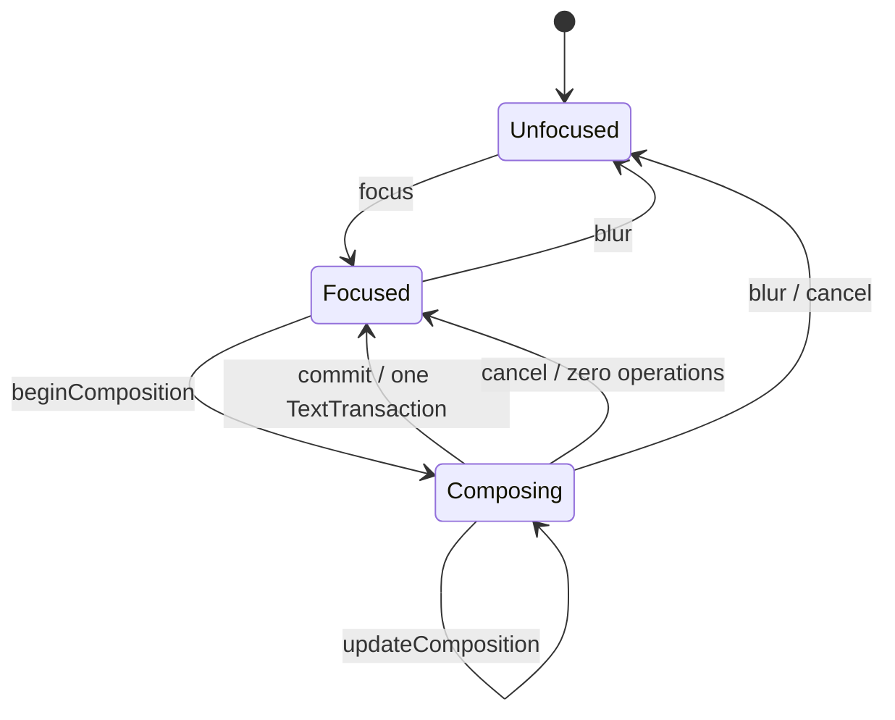

# POC-04 RichText / IME Contract

Status: `Implementing / SDK publication pending`

## Logical positions and schema

`LogicalPosition = { paragraph, offset_utf16 }`. Offsets count UTF-16 code
units, matching Windows and Android IME APIs. They do not count bytes, Unicode
scalar values, grapheme clusters, or shaped glyphs. Grapheme-safe cursor
movement is a layout/edit policy layered over this canonical storage position.

A `TextDocument` contains ordered paragraphs, ordered runs, paragraph
attributes, and run styles. Newlines exist at paragraph boundaries and are
serialized explicitly by the replay format. A style carries canonical
`FontResourceId`, expected content hash, size, color, weight, slant, locale,
an ordered content-addressed fallback chain, and sorted extensible attributes.

Snapshot and NDJSON formats are strictly versioned POC replay fixtures. Unknown
or missing fields, invalid UTF, invalid ranges, non-contiguous sequences, and
partially styled UTF-16 text reject the complete replay batch without changing
the original document.

## IME state machine



The composition preview and its internal selection are `TextEditSession`
state. Canonical document digest, snapshot, operation log, undo history, and
collaboration boundary see only commit. Platform adapters own neither a shadow
document nor an alternative undo stack.

`TextInputAdapter` adapts selection, before/after-cursor queries, committed and
composing text, directional deletion, and undo/redo without maintaining a
second authoritative document. UTF-16 deletion boundaries are expanded when
necessary so a platform request cannot split a surrogate pair. Grapheme-aware
cursor and deletion policy remains a product-layer extension over the POC's
UTF-16 storage contract.

## Operation and collaboration boundary

One IME commit, direct input event, paste, deletion, undo, or redo is one
historical POC `TextTransaction` containing one or more ordered replacements.
This name and envelope do not define a future collaboration or product mutation
unit. ADR-0025 supersedes that inference: the product path is Operation-only,
and G1/G6 must map this behavior to a RichText Operation payload plus Atomic
Operation Apply. This POC does not define CRDT/OT semantics, network encoding,
concurrent RichText merge, or server compaction.

The invariant under test is:

```text
Snapshot N + historical POC TextTransactions N+1..M = POC Text State M
```

Replaying committed operations from an empty document and snapshot
serialize/deserialize must reproduce the same digest.

## Font and layout determinism

Canonical layout resolves fonts only from verified blobs. The declared chain is
ordered and content-addressed; system-installed fonts are never consulted.
Missing ID, hash mismatch, exhausted fallback, and resource replacement have a
deterministic diagnostic and resolver generation so layout cache invalidation
cannot be missed.

The fixed POC corpus uses the pinned Roboto and Skia's pinned Noto Sans CJK
subset. That CJK test font contains only U+662F (`是`), so canonical geometry
uses that glyph while the edit/IME corpus still exercises `中文拼音`. These are
test oracles, not a claim that the V1 product font set is complete. Layout
artifacts include an explicit diagnostics array and fail on any unresolved
glyph. SkParagraph + SkShaper + bundled HarfBuzz/ICU supplies line,
grapheme/cluster, caret, and selection geometry. The lightweight host probe is
explicitly non-canonical.

`SkParagraphTextLayout::Layout()` is the complete geometry oracle. Every call
builds and lays out a fresh Paragraph and returns lines, clusters, selection
rectangles, and diagnostics. `LayoutForPerformance()` is an explicit
benchmark-only entry point: every call also builds a fresh Paragraph and runs
the same canonical shaping and width-constrained line breaking, but it does
not issue the O(n) per-cluster or selection-rectangle diagnostic queries. The
fixed fixture continues to require and compare the complete `Layout()` result,
so the performance path cannot replace or weaken the geometry oracle.

## Performance and lifecycle gates

- 10K-character ordinary input and caret movement: p95 no greater than 16.7 ms.
- 10K-character canonical shaping and line breaking, using a fresh Paragraph
  for every measured sample: p95 no greater than 33.3 ms.
- Fixed-font complete canonical geometry: non-empty lines, clusters, and
  selection rectangles, no diagnostics, and a byte-for-byte equivalent dump
  across platforms.
- 100 focus/unfocus/view-destroy cycles: no crash or residual composition.
- Web/Windows/Android digest and fixed-font geometry: byte-for-byte equivalent dump.

These gates are accepted only from real Web, Windows, and Android artifacts.
Build-only checks and the host probe cannot satisfy the final exit conditions.
The automated canonical recorder directly exercises the shared Runtime and
SkParagraph on each target. Native IME delivery is a second evidence track of
the same POC: browser composition events, Win32 IMM messages, Android
InputConnection callbacks, AppKit callbacks, and UIKit callbacks must be
observed on their actual platforms. A synthetic C++ composition call is not
native IME evidence. Both tracks are required before the single POC-04 status
can become `Accepted`.

## Native IME semantic-result gate

Callback vocabulary is platform-specific. `setMarkedText` is strong evidence
of an active UIKit composition, but its absence is not itself a failure when a
keyboard keeps pre-edit state in its own UI. The final platform record must
nevertheless include one controlled user flow (`ni hao` → `你好`, or an
equivalent documented Chinese candidate flow), the resulting committed text,
and the Runtime digest. Random keyboard suggestions or synthetic C++ calls do
not satisfy this gate.
